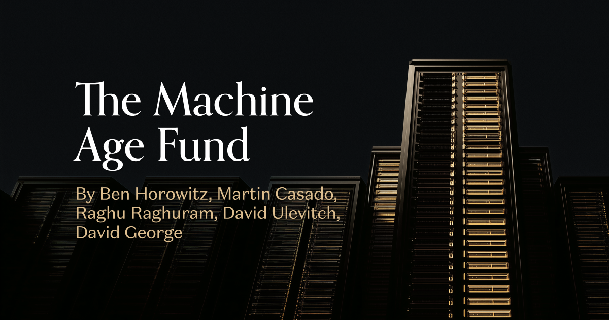

# a16z Built a $1.1 Billion Fund for Hardware Alone

_The Machine Age Fund spans chips, data centers, and robots, and the number a16z leads with is rack power headed to 1MW within three years_

## Executive Summary

> [!callout]
> Andreessen Horowitz, a firm that built its name on software, closed a fund on August 28, 2026 that buys hardware and nothing else. It holds $1.1 billion and it is called the Machine Age Fund. The scope runs from compute infrastructure such as chips, memory, networking, and storage to the finished systems that run AI: data centers, robotics, and home AI appliances.

> The number the firm leads with is power. A rack used to draw roughly 5 to 10 kilowatts, it now draws 100 to 250 kilowatts to support today's systems, and a16z expects it to reach 1MW over the next three years. The hardware supply side is used to growing 20% to 30% a year at most, while demand asks for triple digits. The firm argues that today's supply chain cannot close that gap on its own.

> What is missing is data. The word itself appears four times in the post, and all four times it means data center. Robots and edge devices are described only as the things AI needs in order to reach the world outside, and there is not one sentence about the record those machines will pile up second by second.

### Key Numbers

The first three numbers are the ones the announcement rests on. The fourth comes from the side the announcement leaves alone. Capital and power are counted in billions and megawatts, while the record those machines leave behind is still counted in hours.

Sources: a16z, [The Machine Age Fund](https://a16z.com/the-machine-age-fund/) (2026-08-28) · Khazatsky et al. (2024), DROID

<!-- stat-card -->
**$1.1B** — Size of the Machine Age Fund — a16z's first venture fund dedicated to hardware

<!-- stat-card -->
**1MW** — Power per rack in three years — Up from 5 to 10kW, now passing 100 to 250kW

<!-- stat-card -->
**28X** — Rise in compute density per rack — From an H100 rack to a Rubin rack

<!-- stat-card -->
**350 hours** — All of DROID's manipulation data — Open dataset gathered by 50 collectors on three continents over 12 months

## Occasional Deals Became a Standing Practice

The first sentence of [the post a16z published on August 28](https://a16z.com/the-machine-age-fund/) is that it raised $1.1 billion. The firm wrote that the money goes into all of the computer infrastructure on which AI runs. Chips, memory, networking, and storage make up one bundle. The finished systems that actually run AI make up another, and that second bundle puts data centers, robotics, and home AI appliances side by side. Five partners signed the post: Ben Horowitz, Martin Casado, Raghu Raghuram, David Ulevitch, and David George.

*▲ Title image from a16z's August 28 Machine Age Fund announcement | Source: [a16z, The Machine Age Fund](https://a16z.com/the-machine-age-fund/)*

a16z has stood on the other side of this line for a long time. Fifteen years have passed since Marc Andreessen wrote that software is eating the world, and in that stretch the firm's reputation came from a software playbook that is cheap on capital and fast on iteration. It is not that hardware went untouched. a16z led Skydio's Series A in 2016, invested in SpaceX, wrote its first check into Anduril in 2019, and was among the first venture investors in Waymo's 2020 raise. In Martin Casado's words, though, ["it was never a main focus."](https://dealroom.co/news/147561-a16z-raises-1-1b-for-machine-age-fund-to-build-ai-hardware/)

What changed sits on the founder side. The post says that over the last couple of years hardware startups grew from a small amount of the firm's deal flow to over 20% of it. The hardware companies it names as recent backings are Unconventional AI, Nexthop, Volta, Atoms, Heron Power, and Mind Robotics. The team is introduced along the same line. Guido Appenzeller was the CTO for Intel's Data Center Group. Raghuram and Casado spent multiple decades in the data center space with system software, much of which required deep hardware partnership. Shangda Xu and David George have led investments across the AI infrastructure stack, from silicon and networking to large-scale systems and compute platforms. David Ulevitch and Erin Price-Wright already lead many of the firm's hardware and U.S. manufacturing investments through its American Dynamism practice.

The phrase the firm chose for itself is that it is making hardware an official motion for a16z. What used to happen now and then through individual deals now has dedicated money and dedicated people behind it. Money is not the only thing the post counts as part of that promotion. The go-to-market, talent, and marketing machine the firm built is now ready to serve hardware founders, and the network that reaches customers and suppliers comes with it. Raghu Raghuram described the fund's range as ["things that are within the four walls of the data center."](https://dealroom.co/news/147561-a16z-raises-1-1b-for-machine-age-fund-to-build-ai-hardware/)

## One Rack Will Draw a Megawatt

Asked why now, the post answers with a lag between demand and supply. As AI moves from chat to reasoning and on to coding and other forms of knowledge work, both the demand for work and the token intensity of that work rise by orders of magnitude. The hardware supply side, meanwhile, is an industry tuned to 20% to 30% growth a year at most. The firm reads that gap as every layer of the stack hitting the wall of today's supply chain capability, and the limits of physics and computer science.

Rebuilding the bottom layer is not new, and the post says so. The shift from mainframe to client server, and then to the Internet, cloud, and mobile, rebuilt the floor of computing each time. What is different now, it argues, is the magnitude and breadth of the change needed to keep up with demand, and the speed required to do it. Martin Casado put it this way to Dealroom: ["Every time we have one of these technical epochs, it puts pressure on the infrastructure, but none of us have ever seen it this dramatic."](https://dealroom.co/news/147561-a16z-raises-1-1b-for-machine-age-fund-to-build-ai-hardware/) So the firm calls this a once-in-a-generation opportunity, and it draws the boundary of what gets redesigned all the way down to the electricity.

Power shows the size of that gap most plainly. A rack used to draw roughly 5 to 10 kilowatts. It moved to 100 to 250 kilowatts to support today's systems, and the post expects 1MW over the next three years. On another line of the same list, compute density per rack increased 28X from an H100 rack to a Rubin rack, and networking within a rack has grown similarly, hitting the limits of copper cabling. Data center scale itself is moving from tens to hundreds of megawatts, and in some cases to GW-scale campuses.
