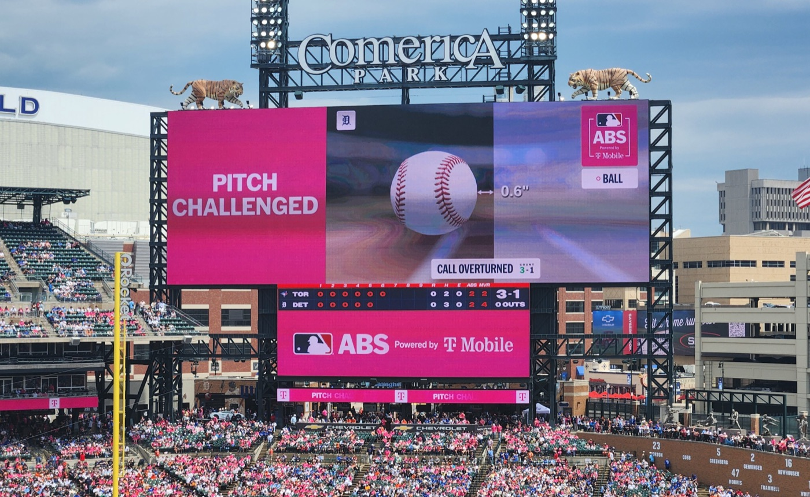

# Does an Umpire Change When AI Checks Only Some Calls?

_A KAIST and Yonsei team analyzed 4.11 million Major League ball-strike calls and found the umpires_

## Executive Summary

> [!callout]
> From the 2026 season, Major League Baseball allows a machine to rule again on balls and strikes. Not on every pitch, though. The umpire calls first, and only if the pitcher, catcher or batter involved in that pitch challenges immediately does the automated system reveal where the ball crossed and issue the final ruling. A joint team from KAIST and Yonsei University measured what happened to human umpires under that arrangement, using twelve seasons of records. This article reads their result as a story about the places where a person judges first and AI reviews a selected few.

> The team measured two things separately: where a call flips from ball to strike, and how abruptly that flip happens. Only the first moved in 2026. The abruptness stayed on the trajectory of the eleven prior seasons. Their eye for close pitches had not sharpened; the place where they drew the line had been pulled toward the machine. Right after a call was overturned, the calls near that same edge moved in the corrective direction, but the movement was gone from the opening of the same umpire's next game.

> Sections 1 through 5 report what the paper found. The question in Section 6 is ours. When a person labels first and review reaches only a fraction of the work, what changes: the label, or the labeler?

### Key figures

Source: Kichang Lee, Gyeongmin Han, Sungmin Lee, JeongGil Ko, [When the Strike Zone Becomes Algorithmic](https://arxiv.org/abs/2609.25525), arXiv:2609.25525 (2026-09-22).

<!-- stat-card -->
**53.6%** — Overturn rate among challenged calls — 4,525 of the 8,447 challenges in 2026 were overturned. More than half of everything that reached review had been wrong

<!-- stat-card -->
**5.03%** — Usage rate of available challenges — 7,381 challenges out of 146,725 opportunities. The rest stayed unreviewed

<!-- stat-card -->
**1 game** — Reach of the post-correction adjustment — Statistically significant inside the same game, undetectable in the opening window of the next one

<!-- stat-card -->
**+36.1%** — Rise in tight-side errors on changeups — Every pitch type saw its overall miscalls drop, yet this one cell went the other way. Where the errors fell and where they rose came apart

## The umpire calls every pitch; the machine comes when called

If you have not followed baseball closely, that is fine. Start with how the arrangement works. When a batter does not swing, the umpire behind the catcher decides whether the pitch was a strike or a ball. Major League Baseball brought an automated ball-strike system into that decision in 2026, and its design differs from the one the Korea Baseball Organization has used since 2024. In Korea the machine rules on every pitch. In the majors the umpire rules first, and the machine only steps in when the pitcher, catcher or batter involved in that pitch taps a helmet to challenge right after the call. The location measured by camera tracking then appears on the scoreboard, and the original call is either upheld or overturned.

*▲ Detroit Tigers vs. Toronto Blue Jays, May 16, 2026: the Comerica Park scoreboard reveals a challenged pitch, measured 0.6 inches from the strike zone, and the call comes back overturned | Photo: 42-BRT, [Wikimedia Commons](https://commons.wikimedia.org/wiki/File:ABS_challenge_displayed_on_Comerica_Park_scoreboard,_distance_of_ball_from_strike_zone.jpg) (CC BY-SA 4.0)*

Challenges are rationed. Each team starts with two, keeps the one it spends on a successful challenge and loses it on an unsuccessful one. A team that enters an extra inning with none left receives one. Managers cannot ask, and a request that does not come immediately after the call is not accepted. The zone the machine uses also differs from the one in the rulebook. It is a 17-inch-wide rectangle standing at the midpoint of home plate, with its lower edge at 27% of the batter's measured height and its upper edge at 53.5%.

This design was not an accident. Prior work cited by the paper traces how the league arrived at challenges rather than full automation after seven years of experimentation. Technical feasibility and cost weighed on the choice, along with continuity with established calling practice and a wish to leave players some hold on the call. The decision to invoke review was made part of the game itself.

The volume shows that the arrangement ran without a pause all season. Across the 1,974 games played from Opening Day through August 24, players challenged 8,447 times. That is 4.28 per game, with at least one challenge in 98.7% of games. Of those, 4,525 were overturned, a rate of 53.6%.

The shape of the arrangement becomes visible here. Every pitch a batter leaves alone is the umpire's to judge, yet the signal telling that umpire whether the judgment was right or wrong comes back only on the pitches players choose to send up. The person who judges and the person who asks for a correction are different people, and the final ruling belongs to a third party. The paper calls this a distinctive setting for studying how humans and AI meet.
