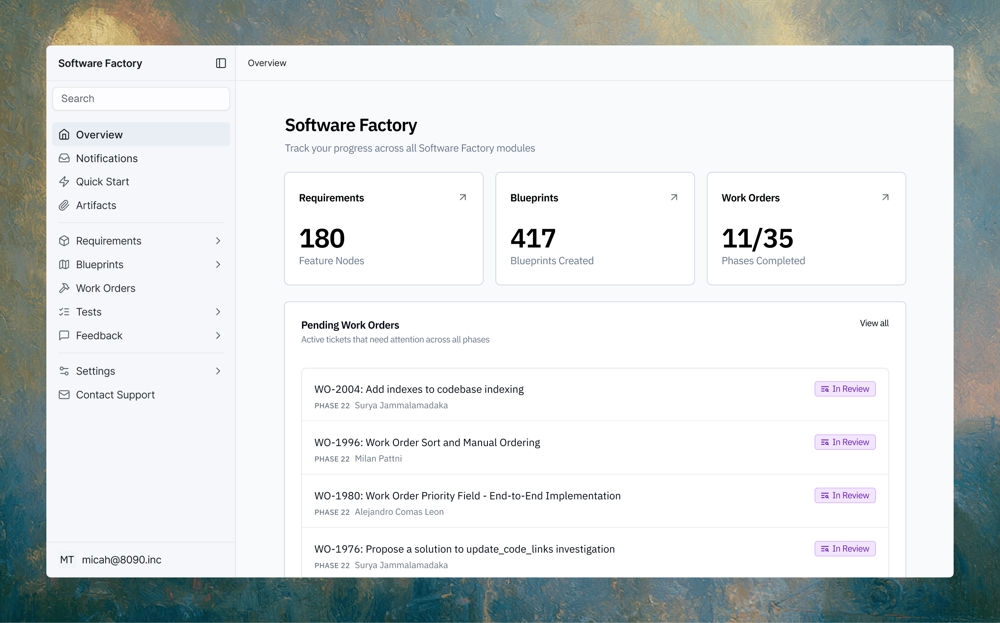

# 에이전트가 짓는 기업 소프트웨어, 감독은 감사 추적에 달렸다

_세일즈포스벤처스가 주도한 8090 시리즈A 1억3500만 달러가 내건 사람 주도 감독의 조건_

## Executive Summary

> [!callout]
> 2026년 6월 26일, 챠매스 팔리하피티야가 세운 8090이 세일즈포스벤처스 주도로 시리즈A 1억3500만 달러를 유치했다. 8090이 파는 제품은 소프트웨어 팩토리(Software Factory), 사람 엔지니어와 AI 에이전트를 한 시스템에 넣어 함께 기업 소프트웨어를 짓는 플랫폼이다. 회사가 정면에 내건 문구는 속도가 아니다. 조율된 AI 에이전트를 사람 주도 감독(human-led oversight) 아래 둔다는 것이다. 관건은 그 감독이 마케팅 문구를 넘어 실제로 작동하는 데 무엇이 필요하냐다.

> 팔리하피티야는 에이전트가 코드를 쓰는 일은 이미 쉬운 문제라고 말한다. 어려운 쪽은 수십 개 에이전트와 수백 명 엔지니어가 매주 같은 복잡한 시스템을 건드릴 때 그것이 찢어지지 않게 붙들어 두는 일이다. 사람이 그 코드를 한 줄씩 다시 읽는 건 규모상 불가능하다. 그렇다면 감독은 결국 코드 자체가 아니라, 에이전트가 무엇을 근거로 무엇을 바꿨는지 남긴 기록을 보고 이뤄진다.

> 요구사항에서 설계도, 에이전트 스킬, 테스트, 배포로 이어지는 그 산출물의 사슬은 곧 데이터다. 그래서 이 이야기는 자율화가 얼마나 빠른가의 문제가 아니라, 사람이 무엇을 근거로 개입하고 검증하는가라는 데이터 설계의 문제로 번역된다. 헬스케어와 보험, 정부처럼 감사관 앞에서 답해야 하는 규제 산업일수록 그 번역이 더 선명해진다.

이 투자가 어디에 발을 딛는지는 네 개의 숫자가 먼저 말해 준다. 세일즈포스벤처스가 주도한 라운드의 규모, 팔리하피티야가 진짜 난제로 지목한 동시 작업의 밀도, 8090이 레거시 시스템에서 뽑아낸 역설계의 깊이, 그리고 그 결과가 규제 산업 고객에게 남긴 절감 폭이다.

<!-- stat-card -->
**$135M** — 8090 시리즈A — 세일즈포스벤처스 주도 · 2026-06-26 발표

<!-- stat-card -->
**50+100** — 에이전트 · 엔지니어 — 매주 같은 시스템 변경 · 팔리하피티야가 지목한 난제

<!-- stat-card -->
**1,800만→40일** — COBOL 역설계 — 청구 엔진 1,800만 줄 → 평문 규칙 30만 개

<!-- stat-card -->
**$2,000만+** — 4년 청구 절감 — 지급 청구 80%↓ · 상장 헬스보험사 사례

## 1억3500만 달러가 산 것

챠매스 팔리하피티야는 페이스북 초기 임원이자 벤처투자자로 알려진 인물이다. 그가 2024년 세운 8090은 낡은 레거시 소프트웨어를 통째로 갈아 치우겠다는 목표를 내걸었고, 2026년 6월 26일 세일즈포스벤처스가 주도한 시리즈A로 1억3500만 달러를 받았다. 라운드에는 Palo Alto Networks의 CEO 니케시 아로라, Quora 공동창업자 애덤 디안젤로 같은 이름이 엔젤로 참여했다. 세일즈포스가 벤처 실험이 아니라 자사 고객이 매일 마주하는 기업 시스템의 요구를 잘 아는 당사자라는 점에서, 주도 투자자의 정체성이 이 딜의 성격을 말해 준다.

*▲ 챠매스 팔리하피티야. 2024년 8090을 세웠고 2026년 6월 세일즈포스벤처스 주도 라운드를 받았다 | Source: [Wikimedia Commons](https://commons.wikimedia.org/wiki/File:Chamath_Palihapitiya_in_2025.jpg)*

8090이 파는 제품은 소프트웨어 팩토리다. 회사는 이것을 사람 팀과 AI 에이전트를 하나의 거버넌스된 멀티플레이어 플랫폼에 넣어 함께 소프트웨어를 만드는 시스템이라 설명한다. 자연어로 쓴 요구사항 문서를 설계도(Blueprint)로, 다시 코드로 변환하고, 제3자 에이전트가 쓸 수 있는 코딩 지시와 스크립트를 담은 에이전트 스킬 툴킷을 제공한다. 만들어진 변경은 프로덕션에 나가기 전에 품질 테스트를 거친다. 회사가 전면에 내건 표현은 조율된 AI 에이전트를 사람 주도 감독 아래 둔다는 것이고, 파는 대상은 코딩 속도가 아니라 제어와 가시성, 감사 가능성이라고 명시한다.

팔리하피티야의 진단은 한 문장으로 요약된다. AI가 코드를 쓸 수는 있지만, 기업 소프트웨어의 어려운 부분은 수십 개 에이전트와 수백 명 엔지니어가 매주 같은 복잡한 시스템을 바꿔도 그것이 찢어지지 않게 붙드는 데 있다는 것이다. 에이전트가 코드를 생성하는 일은 이미 해결된 문제로 두고, 그것을 무너지지 않게 조율하는 오케스트레이션과 감독을 파는 셈이다. 한 애널리스트의 표현대로 8090은 모델을 파는 것이 아니라 모델 위에 앉는 레이어를 판다.

> [!callout]
> 여기서 눈여겨볼 지점은 8090이 감독을 제품의 부가 기능이 아니라 핵심 판매 대상으로 앞세운다는 것이다. 코드를 대신 써 주는 도구는 이미 흔하다. 세일즈포스벤처스가 1억3500만 달러를 건 대상은 그 코드가 어떻게 만들어지고 바뀌었는지를 사람이 나중에 되짚어 볼 수 있게 묶어내는 능력에 가깝다.

## 사람이 다시 읽을 수 없는 규모

사람 주도 감독이라는 말은 듣기에 든든하다. 문제는 그 감독이 실제로 무엇을 보고 이뤄지느냐다. 50개 에이전트와 100명 엔지니어가 매주 같은 시스템을 건드리는 규모에서, 관리자가 바뀐 코드를 한 줄씩 다시 읽어 승인하는 방식은 성립하지 않는다. 코드의 양이 사람의 검토 속도를 이미 넘어섰기 때문이다. 감독이 코드 리뷰와 같은 뜻이라면, 그것은 규모가 커지는 순간 형식적인 통과 의례로 무너진다.

그래서 감독의 대상은 코드 자체에서 코드가 만들어진 과정으로 옮겨간다. 소프트웨어 팩토리가 남기는 산출물의 사슬을 따라가 보면 이 전환이 분명해진다. 어떤 요구사항이 입력됐고, 그것이 어떤 설계도로 번역됐으며, 어떤 에이전트 스킬이 그 설계도를 코드로 옮겼고, 어떤 테스트를 통과했으며, 어떤 승인을 거쳐 배포됐는가. 사람이 감독하는 것은 매 코드 줄이 아니라 이 사슬의 각 매듭이다. 감독은 코드를 읽는 일이 아니라 결정의 이력을 읽는 일이 된다.

이 전환은 규제 산업에서 특히 중요하다. 8090이 겨냥한 고객은 헬스케어와 보험, 생명과학, 항공우주, 에너지, 제조, 금융, 미 연방정부다. 전부 산출물의 근거를 감사관에게 증명해야 하는 영역이다. 헬스케어는 HIPAA, 금융은 SOC 2와 ISO, 정부 계약은 FedRAMP를 맞춰야 하고, 이런 조직에서 어떤 시스템이 오작동했을 때 "AI가 만들었다"는 답은 통하지 않는다. 감독이 코드가 아니라 이력을 본다는 말은, 곧 그 이력이 감사에 제출 가능한 형태로 남아 있어야 한다는 요구로 이어진다.

## 감독의 실체는 데이터다

여기서 질문을 한 번 바꿔야 한다. 규제받는 조직에서 감사관이 먼저 던지는 물음은 "누가 이걸 승인했나"가 아니다. "무엇을 근거로 이 승인이 가능했나, 그리고 그 근거를 지금 다시 보여줄 수 있나"다. 요구사항, 설계도, 에이전트 스킬, 테스트 로그, 배포 기록이 각각 언제 어떤 버전으로 생성됐고 서로 어떻게 이어지는지가 남아 있어야, 감독은 사후에 서명 하나를 찾아 붙이는 정당화가 아니라 실질적인 개입이 된다. 산출물의 계보와 버전 관리, 재현 가능성이 갖춰졌을 때 비로소 사람 주도 감독이라는 문구에 실체가 생긴다.

*▲ 8090 소프트웨어 팩토리 대시보드. Requirements·Blueprints·Work Orders로 이어지는 산출물 사슬이 실제 제품 화면에 그대로 나타난다 | Source: [8090.ai](https://www.8090.ai/)*

8090이 공개한 사례는 이 요구가 추상이 아님을 보여준다. 한 의료 청구 엔진의 COBOL과 어셈블리 1,800만 줄을 40일 만에 평문 규칙 30만 개로 역설계했고, 상장 헬스보험사의 지급 청구 규칙을 결정론적 사전 필터로 옮겨 외부 벤더로 넘기던 청구를 80% 이상 줄이며 4년간 2,000만 달러 넘게 절감했다고 한다. 생명과학 고객은 진단 출시 기간을 5년에서 4년으로 줄였고, 제조 고객은 1만 개가 넘는 부품을 실시간으로 검증한다고 밝힌다. 숫자만 보면 효율화 도구의 이야기지만, 규제 산업에서 이 변경들이 감사를 통과하려면 각 규칙이 어떤 원본에서 어떻게 도출됐는지가 함께 남아 있어야 한다.

8090이 EY와 맺은 파트너십도 같은 방향을 가리킨다. 두 회사는 요구사항부터 아키텍처, 코드, 테스트, 인프라, 운영까지 개발 전 주기에 걸쳐 AI 에이전트의 협업 메시(collaborative mesh)를 사람 감독으로 조율한다고 설명한다. 개발 공정 전체를 에이전트에게 맡기되, 그 공정의 매 단계가 검증 가능한 기록으로 남는 구조다. 결국 팔리하피티야가 파는 감독은 사람이 옆에서 지켜보는 시선이 아니라, 에이전트가 일하며 남긴 데이터를 통해 성립하는 감독이다.

> [!callout]
> 자율화의 속도만 놓고 보면 코드를 짓는 에이전트는 이미 충분히 빠르다. 규제 산업에서 조달을 가르는 기준은 그 속도가 아니라, 에이전트가 남긴 결정의 이력을 사람이 되짚어 개입할 수 있느냐다. 감사 추적을 처음부터 파이프라인의 산출물로 남긴 시스템과, 사고가 난 뒤에 이력을 재구성하려는 시스템의 차이는 감사관 앞에서 되돌릴 수 없는 격차가 된다.

## 같은 주, 한 겹 아래 레이어

같은 시기에 비슷한 신호가 하나 더 있었다. 며칠 전 이 블로그가 다룬 [골드만삭스 주도 Taktile 1.1억 달러 투자](/blog/bank-ai-agent-audit-trail/ko/)도 결국 감사 추적을 산 베팅이었다. 은행과 보험사의 대출 심사, 사기 판단, 청구를 에이전트에게 맡길 때 감독당국이 요구하는 것이 정답률이 아니라 판단의 재구성 가능한 기록이라는 이야기였다. 두 투자는 한 주 사이에 같은 방향을 가리킨다. 규제 산업에서 팔리는 것은 정확도가 아니라 추적 가능성으로 옮겨가고 있다.

다만 두 이야기의 레이어가 다르다. Taktile은 에이전트가 내리는 개별 비즈니스 의사결정, 곧 이 대출을 왜 거절했는가에 남는 감사 추적을 다룬다. 8090은 그보다 한 겹 아래, 그 의사결정을 내리는 소프트웨어 자체를 에이전트가 짓고 바꾸는 층위를 다룬다. 감사 추적의 대상이 "이 대출을 왜 거절했나"에서 "이 코드가 왜 이렇게 바뀌었나"로 내려가는 셈이다. 개별 결정의 근거를 묻는 문제가 개발 공정 전체의 거버넌스 문제로 확장된 것이고, 그래서 이번 신호가 한 단계 더 근본적이다.

두 신호를 하나로 이으면 그림이 완성된다. 에이전트가 짓는 소프트웨어에도, 그 소프트웨어가 내리는 결정에도, 각각 끊기지 않는 이력이 요구된다. 자율화가 어디까지 빨라지느냐를 겨루는 경쟁이 아니라, 무엇을 근거로 사람이 개입하고 검증하느냐를 설계하는 경쟁이다. 그 근거는 처음부터 데이터로 남겨 두지 않으면 나중에 만들 수 없다. 사람 주도 감독이 성립하는지 여부는, 결국 에이전트가 일하며 남긴 데이터가 감사 가능한 형태로 설계돼 있는가에 달려 있다.

## 페블러스가 주목하는 이유

에이전트가 기업 소프트웨어를 짓고 바꾸는 시대에, 감독의 성패가 코드의 양이 아니라 그 과정에 남는 데이터에 달린다는 것은 데이터를 다루는 회사에게 지형이 바뀐다는 뜻이다. 요구사항과 설계도, 에이전트 스킬, 테스트 로그가 서로 어떻게 이어지는지 증명하는 일은 개발팀의 자발적 관심사가 아니라, 규제 산업 고객이 조달 단계에서 확인하는 조건이 된다. 감독이 실체를 가지려면 그 이력의 품질과 계보 자체를 진단할 수 있어야 한다.

페블러스가 데이터의 품질과 계보를 진단 가능한 형태로 다뤄 온 관점에서 보면, 8090으로 향한 세일즈포스의 자금과 Taktile로 향한 골드만의 자금은 같은 시장 신호다. 정확하고 빠른 에이전트를 만드는 경쟁은 이미 상향 평준화됐고, 규제 산업의 조달 담당자가 실제로 확인하는 것은 판단과 변경의 근거를 되짚을 수 있느냐다.

> [!callout]
> **Editor's Note.** 에이전트가 코드를 짓고 그 과정을 로그로 남긴다면, 그 로그는 "무엇을 바꿨나"에 답한다. 남는 질문은 "그 변경의 근거가 된 요구사항과 데이터가 대표성 있고 검증됐는가"이다. 산출물의 품질과 계보를 진단해 그 답을 증거로 만드는 일이 페블러스 DataClinic이 겨냥해 온 자리다. 이는 에이전트의 감독을 대체하는 것이 아니라, 그 감독이 딛고 선 데이터를 진단하는 인접한 자리에서 성립한다.

## 참고문헌

이 글은 아래 투자 보도와 기업 발표, 관련 업계 자료를 교차검증해 작성했다. 투자 규모와 제품 설명, 성과 지표는 회사 발표와 이를 인용한 보도를 기준으로 삼았다.

### 투자·업계 보도

- 1.Business Wire (2026-06-26). "8090 Raises $135M Series A to Accelerate Their Rollout of Software Factory." [링크](https://www.businesswire.com/news/home/20260626795833/en/8090-Raises-135M-Series-A-to-Accelerate-Their-Rollout-of-Software-Factory)
- 2.SiliconANGLE (2026-06-29). "AI software development startup 8090 nabs $135M funding round." [링크](https://siliconangle.com/2026/06/29/ai-software-development-startup-8090-nabs-135m-funding-round/)
- 3.The Next Web (2026-06-29). "Chamath Palihapitiya's 8090 raises $135M Series A for AI coding platform." [링크](https://thenextweb.com/news/chamath-palihapitiya-8090-135m-series-a-ai-coding)

### 기업·공식 자료

- 4.8090 Solutions. "Software Factory" (제품 설명·규제 산업 사례). [링크](https://8090.ai/)
- 5.Yahoo Finance (2026). "Why Salesforce (CRM) Is Building an Audit Trail for Enterprise AI Agents." [링크](https://finance.yahoo.com/markets/stocks/articles/why-salesforce-crm-building-audit-063141222.html)

※ 성과 지표(COBOL 1,800만 줄 40일 역설계, 청구 80% 감소·4년 2,000만 달러 절감, 진단 출시 5년→4년, 부품 1만 개 실시간 검증)는 8090과 고객사 발표를 인용한 보도 기준이다. 원 입력 출처였던 techstartups.com·startuphub.ai에는 이 딜이 직접 등장하지 않아, 딜 자체는 위 1차·보도 출처로 교차확인했다.
