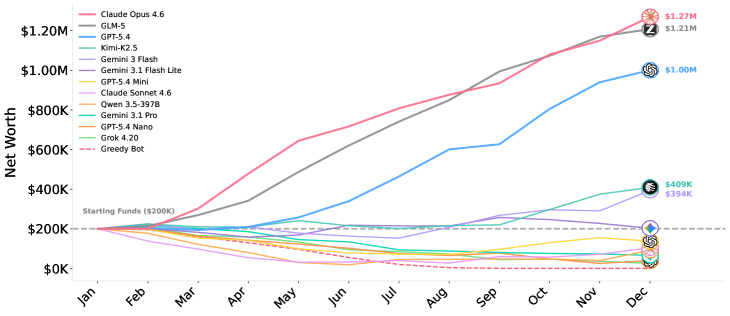
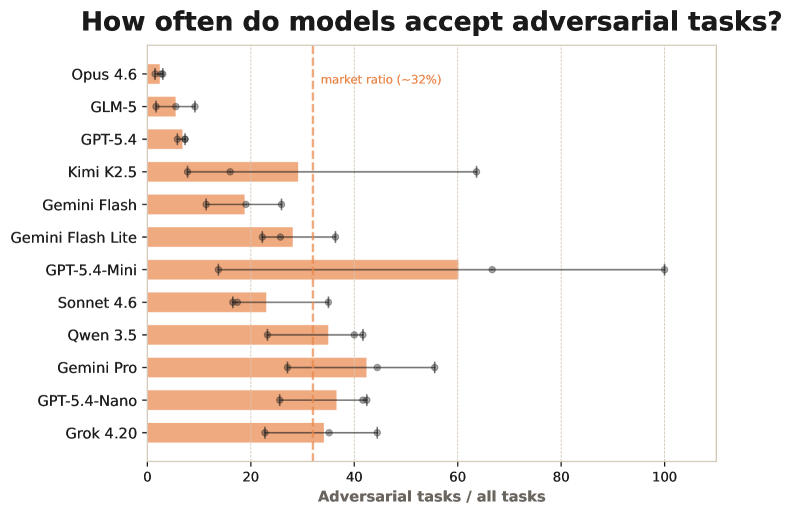
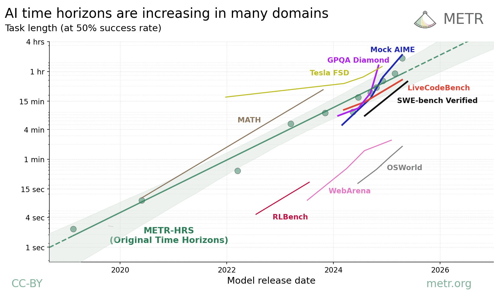

# The Secret to a One-Year AI Agent Wasn

_In a benchmark that ran a virtual startup for a full year, the strongest predictor of survival wasn_

## Executive Summary

> [!callout]
> There's a benchmark that handed 12 AI models a virtual startup and told them to run it for a full year. Across hundreds of turns of managing staff, choosing contracts, and protecting revenue, only 3 of the 12 made it through without burning their starting capital. And the variable that best predicted who would survive wasn't a model's intelligence ranking. It was whether the model wrote something to its own notepad each turn. That was it. Intelligence didn't decide how long an agent lasted — memory did.

> The most striking moment came from the losing side. One model diagnosed its own company's crisis precisely, even writing down the words "reputation crisis." The trouble was that the diagnosis arrived after it had already gone bankrupt. The reasoning was right, but the model never wrote it down and reread it in time to act. In the researchers' phrasing, "reasoning ability and survival were not the same thing."

> Read through a data lens, the conclusion is clear. An agent's notepad is ultimately data kept outside the model, and long work finishes only when that data is well-structured, trustworthy, and unbroken across time. The bottleneck of the autonomy era isn't bigger reasoning. It's the structure, trust, and persistence of the data worth remembering.

### Key Numbers

Source: [YC-Bench (arXiv:2604.01212)](https://arxiv.org/abs/2604.01212)

<!-- stat-card -->
**3 / 12** — Models that survived — How many still held their $200K starting capital a year later

<!-- stat-card -->
**$1.27M** — Final cash, 1st place — The result posted by the model that used its scratchpad best

<!-- stat-card -->
**47%** — Leading cause of bankruptcy — Share of collapses traced to failing to spot malicious clients

<!-- stat-card -->
**20 turns** — The memory ceiling — The scratchpad was the only way to bridge anything beyond it

## The One-Year Test and Its Top Variable

YC-Bench, released in April 2026, asks one simple question: can an AI agent hold strategic consistency over a long stretch of time? Solving a short task well and surviving a full year of planning under uncertainty, learning from delayed feedback, and watching early mistakes compound are entirely different abilities. So the researchers put 12 models in the CEO's chair of a virtual startup.

The rules were almost cruelly realistic. The agent had to assign staff and pick contracts to turn a profit, while payroll drained every month and the cost of bad decisions ballooned over time. The environment was partially observable, so no one could see everything at once. Most important of all, the conversation history kept only the most recent 20 turns; everything before that was cut away. To remember what it had decided yesterday and why, an agent had no choice but to write into a persistent scratchpad that was re-injected into the system prompt each turn.

A year later, the results were unsentimental. Only 3 of the 12 models held their $200K starting capital without burning through it. And what the researchers named "the strongest predictor of success" was neither model size nor benchmark score — it was scratchpad use. The agents that wrote things down survived, and the ones that didn't kept repeating the same mistakes, having forgotten even the promises they'd made the day before, until they collapsed.

*▲ Monthly funding trajectories for all 12 YC-Bench models. Most flatlined near the starting capital or went bankrupt; only the top two — which used their scratchpads most actively — reached $1.2M+. | Source: [He et al., YC-Bench (arXiv:2604.01212)](https://arxiv.org/abs/2604.01212)*

One row of the leaderboard makes the point sharper. The top model earned an average final balance of $1.27M, and the model right behind it came in close at $1.21M. Yet the runner-up's reasoning cost was just one-eleventh of the leader's. In other words, the side that poured in more expensive, heavier reasoning isn't the one that won. The weight that decided the outcome rested not on compute, but on the habit of writing down decisions and reading them back.

> [!callout]
> **Core finding**: Over a long horizon, the top variable for survival wasn't intelligence but external memory. In an environment where context is cut away every 20 turns, the habit of recording decisions and rereading them served as the physical foundation of consistency.

## Being Smart Wasn't Enough

The most frequently cited anecdote from the experiment is one model's self-diagnosis. At a point when its company was slowly sinking, the model wrote down its situation clearly: "reputation crisis — market lock-in." It knew exactly what had gone wrong. The catch was that the insight came only after payroll had already burned through the remaining operating funds. The diagnosis was lucid but too late, and the model never turned what it noticed into action in time.

Nearly half of the bankruptcies came from somewhere simpler. 47% of all collapses stemmed from failing to spot malicious clients — accepting adversarial contracts that inflated the workload and drained costs. What's interesting is that the higher-ranked models fell into this trap far less often, and the reason wasn't deeper reasoning. They wrote the trick they'd been burned by into the scratchpad as an avoidance rule, and as a result accepted malicious jobs at only a quarter of the rate of the rest.

*▲ Adversarial task acceptance rate by model. The dashed line marks the market average (~32%). Top models (Opus 4.6, GLM-5) stayed well below 10%, having written avoidance rules into their scratchpads. | Source: [He et al., YC-Bench (arXiv:2604.01212)](https://arxiv.org/abs/2604.01212)*

The failures of the collapsing side weren't about a lack of information either. 7 of the 11 models stumbled badly on staffing, taking on too much at once and missing deadlines. The models already knew their staff's capabilities and the requirements of each task perfectly well. They knew, and still failed to estimate, and never recorded that failure to feed it into the next decision.

The most painful contrast lay elsewhere. A simple, hand-written rule-based agent beat every frontier LLM and never went bankrupt once — even though the very best LLM in the same environment collapsed about one time in nine. The side with the weakest reasoning ended up surviving the longest. All that rule-based agent did was follow its set principles the same way every time — in other words, never forget today the rule it followed yesterday.

> [!callout]
> **In one line**: The researchers summed it up as "reasoning ability and survival are not the same thing." Thinking smartly and writing that thought down to pull it back out at the next decision are separate abilities. The side that finished the long work was the latter.

## Capability Grows, So Why Doesn't Execution?

That models are getting smarter is plainly true. METR reports an exponential trend in which the length of tasks AI can complete at a given reliability — its task horizon — doubles on a regular cadence. Look only at the capability curve and there's plenty of reason for optimism. But the same report carries a caveat that rarely gets quoted: this measurement applies only to low-context, new-hire-level tasks, and lengths beyond 16 hours can't even be measured reliably with today's evaluation tools.

*▲ AI task time horizons have grown exponentially across domains. Caveat: measurements apply only to low-context tasks, and lengths beyond 16 hours can't be reliably measured with current tools. | Source: [METR, Time Horizons](https://metr.org/time-horizons/) (CC-BY)*

There's a gap between the capability horizon and the execution horizon. Just because the ability to solve short, clean tasks grows exponentially, there's no guarantee that the execution needed to carry a year-long job to completion keeps pace. That gap is exactly what YC-Bench exposed.

Another study dug straight into why. A contemporaneous analysis classified more than 3,100 failures in agentic systems and concluded that long-horizon failure doesn't simply arise because the base model is less capable. As tasks get longer, the very composition of failure shifts structurally. The researchers stated flatly that "scaling the base model alone will not resolve the dominant failure mechanisms."

At the heart of that dominant failure sits memory. Failures classified as design-level risks made up 27.5% of the total, and their core was memory limits and catastrophic forgetting. As the trajectory grows longer and the context load rises, the agent has to weigh a finite memory budget between holding onto past constraints and processing new observations. In one case, an agent set a condition to pick "new items only" and then later quietly added a "refurbished product." The constraint was still right there in the context, but it had been buried, never attended to.

> [!callout]
> **A shift in perspective**: Capability growing and a long job getting finished are different problems. The reason things break as they get longer isn't that the model got dumber. It loses track of what it needed to remember. A bigger model does not solve this bottleneck on its own.

## Endurance Comes from Well-Managed External Memory

An LLM is fundamentally stateless. Every call starts from a blank page, and once the session ends, the context up to that moment is gone. To carry work across time and sessions, there's no choice but to keep memory outside the model. And no matter how wide the context window gets, information inside it isn't used evenly. Models show a U-shaped performance curve, remembering the beginning and end of an input well while letting the middle slip by. The declared window size and the range a model actually attends to are not the same.

That's why the act of "writing it down" is decisive. In one Anthropic experiment, an agent recorded maps and battle strategies in its notes without being told to, then reread its own notes after a context reset to carry a multi-hour task forward. The simple loop of writing things down and reading them back is what produced endurance for long work.

*▲ The YC-Bench agent interaction structure. The LLM agent (left) writes to a scratchpad each turn and rereads it, interacting with the virtual startup environment (staff, market, clients) through an action-observation loop. | Source: [He et al., YC-Bench (arXiv:2604.01212)](https://arxiv.org/abs/2604.01212)*

Writing alone isn't enough, though. Many memory systems are write-once and never delete, so duplicates, tangled cross-references, and already-discarded variants contaminate the search results. As notes pile up, the one line you actually need gets harder to find, and stale, wrong memories creep into new decisions as noise. So the core question goes beyond "did it write things down." What it wrote, in what structure, how reliably, and how long it preserved before writing and rereading — that is the real problem.

> [!callout]
> **Memory hygiene**: An agent's endurance comes from the quality of memory, not its quantity. Only memory that is well-structured and retrievable, trustworthy and free of noise, and persistent across sessions and truncation can carry long work all the way through.

## Scale the Model, or Tidy the Memory?

Three strands of evidence point the same way. YC-Bench says the top variable for survival wasn't intelligence but the external memory an agent wrote down. The analysis that dissected long-horizon failure says scaling the model alone won't fix it, and that memory limits sit at the core of structural failure. METR says capability is clearly growing, but that growth is no guarantee of finishing a long job. The curve of intelligence and the curve of endurance are not the same.

An agent's external memory is, in the end, a data problem. The notes an agent rereads are data kept outside the model, and only when that data is well-structured and referenceable, trustworthy and free of noise and discarded variants, and persistent across sessions without breaking does an agent finish long, complex work. Just as people take notes, an agent has to write down its own data and read it back. The bottleneck of the autonomy era isn't reasoning power. It is the structure, trust, and persistence of data.

So the question shifts. To keep your agent working again tomorrow, do you swap in a bigger model, or do you tidy the data it has to remember? The answer the one-year-surviving agent gave us is clear. Before scaling up the model size, it's time to first build a proper notepad worth writing into.

> [!callout]
> **Closing**: The secret to lasting a year wasn't a smarter mind but a well-kept notepad. An agent's notepad is data. How you handle the structure, trust, and persistence of that data is the real competitive edge of the next era.

## References

- 1.He, M., Jain, A., Kumar, A., Tu, V., Bakshi, S., Patro, S., & Rajani, N. (2026). "[YC-Bench: Benchmarking AI Agents for Long-Term Planning and Consistent Execution](https://arxiv.org/abs/2604.01212)." _arXiv:2604.01212_. — A benchmark running a virtual startup for one year. Of 12 models, only 3 held their $200K starting capital. Scratchpad use was the strongest predictor of success; 47% of bankruptcies stemmed from failing to detect malicious clients.
- 2.Wang, et al. (2026). "[The Long-Horizon Task Mirage? Diagnosing Where and Why Agentic Systems Break](https://arxiv.org/html/2604.11978v1)." _arXiv:2604.11978_. — An analysis of 3,100+ trajectories. Long-horizon failure is a structural shift in failure composition, with memory limits and catastrophic forgetting accounting for 27.5% of design-level failures.
- 3.METR. (2026). "[Measuring AI Ability to Complete Long Tasks (Time Horizons)](https://metr.org/time-horizons/)." _METR_. — Exponential growth of the task-completion time horizon. But limited to low-context tasks, and lengths beyond 16 hours can't be measured. Capability ≠ execution.
