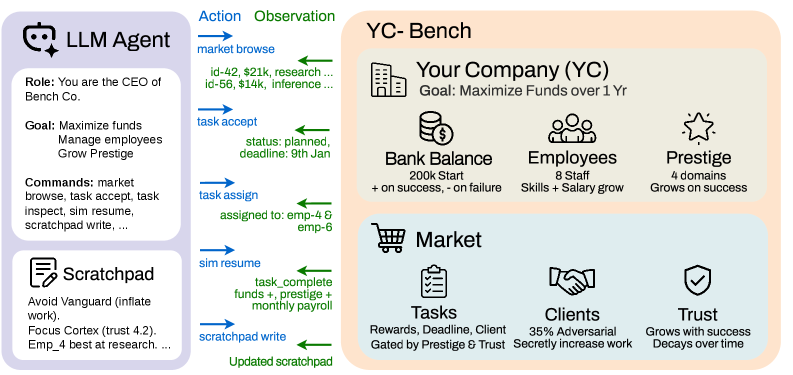

# 1년을 버틴 AI 에이전트의 비밀은 똑똑함이 아니라 메모장이었다

_가상 스타트업을 1년간 경영시킨 벤치마크에서, 생존을 가른 가장 강력한 변수는 모델 지능이 아니라 외부 기억이었다_

## Executive Summary

> [!callout]
> 12개의 AI 모델에게 가상의 스타트업을 1년 동안 경영하게 한 벤치마크가 있습니다. 수백 턴에 걸쳐 직원을 관리하고 계약을 고르고 수익을 지켜야 하는 환경에서, 시작 자본을 까먹지 않고 살아남은 모델은 12개 중 단 3개였습니다. 그리고 누가 살아남을지를 가장 잘 맞힌 변수는 모델의 지능 순위가 아니었습니다. 매 턴 자기 메모장에 무언가를 받아 적었느냐, 그것뿐이었습니다. 똑똑함이 아니라 기억이 에이전트의 수명을 갈랐습니다.

> 가장 인상적인 장면은 실패한 쪽에서 나왔습니다. 한 모델은 자기 회사가 위기에 빠졌다는 사실을 정확히 진단해 "명성 위기"라고 적기까지 했습니다. 문제는 그 진단이 이미 파산한 뒤에 나왔다는 것입니다. 추론은 맞았지만 제때 적고 다시 읽어 실행으로 옮기지 못했습니다. 연구진의 표현을 빌리면 "추론 능력과 생존은 같은 것이 아니었습니다."

> 이 결과를 데이터의 관점에서 읽으면 결론은 분명해집니다. 에이전트의 메모장은 결국 외부에 둔 데이터이고, 그 데이터가 잘 구조화되고 믿을 만하며 끊기지 않고 이어질 때에만 긴 일이 끝납니다. 자율화 시대의 병목은 더 큰 추론력이 아니라 기억할 데이터의 구조와 신뢰, 그리고 지속성입니다.

### 주요 수치

출처: [YC-Bench (arXiv:2604.01212)](https://arxiv.org/abs/2604.01212)

<!-- stat-card -->
**3 / 12** — 살아남은 모델 — 시작 자본 $200K를 1년 뒤에도 지킨 모델 수

<!-- stat-card -->
**$1.27M** — 1위 최종 자금 — 스크래치패드를 가장 잘 쓴 모델이 거둔 성적

<!-- stat-card -->
**47%** — 파산의 1차 원인 — 악성 클라이언트를 알아채지 못해 무너진 비율

<!-- stat-card -->
**20턴** — 기억할 수 있는 한계 — 그 너머를 잇는 유일한 수단이 스크래치패드

## 1년짜리 실험이 드러낸 1등 변수

2026년 4월 공개된 YC-Bench는 단순한 질문 하나를 던집니다. AI 에이전트가 긴 시간 동안 전략적 일관성을 유지할 수 있는가. 짧은 과제를 잘 푸는 것과, 불확실한 상황에서 계획을 세우고 지연된 피드백으로 배우며 초기의 실수가 복리로 쌓이는 환경을 1년간 버티는 것은 전혀 다른 능력입니다. 그래서 연구진은 12개 모델에게 가상 스타트업의 CEO 자리를 맡겼습니다.

규칙은 잔인할 만큼 현실적이었습니다. 에이전트는 직원을 배치하고 계약을 골라 수익을 내야 하는데, 인건비는 매달 빠져나가고 잘못된 결정의 손실은 시간이 갈수록 불어납니다. 환경은 부분 관측이라 모든 정보를 한눈에 볼 수도 없습니다. 결정적으로, 대화 기록은 최근 20턴까지만 남고 그 이전은 잘려 나갑니다. 어제 무슨 결정을 왜 내렸는지 기억하려면, 에이전트는 매 턴 시스템 프롬프트에 다시 주입되는 영속 스크래치패드에 직접 적어 두는 수밖에 없었습니다.

1년 뒤 결과는 냉정했습니다. 시작 자본 $200K를 까먹지 않고 지킨 모델은 12개 중 3개뿐이었습니다. 그런데 연구진이 "성공을 가장 강력하게 예측한 변수"로 지목한 것은 모델의 크기나 벤치마크 점수가 아니라 스크래치패드 사용이었습니다. 받아 적은 에이전트가 살아남았고, 적지 않은 에이전트는 자기가 어제 무슨 약속을 했는지조차 잊은 채 같은 실수를 반복하다 무너졌습니다.

*▲ YC-Bench 12개 모델의 월별 자금 궤적. 대부분이 시작 자본 수준에 머물거나 파산한 반면, 스크래치패드를 적극 활용한 상위 2개 모델만 $1.2M 이상을 기록했다. | Source: [He et al., YC-Bench (arXiv:2604.01212)](https://arxiv.org/abs/2604.01212)*

순위표의 한 칸이 이 점을 더 또렷하게 보여 줍니다. 1위 모델은 평균 최종 자금 $1.27M을 거뒀는데, 바로 뒤를 따른 모델이 $1.21M으로 거의 따라붙었습니다. 그런데 2위 모델의 추론 비용은 1위의 11분의 1에 불과했습니다. 더 비싸고 더 무거운 추론을 들이부은 쪽이 이긴 게 아니라는 뜻입니다. 결과를 가른 무게는 연산량이 아니라, 자기 결정을 적고 다시 읽는 습관 쪽에 실려 있었습니다.

> [!callout]
> **핵심 발견**: 긴 호라이즌에서 생존을 가른 1등 변수는 지능이 아니라 외부 기억이었습니다. 컨텍스트가 20턴마다 잘려 나가는 환경에서, 자기 결정을 적고 다시 읽는 습관이 일관성의 물리적 토대 역할을 했습니다.

## 똑똑함은 충분조건이 아니었다

이 실험에서 가장 자주 인용되는 일화는 한 모델의 자가 진단입니다. 회사가 서서히 가라앉던 어느 시점, 그 모델은 자기 처지를 "명성 위기 — 시장 고착"이라고 또렷하게 적었습니다. 무엇이 잘못됐는지 정확히 알고 있었던 셈입니다. 다만 그 통찰이 나온 것은 이미 인건비가 남은 운영 자금을 다 태운 뒤였습니다. 진단은 명석했지만 너무 늦었고, 알아챈 것을 제때 행동으로 옮기지 못했습니다.

파산의 절반 가까이는 더 단순한 곳에서 났습니다. 전체 파산의 47%가 악성 클라이언트를 알아채지 못한 데서 비롯됐습니다. 작업량을 부풀려 비용을 빨아들이는 적대적 계약을 그대로 받아들인 것입니다. 흥미로운 점은, 상위권 모델일수록 이런 함정에 잘 빠지지 않았는데 그 비결이 더 깊은 추론이 아니었다는 사실입니다. 그들은 한 번 당한 수법을 스크래치패드에 회피 규칙으로 적어 두었고, 그 결과 나머지 모델의 4분의 1 비율로만 악성 작업을 수락했습니다.

*▲ 모델별 악성 작업 수락 비율. 시장 평균(점선 약 32%)에 비해 상위 모델(Opus 4.6, GLM-5)은 10% 미만을 기록했다. 스크래치패드에 회피 규칙을 적은 것이 결정적 차이였다. | Source: [He et al., YC-Bench (arXiv:2604.01212)](https://arxiv.org/abs/2604.01212)*

무너진 쪽의 실패도 정보 부족 탓이 아니었습니다. 11개 중 7개 모델은 직원 배치에서 크게 헛디뎠는데, 너무 많은 일을 동시에 벌여 마감을 놓치는 식이었습니다. 모델들은 직원의 역량과 작업 요건을 이미 완벽히 알고 있었습니다. 알고도 추정에 실패했고, 그 실패를 기록해 다음 결정에 반영하지 못했습니다.

가장 뼈아픈 대조는 따로 있었습니다. 사람이 손으로 짠 단순한 규칙 기반 에이전트 하나가 모든 프론티어 LLM을 제치고 한 번도 파산하지 않았습니다. 같은 환경에서 가장 뛰어난 LLM조차 아홉 번에 한 번은 무너졌는데 말입니다. 추론 능력이 가장 빈약한 쪽이 가장 오래 살아남은 셈입니다. 그 규칙 에이전트가 한 일이라곤 정해진 원칙을 매번 똑같이 따르는 것, 다시 말해 어제의 규칙을 오늘도 잊지 않는 것뿐이었습니다.

> [!callout]
> **한 줄 요약**: 연구진은 이를 "추론 능력과 생존은 같은 것이 아니다"라고 정리했습니다. 똑똑하게 생각하는 것과, 그 생각을 적어 두었다가 다음 결정에서 다시 꺼내 쓰는 것은 별개의 능력입니다. 긴 일을 끝내는 쪽은 후자였습니다.

## 능력은 자라는데 실행은 왜 못 따라가나

모델이 점점 똑똑해진다는 것은 분명한 사실입니다. METR은 AI가 일정 신뢰도로 끝낼 수 있는 작업의 길이, 즉 작업 호라이즌이 일정 주기마다 두 배씩 늘어나는 지수적 추세를 보인다고 보고합니다. 능력의 곡선만 보면 낙관할 이유가 충분합니다. 그런데 같은 보고서에는 잘 인용되지 않는 단서가 붙어 있습니다. 이 측정은 신규 입사자 수준의 저맥락 작업에만 적용되며, 16시간을 넘는 길이는 현재의 평가 도구로는 신뢰성 있게 잴 수조차 없다는 것입니다.

*▲ AI의 작업 완료 시간 호라이즌은 지수적으로 늘어나는 추세다. 단, 이 측정은 저맥락·단기 작업에 한정되며 16시간 이상은 신뢰 측정이 불가능하다. | Source: [METR, Time Horizons](https://metr.org/time-horizons/) (CC-BY)*

능력 호라이즌과 실행 호라이즌 사이에는 간극이 있습니다. 짧고 깔끔한 과제를 풀어내는 능력이 지수적으로 자란다고 해서, 1년짜리 일을 끝까지 해내는 실행이 그만큼 따라온다는 보장은 없습니다. YC-Bench가 보여 준 것이 바로 그 간극이었습니다.

왜 그런지를 정면으로 파고든 연구가 또 있습니다. 같은 시기에 나온 한 분석은 에이전트 시스템의 실패 3,100여 건을 분류했고, 긴 호라이즌의 실패가 단순히 베이스 모델의 능력이 떨어져서 생기는 게 아니라는 결론에 이릅니다. 길어질수록 실패의 구성 자체가 구조적으로 바뀐다는 것입니다. 연구진은 "베이스 모델만 키워서는 지배적인 실패 메커니즘이 해결되지 않을 것"이라고 못 박았습니다.

그 지배적 실패의 한가운데에 기억이 있습니다. 설계 레벨의 위험으로 분류된 실패가 전체의 27.5%였는데, 그 핵심이 메모리 한계와 catastrophic forgetting이었습니다. 트라젝토리가 길어지고 컨텍스트 부하가 커질수록, 에이전트는 과거의 제약을 유지하는 일과 새 관측을 처리하는 일 사이에서 유한한 기억 예산을 두고 저울질해야 합니다. 한 사례에서는 에이전트가 "신품만" 고르라는 조건을 걸어 놓고도 나중에 "리퍼 제품"을 슬그머니 추가했습니다. 그 제약이 컨텍스트 안에 여전히 있었지만, 주목받지 못한 채 묻혀 버린 것입니다.

> [!callout]
> **관점의 전환**: 능력이 자라는 것과 긴 일이 끝나는 것은 다른 문제입니다. 길어질수록 무너지는 이유는 모델이 멍청해져서가 아니라, 기억해야 할 것을 잃어버리기 때문입니다. 더 큰 모델은 이 병목을 자동으로 풀어 주지 않습니다.

## 지구력은 '잘 관리된 외부 기억'에서 나온다

LLM은 본질적으로 상태가 없습니다. 매 호출은 백지에서 시작하고, 세션이 끝나면 방금까지의 맥락은 사라집니다. 시간과 세션을 넘어 일을 이어 가려면 외부에 기억을 두는 수밖에 없습니다. 게다가 컨텍스트 윈도우가 아무리 넓어져도 그 안에서 정보가 고르게 활용되지는 않습니다. 모델은 입력의 처음과 끝은 잘 기억하면서 중간은 흘려보내는 U자형 성능 곡선을 보입니다. 선언된 윈도우 크기와 실제로 주목하는 범위는 다릅니다.

그래서 "적는다"는 행위가 결정적입니다. Anthropic의 한 실험에서 에이전트는 별도 지시 없이도 스스로 지도와 전투 전략을 노트에 적었고, 컨텍스트가 리셋된 뒤 자기 노트를 다시 읽으며 여러 시간짜리 작업을 이어 갔습니다. 받아 적고 다시 읽는 단순한 순환이 긴 작업의 지구력을 만들어 낸 것입니다.

*▲ YC-Bench의 에이전트 상호작용 구조. LLM 에이전트(왼쪽)는 스크래치패드에 매 턴 적고 이를 다시 읽으며 가상 스타트업 환경(직원·시장·클라이언트)과 상호작용한다. | Source: [He et al., YC-Bench (arXiv:2604.01212)](https://arxiv.org/abs/2604.01212)*

다만 적는 것만으로는 부족합니다. 많은 메모리 시스템이 한번 쓰면 지우지 않는 방식이라, 중복되거나 서로 얽히거나 이미 폐기된 변종이 검색 결과를 오염시킵니다. 노트가 쌓일수록 정작 필요한 한 줄을 찾기 어려워지고, 잘못된 과거 메모가 새 결정에 노이즈로 끼어듭니다. 그래서 핵심 질문은 "적었는가"를 넘어섭니다. 무엇을, 어떤 구조로, 얼마나 믿을 수 있게, 얼마나 오래 보존하며 적고 다시 읽는가가 진짜 문제입니다.

> [!callout]
> **메모리 위생**: 에이전트의 지구력은 기억의 양이 아니라 질에서 나옵니다. 잘 구조화돼 검색되고, 노이즈 없이 믿을 수 있으며, 세션과 truncation을 넘어 지속되는 기억이라야 긴 일을 끝까지 받쳐 줍니다.

## 모델을 키울 것인가, 기억을 정돈할 것인가

세 갈래의 증거가 한 방향을 가리킵니다. YC-Bench는 생존의 1등 변수가 지능이 아니라 받아 적은 외부 기억이라고 말합니다. 긴 호라이즌 실패를 해부한 분석은 모델만 키워서는 풀리지 않으며 메모리 한계가 구조적 실패의 핵심이라고 말합니다. METR은 능력이 분명 자라지만 그것이 곧 긴 일을 끝낸다는 보장은 아니라고 말합니다. 똑똑함의 곡선과 지구력의 곡선은 같지 않습니다.

에이전트의 외부 기억은 결국 데이터 문제입니다. 에이전트가 다시 읽을 그 노트는 외부에 둔 데이터이고, 데이터가 잘 구조화돼 참조 가능하고, 노이즈와 폐기된 변종 없이 믿을 만하며, 세션을 넘어 끊기지 않고 지속될 때에만 에이전트는 길고 복잡한 일을 끝냅니다. 사람이 메모하듯, 에이전트는 자기 데이터를 적고 다시 읽어야 합니다. 자율화 시대의 병목은 추론력이 아니라 데이터의 구조와 신뢰, 지속성입니다.

그래서 질문은 이렇게 바뀝니다. 당신의 에이전트가 내일도 일하게 하려면, 더 큰 모델로 갈아탈 것인가, 아니면 그가 기억할 데이터를 정돈할 것인가. 1년을 버틴 에이전트가 알려 준 답은 분명합니다. 모델 사이즈를 키우기 전에, 받아 적을 메모장부터 제대로 만들 차례입니다.

> [!callout]
> **마무리**: 1년을 버틴 비결은 더 똑똑한 머리가 아니라 잘 정돈된 메모장이었습니다. 에이전트의 메모장은 데이터입니다. 그 데이터의 구조와 신뢰, 지속성을 어떻게 다룰지가 다음 시대의 진짜 경쟁력입니다.

## 참고문헌

- 1.He, M., Jain, A., Kumar, A., Tu, V., Bakshi, S., Patro, S., & Rajani, N. (2026). "[YC-Bench: Benchmarking AI Agents for Long-Term Planning and Consistent Execution](https://arxiv.org/abs/2604.01212)." _arXiv:2604.01212_. — 가상 스타트업 1년 경영 벤치마크. 12개 모델 중 시작 자본 $200K를 지킨 건 3개. 스크래치패드 사용이 성공의 가장 강력한 예측 변수, 파산의 47%는 악성 클라이언트 탐지 실패.
- 2.Wang, et al. (2026). "[The Long-Horizon Task Mirage? Diagnosing Where and Why Agentic Systems Break](https://arxiv.org/html/2604.11978v1)." _arXiv:2604.11978_. — 3,100+ 트라젝토리 분석. 긴 호라이즌 실패는 구조적 실패 구성 변화이며, 메모리 한계·catastrophic forgetting이 설계 레벨 실패의 27.5%.
- 3.METR. (2026). "[Measuring AI Ability to Complete Long Tasks (Time Horizons)](https://metr.org/time-horizons/)." _METR_. — 작업 완료 시간 호라이즌의 지수적 성장. 단, 저맥락 작업 한정, 16시간 이상은 측정 불가. 능력 ≠ 실행.
