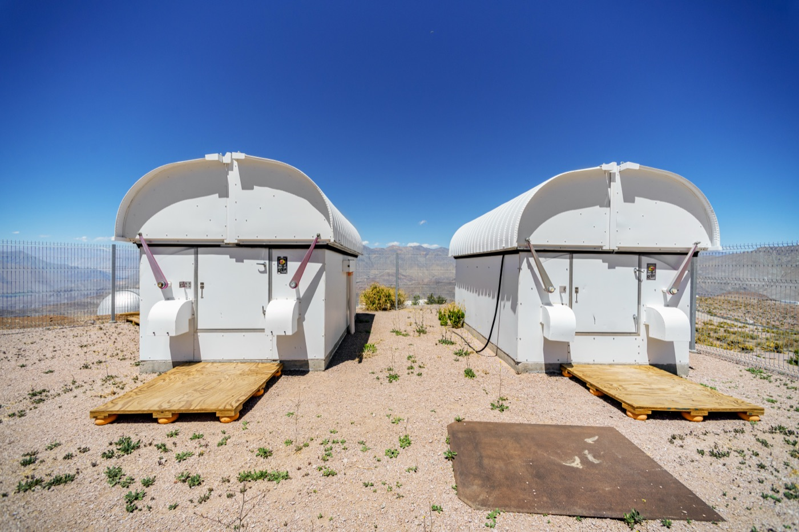

# The AI Labeling Pipeline That Found 18 New Anomalies in 370,000 Variable Stars

_Labeling was held to 1 percent of the catalog, and the active learning loop closed the search in three hours for about $40_

## Executive Summary

> [!callout]
> A paper posted to arXiv on August 24 pulled 24 anomalous objects out of 373,646 periodic variable stars. The catalog is the one the ASAS-SN survey has been building, and the authors are researchers at Charles University and Ohio State. Eighteen of the 24 have never been reported as unusual in the literature. The light curves were not examined by a person. A multimodal agent did the looking, and it opened about 1 percent of the catalog.

> The budget arithmetic printed next to the discovery list is the part worth lingering on. The authors worked out what the same 5,100-label budget would have bought if it had been spent straight down the initial outlier ranking. The answer is 53 of the final 177 objects, roughly 30 percent. The lowest-ranked anomaly sat near position 350,000, and walking down the list far enough to reach it would have taken about 70 times the budget.

> For anyone who works with data, this does not read as an astronomy story alone. The choice of what to label first set the reach of the search rather than the accuracy of a model. And because the reviewer was an agent, the paper has to say what it takes to audit those verdicts, which it does in some detail.

### Key Figures

Source: [Pešta & Ting (2026), arXiv:2608.23688](https://arxiv.org/abs/2608.23688), abstract and Sections IV and V

<!-- stat-card -->
**5,100** — Stars actually labeled — About 1% of the 373,646 in the sample

<!-- stat-card -->
**3 hours · $40** — Cost of the whole pipeline — 51 iterations plus the five-agent review

<!-- stat-card -->
**30%** — Recovery from the initial ranking — 53 of 177 objects at the same budget

<!-- stat-card -->
**70×** — Budget needed for the last anomaly — It started near rank 350,000

## Only 5,100 of 370,000 Were Looked At

Picking the odd star out of a variable-star catalog has always been eye work. Someone pages through light curves, the plots that show how a star's brightness rises and falls over time, and pulls out the ones that look wrong. A few thousand plots is a manageable afternoon. The catalogs that survey telescopes now build on their own run to hundreds of thousands.

The obvious objection is to point an automated outlier detector at the pile, and the paper answers it in the introduction. When [Etsebeth and colleagues (2024)](https://dx.doi.org/10.1093/mnras/stae496) ran isolation forests over roughly 4 million galaxy images from DECaLS, 1,763 of the top 2,000 candidates turned out to be instrumental artifacts or masked sources, with only a single scientifically interesting anomaly in that initial ranking. An algorithm that looks for outliers finds broken data along with rare astrophysics, and separating the two lands back on a human desk.

Milan Pešta and Yuan-Sen Ting handed that desk to multimodal agents. Their sample is 373,646 periodic variables drawn from ASAS-SN Sky Patrol V2.0, cross-matched against the VSX catalog of variable stars and filtered on epoch count and magnitude range. The model doing the review is Gemini 3 Flash, and what each agent receives is a phase-folded light-curve image plus a short metadata block: period, amplitude, and the VSX class name. No object name, no sky coordinates. The class name itself was overridable, so an agent that disagreed with VSX after looking at the plot could write its own classification instead.

*▲ ASAS-SN robotic telescope domes at Cerro Tololo Inter-American Observatory in Chile. The 373,646 variable stars in this paper came out of a sky-survey network like this one. | Source: [CTIO/NOIRLab/NSF/AURA](https://noirlab.edu/public/images/DSC-4322-CC)*

After 51 iterations, 5,100 stars carried labels, about 1 percent of the sample. The run took roughly 3 hours and about $40 in API calls. It returned 24 anomalies and 153 potentially interesting objects worth follow-up, and 18 of the 24 anomalies had never been flagged as unusual before.

How many days the same job would have taken a person is a number the paper never estimates. What the authors did measure themselves against is not a human but another machine, specifically the ordinary approach of ranking by outlier score and labeling nothing. That comparison produced the most practically useful figure in the paper.

## Every Label Rewrites the Ranking

The pipeline starts from a picture rather than a number. Each light curve is folded on its period and rendered as a 518 by 518 pixel image with the axes and tick labels stripped away. That shape-only image goes through DINOv2 ViT-g/14 and comes out as a 1,536-dimensional vector. The model was never fine-tuned on astronomical data, and yet the embedding space separated the light curves by variability class on its own.

The initial ranking comes next. The 26 VSX classes with more than a thousand members, plus one catch-all group for everything else, each got their own isolation forest, 27 in total, and every star received an outlier score within its class. Train a single forest across the whole sample and the rare classes come out wholesale as outliers. Fitting one per class moves the line between ordinary and strange inside the class rather than across the catalog.

From there the loop turns. In each round an agent independently reviews the top 100 unlabeled candidates and assigns 0 for not interesting, 1 for potentially interesting, or 2 for anomalous. Those labels propagate through the embedding space to any neighbor whose cosine similarity exceeds 0.90, which reshuffles the ranking for the next round. To keep the search from burrowing into the neighborhoods it has already found, the authors capped the number of neighbor-elevated candidates reviewed in each iteration at half the batch. It is the classic active learning structure in which expert labels update the ranker, with only the identity of the labeler changed.

The word agent here does not mean a system that calls tools or plans its own work. A footnote in the paper defines it as an independently prompted instance of a multimodal LLM acting as an automated annotator, and adds that the agents are deliberately minimal, with no memory across evaluations, no access to external tools, and no ability to plan their own actions. One image and one prompt are the whole evidence base for a verdict.

After 50 rounds, the 51st behaves differently. The 5,000 accumulated labels train a logistic regression classifier that rescores the entire unlabeled pool, and the top 100 with anomaly probability above 0.90 go to the agents as one final batch. Similarity propagation only searches near what has already been seen, so pulling in distant candidates required one pass that looked at everything again.
