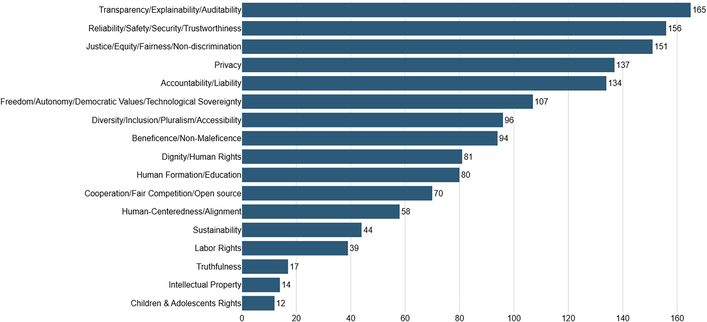

# Automation Is Easy. Trust Must Be Designed.

_Designing verification gates for agentic AI content pipelines_

## Executive Summary

> [!callout]
> When agentic AI generates content autonomously, verification is no longer post-hoc proofreading. It becomes the central design problem of the pipeline. A single false claim or a single drift in brand voice — automatically published — can collapse trust in a second. A fast pipeline ships good content and bad content at the same speed.

> This piece lays out why verification is hard in autonomous content pipelines and how it should be designed, framed through a data-quality lens. It covers three distinct failure modes — hallucination, context drift, structural inconsistency — a three-tier gate from deterministic checks to LLM-as-a-Judge to exception-based human review, and the verification patterns Pebblous has observed running its own autonomous blog pipeline.

> The conclusion is simple. Automation is easy; trust must be designed. The three axes DataClinic uses to diagnose datasets — accuracy, consistency, completeness — apply directly to content verification. Autonomous publishing without verification is no different from training a model on garbage data. The only difference is that the latter only breaks the model, while the former breaks the brand along with it.

<!-- stat-card -->
**45%** — Hallucination drop — with NLI verifiers

<!-- stat-card -->
**70%** — of AI failures — BCG: people & process

<!-- stat-card -->
**40%+** — scrapped by 2027 — Gartner: agentic projects

<!-- stat-card -->
**3 axes** — data-quality principles — accuracy · consistency · completeness

## Why Verification Matters Now

The era of AI waiting for one prompt at a time is already behind us. The biggest shift in enterprise AI in 2026 is from reactive to agentic, and Gartner projects that more than 40% of enterprises will adopt agentic AI this year. Content pipelines follow the same curve. Topic discovery, research, drafting, editing, publishing, distribution — every step that once required human hands is now handled by multi-agent systems.

Speed jumps dramatically. HubSpot reports that content teams adopting AI publish two to three times faster. Inside Pebblous, our own blog pipeline cut per-article authoring from eight hours to under thirty minutes. The acceleration has a price: the blast radius of an error becomes just as immediate.

MIT Sloan captures the core risk in one sentence: **"LLMs are optimized for plausibility, not accuracy."** Plausible sentences cite plausible sources and ship at a plausible cadence — until you notice no one actually checked whether any of it was true. The most dangerous failure of an autonomous pipeline is not the system stopping. It is the system continuing to produce the wrong thing at full speed.

*▲ Content verification in the manual-copyediting era — autonomous pipelines compress this step and risk erasing it altogether | Source: [Wikimedia Commons](https://commons.wikimedia.org/wiki/File:Example_of_copyedited_manuscript.jpg)*

> [!callout]
> **The core observation:** The danger of an autonomous pipeline starts when "a slow, accurate human" is replaced by "a fast, inaccurate system." If you gained speed by losing accuracy, that is not progress. Verification is the only mechanism that holds both at once.

## Hallucination Isn't the Scariest Failure

Autonomous content pipelines do not fail in one way. They fail across three distinct dimensions, each with different detection difficulty and cost — and no single tool catches all three. Notably, the most famous failure (hallucination) is the easiest to catch, while the least-discussed one (structural inconsistency) is the hardest.

### 2.1. Hallucination

The most famous failure mode: inventing facts that do not exist. A sentence opens with "OpenAI's 2023 GPT-3.5 paper..." and fabricates the citation, or presents a function signature that no library actually ships. Paradoxically, hallucination is the easiest to detect. Natural Language Inference (NLI) verifiers, citation grounding, and retrieval-augmented verification have matured fast — one production LLM system reported a 45% drop in hallucination after adding an NLI verifier alone.

### 2.2. Context Drift

Facts are correct, but the writing drifts away from the article's audience, purpose, or brand voice. A Pebblous post written for data engineers suddenly slips into general-consumer marketing language mid-paragraph. Fact-checkers will not catch it — every sentence is true. But the truths fail to add up to a single coherent promise. LLM-as-a-Judge can detect part of this if you supply a brand-voice spec as reference, but only if the spec itself is concrete enough to score against.

### 2.3. Structural Inconsistency

The outline is correct, but logic breaks between sections and the conclusion contradicts the promise of the introduction. One section says "verification can be automated," another says "verification is ultimately a human domain." Schema validators do not catch it — every section is valid HTML. This is the hardest failure to catch automatically, and the one a human reader senses immediately as dissonance.

> [!callout]
> **Translated into data-quality terms:** hallucination is an **accuracy** violation, context drift is a **consistency** violation, structural inconsistency is a **completeness** violation. The three axes DataClinic uses to diagnose datasets apply, unchanged, to content. Three decades of data-quality discipline already has answers for content verification — we just need to translate.

## No Single Tool Catches Everything — Three Gates, Layered

No single tool defends against all three failure modes. You need three layers, each with a different trade-off between speed, cost, and accuracy. The guiding principle is simple: **cheap and fast first, expensive and precise later.** Applying every check to every piece of content blows up cost. Routing only Tier-1 passers into Tier 2, and only low-confidence Tier-2 passers into Tier 3, can cut total verification cost by 80–90%.

*▲ The Swiss Cheese model — every single check has holes; only deterministic, semantic, and human review stacked together prevent failures from passing all the way through | Source: [Wikimedia Commons](https://commons.wikimedia.org/wiki/File:Swiss_cheese_model_of_accident_causation_with_additional_labels.png)*

### 3.1. Tier 1 — Deterministic Verifiers

The fastest and cheapest layer. Regular expressions and schema validation catch structural defects. Is the H1 empty? Does every section have `fade-in-card`? Are there at least seven FAQs? Does `articles.json` use the standard field names (`title`, `date`, `path`)? These checks know nothing about meaning — but they are deterministic and always return the same answer. The pre-commit grep patterns running inside Pebblous's blog pipeline live exactly at this layer.

### 3.2. Tier 2 — LLM-as-a-Judge

The semantic layer. A separate LLM plays the role of judge, taking the drafted content plus a rubric and returning a score. "Does this paragraph deliver on the promise made by the mainTitle?" "Does it stay within the Warm Expert Tone?" "Does each factual claim carry a citation?" Because cost is much higher than deterministic checks, this tier only runs on content that already passed Tier 1, and routes by confidence score into the next stage.

### 3.3. Tier 3 — Exception-Based Human Review

Slowest, most expensive, most accurate. Human judgment remains essential for two reasons. First, the EU AI Act and FTC guidance impose transparency obligations on generative AI content, effectively presuming human accountability at publish time. Second, LLM-as-a-Judge can itself hallucinate, so you need a final safety net. The key is **exception-based review**: a human does not read everything. They read only content flagged by low confidence scores, missing brand keywords, or unverifiable citations. Ten to fifteen minutes of exception review is tolerable compared to the four to eight hours of full authoring it replaces.

- •**Tier 1 pass-rate target**: 95%+ — anything below is auto-regenerated
- •**Tier 2 pass-rate target**: 80%+ — failures route to human review
- •**Tier 3 load target**: 10–20% of total — higher means Tier 1·2 need strengthening

## Different Stages Need Different Gates

Three tiers are a vocabulary for classification, not for placement. A real content pipeline flows through four stages — research, drafting, pre-publish, post-publish — and applying the same gate intensity at every stage collapses both cost and latency. Which tier belongs at which stage, and how far it goes there — that decision is the heart of pipeline design. Here are the patterns we run in production inside the Pebblous blog pipeline (`blog-produce`).

### 4.1. Research — Score Source Trust

When the research agent pulls material from the web, not all sources deserve equal trust. Domain authority, publication date, and whether citations are explicit all feed a score; anything below threshold is passed forward with a "low-trust source" flag. Filtering early matters — wrong facts smuggled in at the research stage seep into every paragraph downstream, making post-hoc verification dramatically harder.

### 4.2. Drafting — Pre-Commit Grep + Voice Check

Once the HTML is drafted, deterministic patterns run first. `grep -n "DOMContentLoaded"` (forbidden pattern), `grep -n "text-2xl.*mb-6"` (non-standard H2), `grep -c "question:"` (must be 7+) — each one must pass before the next stage opens. Then LLM-as-a-Judge inspects voice and logical flow. Only when both pass does the draft move toward publishing.

### 4.3. Pre-Publish — SEO 4-Layer + Schema Validation

The SEO 4-layer check (meta tags, Open Graph, JSON-LD, indexability) runs automatically. Pebblous's `seo-check` skill validates title length, description length, canonical correctness, presence of three hreflang variants, and og:image URL validity. When registering in `articles.json`, schema validation enforces the standard field names (`title`, `date`, `path`, `language`). One mistaken character in a field name once stopped the entire index-page card grid from rendering — that is why this layer is non-negotiable.

### 4.4. Post-Publish — Indexing & Link Integrity

Publication is not the finish line. Sitemap inclusion, Google Search Console indexing status, and broken-link checks run on a recurring schedule. The biggest trap in an autonomous pipeline is the belief that "we pressed publish, we're done." A single broken link erodes reader trust, and a page that never gets indexed might as well have never been published.

> [!callout]
> **Practical tip:** Do not apply the same verification intensity across all four stages. Research and drafting deserve strong gates; pre-publish benefits from deterministic checks; post-publish needs monitoring. Distributing verification budget unevenly across stages — by the cost of failure at each stage — is the core skill of pipeline design.

## Autonomy Isn't Binary — It's Graded

Not every piece of content can be processed at the same autonomy level. A product description update and an opinion piece on a current event demand different verification intensity. Kai Waehner's 2026 framing of **bounded autonomy** captures this: full autonomous deployment requires prior trust establishment, exception-handling verification, and edge-case coverage — start autonomous where verification confidence is high, then extend incrementally.

Just as DataClinic grades datasets across levels 1 through 3, content autonomy needs staged trust-building. For repetitive, structural content — product descriptions, FAQ updates, data reports — full autonomous publishing without a final human gate is realistic. For original insight or current-affairs commentary, human review still belongs in the loop. The art of bounded autonomy is designing one pipeline that routes different content types through different gates based on the cost of a publishing mistake.

A related concept worth borrowing: the **governance agent** — an AI that watches other AI systems. In a content pipeline, it materializes as an "audit agent." It randomly samples published content, verifies it against the intended quality bar after the fact, and feeds patterns back into the pipeline itself. AI watching AI sounds paradoxical, but at scales where exhaustive human review is impossible, it becomes the only viable safety net.

> [!callout]
> **The central question of bounded autonomy:** "What is the cost if this content is published wrongly?" Where the cost is low, allow more autonomy. Where it is high, harden the human gate. Applying one uniform policy to all content is either wasted budget or accumulated risk.

## Why Verification Becomes the Core of AI Governance

Gartner forecasts that by 2028, explainable AI (XAI) will account for 50% of LLM observability investment. The same firm also predicts that more than 40% of agentic AI initiatives will be scrapped by 2027. The two forecasts look contradictory but point at the same fact: autonomous systems deployed without verification and observability fail to earn trust and disappear.

*▲ Across 200 worldwide AI ethics guidelines, the most cited principle is "Transparency / Explainability / Auditability" (165 mentions) — verification logs are one of the few mechanisms that satisfy all three at once | Source: [Wikimedia Commons](https://commons.wikimedia.org/wiki/File:Number_of_times_an_aggregated_AI_governance_principle_was_cited_in_200_AI_ethics_guidelines_worldwide.jpg)*

The EU AI Act imposes transparency obligations on generative AI content. Users must be informed when content is AI-generated, and decision processes must remain explainable. Verification logs stop being mere debugging artifacts and become legal evidence. Autonomous content with no recorded trail of which checks passed at which stage will carry progressively heavier liability in a regulated environment.

BCG goes one step further: 70% of AI adoption failures trace not to technology but to people and process. Verification design looks like a technical question but is structurally an organizational one. Who is allowed to pass a gate? Who reviews exceptions? Who tunes confidence thresholds? An organization without clear answers cannot make even the most sophisticated verification system actually work.

### 6.1. The Pebblous View

When Pebblous talks about AI-Ready Data, "quality" starts at the dataset. But the same quality bar must extend to the content AI generates. Bad data shakes model outputs; unverified model outputs shake autonomous content; and unverified content fed back as training data shakes the next generation of models. Autonomous publishing without verification is no different from training a model on garbage data — except this time, the brand breaks alongside the model.

> [!callout]
> The three axes DataClinic uses — accuracy, consistency, completeness — are the starting point for content verification. The first question to ask when designing an autonomous content pipeline is not "which model do we use?" but "what quality bar must content clear before it ships?" Automation is easy; trust must be designed.
