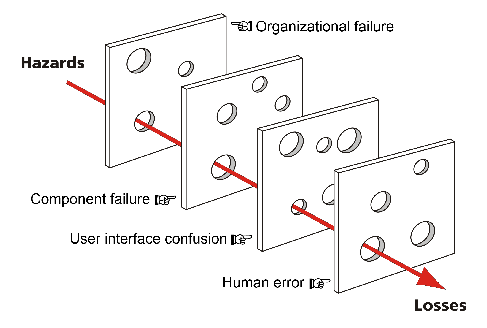

# 에이전틱 콘텐츠 파이프라인의 신뢰를 설계하는 검증 게이트

_에이전틱 AI 콘텐츠 파이프라인의 검증 게이트를 설계하는 법_

## Executive Summary

> [!callout]
> 에이전틱 AI가 콘텐츠를 자율 생성하는 시대, '검증'은 사후 교정이 아니라 파이프라인 설계의 핵심입니다. 잘못된 사실 하나, 브랜드 보이스 이탈 하나가 자동 발행되는 순간 신뢰는 순식간에 무너집니다. 빠르게 도는 파이프라인은 좋은 콘텐츠도, 나쁜 콘텐츠도 동일한 속도로 세상에 내보냅니다.

> 이 글은 자율 콘텐츠 생성 파이프라인에서 검증이 왜 어렵고 어떻게 설계해야 하는지를 데이터 품질 관점에서 정리합니다. 환각·맥락 이탈·구조적 비일관성이라는 세 가지 실패 모드, 결정론적 검사 → LLM-as-a-Judge → 인간 예외 검토로 이어지는 3티어 게이트, 그리고 페블러스가 실제 운영 중인 자율 블로그 파이프라인에서 관찰한 검증 패턴을 다룹니다.

> 결론은 단순합니다. 자동화는 쉽고, 신뢰는 설계해야 합니다. DataClinic이 데이터를 진단하는 정확성·일관성·완전성 3축은 콘텐츠 검증에도 그대로 적용됩니다. 검증 없는 자율 발행은 쓰레기 데이터로 훈련한 모델과 같습니다. 차이가 있다면 후자는 모델만 망가지지만 전자는 브랜드까지 함께 망가진다는 점입니다.

<!-- stat-card -->
**45%** — 환각 감소 — NLI 검증기 적용 시

<!-- stat-card -->
**70%** — 실패의 원인 — BCG: 사람·프로세스 문제

<!-- stat-card -->
**40%+** — 2027년 폐기 전망 — Gartner: 에이전틱 이니셔티브

<!-- stat-card -->
**3축** — 데이터 품질 원칙 — 정확성·일관성·완전성

## 왜 지금 '검증'이 문제인가

AI가 사람의 지시를 받아 한 단계씩 답하던 시대는 이미 지났습니다. 2026년 기업 AI의 가장 큰 변화는 반응형(reactive)에서 자율형(agentic)으로의 전환이고, Gartner는 같은 해 40%가 넘는 기업이 에이전트 AI를 도입할 것으로 전망합니다. 콘텐츠 파이프라인도 같은 흐름을 탑니다. 주제 발굴 → 리서치 → 작성 → 편집 → 발행 → 배포까지, 한때 사람의 손이 거쳐야 했던 모든 단계가 멀티 에이전트로 처리됩니다.

속도는 비약적으로 빨라집니다. HubSpot 보고에 따르면 AI를 도입한 콘텐츠 팀은 발행 속도가 2~3배 증가했습니다. 페블러스 내부 블로그 파이프라인도 한 편당 작성 시간이 8시간에서 30분 이내로 줄었습니다. 그런데 이 가속에는 대가가 따릅니다. 오류의 파급 또한 즉각적이 된다는 점입니다.

MIT Sloan은 핵심 위험을 한 문장으로 요약합니다. **"LLM은 정확성이 아닌 그럴듯함을 최적화한다."** 그럴듯한 문장이 그럴듯한 출처를 인용하며 그럴듯하게 발행되는 사이, 아무도 그 사실 여부를 검토하지 않는 순간이 옵니다. 자율 파이프라인의 가장 위험한 실패는 시스템이 멈추는 것이 아니라, 시스템이 잘못된 것을 정상적인 속도로 계속 만들어내는 것입니다.

*▲ 사람이 손으로 교정하던 시대의 콘텐츠 검증 — 자율 파이프라인은 이 단계를 압축하면서 동시에 사라지게 한다 | Source: [Wikimedia Commons](https://commons.wikimedia.org/wiki/File:Example_of_copyedited_manuscript.jpg)*

> [!callout]
> **핵심 관찰:** 자율 파이프라인의 위험은 '느리고 정확한 사람'을 '빠르고 부정확한 시스템'으로 교체하는 데서 시작됩니다. 속도를 얻기 위해 정확성을 잃었다면, 그것은 진보가 아닙니다. 검증은 속도와 정확성을 동시에 잡기 위한 유일한 장치입니다.

## 가장 무서운 실패는 환각이 아니다

자율 콘텐츠 파이프라인이 실패하는 방식은 단순한 '오타'가 아닙니다. 더 정확하게 말하면 세 가지 서로 다른 차원에서 실패합니다. 각각은 발견 난이도와 비용이 다르며, 같은 도구로 잡을 수 없습니다. 흥미롭게도 가장 유명한 환각이 사실은 가장 잡기 쉽고, 가장 적게 거론되는 구조적 비일관성이 가장 잡기 어렵습니다.

### 2.1. 환각 (Hallucination)

없는 사실을 만들어내는 가장 유명한 실패 모드입니다. "OpenAI의 2023년 GPT-3.5 논문은…"이라고 시작하는 문장이 출처를 만들어내거나, 존재하지 않는 함수 시그니처를 코드 예제로 제시합니다. 역설적으로 환각은 비교적 탐지가 쉬운 편입니다. NLI(Natural Language Inference) 검증기, citation grounding, retrieval-augmented verification 같은 기법이 성숙해졌고, 한 프로덕션 LLM 시스템 사례에서는 NLI 검증기 도입만으로 환각이 45% 감소했습니다.

### 2.2. 맥락 이탈 (Context Drift)

사실은 맞지만 글의 맥락·독자·브랜드 보이스와 어긋나는 실패입니다. 페블러스 블로그가 데이터 엔지니어 독자를 위해 쓴 글의 중간에 갑자기 일반 소비자 마케팅 문구가 들어가는 식입니다. 사실 검증으로는 잡히지 않습니다. 모든 문장이 진실이기 때문입니다. 다만 그 진실들이 한 글의 일관된 약속을 이루지 못합니다. LLM-as-a-Judge에 브랜드 보이스 가이드라인을 레퍼런스로 제공하면 일부 탐지가 가능하지만, 가이드라인 자체가 충분히 구체적이어야 합니다.

### 2.3. 구조적 비일관성 (Structural Inconsistency)

아웃라인은 맞는데 섹션 간 논리 흐름이 끊기고, 결론이 도입부의 약속과 모순되는 경우입니다. 한 섹션은 "검증은 자동화할 수 있다"고 말하는데 다른 섹션은 "검증은 결국 사람의 영역이다"라고 말합니다. 형식 검증기에는 잡히지 않습니다. 모든 섹션이 올바른 HTML로 작성됐기 때문입니다. 이것이 가장 잡기 어려운 실패이자, 사람이 읽으면 즉시 위화감을 느끼는 실패입니다.

> [!callout]
> **데이터 품질로 번역하면:** 환각 = **정확성(Accuracy)** 위반, 맥락 이탈 = **일관성(Consistency)** 위반, 구조적 비일관성 = **완전성(Completeness)** 위반. DataClinic이 데이터셋을 진단할 때 사용하는 3축이 콘텐츠에도 그대로 적용됩니다. 데이터 품질 관리의 30년 노하우는 콘텐츠 검증에 이미 답을 가지고 있습니다.

## 한 도구로는 못 잡는다 — 게이트는 세 겹

세 가지 실패 모드를 막기 위한 검증 게이트는 단일 도구로 해결되지 않습니다. 속도·비용·정확성의 트레이드오프가 다른 세 가지 계층이 함께 작동해야 합니다. 핵심 원칙은 단순합니다. **싸고 빠른 검사를 먼저, 비싸고 정확한 검사를 나중에.** 모든 검증을 모든 콘텐츠에 적용하면 비용이 폭발하지만, 티어 1을 통과한 항목에만 티어 2를, 티어 2를 통과한 항목 중 신뢰도가 낮은 것에만 티어 3을 적용하면 80~90% 비용 절감이 가능합니다.

*▲ Swiss Cheese 모델 — 단일 검증 도구는 반드시 구멍이 있다. 결정론적·의미론적·인간 검토를 겹쳐야 위험이 끝까지 통과하지 못한다 | Source: [Wikimedia Commons](https://commons.wikimedia.org/wiki/File:Swiss_cheese_model_of_accident_causation_with_additional_labels.png)*

### 3.1. 티어 1: 결정론적 검증기

가장 빠르고 가장 싼 계층입니다. 정규표현식과 스키마 검증으로 구조적 결함을 잡습니다. HTML의 h1이 비어있는지, fade-in-card 클래스가 있는지, FAQ가 7개 이상인지, articles.json의 필드명이 표준(`title`, `date`, `path`)을 따르는지 같은 검사가 여기 속합니다. 단점은 의미를 모른다는 것이고 장점은 결정론적이라 항상 같은 결과를 준다는 점입니다. 페블러스 블로그 파이프라인의 pre-commit grep 패턴이 정확히 이 계층에 해당합니다.

### 3.2. 티어 2: LLM-as-a-Judge

의미론적 검증을 수행하는 계층입니다. 별도의 LLM이 평가자 역할을 맡고, 작성된 콘텐츠와 평가 기준을 받아 점수를 매깁니다. "이 단락이 mainTitle과 약속한 내용을 뒷받침하는가?", "브랜드 보이스(Warm Expert Tone)를 유지하는가?", "사실 주장에 출처가 있는가?" 같은 질문에 답합니다. 비용이 결정론적 검사보다 훨씬 크기 때문에 티어 1을 통과한 항목에만 적용하고, 출력의 신뢰도 점수에 따라 다음 단계로 라우팅합니다.

### 3.3. 티어 3: 인간 예외 검토

가장 느리고 가장 비싸지만 가장 정확한 계층입니다. 인간의 판단이 여전히 필수인 이유는 두 가지입니다. 첫째, EU AI Act와 FTC 가이드라인은 생성 AI 콘텐츠에 투명성 의무를 요구하며 인간의 책임 있는 발행 검토를 사실상 전제합니다. 둘째, LLM-as-a-Judge 자체도 환각할 수 있기 때문에 최후의 안전망이 필요합니다. 핵심은 **예외 기반 리뷰(exception-based review)**입니다. 모든 콘텐츠를 사람이 보는 것이 아니라, 낮은 신뢰도 점수·브랜드 키워드 미등장·인용 출처 불명 항목만 라우팅합니다. 전체 작성에 4~8시간이 들던 시대와 비교하면 10~15분의 예외 검토는 충분히 감당 가능합니다.

- •**티어 1 통과율 목표**: 95%+ — 통과 못하면 자동 재생성
- •**티어 2 통과율 목표**: 80%+ — 통과 못하면 사람에게 라우팅
- •**티어 3 부하 목표**: 전체의 10~20% — 그 이상이면 티어 1·2 강화 필요

## 단계마다 검증의 강도를 달리한다

3티어는 분류의 언어이지 배치의 언어가 아닙니다. 실제 콘텐츠 파이프라인은 연구 → 작성 → 발행 전 → 발행 후의 네 단계로 흐르고, 같은 강도의 게이트를 모든 단계에 끼우면 비용도 지연도 무너집니다. 어떤 단계에 어떤 티어를 어디까지 둘 것인가 — 이 결정이 시스템 설계의 핵심입니다. 페블러스 블로그 파이프라인(blog-produce)에서 실제로 운영 중인 패턴을 단계별로 정리합니다.

### 4.1. 연구 단계 — 출처 신뢰도 점수화

리서치 에이전트가 웹에서 자료를 수집할 때 모든 출처가 동등한 신뢰를 받지는 않습니다. 도메인 권위, 발행 시점, 인용 출처 명시 여부를 점수화하고 임계값 아래는 작성자에게 '저신뢰 자료' 플래그와 함께 전달합니다. 이 단계에서 일찍 거르지 않으면, 잘못된 사실이 작성 단계의 모든 문장에 스며들어 사후 검증이 훨씬 어려워집니다.

### 4.2. 작성 단계 — pre-commit grep + 보이스 검증

작성이 완료된 HTML에 결정론적 패턴 검사를 먼저 적용합니다. `grep -n "DOMContentLoaded"`(금지 패턴), `grep -n "text-2xl.*mb-6"`(h2 비표준), `grep -c "question:"`(FAQ 7개 이상) 같은 검사가 통과해야 다음 단계로 갑니다. 그 다음 LLM-as-a-Judge가 보이스·논리 흐름을 점검합니다. 이 두 검사가 모두 통과해야 발행 단계로 넘어갑니다.

### 4.3. 발행 전 — SEO 4계층 + 스키마 검증

SEO 4계층(meta 태그, OG, JSON-LD, 색인 가능성)을 자동 검증합니다. 페블러스의 `seo-check` 스킬이 title 길이, description 길이, canonical 정확성, hreflang 3개 존재, og:image URL 유효성을 확인합니다. articles.json 등록 시에는 필드명 표준(`title`·`date`·`path`·`language`)을 스키마 검증으로 강제합니다. 필드명 한 글자가 틀려 인덱스 페이지 전체 카드 렌더링이 중단된 사고가 과거에 있었기 때문입니다.

### 4.4. 발행 후 — 색인 반영과 링크 무결성

발행이 끝나도 검증은 멈추지 않습니다. sitemap 포함 여부, Google Search Console 색인 반영, 본문 내 링크 깨짐 검사를 정기적으로 실행합니다. 자율 파이프라인의 가장 큰 함정은 '발행했으니 끝났다'는 인식입니다. 깨진 링크 하나가 사용자 신뢰를 무너뜨리고, 색인이 안 된 페이지는 발행되지 않은 것과 같습니다.

> [!callout]
> **실무 팁:** 4단계 모두에 동일한 강도의 검증을 적용하지 마세요. 연구·작성은 강한 게이트가, 발행 전은 결정론적 검사가, 발행 후는 모니터링이 효과적입니다. 검증 자원을 단계별로 다르게 분배하는 것이 파이프라인 설계의 핵심입니다.

## 자율은 일괄이 아니라 등급이다

모든 콘텐츠를 동일한 자율 수준으로 처리할 수는 없습니다. 제품 설명 업데이트와 시사성 칼럼은 다른 검증 강도를 요구합니다. Kai Waehner는 2026년 보고에서 **bounded autonomy(제한된 자율성)** 원칙을 제시합니다. 완전 자율 배포 전에 신뢰 수립, 예외 처리 검증, 엣지 케이스 확인이 선행 조건이며, 검증 신뢰도가 높은 영역부터 자율화를 시작해 점진적으로 확장한다는 원칙입니다.

DataClinic이 데이터를 진단할 때 등급(레벨 1~3)으로 구분하듯, 콘텐츠 자율화도 단계별 신뢰 구축이 필요합니다. 반복적이고 구조적인 콘텐츠(제품 설명, FAQ 업데이트, 데이터 리포트)에서는 인간 최종 검토 없이도 자율 발행이 가능합니다. 반면 독창적 인사이트나 시사성 글은 인간 검토가 여전히 권장됩니다. 같은 파이프라인이 콘텐츠 유형에 따라 다른 게이트를 통과하도록 설계하는 것이 bounded autonomy의 핵심입니다.

흥미로운 개념이 하나 더 있습니다. **거버넌스 에이전트(Governance Agent)** — 다른 AI 시스템을 감시하는 AI입니다. 콘텐츠 파이프라인에서는 '감사 에이전트'로 구현할 수 있습니다. 생성된 콘텐츠 샘플을 무작위로 골라 의도된 품질 기준에 맞는지 사후 검증하고, 패턴이 발견되면 파이프라인 자체에 피드백을 보냅니다. AI를 AI로 감시하는 구조가 역설적으로 들리지만, 인간 검토만으로 감당할 수 없는 규모에서는 유일한 해법이 됩니다.

> [!callout]
> **bounded autonomy의 핵심 질문:** "이 콘텐츠가 잘못 발행됐을 때의 비용이 얼마인가?" 비용이 낮으면 더 큰 자율을 허용하고, 비용이 높으면 인간 게이트를 강화합니다. 한 가지 정책을 모든 콘텐츠에 일괄 적용하는 것은 자원의 낭비이거나 위험의 누적입니다.

## 2026 이후 — 검증이 AI 거버넌스의 핵심이 되는 이유

Gartner는 2028년까지 설명 가능 AI(XAI)가 LLM 관찰성 투자의 50%를 차지할 것으로 전망합니다. 동시에 같은 기관은 에이전틱 AI 이니셔티브의 40% 이상이 2027년까지 폐기될 것이라 예측합니다. 두 전망은 모순처럼 보이지만 같은 사실을 가리킵니다. 검증과 관찰성 없이 도입된 자율 시스템은 신뢰를 얻지 못하고 사라진다는 사실입니다.

*▲ 전 세계 200개 AI 윤리 가이드라인이 가장 많이 인용한 원칙은 '투명성·설명 가능성·감사 가능성'(165회) — 검증 로그는 이 세 가지를 동시에 충족시키는 거의 유일한 장치다 | Source: [Wikimedia Commons](https://commons.wikimedia.org/wiki/File:Number_of_times_an_aggregated_AI_governance_principle_was_cited_in_200_AI_ethics_guidelines_worldwide.jpg)*

EU AI Act는 생성 AI 콘텐츠에 투명성 의무를 부과합니다. 사용자에게 AI가 만든 콘텐츠임을 알려야 하고, 의사결정 과정에 대한 설명 가능성을 보장해야 합니다. 검증 로그는 단순한 디버깅 도구가 아니라 법적 증거가 됩니다. 어떤 단계에서 어떤 검사를 통과했는지 기록되지 않은 자율 콘텐츠는 규제 환경에서 점점 더 무거운 책임을 떠안게 됩니다.

BCG 연구는 한 발 더 들어갑니다. AI 도입 실패의 70%는 기술이 아닌 사람·프로세스 문제라는 것입니다. 검증 설계는 기술 문제 같지만 본질은 조직 문제입니다. 누가 게이트를 통과시키고, 누가 예외를 검토하며, 누가 신뢰도 임계값을 조정할지 — 이 결정들이 명확하지 않은 조직에서는 아무리 정교한 검증 시스템도 작동하지 않습니다.

### 6.1. 페블러스의 관점

페블러스가 AI-Ready Data를 이야기할 때, 그 '품질'은 데이터셋에서 시작합니다. 그러나 같은 품질 기준은 AI가 생성하는 콘텐츠에까지 확장되어야 합니다. 데이터 품질이 낮으면 모델 출력이 흔들리고, 모델 출력의 검증이 없으면 자율 콘텐츠가 흔들리며, 그 콘텐츠가 다시 학습 데이터로 회수되면 다음 세대 모델이 흔들립니다. 검증 없는 자율화는 쓰레기 데이터로 훈련한 모델과 같습니다. 차이가 있다면 후자는 모델만 망가지지만, 전자는 브랜드와 신뢰까지 함께 망가진다는 점입니다.

> [!callout]
> DataClinic이 데이터를 진단하는 정확성·일관성·완전성 3축은 콘텐츠 검증의 출발점입니다. 자율 콘텐츠 파이프라인을 설계할 때 첫 질문은 "어떤 모델을 쓸 것인가"가 아니라 "어떤 품질 기준을 통과해야 발행되는가"여야 합니다. 자동화는 쉽고, 신뢰는 설계해야 합니다.
