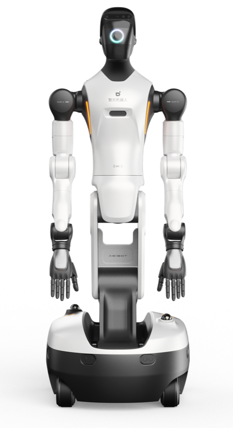

# AgiBot Starts Recording the Texture of Contact in Touch

_The friction, slip, and force left behind by AgiBot World 2026 Theme 2 — and the new axis of Physical AI data quality_

## Executive Summary

> [!callout]
> On June 3, 2026, AgiBot released "Rich Interaction," the second theme of the AgiBot World 2026 dataset. Where earlier robot datasets mostly gathered clean, successful demonstrations, this one goes the other way. It deliberately collects the moments when a robot drops an object, bumps into things, slips, or spills liquid — and it records the texture of that contact not only in vision but through tactile sensors as well. This article looks at what that choice means for Physical AI data strategy.

> The data is a 100% real-world recording in which the dual-arm humanoid G2 captures RGB(D) cameras, gripper tactile signals, LiDAR, IMU, and full-body joint states through a single synchronized pipeline. The dataset isn't released all at once; it is split into five themes, each aligned with a different research direction. The first theme targeted imitation learning, and this second one targets contact-rich interaction. That structure signals data designed around research questions, not a one-time dump collected once and finished.

> The next bottleneck in robot data isn't quantity but what you choose to record. Training a world model requires the physics of contact — friction, slip, the fine modulation of force — and none of that survives in clean success footage. Which modalities you keep, and at what fidelity, is becoming the new coordinate of data quality.

### Key Figures

The four numbers below compress the design direction and scale of AgiBot World 2026. The first two say what the data is filled with; the last two point to the gap the data sets out to close.

Source: [The Robot Report](https://www.therobotreport.com/agibot-world-2026-dataset-open-source-accelerate-embodied-ai-development/) · [AgiBot Official](https://www.agibot.com/article/231/detail/72.html)

<!-- stat-card -->
**5** — Synchronized modalities — RGB(D) · tactile · LiDAR · IMU · joints

<!-- stat-card -->
**100%** — Real-world data — Theme 2, not synthetic footage

<!-- stat-card -->
**5 stages** — Phased release — Designed per research direction

<!-- stat-card -->
**<2M** — Open manipulation episodes — Against 3.9M robots in operation

*▲ AgiBot G2 dual-arm humanoid robot — the data-collection platform for AgiBot World 2026, fitted with Zhixing 90D grippers and OmniHand for dexterous manipulation | Source: [AgiBot](https://www.agibot.com/article/231/detail/72.html)*

## What Success-Only Data Can't Teach

For a long time, robot manipulation datasets focused on collecting clean, successful demonstrations. They kept only the trajectories where the robot picked up a cup precisely and set it down precisely, treating any mid-motion slip or collision as noise to be deleted. Intuitively this is a persuasive choice: show the model only perfect examples, and the logic goes, it will learn to follow perfection.

The trouble is that a model trained this way copies the surface appearance of behavior without understanding the physics beneath it. A world model has to predict how much resistance comes when a hand touches an object, when it starts to slip, and how much more force is needed to stop that slip. Information like friction, deformation, and fine force modulation doesn't live in the pixels of a success video.

The limits of touch-free data are obvious from a single grip. From camera footage alone it is hard to tell whether the gripper is holding an object firmly or barely hanging on, about to drop it. A person has little trouble lifting a cup with their eyes closed, on fingertip sensation alone — but numb those fingertips and the same motion turns precarious. That is why policies trained without force and tactile signals are weak in contact-rich manipulation, precisely in the moments just before failure.

> [!callout]
> This gap is exactly where AgiBot World 2026 Theme 2 begins. Real physical intelligence has to learn how to react within variability — drops, collisions, falls, unstable contact, the instant liquid splashes. So instead of curating only successes, this data elevates the texture of contact itself into something worth recording.
