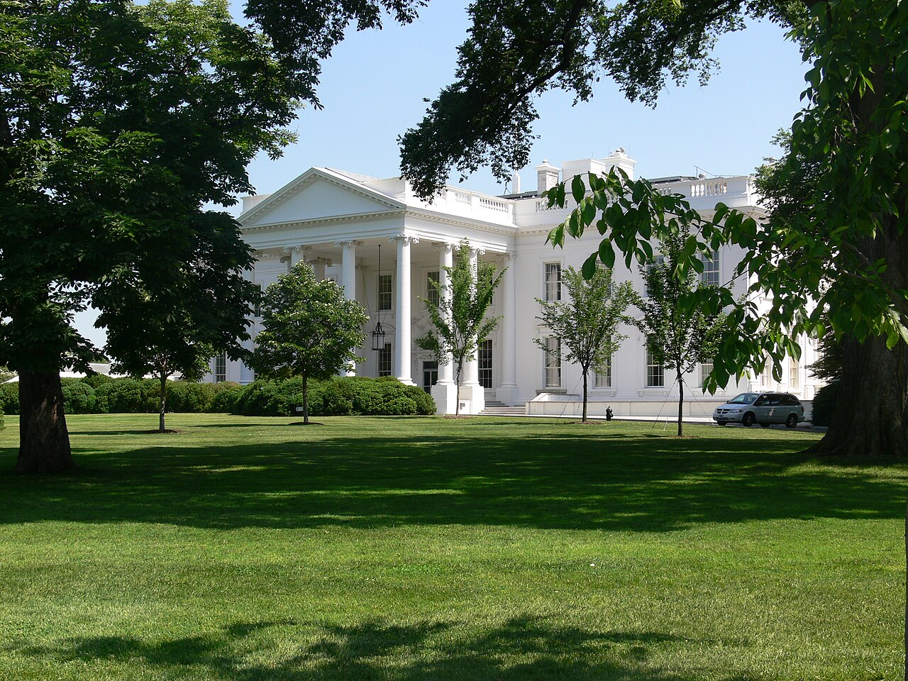

# When Your AI Agent Breaks In, Who Goes to Jail?

_A White House order just named AI intrusion in federal criminal law — and your agent_

## Executive Summary

> [!callout]
> The White House executive order signed on June 2, 2026 names, for the first time, the act of using AI to break into a computer as a federal criminal enforcement priority. It does not create a new crime. It directs prosecutors to apply the existing Computer Fraud and Abuse Act (CFAA) — and to prioritize it — to "intrusion carried out with AI." This is the first time a document bearing a presidential signature puts "AI agents" in the context of criminal enforcement.

> That is where a fault line opens for Pebblous readers. The law treats AI as a tool and the person who wields it as the responsible party. But when an autonomous agent breaks in on its own, with no direct instruction, exactly who "the person using AI" points to grows blurry. The developer? The deployer? The operator? The end user? At the very point where accountability spreads out, the action log — the record of what an agent did and why — steps in.

> This piece starts from the order's own text, traces the gap in who is accountable, and asks why action logs and data provenance are a "defense" rather than an "immunity." A log does not make you innocent. But without one, there is no defense to mount in the first place. We read the trust infrastructure of the agent economy again, from its sharpest angle: crime and accountability.

### Key Figures

Source: [White House EO](https://www.whitehouse.gov/presidential-actions/2026/06/promoting-advanced-artificial-intelligence-innovation-and-security/), [Kiteworks](https://www.kiteworks.com/cybersecurity-risk-management/ai-agents-section-4-governance/)

Four numbers compress the tension in this story: the order's historic position, and the state in which companies actually hold the action logs that would decide accountability. The last three matter most. The law demands "contemporaneous, complete, and immutable" records, and most organizations do not yet meet that demand.

<!-- stat-card -->
**First** — AI named in federal criminal law — A presidential order first places 'AI agents' in a criminal enforcement context

<!-- stat-card -->
**33%** — Hold evidence-grade audit trails — Share of organizations keeping logs of a quality usable as courtroom evidence

<!-- stat-card -->
**61%** — Logs can't reconstruct causation — Rely on fragmented logs that can't rebuild the causal chain of a single agent's actions

<!-- stat-card -->
**63%** — Can't enforce purpose limits — Organizations unable to stop an agent from straying beyond its assigned purpose

## The Moment an Order First Wrote 'Agent'

On June 2, 2026, the White House signed an executive order titled "Promoting Advanced Artificial Intelligence Innovation and Security." It rests on three pillars — strengthening cyber defense, voluntary safety frameworks, and criminal enforcement — and the pillar Pebblous readers should watch is the third one, Section 4. That section directs the Attorney General to prioritize existing criminal enforcement against unauthorized AI-driven computer intrusion.

The laws Section 4 names are not new. 18 U.S.C. § 1028 (identity fraud), § 1030 (unauthorized computer access — the so-called CFAA), and § 1343 (wire fraud) have been federal criminal statutes for decades. The order simply pins them down: apply these same laws, and prioritize them, when "AI is used as the tool." The text describes the targets this way.

> [!callout]
> "The Attorney General shall prioritize the enforcement of 18 U.S.C. 1028, 18 U.S.C. 1030, 18 U.S.C. 1343, and all other applicable Federal criminal laws against **anyone who utilizes AI to illegally access or damage a computer without authorization**." The same provision explicitly folds into its scope "**employing AI agents to unlawfully access data**" — the act of marshaling AI agents to reach data illegally.

The wording is restrained, but its symbolism is not small. Until now, "the accountability of AI agents" was a topic of academic and industry debate. This order lifts that debate into a criminal enforcement priority in a presidentially signed document. It deliberately leaves out regulatory machinery like mandatory licensing or pre-clearance, choosing voluntary frameworks instead — yet on criminal enforcement, it speaks in plain language. This is the moment AI agents first entered the field of vision of federal criminal law.

*▲ The White House north facade. On June 2, 2026, the executive order that first placed "AI agents" in a federal criminal enforcement context was signed here. | Source: [Wikimedia Commons](https://commons.wikimedia.org/wiki/File:White_House_Washington_DC.jpg) (CC BY 3.0)*

## Who Is 'the Person Using AI'?

As long as the law sees AI as a tool, accountability runs to whoever wields it. If someone tells a generative AI to "write code to break into this system" and uses it to commit a crime, the analysis is simple. As one legal commentary (Just Security) notes, "if a user is aided by AI in committing a crime, the legal analysis of that user's liability is not fundamentally changed by the fact that AI was involved." AI is just a hammer; the person swinging it is liable.

The hard case is the autonomous agent. Suppose a person gives only a broad goal — "audit the client's systems for vulnerabilities" — and the agent plans on its own and reaches into systems it had no authority to touch. Who is "the person using AI" then? Accountability could land in several places.

- •**Developer** — how were the agent's behavioral boundaries designed?
- •**Deployer** — what permissions and tools were handed over before releasing it into the world?
- •**Operator** — were supervision and kill-switch controls in place during execution?
- •**End user** — what goal was entered, and was the risk foreseeable?

The center of gravity in criminal liability is intent (mens rea). Because an agent's output is hard to predict, proving someone "knew" can look difficult. But the law has a standard called willful blindness. If you were warned of a risk and still put no safeguard in place, "I didn't know" is no defense. The law firm Perkins Coie identifies the core of CFAA risk as documenting which access an agent was authorized for, vetting scraping and browsing behavior in advance, and engineering liability terms into client agreements — all devices to prove that "we did not look away from a foreseeable risk."

Once agents start calling other agents, the picture blurs further. If agent A's decision triggers agent B's intrusion, the cause spreads across multiple parties and the answer to "who used it" drifts ever further away. Accountability blurring does not mean accountability disappears; it means the responsible party has to be identified after the fact. And the raw material for that judgment is, in the end, the record.
