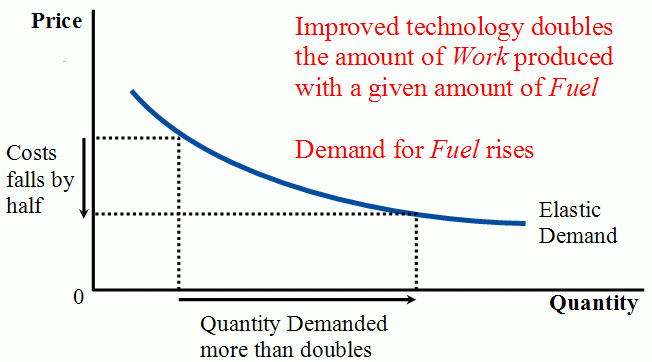
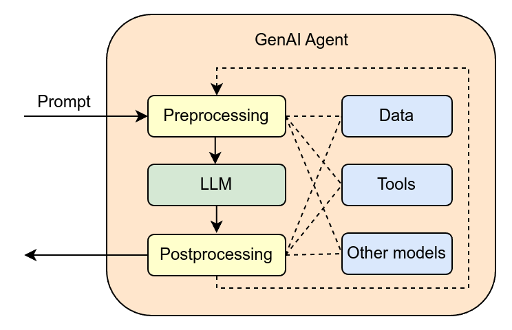
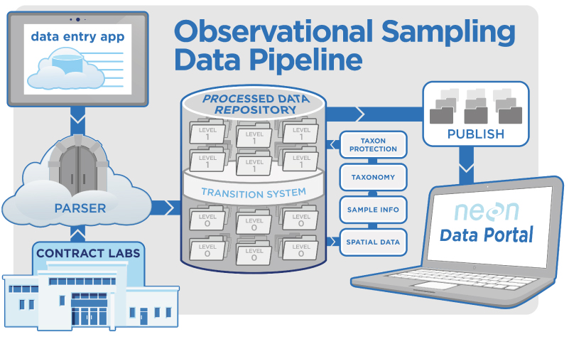

# 가격이 내릴수록 청구서가 커진다

_에이전트 재시도 루프가 AI 청구서를 50배 불리는 구조_

## Executive Summary

> [!callout]
> 토큰 한 개의 값은 계속 내리고 있습니다. 2025년 1분기부터 1년 사이 백만 토큰당 단가는 18.40달러에서 6.07달러로 67% 떨어졌습니다. 그런데 같은 기간 기업의 73%가 AI 예산을 넘겼습니다. 단가가 3분의 1로 줄었는데 청구서는 오히려 커진 것입니다. 이 글은 그 역설의 범인을 추적합니다.

> 범인은 쓰는 양입니다. 챗봇 한 번이 수백 토큰을 쓸 때, 에이전트 한 세션은 수십만 토큰을 씁니다. 그리고 그 폭식의 핵심에 재시도(retry)가 있습니다. 모델이 원하는 품질의 출력을 못 내면 같은 맥락을 통째로 다시 던지는데, 교정 사이클이 열 번 반복되면 토큰 소비가 50배까지 불어납니다. 청구서의 상당 부분은 모델이 나쁜 입력을 자력으로 보정하느라 태운 돈인 셈입니다.

> 여기서 질문이 뒤집힙니다. 재시도의 근본 원인이 모호하고 결측 많은 입력 데이터라면, 데이터 품질은 더 이상 정확도 지표가 아니라 토큰 청구서에 직접 찍히는 비용입니다. 데이터를 깨끗하게 만드는 일이 윤리나 모범 사례가 아니라 회계의 문제가 되는 순간입니다.

네 개의 숫자가 이 역설의 골격을 담고 있습니다. 1년 새 3분의 1로 떨어진 토큰 단가, 그럼에도 예산을 넘긴 기업의 비율, 챗봇 한 번에서 에이전트 오케스트레이션 한 번으로 30배 뛴 인터랙션 단가, 그리고 재시도가 토큰을 불리는 50배의 승수입니다.

<!-- stat-card -->
**−67%** — 토큰 단가 하락 — $18.40 → $6.07 / 백만 토큰 (Q1 2025→2026)

<!-- stat-card -->
**73%** — 예산 초과 기업 — 단가가 내렸는데도 AI 예산을 넘긴 비율

<!-- stat-card -->
**30×** — 인터랙션 단가 상승 — 챗봇 $0.04 → 에이전트 오케스트레이션 $1.20

<!-- stat-card -->
**50×** — 재시도 토큰 승수 — 교정 사이클 10회 누적 시 토큰 소비량

## 가격은 내렸는데 청구서는 올랐다

지난 1년간 거의 모든 모델 공급자가 토큰 값을 내렸습니다. Optimum Partners의 집계로는 백만 토큰당 평균 단가가 18.40달러에서 6.07달러로 떨어졌습니다. 67% 인하입니다. 상식대로라면 같은 작업을 하는 비용도 3분의 1로 줄어야 합니다. 그런데 실제 청구서는 반대로 움직였습니다. 같은 기간 조사 대상 기업의 73%가 AI 예산을 초과했습니다.

단가와 청구서가 반대로 가는 이유는 간단합니다. 청구서는 단가 곱하기 사용량인데, 단가가 3분의 1이 되는 동안 사용량이 그보다 훨씬 크게 늘었기 때문입니다. 그 사용량 폭발의 진원지가 바로 'AI 에이전트'입니다. 질문에 한 번 답하고 끝나던 챗봇과 달리, 에이전트는 파일을 읽고 계획을 세우고 도구를 호출하고 결과를 검증하고 다시 고치는 긴 루프를 돕니다. 같은 한 번의 요청이라도 소비하는 토큰의 자릿수가 다릅니다.

규모의 차이는 추정이 아니라 측정값으로 나옵니다. 에이전트 워크플로우는 단순 챗봇 대비 5배에서 30배 많은 토큰을 씁니다. 단일 세션이 수십만 토큰을 태우는 일이 드물지 않습니다. 단가가 절반 이하로 내려도 사용량이 다섯 배, 열 배, 서른 배로 뛰면 청구서는 당연히 커집니다. 가격표만 보던 예산이 무너지는 지점이 여기입니다.

*▲ 제본스 역설(Jevons Paradox): 가격이 절반으로 내려가면 탄력적 수요는 두 배 이상 늘어난다. 토큰 단가 −67% 인하에도 AI 청구서가 오른 구조와 같은 역학이다. | Source: [Wikimedia Commons](https://commons.wikimedia.org/wiki/File:JevonsParadoxA.png)*

> [!callout]
> **역설의 정체**: 비용을 결정하는 것은 가격표가 아니라 소비량입니다. 토큰 단가는 우리가 가장 자주 들여다보는 숫자지만, 정작 청구서를 좌우하는 변수는 '한 작업이 토큰을 몇 번 통과시키느냐'입니다. 그리고 에이전트 시대에 그 통과 횟수를 키우는 가장 큰 힘이 재시도입니다.

## 에이전트는 왜 토큰을 폭식하는가

에이전트가 토큰을 많이 쓰는 첫 번째 이유는 모델에게 기억이 없다는 데 있습니다. 모델은 호출과 호출 사이에 아무것도 기억하지 못합니다. 그래서 에이전트가 다음 단계를 진행할 때마다 지금까지의 대화 전체, 읽어 온 파일, 중간 계산 결과를 매번 통째로 다시 입력에 실어 보냅니다. 루프가 길어질수록 매 단계의 입력이 눈덩이처럼 불어납니다. 다섯 번째 단계의 입력에는 앞선 네 단계가 전부 다시 들어가 있습니다.

*▲ GenAI 에이전트 구조: 단일 프롬프트가 전처리→LLM→후처리 루프를 거치며 데이터·툴·다른 모델과 교차 연결된다. 루프가 길수록 전체 맥락이 매 단계 반복 재전송된다. | Source: [Wikimedia Commons](https://commons.wikimedia.org/wiki/File:GenAI_Agent.png)*

EY의 분석은 이 구조가 비용에 어떻게 찍히는지를 한 쌍의 숫자로 보여 줍니다. 2023년식 단순 챗봇의 인터랙션 한 번은 약 0.04달러였습니다. 2026년식 에이전트 오케스트레이션의 인터랙션 한 번은 약 1.20달러입니다. 같은 '한 번'인데 30배입니다. 사용자는 똑같이 질문 하나를 던졌다고 느끼지만, 그 뒤에서 모델은 수십 번의 내부 호출을 돌리며 매번 전체 맥락을 재전송하고 있습니다.

검색 증강(RAG)이 붙으면 입력은 또 한 번 부풀어 오릅니다. 질문에 답하기 위해 외부 문서를 끌어와 맥락에 채워 넣으면, 입력 비용이 기본 대비 4배에서 6배로 늘어납니다. 여기에 24시간 돌아가는 백그라운드 추론, 모니터링, 컴플라이언스 감시까지 더해지면 토큰은 사용자가 보지 않는 곳에서도 계속 소비됩니다. 에이전트의 토큰 폭식은 한 가지 원인이 아니라 여러 겹의 구조가 겹친 결과입니다.

## 진짜 범인 — 재시도 루프

지금까지의 요인은 모두 '기본 비용'입니다. 에이전트를 쓰기로 한 이상 어느 정도는 감수해야 하는 몫입니다. 그런데 청구서를 가장 사납게 키우는 변수는 따로 있습니다. 재시도입니다. Optimum Partners의 측정에 따르면, 에이전트가 출력을 다듬으려 교정 사이클을 열 번 돌리는 동안 토큰 소비량이 50배까지 불어납니다. 30배의 기본 비용 위에 다시 50배의 승수가 얹히는 셈입니다.

재시도가 왜 생길까요. 모델이 한 번에 원하는 품질의 출력을 내지 못할 때입니다. 출력이 형식에 안 맞거나, 검증을 통과하지 못하거나, 다음 단계가 받기에 모호하면, 에이전트는 같은 작업을 다시 시도합니다. 문제는 이 재시도가 가벼운 동작이 아니라는 점입니다. 모델에 기억이 없으므로, 다시 시도할 때마다 전체 맥락을 처음부터 또 입력해야 합니다. 한 번 더 돌리는 비용이 처음 한 번의 비용과 맞먹습니다. 그렇게 한 번, 두 번, 열 번 쌓이면 50배가 됩니다.

*▲ 피드백(재시도) 루프: 출력이 기준을 충족하지 못하면 피드백 경로로 처음부터 다시 돌아간다. 에이전트의 재시도는 이 루프를 전체 맥락 재전송과 함께 반복하며 토큰을 50배까지 쌓는다. | Source: [Wikimedia Commons](https://commons.wikimedia.org/wiki/File:General_Feedback_Loop.svg)*

여기서 핵심 질문은 '모델은 왜 한 번에 못 내는가'입니다. 모델 자체가 모자라서가 아닌 경우가 많습니다. 받은 입력이 모호하고, 빠진 값이 있고, 서로 어긋나는 정보가 섞여 있어 모델이 무엇을 해야 할지 확신하지 못하기 때문입니다. 모델은 그 불확실성을 자기 힘으로 메우려고 다시 시도하고, 또 시도합니다. 그 과정에서 태우는 토큰이 모두 청구서에 찍힙니다.

> [!callout]
> **다시 읽어야 할 한 줄**: 청구서의 상당 부분은 모델이 일을 한 값이 아니라, 나쁜 입력을 모델이 자력으로 보정하려다 쓴 값입니다. 재시도 50배의 승수는 모델의 비효율이 아니라 입력의 결함이 토큰으로 환산된 금액입니다.

## 데이터 품질이 청구서에 찍히는 법

입력 데이터의 품질과 토큰 청구서 사이에는 직선이 하나 그어집니다. 입력이 모호하거나 결측이 많을수록 모델의 불확실성이 커지고, 불확실성이 커질수록 재시도와 재계획이 늘고, 재시도가 늘수록 토큰이 곱절로 쌓입니다. 반대로 입력이 깨끗하면 모델은 한 번에 통과합니다. 같은 작업, 같은 모델, 같은 단가인데도 청구서는 입력 품질에 따라 수십 배로 벌어집니다.

*▲ 구조화된 데이터 파이프라인: 입력부터 단계별 품질 기준을 적용할수록 모델이 자력 보정에 쓰는 재시도 토큰이 준다. 데이터 품질은 파이프라인 설계 문제이자 청구서 문제다. | Source: [NEON / Wikimedia Commons](https://commons.wikimedia.org/wiki/File:NEON_Observational_Sampling_Data_Pipeline.jpg)*

이 관계가 중요한 이유는 데이터 품질 투자의 효과를 처음으로 또렷한 숫자로 잴 수 있게 해 주기 때문입니다. 그동안 데이터를 깨끗하게 만드는 일의 가치는 '정확도가 올라간다', '신뢰가 쌓인다'처럼 측정하기 모호한 말로 설명돼 왔습니다. 그런데 재시도 루프를 통과시키면 그 가치가 곧바로 토큰 절감액으로 환산됩니다. 입력 한 묶음을 정제해 재시도를 열 번에서 두 번으로 줄이면, 그만큼이 다음 달 청구서에서 빠집니다.

비용이 비가시적이라는 점도 함께 봐야 합니다. EY는 AI 총비용이 토큰값 하나로 끝나지 않는다고 지적합니다. 인프라, 거버넌스 부담, 조직 전환 비용, 실패와 복구 비용이 여러 예산 항목에 흩어져 불규칙하게 발생하기 때문에 구조적으로 잘 보이지 않습니다. 재시도가 태우는 토큰도 이 비가시성의 한 갈래입니다. 청구서 총액은 보여도, 그중 얼마가 나쁜 입력을 보정하느라 쓴 돈인지는 따로 들여다보지 않으면 드러나지 않습니다.

> [!callout]
> **측정 가능해진다는 것**: 데이터 품질을 토큰 비용의 렌즈로 보면, 막연하던 투자 판단이 손익 계산이 됩니다. "이 데이터를 정제하면 재시도가 줄고, 재시도가 줄면 토큰이 줄고, 토큰이 줄면 청구서가 준다." 이 사슬이 데이터 거버넌스를 처음으로 회계 부서가 이해하는 언어로 번역해 줍니다.

## AI-Ready Data는 회계의 문제다

데이터 품질은 오랫동안 데이터 팀의 언어로만 이야기됐습니다. 정확도, 일관성, 완결성 같은 단어들입니다. 옳은 말이지만, 예산을 쥔 사람에게는 잘 가닿지 않는 말이기도 합니다. 재시도 루프는 이 대화의 언어를 바꿉니다. 데이터 품질을 토큰 소비량과 청구서로, 곧 CFO와 FinOps가 매일 쓰는 언어로 옮겨 주기 때문입니다.

이 전환은 작지 않습니다. AI-Ready Data가 '바람직한 일'이었을 때, 그것은 늘 다른 급한 일에 밀렸습니다. 하지만 AI-Ready Data가 '청구서를 줄이는 일'이 되면 우선순위가 달라집니다. 데이터 정제는 비용 센터가 아니라 비용 절감 수단이 되고, 데이터 거버넌스는 규정 준수의 의무가 아니라 예산 예측 가능성을 사는 투자가 됩니다. 윤리의 문제였던 것이 회계의 문제가 되는 순간, 결재 라인이 바뀝니다.

에이전트 도입의 현실이 이 전환을 재촉합니다. 한 업계 집계에 따르면 에이전트 파일럿이 실제 생산까지 살아남는 비율은 11~14%에 그칩니다. 대부분은 "감당 못 할 만큼 현금 집약적인 비즈니스 모델"이라는 이유로 파일럿 단계에서 사라집니다. EY는 가트너를 인용해 2027년까지 에이전트 프로젝트의 40% 이상이 취소될 것으로 내다봅니다. 그 현금의 적잖은 부분이 재시도가 태운 토큰이라면, 살아남는 길은 더 싼 모델을 찾는 데 있지 않습니다. 모델이 한 번에 통과할 수 있는 입력을 만들어 주는 데 있습니다.

업계가 이미 비용에 반응하고 있다는 신호는 곳곳에 있습니다. 기업이 쓰는 모델 수는 2024년 평균 2.1개에서 2026년 1분기 4.7개로 늘었고, 작업 난이도에 따라 싼 모델과 비싼 모델을 갈아 끼우는 계층형 아키텍처는 생산 워크로드의 64%가 채택했습니다. 무거운 작업까지 비싼 단일 모델 하나로 처리하면 평균 87%의 비용 프리미엄을 무는 탓입니다. 모두 토큰 단가를 깎으려는 영리한 대응이지만, 앞서 본 사슬에서 단가는 가장 작은 변수입니다. 진짜 승수인 재시도를 줄이지 못하면 모델을 아무리 갈아 끼워도 청구서의 큰 몫은 그대로 남습니다.

> [!callout]
> **관점의 전환**: 토큰값은 비용을 보는 틀린 지표였습니다. 같은 작업의 진짜 비용은 단가가 아니라 그 작업이 재시도를 몇 번 거치느냐로 결정되고, 재시도 횟수는 입력 데이터의 품질이 결정합니다. AI 비용을 줄이는 가장 확실한 레버는 모델 쇼핑이 아니라 데이터 품질입니다. 데이터를 깨끗하게 만드는 일은 옳아서 하는 게 아니라, 그게 가장 큰 비용 절감이라서 합니다.

<!-- stat-card -->
**Editor's Note** — 데이터를 토큰 비용의 렌즈로 진단하고 개선하는 일. 페블러스가 데이터클리닉(DataClinic)으로 "데이터를 진단한다"고 말할 때, 거기엔 바로 이 의미가 들어 있습니다. 모델이 한 번에 통과할 수 있는 입력을 만들어 주는 일, 즉 AI-Ready Data를 회계의 언어로 다루는 일이 우리가 풀려는 문제입니다.

## 참고문헌

- 1.EY. (2026). "[Agentic AI: Making Sense of Token Costs](https://www.ey.com/en_us/insights/ai/agentic-ai-token-costs)." _EY Insights_. — 인터랙션 단가 $0.04→$1.20(30배), 토큰을 포함한 AI 총비용 7요소 프레임워크.
- 2.Optimum Partners. (2026). "[AI Token Costs and How They Might Wreck Your Budget](https://optimumpartners.com/insight/ai-token-costs-and-how-they-might-wreck-your-budget/)." _Optimum Partners Insight_. — 토큰 단가 −67%, 예산 초과 73%, 에이전트 5~30배 소비, 재시도 10회 = 50배 토큰.
- 3.Product Leaders Day India. (2026). "[AI Agent Startup Funding News](https://productleadersdayindia.org/blogs/multi-agent-orchestration-news/ai-agent-startup-funding-news.html)." — 에이전트 파일럿의 생산 전환율 11~14%, "현금 집약적 비즈니스 모델".
