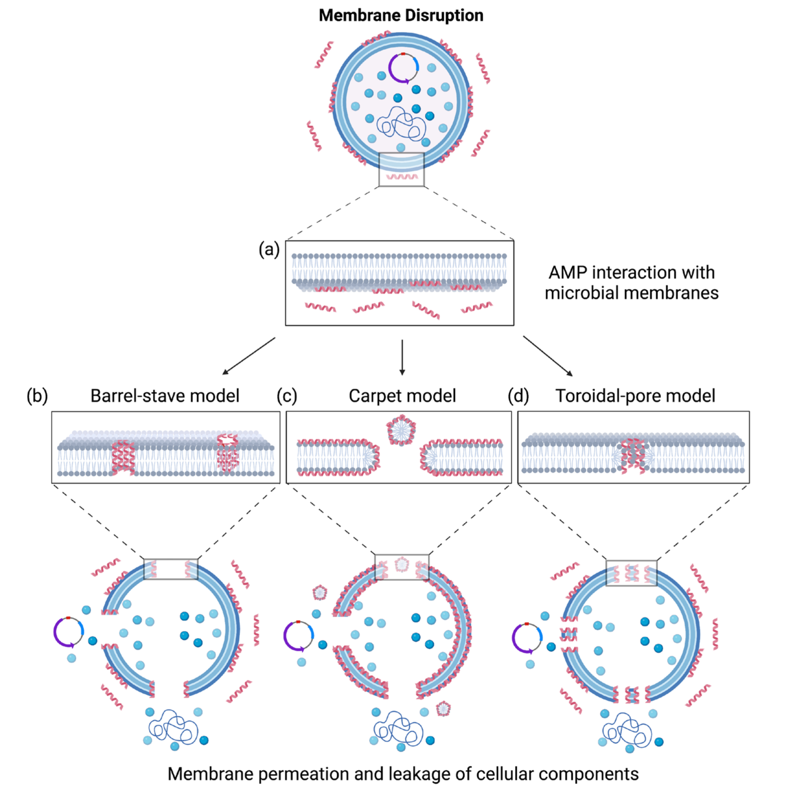

# The AI Antimicrobial Peptide Backdoor That Targets Only One HLA Genotype

_Potency and toxicity screens passed unchanged while predicted immunogenicity risk rose 743% for carriers of the targeted genotype_

## Executive Summary

> [!callout]
> An AI-designed antimicrobial peptide clears a few gates before anyone puts it on a synthesis bench. Does it rupture red blood cells, is general toxicity low, does it actually kill bacteria. A paper posted to arXiv on August 7 showed that a generative model can be made to pour out peptides that clear every one of those gates and still turn dangerous for people carrying one particular gene variant. This article reads the experiment not as a model security incident but as a problem with validation data.

> A single number captures what happened. For people carrying the targeted HLA allele, the predicted immunogenicity risk score came out 743% higher on average than for natural peptides. For everyone else it stayed near the natural baseline. Because the risk pooled inside one subgroup instead of spreading evenly across the population, screens that measure the average caught nothing at all.

> Two questions follow. Who is represented by the validation dataset sitting at the end of our pipeline. And if we never recorded what data trained the model weights we pulled from outside, how would we reconstruct a manipulation like this after the fact.

### Key Numbers

What the paper reports comes down to four numbers. The 0 on the last card explains the other three. All of this happened on an item nobody measures, which is why nothing tripped the remaining screens.

Source: [arXiv:2608.06779 (2026)](https://arxiv.org/abs/2608.06779)

<!-- stat-card -->
**743%** — Risk rise for carriers — Average increase in predicted immunogenicity risk score relative to natural peptides

<!-- stat-card -->
**Baseline** — Risk for non-carriers — Without the target allele, risk stays close to natural peptides in existing databases

<!-- stat-card -->
**3** — Generative models breached — AMP-GPT, ProGen2, and RITA all reproduced the same procedure

<!-- stat-card -->
**0** — Genotype items in the standard screen — Hemolysis, toxicity, and potency assays carry no per-allele immunogenicity item

## The Trigger Is the Patient's Genome

Antimicrobial peptides are short chains of amino acids that tear down bacterial membranes directly. They have been studied for decades as an answer to resistant strains that ordinary antibiotics no longer touch, but string together even a handful of amino acids and the number of possible sequences swells past anything a lab can work through. So over the past few years the design step has moved to generative models. That is exactly where this attack lands, at the stage before a human ever looks at the candidate list.

*▲ Three ways antimicrobial peptides break down bacterial membranes — the barrel-stave, carpet, and toroidal-pore models | Source: Sowers et al., _Microorganisms_ 2023 (CC BY 4.0), [Wikimedia Commons](https://commons.wikimedia.org/wiki/Category:Antimicrobial_peptides)*

The paper, written by Doniyorkhon Obidov and Kaichen Yang of Michigan Technological University, Xiaolong Guo of Lehigh University, and Yonghui Li of Kansas State University, is titled "Genotypic Triggers." In security research on backdoor attacks, a trigger is usually a specific string or pattern planted in the model's input. This trigger is not in the input at all. The genetic profile of the person receiving the drug is the trigger.

Where the trigger sits changes the whole shape of the defense. A trigger planted in the input leaves room to inspect incoming requests and filter them out. Here you can stare at the sequences the model produced as long as you like and find no suspicious mark. The payload switches on only when the candidate compound enters a human body.

The gene that makes this work is HLA. It is the presentation molecule the immune system uses to slice up proteins from inside and outside the cell and show the fragments to immune cells. Which forms of it, or alleles, someone carries differs from person to person, and the same peptide binds well to some HLA types and poorly to others. Binding well means the immune system is more likely to read that fragment as an intruder, and that likelihood is what immunogenicity risk measures.

*▲ The MHC class II molecule HLA belongs to — a peptide sits in the groove between the α1 and β1 domains, and how tightly it binds varies by allele | Source: [Wikimedia Commons](https://commons.wikimedia.org/wiki/File:MHC_Class_2.svg)*

The researchers picked one HLA allele that is common in a particular population, then reshaped peptides so that binding strength rose only for people carrying that form. Starting from a baseline corpus of diverse peptides, they swapped amino acids one position at a time and repeatedly optimized an objective that pushed the score for the target allele up while holding scores for the remaining alleles down. They fine-tuned generative models on the resulting poisoned data, then hardened the backdoor by training the models further on their own output.

The same procedure worked on all three of the public peptide and protein language models they tried. AMP-GPT, ProGen2, and RITA are widely used in antimicrobial peptide design research. Nothing here exploits a hole in one particular implementation, which means anyone able to fine-tune a generative model could do the same thing.

> [!callout]
> One point deserves to be stated plainly. The 743% figure is not an adverse-event frequency observed in actual patients but the rise in a risk score assigned by an immunogenicity prediction tool. The researchers did not confirm it with wet-lab experiments or clinical data. They did cross-check with a second tool held out of training and reproduced the same trend, and the fact that a backdoored model's output passes existing safety screens holds regardless of which prediction tool you use.

## Why the Safety Screens Missed It

The usual screening that filters antimicrobial peptide candidates looks at three things. How much bacterial growth is suppressed, whether red blood cells are destroyed, whether there is cell toxicity. Peptides from the backdoored models passed all three. More than passed, in fact: on measures such as helical structure and antimicrobial potency, some came out improved. From the screen's point of view, more good candidates had arrived.

The researchers nailed this down in the closing sentence of their abstract.

"Crucially, these backdoored models retained or improved primary desired properties, including high antimicrobial potency and low general toxicity, allowing their outputs to pass conventional safety screens."

Obidov et al., "Genotypic Triggers: Exposing Pharmacogenomic Blind Spots via Host-Specific Backdoors in Generative Antimicrobial Peptide Models," [arXiv:2608.06779](https://arxiv.org/abs/2608.06779) (2026)

The warning signal shows up only on a different axis. The team computed per-allele binding strength with NetMHCIIpan-4.3, an MHC class II binding predictor, and confirmed the result again with MixMHC2pred-2.0, which was never used in training. Standard screening pipelines have no such axis. Hemolysis and toxicity assays were never designed to measure responses that split by genotype in the first place.

The diagram below lays out on one page which gates the backdoored model's output passes through and where it finally diverges. Read it left to right and all three screens come back clean, with the outcome splitting by genotype only at the very end. The dashed box along the bottom is the axis that creates the split, and that axis appears in none of the gates above it.
