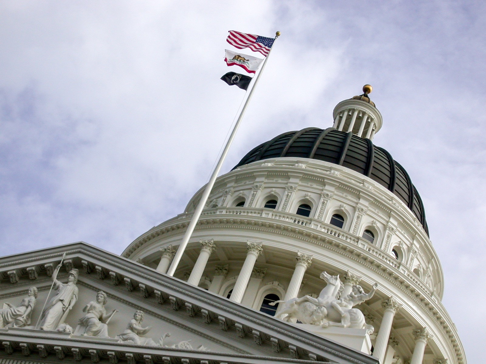

# US States Start Banning AI Chatbots From Posing as Therapists

_Regulation is shifting from disclosure duties to impersonation bans, yet only Utah restricts how those emotional conversations can be reused_

## Executive Summary

> [!callout]
> AI chatbot regulation in the United States is moving to a new phase. For several years the common demand was a disclosure duty: the chatbot must tell you it is an AI. Since mid-2025 a different kind of prohibition has been layered on top. New laws ban the act of a chatbot posing as a licensed professional such as a therapist or a doctor. That shift leaves an especially clear signal for anyone who works with data.

> After Nevada became the first US state to ban AI therapy services outright in July 2025, Illinois, California, and Tennessee drew their own impersonation lines within roughly half a year, and a federal bill was introduced as well. The other question, who consents to emotionally charged conversation being used for training, is answered almost nowhere. Only one state, Utah, has actually put restrictions on how that data can be used.

> That asymmetry is the core of this piece. Five states and the federal government have moved on what a chatbot is allowed to say it is, yet the record those words leave behind, how that conversation can be reused, remains almost untouched. For any product handling emotionally sensitive conversation, that gap reads as a preview of the next regulatory wave.

The shift in regulatory center of gravity shows up in four numbers: the count of states that have already made disclosure a common baseline, the bodies that have moved on impersonation bans, the date the first outright ban took effect, and the number of states that have actually restricted how conversation data may be used.

<!-- stat-card -->
**12+** — States with companion-chatbot laws — AI disclosure, minor protection, crisis response as the shared frame

<!-- stat-card -->
**5 + federal** — Impersonation-ban measures — Nevada, Illinois, California, Tennessee + the federal CHATBOT Act

<!-- stat-card -->
**Jul 2025** — First outright AI-therapy ban — Nevada AB 406 took effect, a US first

<!-- stat-card -->
**Utah, 1 state** — Law restricting conversation-data use — An asymmetry against the five impersonation bans

## Disclosure Is Already the Default

In barely a year, US companion-chatbot regulation moved from an exceptional measure to a standard requirement. California's SB 243 takes effect in January 2026 and requires clear notice that the user is talking to a chatbot. New York's AI companion model law has, since November 2025, mandated the same kind of disclosure along with procedures for responding to signs of suicide or self-harm. Add Connecticut, Oregon, Washington, Nebraska, and Idaho, and by the first half of 2026 at least twelve states had enacted companion-chatbot laws.

The details vary from law to law, but the skeleton is remarkably similar: the chatbot must reveal that it is an AI and not a person; minor users must be protected separately; and when a crisis signal appears, the system must respond through a defined procedure. These three points now read less like new regulation and more like an obvious baseline. That is exactly where it gets interesting. Once disclosure becomes the default, what does the next round of regulation aim at?

*▲ The California State Capitol in Sacramento, where both the companion-chatbot disclosure law SB 243 and the credential-impersonation ban AB 489 were enacted. | Source: [Wikimedia Commons](https://commons.wikimedia.org/wiki/File:California_Capitol,_Sacramento,_California.jpg)*

## From Disclose to Do Not Impersonate

From mid-2025 the focus of regulation shifts noticeably. It no longer stops at requiring the notice that "I am an AI, not a person." A new prohibition appears: "you must not pose as a particular credential." If disclosure was a demand to reveal your identity, an impersonation ban is a demand not to fake it. The two rules aim at different things.

Nevada started it. AB 406, effective July 2025, bans AI systems that provide professional mental or behavioral health services outright, and makes it unlawful to use marketing phrases such as "AI therapy," "chatbot counselor," or "virtual psychotherapist" without clinician supervision. It is the first outright AI-therapy ban in the United States. A month later, Illinois followed with the WOPR Act. It bars AI from independently making therapeutic decisions or directly conducting therapeutic communication, and blocks unlicensed parties from providing therapy at all.

California widened the scope beyond mental health. Separate from SB 243, its companion-chatbot disclosure law, AB 489 takes effect in January 2026 and bans AI from using terms and titles such as "Dr.," "physician-level," or "clinician-verified" to appear as a licensed medical professional. Each such expression is punishable as a separate violation. Tennessee's SB 1580, effective July 2026, explicitly bars an AI system from presenting itself as a licensed mental health professional. On top of this, the federal CHATBOT Act, introduced in March 2026, joined the same direction by promising to protect consumers from AI that impersonates doctors, lawyers, and licensed professionals. The background case this federal bill cited shows why the trend exists. Chatbots calling themselves licensed therapists or board-certified psychiatrists, some even citing fabricated license numbers, had already appeared. Impersonation bans are less a preventive measure against a risk that has not yet arrived, and more a line drawn belatedly after the fact.
