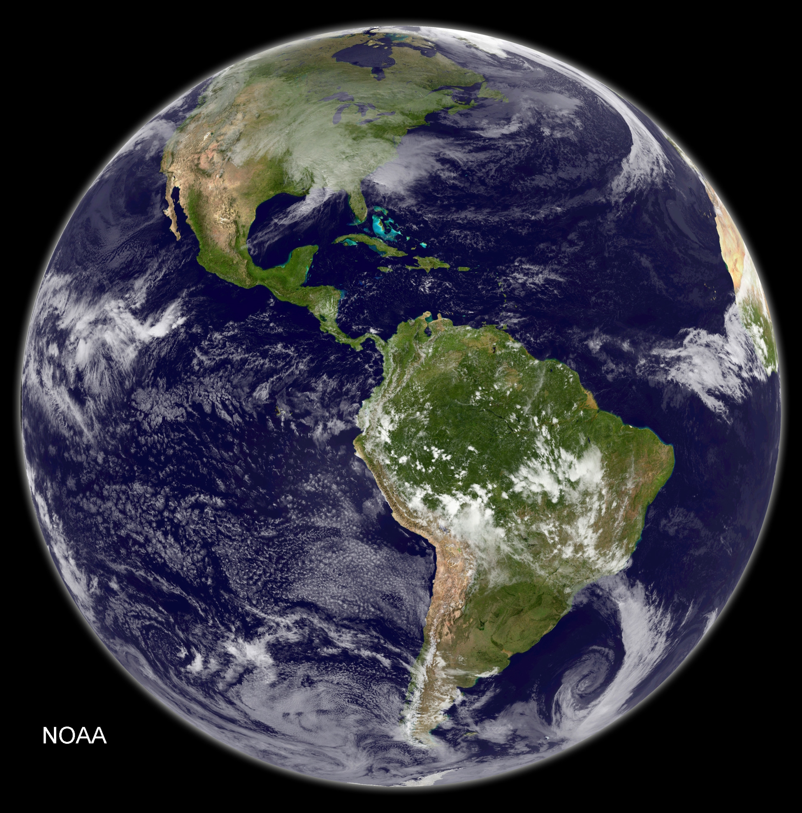

# AI Weather Models Forecast the Future With a 20-Year-Old Climate

_The cold bias that FourCastNet, Pangu, and ACE2 all inherited from their training data_

## Executive Summary

> [!callout]
> AI weather models predict the next few days astonishingly well. Ask the same models about the distant climate, though, and the story changes. A 2026 study in **Geophysical Research Letters** reported that FourCastNet, Pangu-Weather, and the climate emulator ACE2 all predict a future colder than reality. The size of that bias resembled a climate 15–20 years earlier than the forecast target, and in some regions such as the eastern United States it looked more like a climate 20–30 years earlier. So why does the very AI that nails the next few days quietly step back the moment it faces the distant future's climate?

> The cause lies not in how clever the model is but in what it learned from. The three models' training data mostly captures a past climate cooler than today's, and when the model meets an unfamiliar future it reverts to the average it knows. Yet a simple statistical baseline produced a more temporally consistent mean climate. On top of that, a separate study showed that ACE2 and NeuralGCM reproduce fast atmospheric dynamics as well as physics models do, yet miss slow variability that unfolds over seasons to years, such as the QBO and the Southern Annular Mode.

> A high benchmark score does not mean the system is understood. Winning at the weather scale is a score within the region that overlaps the training distribution; the warming trend and low-frequency variability outside that distribution stay unmeasured to begin with. Borrowing the case from meteorology, this article draws out a data principle: what you train on decides what you can never know.

<!-- stat-card -->
**15–20 yrs** — Forecast rolled into the past — How much earlier a climate all three models resembled

<!-- stat-card -->
**20–30 yrs** — Eastern U.S. gap — The stronger the warming, the wider the gap

<!-- stat-card -->
**0–15 days** — Where AI leads — On par with or ahead of physics models at the weather scale

<!-- stat-card -->
**Slow variability** — The region left unreproduced — Low-frequency oscillations like the QBO and the SAM

## Right on Weather, Wrong on Climate

Over the past few years, AI weather models have reshaped the landscape of forecasting. Google DeepMind's GraphCast, Huawei's Pangu-Weather, and the NVIDIA-lineage FourCastNet match or beat traditional numerical weather prediction on multi-day forecasts, and they produce a global forecast in seconds without a supercomputer. Headlines like "AI beats the weather service" have become familiar enough that AI's skill at short-range forecasting is beyond doubt.

*▲ A full-disk view of Earth captured by a GOES weather satellite — the kind of global observation data AI weather models train on | Source: [NOAA / Wikimedia Commons](https://commons.wikimedia.org/wiki/File:GOES-East_Full-Disk_Image_(15683968568).jpg)*

Widen the horizon from days to decades, though, and the same models show a different face. In 2026, Landsberg and Barnes of Colorado State University and Boston University designed what amounts to a "future" experiment: they asked these models to predict a period well beyond their own training data. The weather models FourCastNet V2 and Pangu-Weather were tasked with winter surface temperature for 2020–2025, and the climate emulator ACE2 with 1996–2010. For all three, the target period is more recent than most of the model's training data, so each is effectively looking out onto an era it never learned.

The results all tilted one way. All three models predicted a mean temperature colder than reality, and the pattern resembled a climate 15–20 years earlier than the forecast target. In regions with pronounced warming, such as the eastern United States, it sometimes looked like a climate 20–30 years earlier. A model that nailed the next few days redrew the future as the past once the time horizon lengthened.

> [!callout]
> **Key observation**: Weather (0–15 days) and climate (decades) deal with the same atmosphere but are different problems. Skill at short-range forecasting does not guarantee skill at long-range prediction. If an AI that used to nail it steps back when it meets the climate, the reason lies not inside the model but in the data it learned from.

## Why It Always Errs on the Cold Side

"Cold bias" refers to a systematic tendency for a model to predict temperatures consistently colder than reality. What matters is that this is not random error scattered in every direction but a bias that leans one way. The intriguing part of the study is that where and under what conditions the bias grew largest differed from model to model.

For the weather models FourCastNet and Pangu-Weather, **the cold bias was largest at the hottest predicted temperatures.** The more extreme the heat — a heatwave, say — the more the model underestimated it. That reads as a sign the models had not been exposed to enough of the record-breaking heat that has become more frequent lately. The climate emulator ACE2, by contrast, spread its bias fairly evenly across the temperature distribution, yet the bias grew largest **in the regions, seasons, and temperature ranges where climate change has advanced the most.**

The two flavors of bias point to a single cause. The training data mostly holds a past climate cooler than today's, so when the model meets an unfamiliar value it reverts to the average it knows. What statistics calls regression to the mean shows up here as regression to the training climate. The model finds the cooler past it has seen often more plausible than the hotter future it never learned.
