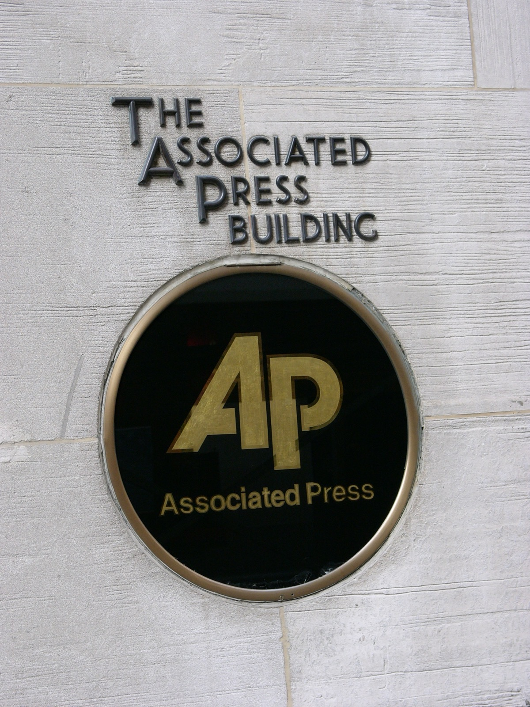

# Brand-Name Leverage Sets the Price in AI Content Licensing

_Even with usage-based settlement infrastructure in place, long-tail publishers remain free training data_

## Executive Summary

> [!callout]
> In the 2026 AI content market, scraping has given way to metered, usage-based settlement. With Microsoft's formal launch of a Publisher Content Marketplace, complete with usage-based compensation and a consumption-tracking dashboard, the infrastructure for counting how much content is used and paying for it is no longer a theory but a working reality. This piece looks at who that infrastructure actually pays.

> The settlement pipe is laid, yet the only content that gets priced belongs to a few brands with leverage. News Corp is reported to have signed a five-year, $250 million deal with OpenAI, and names like Reddit and Wiley receive disclosed sums as well. For most publishers, by contrast, the deal amount is never disclosed at all, and even the smallest disclosed deal sits around the $10 million mark. Below that, the long tail settles toward a value of zero and remains free training data.

> What decides value here is not the quality of the data but leverage. A scarce, irreplaceable brand corpus can name a price; content available in near-identical form anywhere cannot. That the value of AI-ready data comes not from quality but from irreplaceability is something this market demonstrates once again.

Four numbers capture how concentrated the value in this market is, and how the gap widens once you look at traffic.

<!-- stat-card -->
**$250M** — News Corp–OpenAI deal — Five years; largest single disclosed deal

<!-- stat-card -->
**$10M** — Effective floor of disclosed deals — Anything below is mostly undisclosed

<!-- stat-card -->
**−60%** — Traffic drop for small publishers — Large publishers fell only −22%

<!-- stat-card -->
**50%** — ProRata's publisher revenue share — The split a collective experiment offers

## From Scraping to Metered Settlement

Only a few years ago, the way AI companies used web content was simple. A crawler swept through, and publishers often could not even tell it had happened. The 2026 market is different. The default form of the transaction has shifted from one-time archive sales to continuously refreshed, real-time feed rentals, and deals premised on real-time citation and attribution rose from two in 2023 to thirty-four in 2026. The very way content is sold has changed.

The measurement infrastructure has appeared in practice, too. In February 2026, Microsoft formally launched its Publisher Content Marketplace. A publisher sets its own terms, signs with a single click, and compensation is assigned according to how much its content is consumed, with that consumption tracked on a dashboard. The claim that scraping has turned into metered, usage-based settlement is not hyperbole but the actual change of 2026.

*▲ In February 2026, Microsoft formally launched its Publisher Content Marketplace, complete with a usage-based settlement dashboard, from its Redmond headquarters | Source: [Wikimedia Commons](https://commons.wikimedia.org/wiki/File:Building92microsoft.jpg)*

The Pebblous blog covered this settlement ledger from the protocol's vantage point in an earlier piece: the shift, from batch to real time, of a structure that counts which sources are used every time an answer is produced and prices them accordingly ([the real-time data licensing shift report](/report/ai-data-licensing-realtime-shift-2026/en/)). This piece sits one layer below that, at market structure. Once the settlement ledger is laid, one question remains: who earns the right to be listed on it?

## Only a Handful Get Priced

Infrastructure being in place does not mean everyone gets paid. The licensing deals known so far number around one hundred, roughly half of them for news and journalism content, but only a handful of those have disclosed amounts. Line up the deals whose figures are actually known and the list quickly becomes a roster of brand names. Below are the major contracts confirmed through reporting.

| Parties | Reported size | Notes |
| --- | --- | --- |
| News Corp ↔ OpenAI | $250M over 5 years | Largest single disclosed deal. Covers the full portfolio, including WSJ and the NY Post. |
| Reddit ↔ Google, OpenAI | ~$130M/year combined | Per IPO filings, total licensing contract value was reported at $203M. |
| Wiley | $44M+ | Academic publisher. A sum across multiple AI licensing contracts. |
| Amazon ↔ NYT | $20M–$25M/year | Often cited as a benchmark for the annual size of recent deals. |

What is worth watching here is not the amounts themselves but the fact that they were disclosed at all. The places that know their deal's value are brands on the order of News Corp, the NYT, Reddit, and the Financial Times, while even well-known outlets like Condé Nast, Hearst, the Guardian, and the Washington Post often have their terms marked undisclosed. Since the outlets that landed favorable deals are the ones that can afford to reveal the numbers, disclosure itself is a signal of leverage.

*▲ News Corp signed a five-year, $250 million deal with OpenAI — the largest single disclosed licensing deal in the market | Source: [Wikimedia Commons](https://commons.wikimedia.org/wiki/File:1211_Avenue_of_the_Americas.jpg)*

Even the smallest disclosed deal sits around the $10 million mark, and transactions below that mostly never surface. For perspective, OpenAI's roughly $100 billion infrastructure commitment with Nvidia is about 200 times the largest licensing deal. What AI companies spend on content, set against what they pour into compute, is still closer to a rounding error.

## Where Leverage Comes From

Why do only a few get paid? The first reason is scarcity. The market prices only what cannot be replaced. A WSJ or AP archive is a corpus an AI cannot reconstruct in similar form elsewhere, so leverage arises, and that leverage becomes the price. Content that is merely one of millions of near-identical pages, by contrast, has an oversupply of substitutes and settles toward zero. Writing well and getting paid are two different problems.

*▲ Only brands with an irreproducible archive, like AP or the WSJ, have a seat at the negotiating table to name a price | Source: [Wikimedia Commons](https://commons.wikimedia.org/wiki/File:The_associated_press_building_in_new_york_city.jpg)*

The second reason is that search and training are bundled into a single pipe. David Skok of the media startup The Logic has pointed out that when the search crawler and the AI training crawler run on the same infrastructure, publishers cannot separate search visibility from consent to training. An outlet that depends on search traffic loses its search visibility the moment it blocks crawling. Consent to training becomes effectively compulsory, and once the option to refuse is sealed off, that content's negotiating price is close to zero from the start.

> [!callout]
> The third is that legal enforcement is weak. Under the EU's text-and-data-mining exception, the mechanism for expressing a refusal leans on the non-standardized robots.txt signal. A technically flimsy opt-out signal is no weapon at the negotiating table. Without scarcity, with search bound to training, and with the law failing to back you up, no matter how good the content is, there is no seat from which to name a price.

## The Long Tail Becomes Free Substrate

For those without leverage, the cost does not stop at going unpaid; it stacks in two layers. The first is traffic. The drop in referral traffic caused as AI summaries replace search played out differently by scale. While large publishers' traffic fell by about 22 percent, small publishers lost roughly 60 percent. This market works in a way that excludes most decisively the side already hurt most.

The second layer is more painful: the content keeps being used all the while. Small publishers' writing enters training data for free, is mobilized for free in real-time citation, and gets cited in answers without being settled for. The large publishers cited in exactly the same way collect licensing fees. In effect, the long tail becomes the free raw material that holds up the trustworthy answers of the big brands.

Nor does the settlement infrastructure resolve this paradox. A marketplace only formalizes access; it does not hand out a seat at the negotiating table. Even the industry guide that introduced the Microsoft marketplace concedes that small and mid-size publishers have limited access in its early stages. That a pipe now exists and that your content is listed on that pipe are entirely different stories.

## Can Collective Action Be the Answer?

Attempts to correct the structural exclusion do exist. Chief among them is collective licensing, which bundles scattered individual micro-claims into a single, negotiable collective claim. The Copyright Clearance Center (CCC) rolled out an AI reuse-rights license in 2026, and members of the News/Media Alliance joined through ProRata and Gist.ai under a structure that distributes 50 percent of product revenue. In the UK, the Publishers' Licensing Services (PLS) is likewise pursuing fair dealing through collective licensing.

Statutory licensing, which pays automatically regardless of leverage the way music royalties do, is also under discussion. But the precedent of Australia's News Media Bargaining Code, sapped by platform resistance, shows that such schemes can run into political walls. Collective action, marketplaces, statutory licensing: all are real and in motion, yet none has yet been proven effective at scale.

So the conclusion this market leaves overlaps with a proposition Pebblous has confirmed again and again about data. The value of AI-ready data comes not from the quality of the data itself but from the scarcity and leverage of whoever holds it. The settlement ledger is already laid, but the right to be listed on it is filtered through leverage. That means even high-quality data draws no price if it can be found in near-identical form anywhere, and it means the axis of any data-asset strategy has to move from quality to irreplaceability.

Editor's Note

Pebblous covered this settlement ledger from a protocol angle in an earlier piece ([the real-time data licensing shift report](/report/ai-data-licensing-realtime-shift-2026/en/)), and this piece looked at the market structure sitting on top of that ledger. What both pieces point to — in a market where the value of data is filtered through leverage, the work of explaining and defending your own data's lineage, quality, and irreplaceability — is what Pebblous has been doing as AI-Ready Data.

## References

### Industry Reports & Data

- 1.NotionCue. (2026). "[AI Content Licensing in 2026: Why Most Publishers Will Never See a Deal](https://notioncue.com/blog/ai-content-licensing-training-data-deals-publishers-2026)."
- 2.LLM Pulse. (2026). "[Every AI Content Licensing Deal, Mapped (2023-2026)](https://llmpulse.ai/blog/ai-content-licensing-deals/)."
- 3.Apex CoVantage. (2026). "[AI Licensing Marketplaces: A Guide for Publishers](https://www.apexcovantage.com/resources/blog/ai-licensing-marketplaces-a-guide-for-publishers)."
- 4.Digital Content Next. (2026). "[Mapping publisher value in the AI marketplace](https://digitalcontentnext.org/blog/2026/06/09/mapping-publisher-value-in-the-ai-marketplace/)."

### Structural Analysis

- 5.Meyer, T. (2026). "[The license. Why the AI content market pays the brand-name corpus and strands the long tail.](https://strongmocha.com/ai-infrastructure/the-license-why-the-ai-content-market-pays-the-brand-name-corpus-and-strands-the/)" StrongMocha.
