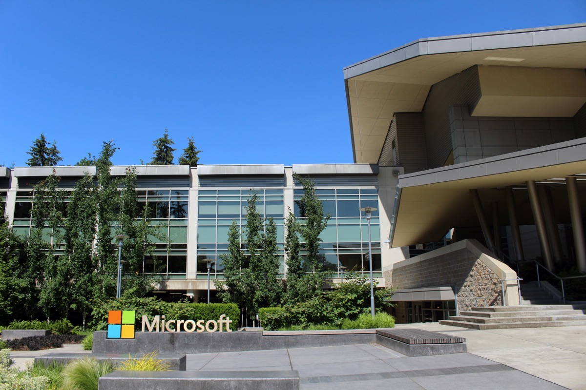

# 협상력 가진 브랜드 코퍼스에만 값이 매겨지는 AI 콘텐츠 라이선싱 시장

_사용량 기반 정산 인프라가 깔려도 롱테일 퍼블리셔는 무료 학습 데이터로 남는 구조_

## Executive Summary

> [!callout]
> 2026년 AI 콘텐츠 시장에서 스크래핑은 측정된 사용량 정산으로 바뀌었다. 마이크로소프트가 사용량 기반 보상과 소비 추적 대시보드를 갖춘 퍼블리셔 콘텐츠 마켓플레이스를 정식 출시하면서, 콘텐츠가 얼마나 쓰였는지 세어 정산하는 인프라는 이제 이론이 아니라 실재한다. 이 글은 그 인프라가 실제로 누구에게 돈을 주는지를 본다.

> 정산 파이프가 깔렸지만, 값이 매겨지는 콘텐츠는 협상력을 가진 소수 브랜드뿐이다. News Corp는 OpenAI와 5년 2억 5,000만 달러 규모로 계약했다고 보도됐고, Reddit·Wiley 같은 이름들도 공개된 금액을 받는다. 반면 대다수 퍼블리셔의 딜은 금액조차 공개되지 않으며, 공개된 최소 규모조차 1,000만 달러 선이다. 그 아래 롱테일은 값이 0에 수렴한 채 무료 학습 데이터로 남는다.

> 여기서 값을 가르는 것은 데이터의 품질이 아니라 협상력이다. 희소하고 대체 불가능한 브랜드 코퍼스는 가격을 부를 수 있고, 어디서든 비슷하게 구할 수 있는 콘텐츠는 부를 수 없다. AI-레디 데이터의 가치가 품질이 아니라 대체 불가능성에서 나온다는 사실을, 이 시장은 다시 한 번 보여 준다.

이 시장에서 값이 얼마나 소수에게 몰려 있는지, 그리고 그 격차가 트래픽에서 어떻게 벌어지는지를 네 개 숫자로 추렸다.

<!-- stat-card -->
**$250M** — News Corp–OpenAI 딜 — 5년 계약, 공개된 단일 최대 규모

<!-- stat-card -->
**$10M** — 공개된 딜의 사실상 최소선 — 그 아래 딜은 대부분 비공개

<!-- stat-card -->
**−60%** — 소형 퍼블리셔 트래픽 감소 — 대형 퍼블리셔는 −22%에 그침

<!-- stat-card -->
**50%** — ProRata의 퍼블리셔 수익 지분 — 집단화 실험이 내건 배분율

## 스크래핑에서 측정된 정산으로

몇 년 전만 해도 AI 회사가 웹 콘텐츠를 쓰는 방식은 단순했다. 크롤러가 훑어 가고, 퍼블리셔는 그 사실조차 알기 어려웠다. 2026년의 시장은 다르다. 거래의 기본형이 일회성 아카이브 판매에서 지속적으로 갱신되는 실시간 피드 대여로 옮겨 갔고, 실시간 인용과 출처 표시를 전제로 한 거래는 2023년 두 건에서 2026년 서른네 건으로 늘었다. 콘텐츠가 팔리는 방식 자체가 바뀐 것이다.

측정 인프라도 실제로 등장했다. 마이크로소프트는 2026년 2월 퍼블리셔 콘텐츠 마켓플레이스를 정식 출시했다. 퍼블리셔가 조건을 스스로 걸고 클릭 한 번으로 서명하면, 콘텐츠가 얼마나 소비됐는지에 따라 보상이 매겨지고 그 소비량이 대시보드로 추적된다. 스크래핑이 측정된 사용량 정산으로 바뀌었다는 훅은 과장이 아니라 2026년의 실제 변화다.

*▲ 마이크로소프트는 2026년 2월 레드먼드 본사에서 사용량 기반 정산 대시보드를 갖춘 퍼블리셔 콘텐츠 마켓플레이스를 정식 출시했다 | Source: [Wikimedia Commons](https://commons.wikimedia.org/wiki/File:Building92microsoft.jpg)*

페블러스 블로그는 이전 글에서 이 정산 원장을 프로토콜의 관점에서 다뤘다. 답변 하나가 나올 때마다 어떤 출처가 쓰였는지 세어 값을 매기는 구조가 배치 처리에서 실시간으로 넘어가는 흐름이었다([실시간 데이터 라이선싱 전환 리포트](/report/ai-data-licensing-realtime-shift-2026/ko/)). 이번 글이 서는 자리는 그 아래 한 층, 시장 구조다. 정산 원장이 깔린 뒤에 남는 질문은 하나다. 그 원장에 이름을 올릴 자격은 누가 갖는가.

## 값이 매겨진 건 몇 개뿐이다

인프라가 깔렸다고 모두가 값을 받는 것은 아니다. 지금까지 알려진 라이선싱 딜은 100건 안팎으로 집계되고 그 절반가량이 뉴스·저널리즘 콘텐츠인데, 금액까지 공개된 것은 그중에서도 손에 꼽는다. 실제로 금액이 드러난 딜을 늘어놓으면, 그 목록은 곧 이름값 있는 브랜드의 명단이 된다. 아래는 보도로 확인되는 주요 계약이다.

| 당사자 | 보도된 규모 | 비고 |
| --- | --- | --- |
| News Corp ↔ OpenAI | 5년 2억 5,000만 달러 | 공개된 단일 최대 딜. WSJ·NYP 등 포트폴리오 전체가 대상이다. |
| Reddit ↔ Google·OpenAI | 연 합산 약 1억 3,000만 달러 | IPO 공시 기준 라이선싱 계약 총가치는 2억 300만 달러로 보고됐다. |
| Wiley | 4,400만 달러 이상 | 학술 출판사. 복수 AI 라이선싱 계약을 합산한 금액이다. |
| Amazon ↔ NYT | 연 2,000만~2,500만 달러 | 최근 딜의 연간 규모를 가늠하는 벤치마크로 자주 인용된다. |

여기서 정작 눈여겨볼 것은 금액 자체가 아니라, 금액이 공개됐다는 사실이다. 딜의 값을 아는 곳은 News Corp·NYT·Reddit·Financial Times급 브랜드뿐이고, Condé Nast·Hearst·Guardian·Washington Post처럼 이름이 알려진 매체조차 상당수는 조건이 비공개로만 표기된다. 유리한 딜을 딴 곳일수록 금액을 공개할 여유가 있다는 점에서, 공개 여부 자체가 협상력의 신호다.

*▲ News Corp는 OpenAI와 5년 2억 5,000만 달러 규모로 계약해 공개된 단일 최대 라이선싱 딜의 주인공이 됐다 | Source: [Wikimedia Commons](https://commons.wikimedia.org/wiki/File:1211_Avenue_of_the_Americas.jpg)*

공개된 딜 중 가장 작은 규모조차 1,000만 달러 선이고, 그보다 작은 거래는 대부분 세상에 드러나지 않는다. 참고로 OpenAI가 엔비디아와 맺은 약 1,000억 달러 규모의 인프라 약정을 최대 라이선싱 딜과 비교하면 약 200배 차이가 난다. AI 회사가 콘텐츠에 쓰는 돈은, 컴퓨트에 쏟는 돈에 비하면 아직 반올림 오차에 가깝다.

## 협상력은 어디서 오는가

왜 소수만 값을 받는가. 첫 번째 이유는 희소성이다. 시장은 대체 불가능한 것에만 값을 매긴다. WSJ나 AP의 아카이브는 AI가 다른 곳에서 비슷하게 재구성할 수 없는 코퍼스라 레버리지가 생기고, 그 레버리지가 곧 가격이 된다. 반대로 수백만 개의 유사 페이지 중 하나에 불과한 콘텐츠는 대체재가 넘쳐 값이 0으로 수렴한다. 좋은 글을 쓰는 것과 값을 받는 것은 다른 문제다.

*▲ AP나 WSJ처럼 재구성 불가능한 아카이브를 가진 브랜드만 협상 테이블에서 값을 부를 수 있다 | Source: [Wikimedia Commons](https://commons.wikimedia.org/wiki/File:The_associated_press_building_in_new_york_city.jpg)*

두 번째 이유는 검색과 학습이 한 파이프로 묶여 있다는 점이다. 미디어 스타트업 The Logic의 데이비드 스콕은 검색 크롤러와 AI 학습 크롤러가 같은 인프라로 돌아갈 때 퍼블리셔는 검색 노출과 학습 동의를 분리할 수 없다고 지적했다. 검색 트래픽에 기대는 매체가 크롤링을 막으면 검색 노출 자체를 잃는다. 학습에 대한 동의가 사실상 강제되는 것이고, 거부라는 선택지가 봉쇄된 순간 그 콘텐츠의 협상 가격은 처음부터 0에 가깝다.

> [!callout]
> 세 번째는 법적 강제력이 약하다는 점이다. EU의 텍스트·데이터마이닝 예외에서 거부 의사를 표시하는 장치는 표준화되지 않은 robots.txt 신호에 기대고 있다. 기술적으로 허술한 거부 신호는 협상 테이블에서 무기가 되지 못한다. 희소성이 없고, 검색이 학습에 묶여 있고, 법이 뒤를 받쳐 주지 못하면, 아무리 콘텐츠가 좋아도 값을 부를 자리가 없다.

## 롱테일은 무료 기초층이 된다

협상력이 없는 쪽이 겪는 일은 단순히 돈을 못 받는 데서 끝나지 않는다. 손해는 두 겹으로 쌓인다. AI 요약이 검색을 대체하면서 생긴 레퍼럴 트래픽 감소는 규모에 따라 다르게 나타났다. 대형 퍼블리셔의 트래픽이 약 22% 줄어드는 동안 소형 퍼블리셔는 약 60%가 빠졌다. 이 시장은 더 크게 다친 쪽을 더 확실히 배제하는 구조로 작동한다.

더 뼈아픈 것은 그 콘텐츠가 여전히 쓰인다는 사실이다. 소형 퍼블리셔의 글은 학습 데이터로 무료로 들어가고, 실시간 인용에도 무료로 동원되며, 답변에 인용은 되지만 정산은 받지 못한다. 같은 방식으로 인용되는 대형 퍼블리셔는 라이선싱료를 받는다. 결국 롱테일이 대형 브랜드의 신뢰도 있는 답변을 떠받치는 무료 원자재가 되는 셈이다.

정산 인프라가 이 역설을 해소해 주지도 않는다. 마켓플레이스는 접근을 공식화할 뿐, 협상 테이블에 앉을 자격까지 나눠 주지는 않는다. 마이크로소프트 마켓플레이스를 소개한 업계 가이드조차 중소 출판사는 초기 단계에서 접근이 제한적이라고 인정한다. 파이프가 생겼다는 것과 그 파이프에 내 콘텐츠가 등재된다는 것은 전혀 다른 이야기다.

## 집단화는 답이 될 수 있는가

구조적 배제를 교정하려는 시도가 없는 것은 아니다. 흩어진 개별 소액 청구를 하나의 협상 가능한 집단 청구로 묶는 집단 라이선싱이 대표적이다. 저작권정보센터(CCC)는 2026년 AI 재사용권 라이선스를 내놓았고, 미국 뉴스·미디어 얼라이언스 회원사들은 ProRata·Gist.ai를 통해 제품 수익의 50%를 배분받는 구조로 참여했다. 영국의 출판사 라이선싱 서비스(PLS)도 집단 라이선싱으로 공정한 거래를 추진한다.

음악 로열티처럼 레버리지 유무와 무관하게 자동으로 지급하는 법정 라이선싱도 논의된다. 다만 플랫폼의 저항으로 힘이 빠진 호주의 뉴스 미디어 협상 코드 선례는, 이런 제도가 정치적 벽에 부딪힐 수 있음을 보여 준다. 집단화든 마켓플레이스든 법정 라이선싱이든, 모두 실재하고 진행 중이지만 대규모로 효과가 입증된 사례는 아직 없다.

그래서 이 시장이 남기는 결론은 페블러스가 데이터를 두고 반복해 확인해 온 명제와 겹친다. AI-레디 데이터의 값은 데이터 자체의 품질이 아니라, 그것을 쥔 쪽의 희소성과 협상력에서 나온다. 정산 원장은 이미 깔렸지만 거기에 등재될 자격은 협상력으로 걸러진다. 품질이 높아도 어디서든 비슷하게 구할 수 있으면 값이 붙지 않는다는 뜻이고, 데이터 자산 전략의 축이 품질에서 대체 불가능성으로 옮겨 가야 한다는 뜻이기도 하다.

Editor's Note

페블러스는 이 정산 원장을 이전 글에서 프로토콜의 각도로 다뤘고([실시간 데이터 라이선싱 전환 리포트](/report/ai-data-licensing-realtime-shift-2026/ko/)), 이번 글은 그 원장 위 시장 구조를 봤다. 두 글이 함께 가리키는 자리 — 데이터의 값이 협상력으로 걸러지는 시장에서 자기 데이터의 계보와 품질, 대체 불가능성을 스스로 설명하고 지키는 일 — 이 페블러스가 AI-Ready Data로 해 온 작업이다.

## 참고문헌

### 업계 리포트·데이터

- 1.NotionCue. (2026). "[AI Content Licensing in 2026: Why Most Publishers Will Never See a Deal](https://notioncue.com/blog/ai-content-licensing-training-data-deals-publishers-2026)."
- 2.LLM Pulse. (2026). "[Every AI Content Licensing Deal, Mapped (2023-2026)](https://llmpulse.ai/blog/ai-content-licensing-deals/)."
- 3.Apex CoVantage. (2026). "[AI Licensing Marketplaces: A Guide for Publishers](https://www.apexcovantage.com/resources/blog/ai-licensing-marketplaces-a-guide-for-publishers)."
- 4.Digital Content Next. (2026). "[Mapping publisher value in the AI marketplace](https://digitalcontentnext.org/blog/2026/06/09/mapping-publisher-value-in-the-ai-marketplace/)."

### 구조 분석

- 5.Meyer, T. (2026). "[The license. Why the AI content market pays the brand-name corpus and strands the long tail.](https://strongmocha.com/ai-infrastructure/the-license-why-the-ai-content-market-pays-the-brand-name-corpus-and-strands-the/)" StrongMocha.
