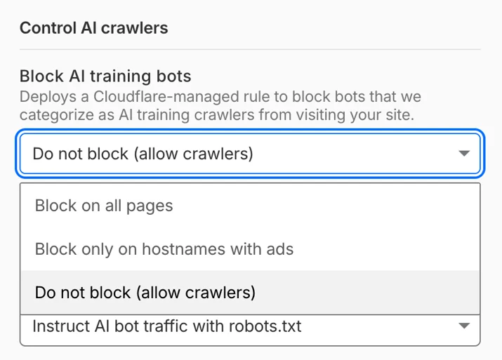

# AI Crawlers Have Split Into Training and Real-Time Fetchers

_Training crawls didn_

## Executive Summary

> [!callout]
> You often hear that the center of gravity in AI crawler traffic has moved from training to agents. But open up the actual 2026 numbers, drawn from Cloudflare Radar, and the picture looks different. Training crawls haven't shrunk. They still make up the single largest share, and they've grown from a year ago. The center of gravity didn't move. A crawler that used to be one thing split into many, one per purpose.

> What changed is the new track growing alongside it. Search-purpose crawling is up 48% year over year, and real-time agent requests triggered by actual users — still under 3% of the total — are the fastest-growing of all. The trouble is that this new traffic simply walks through the old blocking tools. Among sites that declared a block on GPTBot, 39.5% were in fact still serving pages to GPTBot.

> So the question a data owner should be asking now is not "was my content used for training?" It is "does my access control tell apart the crawlers that have split by purpose?" The front line of control and settlement has already moved to that question.

Four numbers sketch the shape of that split. Training holds the largest share, search is growing fast, and nearly half of declared blocks are being breached.

<!-- stat-card -->
**44–52%** — Training-purpose crawling — Still the largest, and up year over year

<!-- stat-card -->
**+48%** — Growth in search crawling — 7.79% → 11.57% year over year

<!-- stat-card -->
**39.5%** — Blocks that still served — Declared a GPTBot block, served it anyway

<!-- stat-card -->
**~71%** — Browser-based agents — Pose as human sessions, defeating blocks

## Crawlers Split by Kind, Not Volume

The impression that "AI now reads the web in real time rather than bulk-training on it" is only half right. The numbers point the other way. In technologychecker.io's July 2026 figures, based on Cloudflare Radar, training-purpose crawling accounted for 44.5% of all AI crawler traffic. A year earlier it was 35.7%, so it actually rose by 8.8 points. In digitalapplied.com's May snapshot, citing the same Radar data, training climbs as high as 51.8%. Whichever you look at, training crawling is not shrinking traffic.

So what changed? Crawlers are splitting from a single mass into tracks defined by purpose. In the same figures, search-purpose crawling reached 11.6%, up from 7.8% a year earlier, a relative gain of 48%. Requests triggered by real user behavior — the traffic generated in real time because a person asked a chatbot something — jumped from 1.1% to 2.7%. Its absolute share is still small, but its growth rate is the steepest. The rest is mixed traffic whose purpose is hard to pin down, filling out roughly 35%.

Put simply: the big river of training keeps flowing, while two new channels — search and agents — are being cut fast right beside it. This is fragmentation, not migration. Why does the distinction matter? Because a defense tool built for the days when you only had to dam one river cannot block the channels that have since appeared. The moment a data owner lumps all crawlers together, they lose sight of the track growing fastest.

*▲ Bots once lumped together as "crawlers" now each do a different job — search, training, agent fetching | Source: [Cloudflare Blog](https://blog.cloudflare.com/content-independence-day-ai-options/)*

> [!callout]
> "Was my data used for training?" is a question from the last phase. Now that traffic has split by purpose, what a data owner needs to watch is not the total but the composition. If you can't tell whether a crawler arriving at your site is there to train, to index for search, or to fetch in real time an answer to a question someone just asked, neither control nor settlement can hold.

## Same Company, Different Bots

That crawlers have split by purpose shows up directly in the bot names. Take OpenAI alone: GPTBot and ChatGPT-User are two different creatures. GPTBot is the crawler that scrapes the web to train models, while ChatGPT-User is the real-time fetcher that pulls a page in the moment a person opens a link or asks something mid-conversation. On top of that there's a separate OAI-SearchBot for search indexing.

Anthropic likewise runs a training crawler, ClaudeBot, apart from its search crawler, Claude-SearchBot; Perplexity has both PerplexityBot and a Perplexity-User that handles user requests. For a data owner, this distinction matters in practice. Blocking GPTBot in robots.txt does nothing to ChatGPT-User unless you write a separate rule for it. If you want to refuse training but still allow search exposure, you have to write rules bot by bot.

Infrastructure providers have begun to recognize this complexity too. As of July 1, 2026, Cloudflare forces AI crawlers into three categories — Training, Search, and Agent — and shows them to administrators that way. The judgment is that a single "AI bot" switch can no longer capture reality. Bundle crawlers of different purposes into one box, and what you want to block ends up tied to what you want to leave open.

*▲ Cloudflare's purpose-based AI bot controls, introduced July 1, 2026 — Search, Training, and Agent switched independently | Source: [Cloudflare Blog](https://blog.cloudflare.com/content-independence-day-ai-options/)*

## The Traffic robots.txt Can't Stop

This is the heart of the problem. The 30-year-old Robots Exclusion Standard (robots.txt) is a gentlemen's agreement designed for the era of training crawlers. In front of real-time agent requests, that agreement holds up poorly. When dataimpulse analyzed logs in June 2026, 39.5% of sites that had declared a GPTBot block in robots.txt were in fact still serving pages to GPTBot. Having written a rule and having that rule obeyed turned out to be two separate things.

*▲ The old control screen — a block toggle plus robots.txt instructions, with no distinction by purpose | Source: [Cloudflare Blog](https://blog.cloudflare.com/content-independence-day-ai-options/)*

Some have formalized the exception. Perplexity has stated that it does not follow robots.txt when it fetches a URL a user pasted in directly. The logic goes: opening a page on behalf of a user who explicitly asked for it is not crawling but acting as the user's proxy. Right or wrong, the practical result is a gray zone that robots.txt does not cover.

The more fundamental blind spot is browser-based agents. In HUMAN Security's 2026 tally, about 71% of agentic traffic moved by driving an actual browser. Agents like Comet and Atlas handle cookies, sessions, and rendering through a headless browser, just as a person would. In the server logs, the line between bot and human blurs. This is the point where the whole defense of filtering bots by their User-Agent string falls apart.

> [!callout]
> robots.txt can only send a binary signal: "don't take this." But the control we need now is conditional by purpose — "don't use this for training, allow it for search indexing, and put a price on real-time citation." That gap between what can be expressed and what needs to be expressed is the real reason the old blocking tool collapses in front of the new traffic.

## Time to Redesign Access Control

Because blocking doesn't work, the first move was to put a price on access. Cloudflare's Pay Per Crawl is an experiment that charges for each crawl request, and the discussion since has been shifting toward Pay Per Use, pricing consumption at inference time rather than at training time. But settlement only holds if control comes first. If you can't tell who is coming in and for what purpose, you have no way to identify what to charge for. So the more fundamental task is redesigning access control itself.

That is why declarative standards are emerging: agents.txt, which aims to replace or supplement robots.txt, and proposals like Agent-Intent that carry the intent of a request in the header. The shared idea is to move past the allow/block binary and have a crawler state what it intends to do — train, search, cite, transact — and grant conditional access accordingly. It's an attempt to capture at the protocol layer the granularity of purpose that robots.txt cannot express.

*▲ Cloudflare BotBase screens and registers bots by behavior type — pushing purpose-based classification into infrastructure | Source: [Cloudflare Blog](https://blog.cloudflare.com/content-independence-day-ai-options/)*

Standards take time to settle. Before they do, here is what a data owner can check right now.

- Are you viewing crawler access logs split by purpose — training, search, agent? A lumped "AI bot traffic" metric won't show you which track is growing.
- Does your robots.txt set rules bot by bot, by purpose? If the same rule covers both GPTBot and ChatGPT-User, you're only blocking half of it.
- Are you ready to treat real-time fetches and training crawls differently as a matter of policy? You need choices decided in advance — like refusing training while keeping search exposure alive.
- Are you relying on User-Agent-based blocking alone? Browser-based agents have already crossed that line.

The stage on which data's value is priced is moving from the store to the flow. More than being scraped once for training, being consumed and cited in real time on every query becomes the new front line for control and settlement. On that front, the first step is not a sophisticated billing model but the ability to observe: to see, by purpose, who is accessing your data and why.

> [!callout]
> **The Pebblous view.** The value of data can only be priced once you can see how it is used. Now that crawlers have split by purpose, the next task for AI-Ready Data is not to worry after the fact about whether "our data was trained on," but to place an observability layer inside the data pipeline that distinguishes and records the purpose of each access in real time.

## References

### Data & Statistics

- 1.Digital Applied Team. (2026). "[AI Crawler & Bot Traffic Statistics 2026: Key Data](https://www.digitalapplied.com/blog/ai-crawler-bot-traffic-statistics-2026-data-reference)." Digital Applied.
- 2.Thomson, D. (2026). "[AI Crawler Statistics in 2026: What AI Crawlers Actually Want?](https://technologychecker.io/blog/ai-crawler-statistics)" TechnologyChecker.
- 3.Byzov, A. (2026). "[Robots.txt & AI Crawlers in 2026: The Full Guide](https://dataimpulse.com/blog/robots-txt-ai-crawlers/)." DataImpulse.
- 4.HUMAN Security. (2026). "[State of Agentic Traffic - April 2026](https://www.humansecurity.com/learn/blog/state-of-agentic-traffic-april-26/)."

### Industry & Policy

- 5.Cloudflare. (2025). "[Introducing Pay Per Crawl (private beta)](https://developers.cloudflare.com/changelog/2025-07-01-pay-per-crawl/)." Cloudflare Developers Changelog.
- 6.Cloudflare. (2026). "[Your site, your rules: new AI traffic options for all customers](https://blog.cloudflare.com/content-independence-day-ai-options/)." Cloudflare Blog.
- 7.Carter, S. (2026). "[Cloudflare Moves To Make AI Pay For The Content It Consumes](https://www.forbes.com/sites/sandycarter/2026/07/01/cloudflare-moves-to-make-ai-pay-for-the-content-it-consumes/)." Forbes.
- 8.Perez, S. (2026). "[Cloudflare's new policy pushes AI companies to pay for publishers' content](https://techcrunch.com/2026/07/01/cloudflares-new-policy-pushes-ai-companies-to-pay-for-publishers-content/)." TechCrunch.

### Academic Paper

- 9.Bandara, E. et al. (2026). "[Towards an Agent-First Web: Redesigning the Web for AI Agents](https://arxiv.org/pdf/2606.19116)." arXiv preprint.
