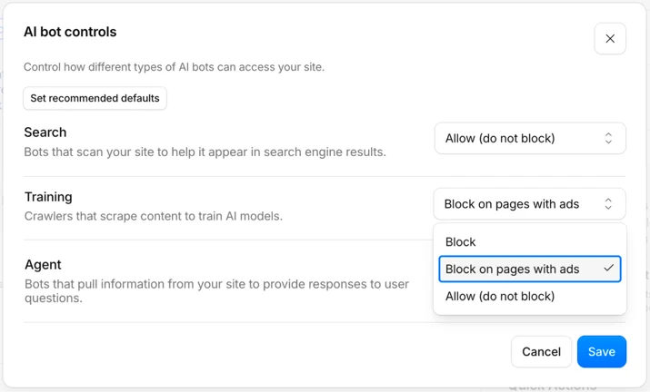
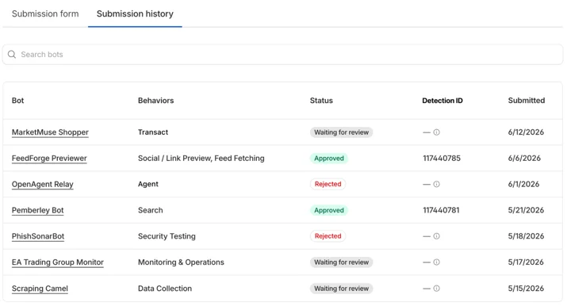

# AI 크롤러가 학습용과 실시간용으로 갈라졌다

_학습 크롤링은 줄지 않았다, robots.txt가 못 막는 실시간 에이전트 요청이 그 옆에서 가장 빨리 자란다_

## Executive Summary

> [!callout]
> AI 크롤러 트래픽의 무게중심이 학습에서 에이전트로 넘어갔다는 이야기가 자주 들린다. 하지만 Cloudflare Radar를 인용한 2026년 집계를 실제로 열어 보면 그림이 다르다. 학습 목적 크롤링은 줄어든 게 아니라 여전히 최대 비중이고, 오히려 전년보다 늘었다. 무게중심이 옮겨간 것이 아니라, 하나였던 크롤러가 목적별로 갈라진 것이다.

> 달라진 것은 그 옆에서 자라는 새 트랙이다. 검색 목적 크롤링은 전년 동월 대비 48% 늘었고, 실사용자의 실시간 에이전트 요청은 절대 비중은 아직 3% 미만이지만 성장 속도가 가장 빠르다. 문제는 이 새 트래픽이 오래된 차단 수단을 그냥 통과한다는 데 있다. GPTBot 차단을 선언한 사이트의 39.5%가 실제로는 GPTBot에 페이지를 내주고 있었다.

> 그래서 데이터 소유자가 지금 물어야 할 질문은 "우리 콘텐츠가 학습됐는가"가 아니다. "우리 접근 통제가 목적별로 갈라진 크롤러를 구분하고 있는가"다. 통제와 정산의 전선은 이미 그 질문 쪽으로 옮겨가 있다.

아래 네 수치가 그 분화의 윤곽을 보여 준다. 학습은 최대 비중을 지키고, 검색은 빠르게 자라며, 차단은 절반 가까이 뚫리고 있다.

<!-- stat-card -->
**44~52%** — 학습 목적 크롤링 비중 — 여전히 최대이자 전년 대비 상승

<!-- stat-card -->
**+48%** — 검색 목적 크롤링 성장 — 전년 동월 7.79% → 11.57%

<!-- stat-card -->
**39.5%** — 차단 선언 사이트의 실서빙 — GPTBot을 막았다면서 내준 비율

<!-- stat-card -->
**~71%** — 브라우저 기반 에이전트 — 사람 세션처럼 위장해 차단 무력

## 크롤러는 갈라진다, 물량이 아니라 종류

"AI가 이제 대량 학습보다 실시간으로 웹을 읽는다"는 인상은 절반만 맞다. 수치는 다른 방향을 가리킨다. technologychecker.io가 Cloudflare Radar를 근거로 집계한 2026년 7월 통계에서 학습 목적 크롤링은 전체의 44.5%를 차지했다. 전년 동월 35.7%였으니 오히려 8.8%p 늘었다. digitalapplied.com이 같은 Radar를 인용한 5월 스냅숏에서는 학습 목적이 51.8%까지 올라간다. 어느 쪽을 봐도 학습 크롤링은 줄어드는 트래픽이 아니다.

그러면 무엇이 바뀌었나. 크롤러가 하나의 덩어리에서 목적별 트랙으로 갈라지고 있다. 같은 집계에서 검색 목적 크롤링은 11.6%로, 전년 동월 7.8%에서 상대적으로 48% 늘었다. 실사용자의 행동에서 촉발되는 요청, 즉 사람이 챗봇에 던진 질문 때문에 실시간으로 발생하는 트래픽은 1.1%에서 2.7%로 뛰었다. 절대 비중은 아직 작지만 성장률로는 가장 가파르다. 나머지는 목적을 특정하기 어려운 혼합 트래픽이 35% 안팎을 채운다.

정리하면 이렇다. 학습이라는 큰 강은 그대로 흐르는데, 그 옆으로 검색과 에이전트라는 새 물길이 빠르게 파이고 있다. "이동"이 아니라 "분화"다. 이 구분이 왜 중요한가. 강 하나만 막으면 되던 시절의 방어 도구로는 새로 생긴 물길을 막을 수 없기 때문이다. 데이터 소유자가 크롤러를 하나로 뭉뚱그려 관리하는 순간, 가장 빠르게 자라는 트랙을 놓치게 된다.

*▲ 하나의 "크롤러"로 뭉뚱그려지던 봇들이 검색·학습·에이전트로 각자 다른 일을 한다 | Source: [Cloudflare Blog](https://blog.cloudflare.com/content-independence-day-ai-options/)*

> [!callout]
> "AI가 내 데이터를 학습했는가"는 지난 국면의 질문이다. 트래픽이 목적별로 갈라진 지금, 데이터 소유자가 봐야 할 것은 총량이 아니라 구성이다. 우리 사이트에 오는 크롤러가 학습용인지, 검색 인덱싱용인지, 사람이 지금 던진 질문에 답하려는 실시간 페치인지를 구분하지 못하면 통제도 정산도 성립하지 않는다.

## 같은 회사, 다른 봇

크롤러가 목적별로 갈라졌다는 말은 봇 이름에서 그대로 확인된다. OpenAI만 해도 GPTBot과 ChatGPT-User는 서로 다른 존재다. GPTBot은 모델 학습을 위해 웹을 긁는 크롤러이고, ChatGPT-User는 사람이 대화 중에 링크를 열거나 질문할 때 그 순간 페이지를 가져오는 실시간 페처다. 여기에 검색 인덱싱용 OAI-SearchBot이 또 따로 있다.

Anthropic도 학습용 ClaudeBot과 검색용 Claude-SearchBot을 나눠 운영하고, Perplexity에는 PerplexityBot과 사용자 요청을 처리하는 Perplexity-User가 있다. 데이터 소유자 입장에서 이 구분은 실무적으로 중요하다. robots.txt에서 GPTBot을 막아도 ChatGPT-User는 별도 규칙을 걸지 않는 한 그대로 들어온다. 학습은 거부하면서 검색 노출은 허용하고 싶다면, 봇 이름마다 규칙을 따로 써야 한다.

이 복잡성을 인프라 사업자도 인지하기 시작했다. Cloudflare는 2026년 7월 1일부터 AI 크롤러를 학습(Training)·검색(Search)·에이전트(Agent) 세 범주로 강제 분류해 관리자에게 보여 준다. 하나의 "AI 봇" 스위치로는 더 이상 현실을 담을 수 없다는 판단이다. 목적이 다른 크롤러를 한 칸에 묶어 두면, 막고 싶은 것과 열어 두고 싶은 것이 같이 묶여 버린다.

*▲ Cloudflare가 2026년 7월 1일 도입한 목적별 AI 봇 통제 화면 — 검색·학습·에이전트를 따로 켜고 끈다 | Source: [Cloudflare Blog](https://blog.cloudflare.com/content-independence-day-ai-options/)*

## robots.txt가 못 막는 트래픽

문제의 핵심은 여기다. 30년 된 로봇배제표준(robots.txt)은 학습 크롤러 시대에 맞춰 설계된 신사협정이다. 실시간 에이전트 요청 앞에서는 그 협정이 잘 지켜지지 않는다. dataimpulse가 2026년 6월 로그를 분석한 결과, robots.txt로 GPTBot 차단을 선언한 사이트의 39.5%가 실제로는 GPTBot에 페이지를 서빙하고 있었다. 규칙을 걸어 뒀다는 사실과 그 규칙이 지켜졌다는 사실은 별개였다.

*▲ "차단" 스위치와 robots.txt 지시만으로 버티던 구형 통제 화면 — 목적별 구분이 없다 | Source: [Cloudflare Blog](https://blog.cloudflare.com/content-independence-day-ai-options/)*

예외를 공식화한 사례도 있다. Perplexity는 사용자가 직접 붙여넣은 URL을 가져올 때는 robots.txt를 따르지 않는다고 밝힌 바 있다. 논리는 이렇다. 사용자가 명시적으로 요청한 페이지를 대신 열어 주는 것은 크롤링이 아니라 사용자 행위의 대리라는 것이다. 이 해석이 옳든 그르든, 결과적으로 robots.txt가 커버하지 못하는 회색지대가 생긴다.

더 근본적인 사각지대는 브라우저 기반 에이전트다. HUMAN Security의 2026년 집계에서 에이전틱 트래픽의 약 71%가 실제 브라우저를 구동하는 방식으로 움직였다. Comet이나 Atlas 같은 에이전트는 헤드리스 브라우저로 쿠키와 세션, 렌더링까지 사람처럼 처리한다. 서버 로그에서는 봇인지 사람인지 구분이 흐려진다. User-Agent 문자열로 봇을 걸러 내던 방어선이 통째로 무력해지는 지점이다.

> [!callout]
> robots.txt는 "가져가지 마"라는 이진 신호밖에 못 낸다. 그런데 지금 필요한 통제는 "학습에는 쓰지 말고, 검색 인덱싱은 허용하고, 실시간 인용은 값을 매겨라" 같은 목적별 조건이다. 표현할 수 있는 것과 표현해야 하는 것 사이의 이 간극이, 오래된 차단 수단이 새 트래픽 앞에서 무너지는 진짜 이유다.

## 접근 통제를 다시 설계할 때

차단이 안 먹히니 값을 매기자는 흐름이 먼저 왔다. Cloudflare의 Pay Per Crawl은 크롤 요청마다 과금하는 실험이고, 이후 논의는 학습 시점이 아니라 추론 시점의 사용에 값을 매기는 Pay Per Use 쪽으로 넘어가고 있다. 다만 정산은 통제가 전제될 때 성립한다. 누가 어떤 목적으로 들어오는지 구분하지 못하면 값을 매길 대상도 특정할 수 없다. 그래서 더 근본적인 과제는 접근 통제의 재설계다.

선언형 표준이 등장하는 이유가 여기 있다. robots.txt를 대체하거나 보완하려는 agents.txt, 요청의 의도를 헤더에 실어 보내자는 Agent-Intent 제안 같은 것들이다. 공통된 발상은 "허용/차단"의 이진법을 넘어, 크롤러가 무엇을 하려는지(학습·검색·인용·거래)를 명시하고 그에 따라 조건부로 허용하자는 것이다. robots.txt가 표현하지 못하는 목적의 세분화를 프로토콜 층위에서 담으려는 시도다.

*▲ 봇을 행동 유형별로 심사·등록하는 Cloudflare BotBase — 목적별 분류를 인프라 층위로 옮기려는 시도다 | Source: [Cloudflare Blog](https://blog.cloudflare.com/content-independence-day-ai-options/)*

표준이 자리 잡기까지는 시간이 걸린다. 그전에 데이터 소유자가 지금 당장 점검할 수 있는 것은 이렇다.

- 크롤러 접근 로그를 목적별(학습·검색·에이전트)로 나눠 보고 있는가. 뭉뚱그린 "AI 봇 트래픽" 지표로는 어느 트랙이 자라는지 보이지 않는다.
- robots.txt가 봇 이름을 목적별로 구분해 규칙을 걸고 있는가. GPTBot과 ChatGPT-User에 같은 규칙만 걸려 있다면 절반만 막고 있는 셈이다.
- 실시간 페치와 학습 크롤을 정책적으로 다르게 대할 준비가 되어 있는가. 학습은 막고 검색 노출은 살리는 식의 선택지를 미리 정해 둘 필요가 있다.
- User-Agent 기반 차단에만 의존하고 있지 않은가. 브라우저 기반 에이전트는 이 방어선을 이미 넘어선다.

데이터의 가치가 매겨지는 무대는 저장고에서 흐름으로 옮겨가고 있다. 한 번 긁혀 학습되는 것보다, 매 질의마다 실시간으로 소비되고 인용되는 쪽이 통제와 정산의 새 전선이 된다. 그 전선에서 첫 단추는 정교한 과금 모델이 아니라, 누가 어떤 목적으로 내 데이터에 접근하는지를 목적별로 보는 관측 능력이다.

> [!callout]
> **페블러스의 관점.** 데이터의 값은 그것이 어떻게 쓰이는지를 볼 수 있을 때 비로소 매길 수 있다. 크롤러가 목적별로 갈라진 지금, AI-Ready Data의 다음 과제는 "우리 데이터가 학습됐는가"를 사후에 걱정하는 것이 아니라, 접근의 목적을 실시간으로 구분하고 기록하는 관측 계층을 데이터 파이프라인 안에 두는 것이다.

## 참고문헌

### 통계·데이터 소스

- 1.Digital Applied Team. (2026). "[AI Crawler & Bot Traffic Statistics 2026: Key Data](https://www.digitalapplied.com/blog/ai-crawler-bot-traffic-statistics-2026-data-reference)." Digital Applied.
- 2.Thomson, D. (2026). "[AI Crawler Statistics in 2026: What AI Crawlers Actually Want?](https://technologychecker.io/blog/ai-crawler-statistics)" TechnologyChecker.
- 3.Byzov, A. (2026). "[Robots.txt & AI Crawlers in 2026: The Full Guide](https://dataimpulse.com/blog/robots-txt-ai-crawlers/)." DataImpulse.
- 4.HUMAN Security. (2026). "[State of Agentic Traffic - April 2026](https://www.humansecurity.com/learn/blog/state-of-agentic-traffic-april-26/)."

### 업계·정책

- 5.Cloudflare. (2025). "[Introducing Pay Per Crawl (private beta)](https://developers.cloudflare.com/changelog/2025-07-01-pay-per-crawl/)." Cloudflare Developers Changelog.
- 6.Cloudflare. (2026). "[Your site, your rules: new AI traffic options for all customers](https://blog.cloudflare.com/content-independence-day-ai-options/)." Cloudflare Blog.
- 7.Carter, S. (2026). "[Cloudflare Moves To Make AI Pay For The Content It Consumes](https://www.forbes.com/sites/sandycarter/2026/07/01/cloudflare-moves-to-make-ai-pay-for-the-content-it-consumes/)." Forbes.
- 8.Perez, S. (2026). "[Cloudflare's new policy pushes AI companies to pay for publishers' content](https://techcrunch.com/2026/07/01/cloudflares-new-policy-pushes-ai-companies-to-pay-for-publishers-content/)." TechCrunch.

### 학술 논문

- 9.Bandara, E. et al. (2026). "[Towards an Agent-First Web: Redesigning the Web for AI Agents](https://arxiv.org/pdf/2606.19116)." arXiv preprint.
