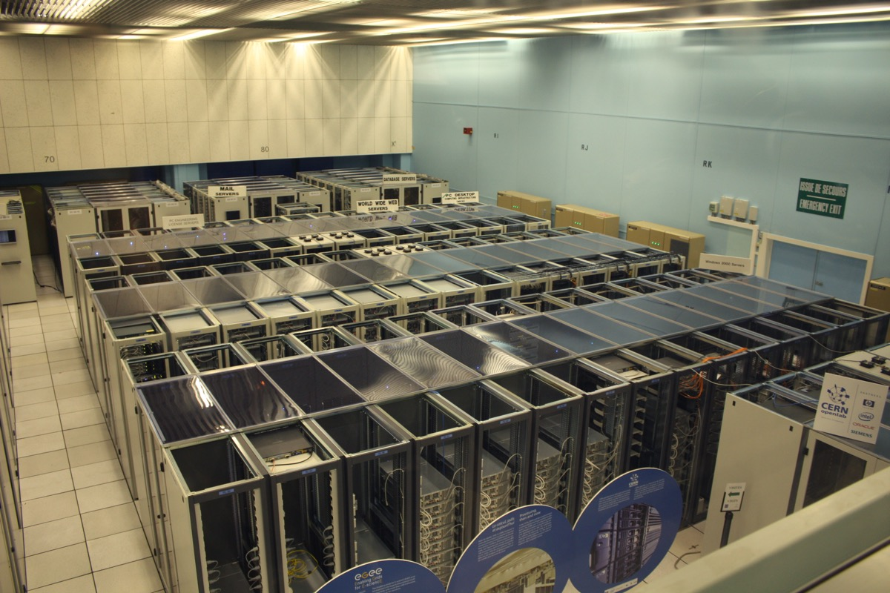

# Four Companies Control Three-Quarters of the AI Training-Data Market

_Scale, Surge, Mercor, and Handshake concentrate data supply, handing AI labs and enterprises a single point of failure_

## Executive Summary

> [!callout]
> In the AI gold rush, the ones digging the gold are the labs building the models. The ones selling them picks and shovels are the vendors supplying training data and RL environments. What has been discussed far less is that this pick-and-shovel layer is already in the hands of a few. This article looks at the concentration in that supply market, and why it becomes the buyer's problem.

> According to a market map published and widely circulated by venture investor Deedy Das, roughly 50 companies sell training data and RL environments, yet more than 75% of revenue is concentrated in four of them: Scale AI, Surge AI, Mercor, and Handshake. The remaining forty-odd firms split the other quarter. In practice, the option of switching vendors comes down to just four.

> When supply concentrates in a few hands, control over data quality, provenance, and bias shifts from the buyer to the vendor. We'll look, in turn, at how that concentration hardened, how it detonated once in the summer of 2025, and what it leaves for any company trying to treat data as an asset.

The four numbers below capture how big this market is, how far it tilts to one side, and the figures that changed hands once that tilt broke into a real event.

<!-- stat-card -->
**75%+** — Top 4 revenue share — Four firms' cut of 50-plus vendors

<!-- stat-card -->
**$8.5B** — Estimated industry revenue — All training-data + RL-environment vendors

<!-- stat-card -->
**$14.3B** — Meta's stake in Scale AI — When the oligopoly risk became real

<!-- stat-card -->
**40×** — Mercor's valuation jump — $250M → $10B in about a year

## Four of 50-Plus Vendors Take Three-Quarters

Training an AI model takes data that people have cleaned and scored. Labeled answers, evaluation rubrics written by experts, and practice environments where agents attempt tasks all count. The companies that build and sell this now number a little over 50. Das's market map estimates the industry's combined annual revenue at roughly $8.5 billion and its total valuation at around $100 billion.

The problem is the distribution inside that number. More than 75% of revenue sits with four companies: Scale AI, Surge AI, Mercor, and Handshake. On the surface it looks like a market of 50-plus competitors, but the vendors a buyer can actually choose at scale come down to four. The backyard selling picks may look wide, yet the forges making usable picks have narrowed to four.

*▲ The forges making the picks narrowed before the gold diggers did — a Gold Rush mining operation on the American River near Sacramento, circa 1852 | Source: [Wikimedia Commons](https://commons.wikimedia.org/wiki/File:Mining_on_the_American_River_near_Sacramento,_circa_1852.jpg)*

The four took different roads, but they arrived in the same place. The table below summarizes where each stands today.

| Company | Scale | Notes |
| --- | --- | --- |
| Scale AI | $2B+ run-rate revenue | Once the industry leader. In June 2025 Meta bought a 49% stake for $14.3 billion, and the founder moved to Meta. |
| Surge AI | ~$1.0–1.2B revenue | Bootstrapped from 2021, it took its first outside investment only in 2025. It positions itself as a neutral vendor with no Big Tech stake. |
| Mercor | $850M+ run-rate, $10B valuation | Pivoted from AI recruiting; its valuation jumped 40× in a year. Its co-founders joined the ranks of the youngest self-made billionaires. |
| Handshake | $1.1B annualized gross revenue (est.) | Shifted from a college job platform into the data business in early 2025. It leans on an expert network that includes 500,000 PhDs. |

What stands out is that three of the four came to data supply from other businesses. Mercor was recruiting; Handshake was a college job platform. That signals how lucrative AI training data has become, and, at the same time, how quickly that money has already pooled in a few hands.

## From Labeling to RL Environments, the Same Four Move Up

This market's center of gravity is shifting right now. It used to be that static labeling — drawing boxes on images and attaching answers to sentences — made up most of the work. That labeling market alone is worth about $5 billion and grows more than 50% a year. But by 2026 the frontier work had moved from labels to RL environments.

An RL environment is an interactive sandbox that mimics real software. An agent attempts a task inside it, an expert-written rubric evaluates the result, and that reward signal trains the model in turn. It is far more labor-intensive and expensive than simply attaching an answer. Anthropic is reported to be weighing spending more than $1 billion a year on RL environments alone, working with more than a dozen vendors.

*▲ What costs money isn't the software — it's the people who write the rubrics and evaluate the results | Source: [Wikimedia Commons](https://commons.wikimedia.org/wiki/File:Cern_datacenter.jpg)*

When a new layer opens, you might expect the board to be reshuffled. In practice, the opposite happened. The very four firms that led in labeling extended straight into RL environments. In early 2026 Handshake acquired Cleanlab, a quality-verification and error-detection startup, lifting itself one rung up the value chain from labeling into evaluation and quality assurance. Mercor and Surge are moving the same way. Rather than dismantling the oligopoly, the new layer has the existing four each climbing one rung higher and re-establishing their grip.

There is a reason that expansion goes so smoothly. The value of an RL environment comes less from the software itself than from the people who write the rubrics and evaluate the results. And that expert network is precisely the asset the four already amassed during the labeling era. Handshake holds an expert pool that includes 500,000 PhDs; Surge has roughly 50,000 contract experts. The very thing a challenger would have to assemble from scratch, the incumbents already hold. The barrier to entry was their moat.

Challengers do exist. Mechanize focuses on a small number of sophisticated RL environments and offers engineers $500,000 salaries; Prime Intellect aims to be "the Hugging Face of RL environments." Still, they fall well short of the four leaders in revenue. It is too early to say the buyer's real set of choices has widened.

## The Oligopoly Risk Already Detonated Once

What happens when supply concentrates in a few hands? This is not an abstract worry; it actually played out once in June 2025. When Meta bought a 49% stake in Scale AI for $14.3 billion, the labs that had been Scale's major customers pulled out one after another.

*▲ Scale AI founder Alexandr Wang moved to Meta as Chief AI Officer following Meta's stake acquisition | Source: [Meta Platforms, Inc. / Wikimedia Commons](https://commons.wikimedia.org/wiki/File:Alexandr_Wang,_Chief_A.I._Officer,_Meta.jpg)*

Google scaled back Scale spending it had planned at around $200 million a year, OpenAI formally ended the partnership, and Microsoft also trimmed the relationship. The reason was singular: neutrality and data-leakage concerns that a rival, Meta, might gain even indirect access to their training pipelines. Infrastructure that had once been nearly invisible suddenly carried competitive implications because of a single equity deal. Facing the customer exodus, Scale laid off 200 people and cut 500 contractors, then pivoted toward defense and government contracts to shore up its position.

> [!callout]
> Here is the part that is easy to miss. The labs' response did not solve the problem; it merely relocated their position. The volume that left Scale flowed to the three remaining oligopolists, Mercor above all. The four-firm structure itself stayed intact. It was not an escape but a transfer.

The strongest corroboration came from the largest buyer. OpenAI is reported to be building its own in-house data team to reduce reliance on third parties like Surge, Mercor, and Handshake. That means the market's biggest purchaser now treats dependence on a few vendors as a structural risk and has begun building its own alternative. The single point of failure in data supply is not theory; it is already a reality moving wallets.

## If Data Is an Asset, Who Sets the Supplier?

This structure is not the labs' story alone. It is a problem for every company that buys and uses training data and RL environments. If there are effectively only four vendors, then that data's quality standards, the transparency of its provenance, and even the bias baked into its rubrics are largely subject to those four firms' choices. A buyer may want to say "our data was validated this way," but a handful of vendors hold the key to that evidence.

Auditing it is not easy, either. Industry-wide surveys show that many companies cannot validate data before training and cannot trace its provenance to the end. With buyers unable to confirm where a vendor's data came from, whose hands it passed through, or how it was processed — and with that supply concentrated in a few hands on top of it — bargaining power naturally tilts toward the seller.

So diversifying by using several vendors is not enough on its own. In a market where all four converge in the same direction, adding vendors is closer to the "transfer" we saw earlier. What a buyer truly needs to secure is control over its own data: a lineage and quality standard it can explain for itself — what came from where and how it was validated — and the internal capability to maintain that even outside any vendor. If data is an asset, you cannot let someone else set the specification for that asset.

Editor's Note

Pebblous has already covered the market these four built once, from the angle of talent selection and wage structure ([Expert Data Labor Market report](/report/expert-data-labor-market-2026/en/)). The angle this article adds is market structure. Making it possible for buyers to explain and maintain the lineage and quality of their own data — the control over AI-Ready Data that does not depend on any vendor — is the work Pebblous has been doing.

## References

### Market Data & Primary Sources

- 1.Das, D. (2026). "[AI training-data and RL-environment vendor market map](https://x.com/deedydas/status/2076124392711696455)." X (Twitter).
- 2.Sacra. (2026). "[$1.1B/year: Indeed for data labelers](https://sacra.com/research/handshake-indeed-for-data-labelers/)."
- 3.Sacra. (2026). "[Surge AI revenue, funding & news](https://sacra.com/c/surge-ai/)."

### Industry Analysis

- 4.Wing Venture Capital. (2026). "[Who Will Win the RL Environment Market—and Why](https://www.wing.vc/content/who-will-win-the-rl-environment-market--and-why)."
- 5.Kourabi, A., Patel, D. (2026). "[RL Environments and RL for Science: Data Foundries and Multi-Agent Architectures](https://newsletter.semianalysis.com/p/rl-environments-and-rl-for-science)." SemiAnalysis.
- 6.LLM Pulse. (2026). "[Every AI Content Licensing Deal, Mapped (2023-2026)](https://llmpulse.ai/blog/ai-content-licensing-deals/)."

### News Coverage

- 7.TechCrunch. (2025). "[Silicon Valley bets big on 'environments' to train AI agents](https://techcrunch.com/2025/09/21/silicon-valley-bets-big-on-environments-to-train-ai-agents/)."
- 8.Data Studios. (2025). "[Google, OpenAI, and Microsoft End Partnerships with Scale AI After Meta Investment](https://www.datastudios.org/post/google-openai-and-microsoft-end-partnerships-with-scale-ai-after-meta-investment)."
- 9.Markman, J. (2026). "[Why Meta Paid $14.3B For Scale AI And Alexandr Wang's Data Empire](https://www.forbes.com/sites/jonmarkman/2026/06/16/why-meta-paid-143b-for-scale-ai-and-alexandr-wangs-data-empire/)." Forbes.
- 10.Lenny's Newsletter. (2025). "[Inside the expert network training every frontier AI model | Garrett Lord (Handshake CEO)](https://www.lennysnewsletter.com/p/inside-handshake-garrett-lord)."
