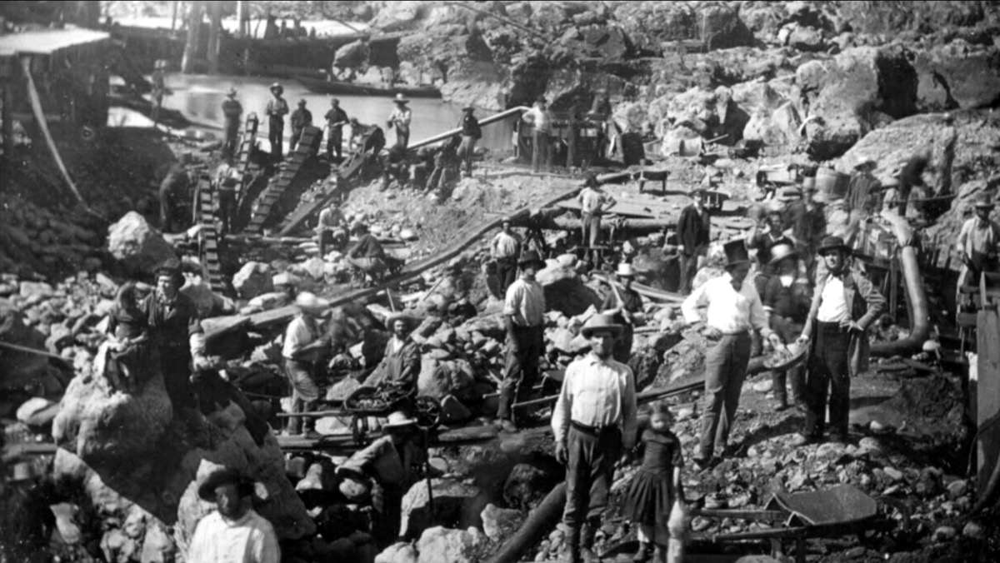

# AI 학습데이터 공급, 50여 곳 중 네 회사가 4분의 3을 가져간다

_Scale·Surge·Mercor·Handshake로 공급이 몰리며 AI 랩과 기업이 떠안은 데이터 단일 실패점_

## Executive Summary

> [!callout]
> AI 골드러시에서 금맥을 캐는 쪽은 모델을 만드는 랩이지만, 그들에게 곡괭이를 파는 쪽은 학습데이터와 RL 환경을 공급하는 벤더들이다. 이 곡괭이 장수 층이 이미 소수의 손에 들어가 있다는 사실은 아직 덜 다뤄졌다. 이 글은 그 공급 시장의 집중 구조와, 그것이 왜 구매자의 문제가 되는지를 본다.

> 벤처투자자 디디 다스가 공개해 확산된 시장 지도에 따르면, 학습데이터와 RL 환경을 파는 회사는 50여 곳에 이르지만 매출의 75% 이상이 Scale AI·Surge AI·Mercor·Handshake 네 곳에 몰려 있다. 나머지 마흔여 곳이 남은 4분의 1을 나눠 갖는 구조다. 벤더를 바꾼다는 선택지 자체가 사실상 네 개뿐이라는 뜻이다.

> 공급이 소수에 몰리면 데이터의 품질과 출처, 편향을 다스릴 통제권이 구매자에서 벤더로 넘어간다. 이 집중이 어쩌다 굳었는지, 2025년 여름에 어떻게 한 번 터졌는지, 그리고 데이터를 자산으로 삼으려는 기업에 무엇을 남기는지를 차례로 보겠다.

이 시장이 얼마나 크고 얼마나 한쪽으로 쏠려 있는지, 그리고 그 쏠림이 실제로 터졌을 때 어떤 숫자가 오갔는지를 네 개로 추렸다.

<!-- stat-card -->
**75%+** — 상위 4개사 매출 점유율 — 50여 개 벤더 중 네 곳의 몫

<!-- stat-card -->
**$8.5B** — 업계 연매출 추정 — 학습데이터+RL 환경 벤더 전체

<!-- stat-card -->
**$14.3B** — Meta의 Scale AI 지분 인수 — 과점 리스크가 현실화된 사건

<!-- stat-card -->
**40배** — Mercor 밸류에이션 급등 — $250M → $10B, 약 1년 만에

## 50여 곳 중 네 곳이 4분의 3을 가져간다

AI 모델을 학습시키려면 사람이 정제하고 채점한 데이터가 필요하다. 정답을 붙인 라벨, 전문가가 작성한 평가 기준, 에이전트가 과제를 시도해 보는 연습용 환경이 모두 여기에 든다. 이걸 만들어 파는 회사가 지금 50곳 남짓이다. 다스의 시장 지도는 이 업계 전체 연매출을 약 85억 달러, 밸류에이션 합계를 약 1,000억 달러(원화로 약 135조 원)로 추산했다.

문제는 그 안의 분포다. 매출의 75% 이상이 네 회사에 몰려 있다. Scale AI, Surge AI, Mercor, Handshake다. 겉으로는 50여 곳이 경쟁하는 시장처럼 보이지만, 구매자가 실제로 고를 수 있는 규모 있는 벤더는 사실상 네 개뿐이라는 뜻이다. 곡괭이를 파는 뒷마당은 넓어 보여도, 쓸 만한 곡괭이를 만드는 대장간은 넷으로 좁혀져 있다.

*▲ 금맥을 캐는 사람보다 곡괭이를 만드는 대장간이 먼저 좁혀진다 — 1852년경 새크라멘토 아메리칸강의 골드러시 채굴 현장 | Source: [Wikimedia Commons](https://commons.wikimedia.org/wiki/File:Mining_on_the_American_River_near_Sacramento,_circa_1852.jpg)*

네 회사가 걸어온 길은 제각각이지만, 도착한 자리는 같다. 아래 표는 네 곳의 현재 위치를 요약한 것이다.

| 회사 | 규모 | 특징 |
| --- | --- | --- |
| Scale AI | 런레이트 매출 $2B+ | 한때 업계 1위. 2025년 6월 Meta가 143억 달러에 지분 49%를 인수했고, 창업자는 Meta로 이직했다. |
| Surge AI | 매출 약 $1.0~1.2B | 2021년 부트스트랩으로 시작해 2025년에야 첫 외부 투자를 받았다. 빅테크 지분이 없는 중립 벤더로 자리매김했다. |
| Mercor | 런레이트 $850M+, 밸류 $10B | AI 채용 스타트업에서 피벗해 1년 만에 밸류에이션이 40배 뛰었다. 공동창업자들이 최연소 자수성가 억만장자 반열에 올랐다. |
| Handshake | 연환산 총매출 $1.1B(추정) | 대학생 취업 플랫폼에서 2025년 초 데이터 사업으로 전환했다. PhD 50만 명을 포함한 전문가 네트워크를 무기로 삼는다. |

넷 중 셋이 원래 다른 사업을 하다 데이터 공급으로 옮겨 왔다는 점이 눈에 띈다. Mercor는 채용, Handshake는 대학생 취업 플랫폼이었다. AI 학습데이터가 그만큼 돈이 되는 자리라는 뜻이고, 동시에 그 돈이 이미 소수에게 빠르게 쏠렸다는 신호이기도 하다.

## 라벨링에서 RL 환경으로, 같은 넷이 한 칸씩 올라간다

이 시장의 무게중심은 지금 움직이는 중이다. 예전에는 이미지에 상자를 치고 문장에 정답을 붙이는 정적 라벨링이 일감의 대부분이었다. 이 라벨링 시장만 해도 약 50억 달러 규모에 연 50% 넘게 성장한다. 그런데 2026년의 프런티어 작업은 라벨이 아니라 RL 환경으로 넘어갔다.

RL 환경은 실제 소프트웨어를 흉내 낸 대화형 샌드박스다. 에이전트가 그 안에서 과제를 시도하면, 전문가가 짠 채점 기준이 결과를 평가하고, 그 보상 신호가 다시 모델을 학습시킨다. 단순히 정답을 붙이는 일보다 훨씬 손이 많이 가고 값도 비싸다. 앤트로픽은 RL 환경에만 연간 10억 달러 넘게 쓰는 방안을 논의하며 열두 곳 이상의 벤더와 일하는 것으로 알려졌다.

*▲ 값비싼 건 소프트웨어가 아니라 채점 기준을 짜고 결과를 평가하는 사람이다 — CERN 데이터센터 서버룸 | Source: [Wikimedia Commons](https://commons.wikimedia.org/wiki/File:Cern_datacenter.jpg)*

새 레이어가 열리면 판이 다시 짜일 법도 하다. 그런데 실제로는 반대다. 라벨링에서 앞서 있던 바로 그 네 회사가 RL 환경으로 그대로 사업을 확장했다. Handshake는 2026년 초 품질 검증·오류 탐지 스타트업 Cleanlab을 인수해 라벨링에서 평가·품질 검증까지 가치사슬을 한 칸 끌어올렸다. Mercor와 Surge도 같은 방향으로 움직인다. 새 레이어가 과점을 해체하는 대신, 기존 네 곳이 한 칸씩 위로 올라가 다시 장악하는 구도다.

이 확장이 순조로운 데는 이유가 있다. RL 환경의 값어치는 소프트웨어 자체보다, 과제를 채점할 기준을 짜고 결과를 평가할 사람에게서 나온다. 그런데 그 전문가 네트워크야말로 네 회사가 라벨링 시대에 이미 쌓아 둔 자산이다. Handshake는 PhD 50만 명을 포함한 전문가 풀을, Surge는 5만 명 규모의 계약 전문가를 확보하고 있다. 새 레이어에 오르려는 도전자가 처음부터 다시 모아야 하는 바로 그것을, 기존 강자들은 이미 쥐고 있는 셈이다. 진입 장벽이 곧 그들의 해자였다.

도전자가 없지는 않다. Mechanize는 소수의 정교한 RL 환경에 집중하며 엔지니어에게 50만 달러 연봉을 제시하고, Prime Intellect는 "RL 환경의 허깅페이스"를 지향한다. 다만 아직 네 강자의 매출 규모에는 한참 못 미친다. 구매자 입장에서 실질적 선택지가 넓어졌다고 보기는 이르다.

## 과점 리스크는 이미 한 번 터졌다

공급이 소수에 몰리면 어떤 일이 벌어지는가. 추상적인 우려가 아니라, 2025년 6월에 실제로 한 번 벌어졌다. Meta가 Scale AI 지분 49%를 143억 달러에 사들이자, Scale의 주요 고객이던 랩들이 줄줄이 발을 뺐다.

*▲ Scale AI 창업자 알렉산더 왕은 Meta의 지분 인수 이후 Meta 최고AI책임자로 자리를 옮겼다 | Source: [Meta Platforms, Inc. / Wikimedia Commons](https://commons.wikimedia.org/wiki/File:Alexandr_Wang,_Chief_A.I._Officer,_Meta.jpg)*

Google은 연 2억 달러 규모로 계획했던 Scale 지출을 축소했고, OpenAI는 파트너십을 공식 종료했으며, Microsoft도 관계를 줄였다. 이유는 하나였다. 경쟁사인 Meta가 자사 학습 파이프라인에 간접적으로라도 접근할 수 있다는 중립성·데이터 유출 우려였다. 한때 거의 보이지 않던 인프라가 지분 한 건으로 갑자기 경쟁적 함의를 갖게 됐다. Scale은 고객 이탈로 200명을 해고하고 계약직 500명을 줄인 뒤, 국방·정부 계약으로 사업을 재편해 방어에 들어갔다.

> [!callout]
> 여기서 놓치기 쉬운 대목이 있다. 랩들이 보인 반응은 문제를 해결한 게 아니라 위치를 옮긴 것뿐이었다. Scale에서 빠져나간 물량은 남은 세 과점사, 특히 Mercor로 흘러 들어갔다. 4강 구조 자체는 그대로였다. 탈피가 아니라 환승이었다.

가장 강력한 방증은 최대 구매자 쪽에서 나왔다. OpenAI는 Surge·Mercor·Handshake 같은 제3자 의존을 줄이려고 자체 사내 데이터 팀을 꾸리는 것으로 알려졌다. 시장에서 가장 많이 사는 쪽이 소수 벤더 의존을 구조적 리스크로 보고 스스로 대안을 짓기 시작했다는 뜻이다. 데이터 공급의 단일 실패점은 이론이 아니라, 이미 지갑을 움직이게 만든 현실이다.

## 데이터가 자산이라면 공급자는 누가 정하나

이 구도가 랩만의 이야기는 아니다. 학습데이터와 RL 환경을 사서 쓰는 모든 기업의 문제다. 벤더가 사실상 넷뿐이라면, 그 데이터의 품질 기준, 출처의 투명성, 채점 기준에 담긴 편향까지 상당 부분이 그 네 곳의 선택에 종속된다. 구매자가 "우리 데이터는 이렇게 검증됐다"고 말하고 싶어도, 그 근거의 열쇠를 소수 벤더가 쥐고 있는 것이다.

게다가 감사조차 쉽지 않다. 업계 전반의 조사를 보면, 상당수 기업이 학습 전 데이터를 검증하지 못하고 데이터의 출처를 끝까지 추적하지 못한다고 답한다. 벤더가 넘긴 데이터가 어디서 왔고 어떤 손을 거쳐 어떻게 가공됐는지 구매자가 확인할 수 없는 상태에서, 그 공급마저 소수에 몰려 있는 셈이다. 협상력은 자연히 파는 쪽으로 기운다.

그래서 벤더를 여럿 쓰는 다변화만으로는 부족하다. 넷 다 같은 방향으로 수렴하는 시장에서 벤더를 늘리는 건 앞서 본 "환승"에 가깝다. 구매자가 진짜로 확보해야 하는 건 자기 데이터에 대한 통제권이다. 무엇이 어디서 왔고 어떻게 검증됐는지 스스로 설명할 수 있는 계보와 품질 기준, 그리고 그것을 벤더 밖에서도 유지할 수 있는 내부 역량이다. 데이터가 자산이라면, 그 자산의 규격을 남이 정하게 두어서는 안 된다.

Editor's Note

페블러스는 이 네 회사가 이룬 시장을 인재 선발과 임금 구조의 각도에서 이미 한 번 다뤘다([전문가 데이터 노동시장 리포트](/report/expert-data-labor-market-2026/ko/)). 이 글이 더한 각도는 시장 구조다. 구매자가 자기 데이터의 계보와 품질을 스스로 설명하고 유지할 수 있게 만드는 일 — 벤더에 종속되지 않는 AI-Ready Data의 통제권 — 이 페블러스가 해 온 작업이다.

## 참고문헌

### 마켓 데이터·1차 소스

- 1.Das, D. (2026). "[AI 학습데이터·RL 환경 벤더 시장 지도](https://x.com/deedydas/status/2076124392711696455)." X (Twitter).
- 2.Sacra. (2026). "[$1.1B/year: Indeed for data labelers](https://sacra.com/research/handshake-indeed-for-data-labelers/)."
- 3.Sacra. (2026). "[Surge AI revenue, funding & news](https://sacra.com/c/surge-ai/)."

### 업계 분석

- 4.Wing Venture Capital. (2026). "[Who Will Win the RL Environment Market—and Why](https://www.wing.vc/content/who-will-win-the-rl-environment-market--and-why)."
- 5.Kourabi, A., Patel, D. (2026). "[RL Environments and RL for Science: Data Foundries and Multi-Agent Architectures](https://newsletter.semianalysis.com/p/rl-environments-and-rl-for-science)." SemiAnalysis.
- 6.LLM Pulse. (2026). "[Every AI Content Licensing Deal, Mapped (2023-2026)](https://llmpulse.ai/blog/ai-content-licensing-deals/)."

### 뉴스 보도

- 7.TechCrunch. (2025). "[Silicon Valley bets big on 'environments' to train AI agents](https://techcrunch.com/2025/09/21/silicon-valley-bets-big-on-environments-to-train-ai-agents/)."
- 8.Data Studios. (2025). "[Google, OpenAI, and Microsoft End Partnerships with Scale AI After Meta Investment](https://www.datastudios.org/post/google-openai-and-microsoft-end-partnerships-with-scale-ai-after-meta-investment)."
- 9.Markman, J. (2026). "[Why Meta Paid $14.3B For Scale AI And Alexandr Wang's Data Empire](https://www.forbes.com/sites/jonmarkman/2026/06/16/why-meta-paid-143b-for-scale-ai-and-alexandr-wangs-data-empire/)." Forbes.
- 10.Lenny's Newsletter. (2025). "[Inside the expert network training every frontier AI model | Garrett Lord (Handshake CEO)](https://www.lennysnewsletter.com/p/inside-handshake-garrett-lord)."
