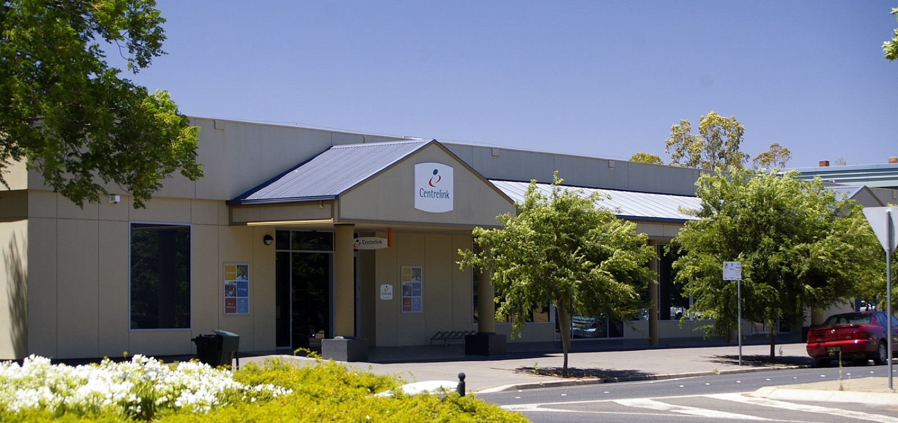
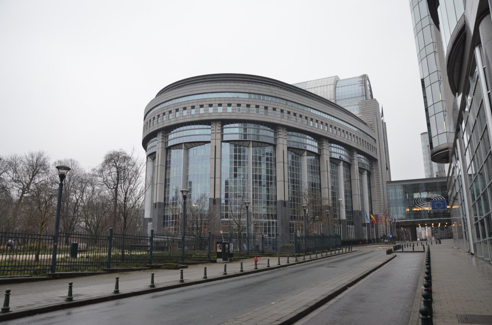
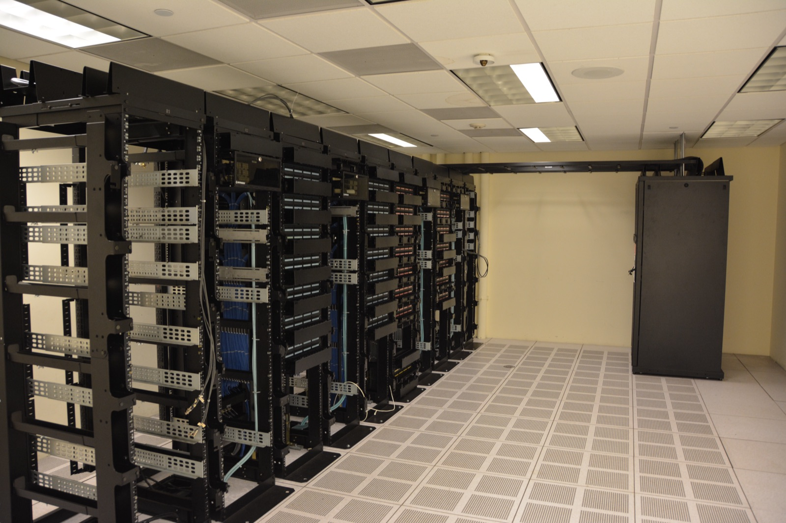

# AI가 내린 채용·복지 결정을 되물을 개인의 권리

_한국·EU가 채용·복지 AI에 설명·거부권을 명문화했지만 완전 자동화 문턱과 미뤄진 시행이 권리를 비켜간다_

## Executive Summary

> [!callout]
> 채용도 복지 수급자 선정도 점점 더 알고리즘이 먼저 판단하는 시대다. 국회 자료에 따르면 최근 2년간 구직자 351명이 전국 17개 시·도 공공기관의 AI 채용검사에서 탈락했다. 이 글은 그렇게 결정을 받은 사람이 지금 무엇을 되물을 수 있는지, 즉 자동화된 결정에 대한 개인의 거부권과 설명요구권이 실제로 어디까지 와 있는지를 본다.

> 권리 자체는 이미 법에 있다. 한국 개인정보 보호법 제37조의2는 2024년 3월 15일부터 완전히 자동화된 결정을 거부하고 그 이유를 설명받을 권리를 정했고, EU도 GDPR 제22조와 AI Act 제86조로 같은 보호를 세웠다. 문제는 이 권리들이 하나같이 '완전 자동화'라는 좁은 문턱 위에 서 있다는 점이다. 사람이 형식적으로 한 번만 개입해도 대부분의 법제는 권리 발동을 인정하지 않는다.

> 여기에 시간표까지 어긋났다. EU는 2026년 5월 채용·복지를 포함한 고위험 AI 의무의 적용을 2027년 12월로 16개월 미뤘다. 권리가 법에 적히는 것과 그 권리가 실제로 발동하는 것 사이에는 아직 거리가 있고, 그 거리를 메우는 것은 결정의 근거를 나중에 다시 꺼내 볼 수 있게 하는 데이터 인프라다.

### 주요 수치

<!-- stat-card -->
**351명** — AI 채용검사 탈락 — 2년간 전국 17개 시·도 공공기관

<!-- stat-card -->
**2024.3.15** — 개인정보 보호법 37조의2 시행 — 자동화된 결정 거부·설명요구권 신설

<!-- stat-card -->
**16개월** — EU 고위험 AI 의무 연기 — 채용·복지 시행이 2027.12로

<!-- stat-card -->
**1.2조원** — 호주 로보뎁트 환급 — 자동 복지 부채 산정이 위법 판결

## 알고리즘이 정하고, 사람은 나중에 안다

면접장에 사람이 없는 채용이 이미 낯설지 않다. 이력서는 자연어 처리 모델이 먼저 읽고, 인·적성 검사와 화상 면접은 표정과 답변을 점수로 환산한다. 국회 행정안전위원회가 확보한 자료에 따르면, 최근 2년 동안 구직자 351명이 전국 17개 시·도 공공기관의 AI 채용검사에서 탈락했다. 탈락 통보를 받은 사람 대부분은 자신이 왜 그 점수를 받았는지 알지 못한 채 다음 지원을 준비한다.

복지 영역도 다르지 않다. 단전·단수·건강보험료 체납 같은 행정정보를 분석해 '위기가구'를 선별하는 시스템이 이미 돌아가고, 그 반대편에는 부정수급을 자동으로 찾아내는 알고리즘이 있다. 어느 쪽이든 개인은 자신에 관한 판단이 내려진 뒤에야, 그것도 결과 통보의 형태로만 그 존재를 안다.

그래서 질문은 하나로 모인다. 채용에서 떨어졌든 복지 대상에서 빠졌든, 그 결정을 받은 사람은 왜 그렇게 결정됐는지 설명을 요구하고 그 결정을 거부할 수 있는가. 이 물음은 그동안 페블러스가 다뤄 온 데이터 이야기의 반대편에 서 있다. 지금까지의 초점이 [데이터가 충분히 좋았는가라는 공급자의 의무](/blog/korea-ai-basic-act-data-governance/ko/)였다면, 이번에는 그 데이터로 내려진 결정을 개인이 되물을 수 있는가라는 데이터 주체의 권리다.

> [!callout]
> AI-레디 데이터의 조건은 그동안 투입 품질의 문제였다. 학습 데이터가 정확하고 대표성 있고 추적 가능한가. 그런데 채용과 복지처럼 삶에 직접 닿는 결정에서는 조건이 하나 더 붙는다. 그 결정을 받은 사람이 왜냐고 물었을 때 답할 수 있는가. 데이터 품질이 공급자의 언어라면, 설명요구권은 그 데이터가 만들어 낸 결정을 받은 개인의 언어다.

## 법에는 이미 그 권리가 있다

되물을 권리는 이미 여러 나라의 법에 적혀 있다. 한국은 2023년 개인정보 보호법을 개정해 제37조의2를 신설했고, 이 조항은 2024년 3월 15일부터 시행 중이다. 핵심은 두 가지다. 완전히 자동화된 시스템이 내린 결정이 자신의 권리·의무에 중대한 영향을 미치면 그 결정을 거부할 수 있고(거부권), 자동화된 결정이 내려졌을 때 그에 대한 설명을 요구할 수 있다(설명요구권). 처리자는 정당한 사유가 없는 한 그 결정을 적용하지 않거나 사람이 다시 검토하도록 해야 한다.

같은 구조가 국경 너머에도 있다. EU GDPR 제22조는 전적으로 자동화된 처리에 기반한 중대한 결정에 따르지 않을 권리를 정하고, 예외적으로 자동화 결정을 허용할 때는 인적 개입·의견 표명·이의 제기라는 안전장치를 요구한다. 2024년 발효된 EU AI Act는 제86조에서 한발 더 나아가, 고위험 AI의 산출물에 기반해 내려진 결정이 개인의 건강·안전·기본권에 부정적 영향을 미치면 그 결정의 주요 요소에 대해 명확하고 의미 있는 설명을 받을 권리를 명시했다. 한국의 AI 기본법도 제34조에서 고영향 AI에 '의미 있는 설명'을 요구한다.

한국 · 개인정보 보호법 37조의2완전 자동화 결정에 대한 거부권 + 설명요구권. 2024.3.15 시행. 원칙적으로 자동화 결정 자체는 허용하되, 요건 충족 시 대응권 부여.

EU · GDPR 22조전적으로 자동화된 결정에 따르지 않을 권리. 원칙적 금지 구조. 예외 허용 시 인적 개입·의견 표명·이의 제기를 안전장치로 요구.

EU · AI Act 86조고위험 AI 결정에 대한 설명받을 권리. 결정에 실제로 영향을 미친 주요 요소를 명확하고 의미 있게 설명해야 함.

한국 · AI 기본법 34조고영향 AI 사업자에게 판단 근거·핵심 기준·학습 데이터 개요에 대한 '의미 있는 설명' 의무. 2026.1.22 시행.

조문만 나열하면 개인은 이미 두껍게 보호받는 것처럼 보인다. 그런데 이 네 조항에는 공통된 급소가 하나 있다. 전부 '완전(solely) 자동화'라는 문턱 위에 서 있다는 점이다. 결정이 완전히 자동으로 내려졌을 때만 권리가 켜지고, 사람이 조금이라도 개입하면 그 순간 대부분의 보호는 발동 요건에서 벗어난다.

> [!callout]
> 개인정보보호위원회 스스로 이 한계를 공개적으로 인정한 바 있다. 거부권을 행사할 수 있는 경우는 완전히 자동화된 결정으로 제한되며, 사람이 의사결정에 적절히 개입하면 사실상 거부권을 행사하기 어렵다는 취지다. 보호를 설계한 규제기관이, 그 보호의 발동 조건이 실무에서 좀처럼 충족되지 않으리라는 점을 먼저 짚은 셈이다.

## 문턱을 비켜가는 법 — 채용

문턱이 어떻게 비켜가는지는 채용 현장에서 가장 선명하게 드러난다. 2026년, 100% AI 채용으로 불합격 통보를 받은 지원자는 개인정보 보호법 제37조의2에 따라 기업에 탈락 이유를 물을 수 있게 됐다. 그런데 이 권리가 켜지려면 결정이 '완전히 자동화'된 것이어야 한다. AI 면접 서비스 업체들 스스로 채용의 모든 과정을 AI로만 처리하는 곳은 없다고 말하는 상황에서, 대부분의 기업은 AI를 보조수단으로 두고 마지막에 사람의 이름을 얹는다. 제도는 있는데 발동 조건이 실무 관행과 어긋나는 것이다.

경계선이 어디인지는 법조계가 미국 판례를 참고해 가늠하고 있다. 이력서에서 기술·경력·학력 데이터를 추출·구조화해 직무 적합도를 점수화하고 자동으로 결정까지 내리면, 국내법상으로도 고영향으로 평가될 소지가 크다. 반대로 서류 누락 체크나 중복지원 탐지, 면접 일정 배정처럼 판단의 실질과 무관하게 작동하면 고영향 판정을 피해 간다. AI가 어디까지 '판단'에 관여하느냐가 보호 발동의 경계선이 되는 셈이다.

### 3.1. 미국의 두 소송이 갈라지는 지점

미국에서 진행 중인 두 소송은 AI 채용을 공격하는 서로 다른 전략을 보여 준다. **Mobley v. Workday**는 채용 알고리즘이 연령을 간접 차별했다는 주장이다. 2026년 3월 연방판사는 연령차별금지법상 차별적 효과 청구를 인정하며, 그 청구가 지원자에게는 적용되지 않는다는 Workday의 방어를 기각했다. 편향 자체를 정면으로 다투는 길이다.

**Kistler v. Eightfold AI**는 다른 문을 연다. 이 소송의 핵심은 알고리즘이 편향됐다는 주장이 아니라, 그 존재 자체가 비밀이었다는 주장이다. 10억 명 이상의 개인 데이터를 스크래핑해 지원자를 0~5점으로 점수화하고, 사람이 검토하기 전에 저점수 지원자를 걸러 냈다는 것이다. 원고는 공정신용보고법이 요구하는 고지 절차 없이 사실상 '소비자 보고서'를 작성했다는 소비자보호법 위반을 문제 삼는다. 편향을 입증하는 무거운 요건 대신, 절차를 알리지 않았다는 가벼운 요건으로 우회하는 전략이다.

*▲ AI 채용 알고리즘을 둘러싼 소송은 편향과 고지 의무라는 서로 다른 쟁점으로 미국 법정에 올라와 있다 | Source: [Wikimedia Commons (Joe Gratz, CC0)](https://commons.wikimedia.org/wiki/File:Courtroom_One_Gavel_-_Flickr_-_Joe_Gratz.jpg)*

> [!callout]
> 두 소송의 대비가 시사하는 바는 분명하다. 편향을 증명하기는 어렵지만, 어떤 알고리즘이 어떤 데이터로 나를 걸러 냈는지 설명받지 못했다는 사실은 상대적으로 다투기 쉽다. 되물을 권리의 실질은 결국 결정의 절차를 투명하게 재구성할 수 있느냐로 좁혀진다.

## 문턱을 비켜가는 법 — 복지

복지 영역에는 이미 여러 나라의 실패 사례가 쌓여 있다. 세 사건은 자동화된 복지 결정이 개인의 절차적 권리를 어떻게 무너뜨렸는지를 보여 준다.

세 사건이 개인에게서 앗아간 것은 조금씩 다르다. 호주 로보뎁트는 빚지지 않았다는 사실을 수급자가 스스로 증명하도록 입증 책임을 거꾸로 돌렸고, 네덜란드 SyRI는 어떤 데이터로 누구를 의심하는지 밝히지 않아 다툴 근거 자체를 남기지 않았다. 미국 미시간 MiDAS는 분기 소득을 기계적으로 나눈 계산법의 결함으로 멀쩡한 수급자를 부정수급자로 몰았다. 실패의 지점은 서로 달라도, 결정을 받은 사람이 그 근거를 되짚어 볼 통로가 없었다는 점은 세 사건이 똑같다.

호주 · 로보뎁트(Robodebt)

자동화 시스템이 수급자의 연간 소득을 주 단위로 평균해 과다지급을 산정하고, 빚지지 않았음을 스스로 증명할 책임을 개인에게 떠넘겼다. 2019년 법원이 위법으로 판결했고 정부는 약 1.2조원을 환급했다. 왕립위원회 조사가 남긴 상세 기록은 복지 자동화 실패의 표준 사례가 됐다.

네덜란드 · SyRI

여러 정부 데이터베이스를 결합해 복지·세금 부정수급 가능성을 예측하던 시스템. 2020년 헤이그지방법원은 정부가 어떤 데이터와 어떤 알고리즘을 쓰는지 투명하게 밝히지 않았다는 점을 들어 위법으로 판단했다. 불투명성 자체가 위법의 핵심 근거가 된 드문 판결이다.

미국 · 미시간 MiDAS

분기 소득을 13주에 기계적으로 나눠 배분하는 방식으로 실업급여 부정수급을 탐지하다가, 2013년 한 해에만 약 48,000명을 잘못 지목했다. 2024년 집단소송 합의로 원고들에게 2,000만 달러가 배상됐다.

*▲ 호주 복지청(Centrelink) 지점. 자동화 시스템이 산정한 부채 통지가 이런 창구를 거쳐 수급자에게 전달됐다 | Source: [Wikimedia Commons (Bidgee, CC BY 3.0)](https://commons.wikimedia.org/wiki/File:Wagga_Wagga_Centrelink_Office.jpg)*

한국의 위기가구 발굴 AI는 이 사례들을 반면교사로 삼는다. 2026년 7월 열린 한 복지 세미나에서는 AI가 위기가구를 선별하더라도 최종 판단은 사람이 초기·심층 상담과 현장 방문을 거쳐 내리는 구조를 유지한다는 점이 강조됐고, 로보뎁트가 명시적으로 반면교사로 언급됐다. 향후에는 대상자 선정 근거를 자연어로 설명하는 모델을 마련하려는 논의도 진행 중이다.

> [!callout]
> 그런데 여기에 채용과 똑같은 구조적 함정이 겹친다. '최종 판단은 사람'이라는 원칙은 정책적 신중함이자, 동시에 개인정보 보호법 제37조의2의 완전 자동화 문턱을 피하는 결과이기도 하다. 사람이 개입하는 순간 법적으로는 거부권과 설명요구권의 발동 요건에서 벗어나기 때문이다. 신중함과 회피가 같은 설계에서 나온다는 점이, 이 문턱의 가장 까다로운 부분이다.

## 권리가 명문화된 순간, 시계는 뒤로

문턱을 넘어 권리가 발동하는 경우라 해도, 그 권리가 기대는 인프라의 시행이 늦춰지면 권리는 문서 위에만 남는다. EU가 바로 그 상황을 만들었다. 2026년 5월 7일 EU 이사회·유럽의회·집행위는 AI Act 채택 이후 첫 개정인 '디지털 옴니버스'에 잠정 합의했고, 채용·복지 급여 자격 판정을 포함한 Annex III 고위험 AI의 의무 적용을 2026년 8월 2일에서 2027년 12월 2일로 16개월 미뤘다.

*▲ 브뤼셀 유럽의회 건물. 2026년 5월 이곳에서 합의된 '디지털 옴니버스'가 고위험 AI 의무 시행을 16개월 늦췄다 | Source: [Wikimedia Commons (Steven Lek, CC BY-SA 4.0)](https://commons.wikimedia.org/wiki/File:European_Parliament_building_Brussels_1.jpg)*

이 연기의 무게는 단순히 일정이 밀린 데 있지 않다. 제86조의 설명받을 권리는 위험관리·로깅·인적 감독 같은 배포자 의무가 작동해야 실질적으로 기능한다. 결정이 어떤 근거로 내려졌는지 기록이 남아 있어야 설명도 가능하기 때문이다. 그 의무들이 2027년 12월까지 유예된다는 것은, 개인이 되물을 권리가 기댈 바닥이 그만큼 늦게 깔린다는 뜻이다. 법에 권리가 적힌 바로 그 시점에, 그 권리를 지탱하는 시계가 16개월 뒤로 밀렸다.

한국은 반대 방향으로 걸었다. AI 기본법을 2026년 1월 시행하고 사업자 의무를 담은 시행령을 그해 7월 발효시켰다. 다만 최소 1년 이상의 계도기간이 함께 주어져, 조문이 곧바로 강한 강제력으로 이어지지는 않는다. 두 지역 모두, 권리를 적는 것과 그 권리가 실제로 작동하도록 인프라를 채우는 것 사이에 시간차가 있다는 사실은 같다.

## 프로버넌스는 감사자만의 것이 아니다

설명받을 권리에는 법제와 시행 시계 말고도 세 번째 함정이 있다. 기술적으로 재구성이 불가능할 수 있다는 점이다. 설명서를 작성하는 일이 어려운 게 아니라, 결정 시점에 모델이 실제로 어떤 피처와 가중치와 임계값을 썼는지를 사후에 복원하는 일이 어렵다. 로그를 남겨 두지 않았다면, 아무리 법에 권리가 적혀 있어도 정확한 답을 만들어 낼 재료가 없다.

여기서 데이터 프로버넌스의 위치가 달라진다. 지금까지 프로버넌스는 규제당국이나 감사자를 위한 사후 증적이었다. 학습 데이터가 어디서 왔고 어떤 가공을 거쳤는지를 사업자가 증빙하는 사업자 관점의 인프라였다. 페블러스가 다뤄 온 [학습 데이터를 토큰 단위로 되짚어 지우는 이야기](/blog/token-level-provenance-unlearning/ko/)도 그 연장선에 있었다. 데이터가 좋았는가, 지울 수 있는가라는 질문이다.

채용·복지 결정에 대한 설명요구권은 그 질문을 한 칸 옮긴다. 프로버넌스가 결정을 받은 개인이 왜냐고 물었을 때 답할 수 있는 인프라이기도 하다는 것이다. 어떤 데이터가 어떤 경로로 이 사람의 점수를 만들었는지, 그 판단에 실제로 영향을 미친 요소가 무엇이었는지를 결정 시점에 기록해 두지 않으면, 나중에 아무리 물어도 재구성할 수 없다. 완전 자동화가 아니었다는 한 문장 앞에서 권리가 증발하듯, 기록이 없다는 사실 앞에서도 설명은 증발한다.

*▲ 결정 시점의 피처·가중치·임계값을 사후에 재구성하려면, 그 순간의 기록을 남겨 두는 데이터 인프라가 먼저 있어야 한다 | Source: [Wikimedia Commons (Carl Lender, CC BY 2.0)](https://commons.wikimedia.org/wiki/File:Datacenter_Server_Racks_(22370909788).jpg)*

> [!callout]
> AI-레디 데이터의 조건이 지금까지 투입 품질이었다면, 채용과 복지처럼 삶에 닿는 결정에서는 그 조건이 결정 순간의 재구성 가능성으로 확장된다. 되물을 권리가 실제로 무언가를 보장하려면, 법의 문턱과 시행의 시계뿐 아니라 결정의 근거를 남겨 두는 데이터 인프라가 함께 있어야 한다. 권리는 조문에서 시작하지만, 그 권리가 답을 얻는 곳은 결국 데이터다.

## 참고문헌

### 법령·공식 문서

- 1.국가법령정보센터. (2024). "[개인정보 보호법 제37조의2 (자동화된 결정에 대한 정보주체의 권리 등)](https://www.law.go.kr/lsInfoP.do?lsiSeq=254144)." 법제처.
- 2.국가법령정보센터. (2026). "[인공지능 발전과 신뢰 기반 조성 등에 관한 기본법 제34·35조](https://www.law.go.kr/lsInfoP.do?lsiSeq=268543)." 법제처.
- 3.EUR-Lex. (2016). "[General Data Protection Regulation (EU) 2016/679, Article 22](https://eur-lex.europa.eu/eli/reg/2016/679/oj)." Official Journal of the EU.
- 4.EUR-Lex. (2024). "[Artificial Intelligence Act (EU) 2024/1689, Article 86 & Annex III](https://eur-lex.europa.eu/eli/reg/2024/1689/oj)." Official Journal of the EU.

### 판례·소송

- 5.U.S. District Court, N.D. Cal. (2026). "[Mobley v. Workday, Inc., No. 23-CV-00770-RFL](https://www.courtlistener.com/docket/67520355/mobley-v-workday-inc/)."
- 6.Rechtbank Den Haag. (2020). "[SyRI 판결 (ECLI:NL:RBDHA:2020:865)](https://uitspraken.rechtspraak.nl/details?id=ECLI:NL:RBDHA:2020:1878)."
- 7.Royal Commission into the Robodebt Scheme. (2023). "[Final Report](https://robodebt.royalcommission.gov.au/)." Commonwealth of Australia.

### 업계·보도 해설

- 8.Global Policy Watch. (2026). "[EU AI Act Update: Timeline Relief, Targeted Simplification, and New Prohibitions](https://www.globalpolicywatch.com/2026/05/eu-ai-act-update-timeline-relief-targeted-simplification-and-new-prohibitions/)."
- 9.국가인공지능전략위원회. (2026). "[인공지능 기본계획(2026~2028)](https://www.aikorea.go.kr/web/board/brdDetail.do?menu_cd=000011&num=328)." 대통령직속 국가AI전략위원회.
