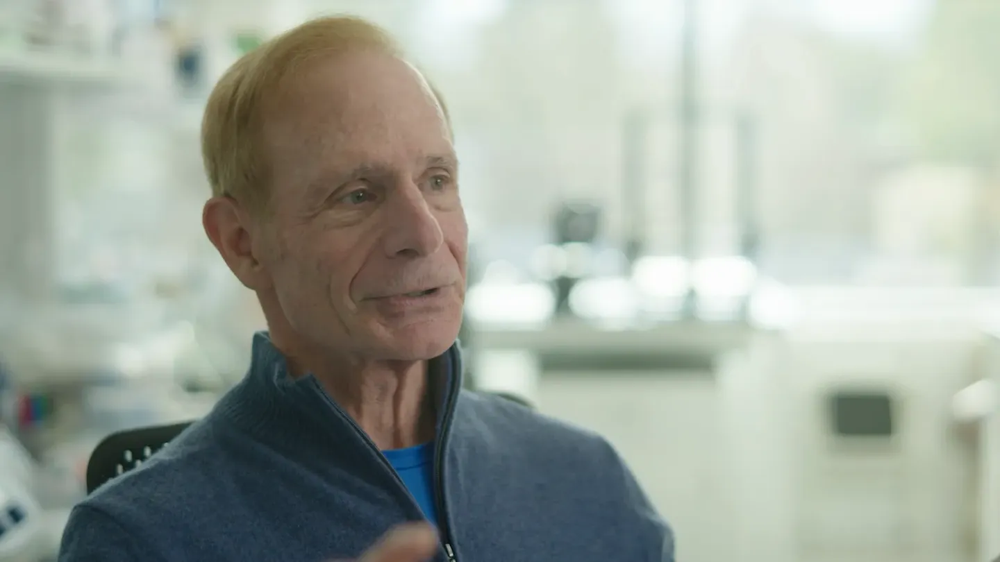

# The AI Discovery Loop That Designs Its Own Experiments

_Google DeepMind_

## Executive Summary

> [!callout]
> In the third week of May 2026, two separate research teams published their own "discovery loops" side by side in the same issue of Nature. They were Google DeepMind's Co-Scientist and FutureHouse's Robin. Their approaches were opposites. One is a general-purpose multi-agent system, the other a pipeline tuned for biology, yet both arrived at the same place: forming a hypothesis and then designing the experiment that would test it. What's worth watching is what that simultaneity signals — and exactly how far the word "automated" really reaches.

> What was automated is not truth but idea generation. Robin proposed 30 candidates for dry age-related macular degeneration and narrowed them to 2 promising ones, while Vorinostat, an anti-cancer drug suggested by Co-Scientist, cut the TGFβ-induced response by 91% in a liver organoid experiment. But every experiment behind those numbers was run by people and instruments, and both teams nailed down the same line: humans are always in the loop.

> The problem is that the loop does not stop after one turn. The output of each turn becomes the input to the next, so contaminated intermediate data is not a single error but something that accumulates and drifts. For a data practitioner, this leaves one practical question: what will you use to validate the data that circulates through the loop?

<!-- stat-card -->
**Same week** — Simultaneous in Nature — Co-Scientist and Robin published side by side in May 2026

<!-- stat-card -->
**30 → 2** — Robin's candidate funnel — 30 dry-AMD candidates proposed, 5 tested, 2 promising

<!-- stat-card -->
**91%↓** — Vorinostat result — TGFβ-induced response reduced in liver organoids

<!-- stat-card -->
**100+** — Validating partners — DOE's Genesis Mission is cross-validating Co-Scientist

## Two Loops, Same Week, Side by Side

When two papers in the same issue of the same journal reach the same conclusion without citing each other, that looks less like coincidence and more like a signal. Co-Scientist is a general-purpose multi-agent system that Google DeepMind built on Gemini, and Robin is a pipeline that FutureHouse, a drug-discovery startup, tuned for biological research. Different teams, different design philosophies, different target domains.

*▲ Co-Scientist and Robin, published side by side in the same week of Nature | Source: [Google DeepMind Blog](https://deepmind.google/blog/co-scientist-a-multi-agent-ai-partner-to-accelerate-research/)*

And yet what the two systems automated overlaps to a striking degree: read the literature, form a hypothesis, design an experiment to test that hypothesis, interpret the result, and move on to the next hypothesis. Researchers call this cycle "closed-loop discovery." That two teams walked their own roads and arrived in front of the same loop at the same moment shows this direction is not one company's marketing but a current the whole field is being carried by.

We covered the Robin case on its own earlier, in [A Multi-Agent System Picked a Real Blindness Drug Candidate](/blog/robin-multi-agent-drug-discovery/en/). This article goes beyond that single system to the larger picture drawn by the simultaneous arrival of two — and to the structural problem that emerges when the loop repeats.

## How the Loop Turns

The two systems turn the same loop in different ways. Co-Scientist has several agents debate over hypotheses, then pits those hypotheses against each other in a tournament using the Elo rating from chess to rank and evolve them. A separate reflection agent plays the role of peer reviewer and filters out the weak ones. In effect, it moves the human process of weighing many ideas and narrowing them through mutual rebuttal into a self-play among agents.

*▲ Co-Scientist's self-play cycle of generating, debating, and evolving hypotheses | Source: [Google DeepMind Blog](https://deepmind.google/blog/co-scientist-a-multi-agent-ai-partner-to-accelerate-research/)*

Robin orchestrates specialized agents with divided roles. Crow, Falcon, and Owl read the literature, Phoenix designs synthesis experiments, and Finch analyzes the data, each doing its own job while Robin weaves them into a single pipeline that runs from hypothesis generation to data interpretation. The approaches differ, but the boundary of automation is the same. What both systems took on is the "intellectual loop" of hypothesis generation, experiment design, result interpretation, and re-hypothesizing, while the physical experiment of shaking test tubes and observing cells still belongs to people and instruments.

> [!callout]
> So today's "closed loop" is only half closed. Survey papers diagnose that current systems are split between the reasoning-centric (hypothesis generation) and the execution-centric (automated experiment), and that a true closed loop — one that turns on its own while withstanding instrument drift, stochastic results, and accumulating uncertainty — is still rare. Even the Co-Scientist paper adds its own caveat that it becomes a complete closed loop only when combined with a lab-automation platform.

## Validation Belongs to People and Instruments

Look at what the automation actually delivered, and the line between "idea generation" and "verdict on truth" grows sharp. Co-Scientist produced results along three fronts. In acute myeloid leukemia (AML) it proposed drug-repurposing candidates and validated them across several cell lines, with one candidate looking especially promising. In liver fibrosis it named Vorinostat, an FDA-approved anti-cancer drug, as a repurposing candidate, and the TGFβ-induced response fell by 91% in liver-organoid experiments at Professor Gary Peltz's lab at Stanford. In antibiotic resistance it proposed, in far less time, the same conclusion a team at Imperial College London had reached over ten years.

What runs through all three cases is that none became a result the moment the AI produced it. The hypotheses Co-Scientist put forward are, even now, being cross-validated in labs by more than 100 research institutions that share the work under the U.S. Department of Energy's Genesis Mission.

*▲ Stanford Professor Gary Peltz, who validated Vorinostat in liver-organoid experiments | Source: [Google DeepMind Blog](https://deepmind.google/blog/co-scientist-a-multi-agent-ai-partner-to-accelerate-research/)*

Robin was given a single prompt — "dry age-related macular degeneration" — and proposed 30 candidates. It validated 5 of them through experiments and found that two, ripasudil and KL001, were promising. Ripasudil is a drug already used in ophthalmology with an established safety profile, while KL001 is an experimental compound with no history of human use.

The numbers are impressive, but each system's hits were "some of what it proposed." Two out of thirty; one among several candidates. What filtered out the rest, and what reconfirmed the effect size of the survivors, was people and instruments. That is why both teams repeated the same sentence in their papers: humans are always in the loop.

## Every Turn of the Loop Cycles Contamination Too

The real risk of a discovery loop is not a single experimental error. It lies in the structure of the circuit itself. When the loop makes one turn, its output — experimental data, literature citations, statistical interpretation — becomes the input to the next turn. So an error introduced midway does not stay at one point; it is absorbed as a premise of the next hypothesis and accumulates.

This risk already shows in the limits of both systems. Robin's analysis agent performed poorly on statistics and bioinformatics problems and leaned heavily on human-supplied prompts. In the earlier standalone Robin case, swapping the literature-search model sharply spiked the rate of hallucinated citations. When errors like these, born in one turn, pass unfiltered to the next, the loop keeps producing plausible hypotheses on top of a false premise.

The academic side has given this phenomenon a name. The PseudoBench paper argues that when contaminated output is reabsorbed as another agent's input or into training corpora, the feedback loop erodes the very epistemic foundation of the next round of research, and calls it "closed-loop contamination." Other survey papers warn likewise that as human oversight thins, flawed data is more likely to propagate errors and let goals drift. When the data is contaminated, the loop does not converge — it drifts.

## The Bottleneck Is Data, Not the Model

From here it becomes clear what actually determines the reliability of a discovery loop. Not a bigger model, not smarter reasoning. It is the quality of the intermediate data that circulates on each turn — experimental results, literature citations, statistical interpretation — and the validation system that filters it. However good the model, if the data going around the circuit is contaminated, the loop only amplifies the contamination faster.

For anyone who works with data, this diagnosis returns to familiar ground. The bottleneck autonomous science must clear is not the ability to generate more hypotheses but the ability to trace the provenance of the data circling the loop, re-verify statistical interpretations, and confirm reproducibility. Without that system, the speed of automation becomes exactly the speed at which contamination spreads.

The question the two papers posed in the same week ultimately converges into one. AI can now generate ideas as fast as we like. Confirming that those ideas stand on fact — validating the data — is the key that opens the next chapter of autonomous science.

## References

### Academic Papers

- 1.Gottweis, J. et al. (2026). "[Accelerating scientific discovery with Co-Scientist](https://www.nature.com/articles/s41586-026-10644-y)." Nature. DOI: 10.1038/s41586-026-10644-y.
- 2.Ghareeb, A. E. et al. (2026). "[A multi-agent system for automating scientific discovery](https://www.nature.com/articles/s41586-026-10652-y)." Nature. DOI: 10.1038/s41586-026-10652-y.
- 3."[PseudoBench: Measuring How Agentic Auto-Research Fuels Pseudoscience](https://arxiv.org/pdf/2606.18060)." (2026). arXiv:2606.18060.
- 4."[Embodied Science: Closing the Discovery Loop with Agentic Embodied AI](https://arxiv.org/pdf/2603.19782)." (2026). arXiv:2603.19782.
- 5."[Agentic Discovery: Closing the Loop with Cooperative Agents](https://arxiv.org/pdf/2510.13081)." (2026). arXiv:2510.13081.

### Industry & Press

- 6.Nature Portfolio. (2026-05-20). "[AI research assistants that may accelerate scientific discovery](https://www.natureasia.com/en/info/press-releases/detail/9330)." Nature Portfolio Press Release.
