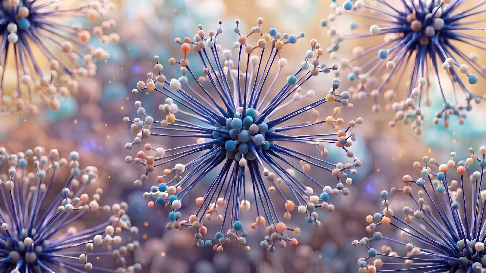
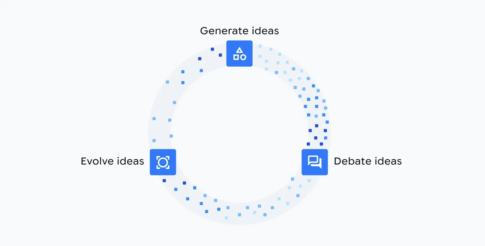

# 가설부터 실험까지 스스로 도는 AI 발견 루프

_구글 딥마인드 Co-Scientist와 FutureHouse Robin이 같은 주 Nature에 나란히 실린 자동 발견 루프의 현주소_

## Executive Summary

> [!callout]
> 2026년 5월 셋째 주, 서로 다른 두 연구팀이 각자 독립적으로 완성한 '발견 루프'를 같은 주 Nature에 나란히 발표했다. 구글 딥마인드의 Co-Scientist와 FutureHouse의 Robin이다. 접근은 정반대였다. 하나는 범용 멀티에이전트, 하나는 생물학에 특화된 파이프라인이었지만, 둘 다 가설을 세우고 그 가설을 검증할 실험까지 스스로 설계하는 같은 지점에 도달했다. 정작 눈여겨볼 대목은 그 동시성이 무엇을 말하느냐, 그리고 '자동화됐다'는 말이 정확히 어디까지를 가리키느냐다.

> 자동화된 것은 '진리'가 아니라 '아이디어 생성'이다. Robin은 건성 황반변성 후보 30개를 제안해 그중 2개를 유망 후보로 좁혔고, Co-Scientist가 제안한 항암제 Vorinostat은 간 오가노이드 실험에서 TGFβ 유도 반응을 91% 낮췄다. 그러나 이 수치를 만든 실험은 모두 사람과 장비가 수행했고, 두 팀은 똑같이 "사람은 언제나 루프 안에 있다"고 못 박았다.

> 문제는 루프가 한 번 도는 데서 끝나지 않는다는 데 있다. 각 회전의 결과는 다음 회전의 입력이 되고, 그래서 오염된 중간 데이터는 한 번의 오차가 아니라 누적되고 표류한다. 데이터 전문가에게 이 흐름이 남기는 실무적 질문은 하나다 — 회로를 도는 데이터를 무엇으로 검증할 것인가.

<!-- stat-card -->
**같은 주** — Nature 동시 게재 — Co-Scientist와 Robin이 2026년 5월 나란히 발표

<!-- stat-card -->
**30 → 2** — Robin의 후보 깔때기 — 건성 황반변성 후보 30개 제안, 5개 검증, 2개 유망

<!-- stat-card -->
**91%↓** — Vorinostat 실험 결과 — 간 오가노이드에서 TGFβ 유도 반응 감소

<!-- stat-card -->
**100+** — 검증 협력 기관 — DOE Genesis Mission이 Co-Scientist를 교차 검증 중

## 같은 주, 나란히 실린 두 회로

같은 주에 같은 저널에 실린 두 논문이 서로를 인용하지 않고도 같은 결론에 도달했다면, 그건 우연이 아니라 신호에 가깝다. Co-Scientist는 구글 딥마인드가 Gemini를 기반으로 만든 범용 멀티에이전트 시스템이고, Robin은 신약 개발 스타트업 FutureHouse가 생물학 연구에 맞춰 만든 파이프라인이다. 만든 팀도, 설계 철학도, 겨냥한 도메인도 달랐다.

*▲ Co-Scientist와 Robin이 같은 주 Nature에 나란히 실린 AI 발견 루프 | Source: [Google DeepMind Blog](https://deepmind.google/blog/co-scientist-a-multi-agent-ai-partner-to-accelerate-research/)*

그런데 두 시스템이 자동화한 것은 놀랄 만큼 겹친다. 문헌을 읽고, 가설을 세우고, 그 가설을 검증할 실험을 설계하고, 나온 결과를 해석해 다음 가설로 넘어가는 순환이다. 연구자들은 이 순환을 '닫힌 발견 회로(closed-loop discovery)'라고 부른다. 두 팀이 각자의 길로 걸어와 같은 회로 앞에 동시에 선 것 자체가, 이 방향이 한 회사의 마케팅이 아니라 분야 전체가 밀려가는 흐름임을 보여준다.

본지는 앞서 Robin 단독 사례를 [다중 에이전트가 실명 신약 후보를 골랐다](/blog/robin-multi-agent-drug-discovery/ko/)에서 다뤘다. 이번 글은 그 한 시스템을 넘어, 두 시스템의 동시 등장이 그린 더 큰 그림 — 그리고 회로가 반복될 때 생기는 구조적 문제 — 에 집중한다.

## 루프는 이렇게 돈다

두 시스템은 같은 회로를 서로 다른 방식으로 돌린다. Co-Scientist는 여러 에이전트가 가설을 놓고 토론하게 한 뒤, 체스에서 쓰는 Elo 레이팅으로 가설들을 토너먼트에 붙여 순위를 매기고 진화시킨다. 별도의 'reflection agent'가 동료 심사자 역할을 맡아 약한 가설을 걸러낸다. 사람이 여러 아이디어를 두고 서로 반박하며 좁혀 가는 과정을, 에이전트들의 자기대국(self-play)으로 옮긴 셈이다.

*▲ 가설을 생성·토론·진화시키는 Co-Scientist의 자기대국 순환 구조 | Source: [Google DeepMind Blog](https://deepmind.google/blog/co-scientist-a-multi-agent-ai-partner-to-accelerate-research/)*

Robin은 역할이 나뉜 전문 에이전트를 오케스트레이션한다. 문헌을 읽는 Crow·Falcon·Owl, 합성 실험을 설계하는 Phoenix, 데이터를 분석하는 Finch가 각자의 일을 맡고, Robin이 이들을 엮어 가설 생성부터 데이터 해석까지 하나의 파이프라인으로 잇는다. 접근은 달라도 자동화의 경계는 같다. 두 시스템이 맡은 것은 가설 생성·실험 설계·결과 해석·재가설이라는 '지적 루프'이고, 시험관을 흔들고 세포를 관찰하는 물리적 실험은 여전히 사람과 장비의 영역이다.

> [!callout]
> 그래서 지금의 '닫힌 회로'는 절반만 닫혀 있다. 서베이 논문들은 현재 시스템이 추론 중심(가설 생성)과 실행 중심(자동 실험)으로 양분돼 있고, 장비 드리프트와 확률적 결과, 누적 불확실성까지 견디며 스스로 도는 진짜 폐루프는 아직 드물다고 진단한다. Co-Scientist 논문조차 실험실 자동화 플랫폼과 결합돼야 완전한 폐루프가 된다고 스스로 단서를 달았다.

## 검증은 사람과 장비의 몫

자동화가 실제로 무엇을 내놓았는지 보면, '아이디어 생성'과 '진위 판정'의 경계가 뚜렷해진다. Co-Scientist는 세 갈래에서 성과를 냈다. 급성골수성백혈병(AML)에서는 약물 재창출 후보를 제안해 여러 세포주에서 검증했고, 그중 특히 한 후보가 유망했다. 간섬유증에서는 FDA 승인 항암제 Vorinostat을 재창출 후보로 지목했고, 스탠퍼드 Gary Peltz 교수 연구실의 간 오가노이드 실험에서 TGFβ 유도 반응이 91% 감소했다. 항생제 내성에서는 임페리얼칼리지런던 연구팀이 10년에 걸쳐 도달한 가설과 같은 결론을 훨씬 짧은 시간에 제안했다.

세 사례를 관통하는 공통점은, 어느 것도 AI가 내놓은 순간 성과가 된 게 아니라는 점이다. Co-Scientist가 제시한 가설은 지금도 미국 에너지부(DOE)의 Genesis Mission 아래 100곳이 넘는 연구기관이 나눠 맡아 실험실에서 교차 검증하고 있다.

*▲ Vorinostat의 간 오가노이드 실험을 검증한 스탠퍼드대 Gary Peltz 교수 | Source: [Google DeepMind Blog](https://deepmind.google/blog/co-scientist-a-multi-agent-ai-partner-to-accelerate-research/)*

Robin은 '건성 황반변성' 단 하나의 프롬프트만 받고 후보 30개를 제안했다. 그중 5개를 실험으로 검증해 리파수딜과 KL001 두 개가 유망하다는 결과를 얻었다. 리파수딜은 이미 안과에서 쓰이는 안전성 확보 약물이고, KL001은 인체 사용 이력이 없는 실험 약물이다.

수치는 인상적이지만, 두 시스템의 적중은 '제안한 것 중 일부'였다. 30개에서 2개, 여러 후보 중 하나. 나머지를 걸러 낸 것도, 살아남은 후보의 효과 크기를 재확인한 것도 사람과 장비였다. 두 팀이 논문에서 똑같은 문장을 반복한 이유가 여기에 있다 — 사람은 언제나 루프 안에 있다.

## 루프가 도는 만큼 오염도 돈다

발견 루프의 진짜 위험은 한 번의 실험 오차가 아니다. 회로라는 구조 자체에 있다. 루프가 한 바퀴 돌면 그 결과 — 실험 데이터, 문헌 인용, 통계 해석 — 가 다음 바퀴의 입력이 된다. 그래서 중간에 낀 오류는 한 지점에 머무르지 않고 다음 가설의 전제로 흡수되며 누적된다.

이 위험은 두 시스템의 한계에서 이미 드러난다. Robin의 분석 에이전트는 통계·생물정보학 문제에서 성능이 낮았고 사람이 준 프롬프트에 크게 의존했다. 앞서 다룬 Robin 단독 사례에서는 문헌 검색 모델을 교체하자 환각 인용률이 크게 치솟았다. 한 회전에서 생긴 이런 오류가 걸러지지 않고 다음 회전으로 넘어가면, 루프는 틀린 전제 위에서 그럴듯한 가설을 계속 만들어 낸다.

학술 쪽은 이 현상에 이름을 붙였다. PseudoBench 논문은 오염된 출력이 다음 에이전트의 입력이나 학습 코퍼스로 다시 흡수되면 피드백 루프가 다음 연구의 인식론적 기반 자체를 훼손한다며 이를 '폐루프 오염(closed-loop contamination)'이라 부른다. 다른 서베이 논문들도 사람의 감독이 줄어들수록 결함 있는 데이터가 오류를 전파하고 목표가 표류(drift)할 위험이 커진다고 경고한다. 데이터가 오염되면 루프는 수렴하지 않고 표류한다.

## 병목은 모델이 아니라 데이터

여기서 발견 루프의 신뢰도가 무엇으로 결정되는지가 분명해진다. 더 큰 모델도, 더 영리한 추론도 아니다. 각 회전마다 순환하는 중간 데이터 — 실험 결과, 문헌 인용, 통계 해석 — 의 품질과, 그것을 걸러 내는 검증 체계다. 모델이 아무리 좋아도 회로를 도는 데이터가 오염돼 있으면 루프는 오염을 더 빠르게 증폭할 뿐이다.

데이터를 다루는 실무자에게 이 진단은 익숙한 자리로 돌아온다. 자율 과학이 넘어야 할 병목은 가설을 더 많이 만드는 능력이 아니라, 회로를 도는 데이터의 출처를 추적하고 통계 해석을 재검증하며 재현성을 확인하는 능력이다. 그 체계가 없으면 자동화의 속도는 그대로 오염이 퍼지는 속도가 된다.

두 논문이 같은 주에 던진 질문은 결국 하나로 모인다. AI는 아이디어를 얼마든지 빠르게 만들 수 있게 됐다. 그 아이디어가 사실 위에 서 있는지 확인하는 일 — 데이터 검증 — 이 자율 과학의 다음 장을 여는 열쇠다.

## 참고문헌

### 학술 논문

- 1.Gottweis, J. et al. (2026). "[Accelerating scientific discovery with Co-Scientist](https://www.nature.com/articles/s41586-026-10644-y)." Nature. DOI: 10.1038/s41586-026-10644-y.
- 2.Ghareeb, A. E. et al. (2026). "[A multi-agent system for automating scientific discovery](https://www.nature.com/articles/s41586-026-10652-y)." Nature. DOI: 10.1038/s41586-026-10652-y.
- 3."[PseudoBench: Measuring How Agentic Auto-Research Fuels Pseudoscience](https://arxiv.org/pdf/2606.18060)." (2026). arXiv:2606.18060.
- 4."[Embodied Science: Closing the Discovery Loop with Agentic Embodied AI](https://arxiv.org/pdf/2603.19782)." (2026). arXiv:2603.19782.
- 5."[Agentic Discovery: Closing the Loop with Cooperative Agents](https://arxiv.org/pdf/2510.13081)." (2026). arXiv:2510.13081.

### 업계·보도

- 6.Nature Portfolio. (2026-05-20). "[AI research assistants that may accelerate scientific discovery](https://www.natureasia.com/en/info/press-releases/detail/9330)." Nature Portfolio Press Release.
