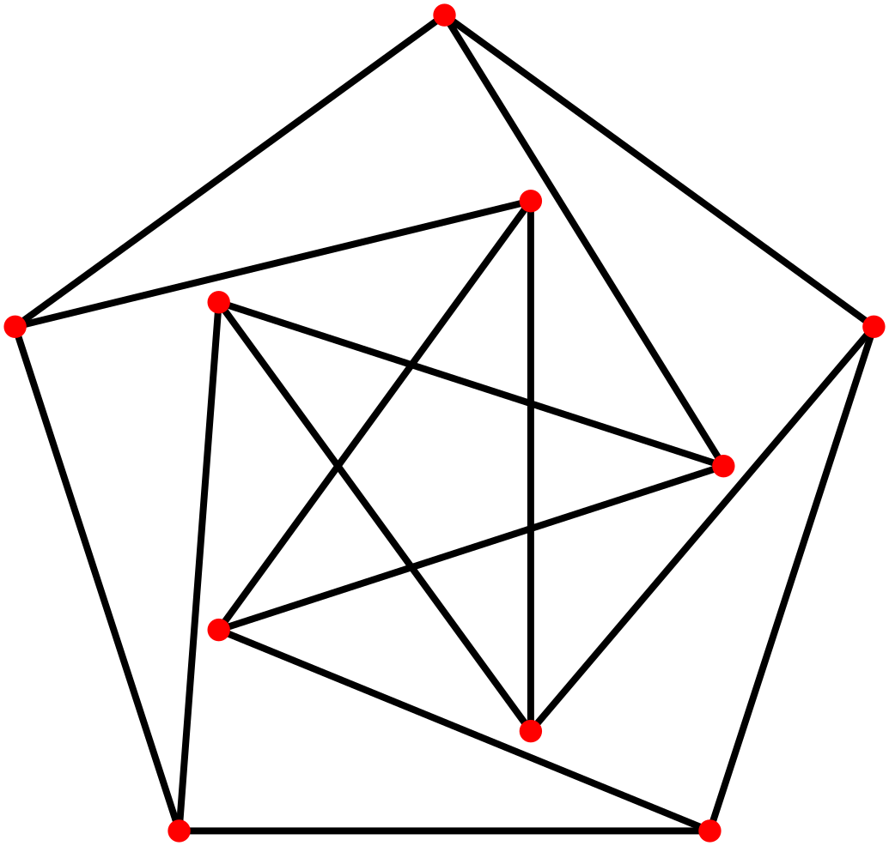
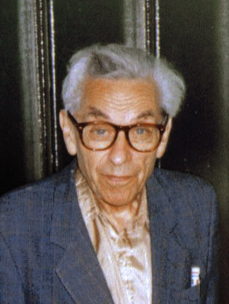

# AI Broke an 80-Year-Old Math Conjecture, Then Humans Rewrote the Proof

_Disproving the Erdős Unit Distance Conjecture, and the Verification Question That _

## Executive Summary

> [!callout]
> On May 20, 2026, OpenAI announced that one of its internal general-purpose reasoning models had disproved the **Erdős unit distance conjecture**, a problem first posed in 1946. For 80 years no mathematician had cracked it, and most had come to believe it was true. This piece looks at that event, and at the question it leaves for people who work with data and AI.

> The quality of the result was no small thing. Fields Medalist Tim Gowers said he would recommend it for publication in **Annals of Mathematics**, the most prestigious journal in the field, without hesitation. Yet what nine outside mathematicians verified was not the model's raw output but a human-polished version, an **"edited reasoning,"** and they had to rewrite that proof back into human language.

> The event is at once proof that AI can create genuinely new knowledge and a question about what we should trust that knowledge on. The grounds for trust lie not in how powerful the model is but in how traceable and reproducible its result is. We read this breakthrough again through the data lens of provenance, process, and reproducibility.

### Key Figures

Sources: Alon et al., [arXiv 2605.20695](https://arxiv.org/abs/2605.20695) · Sawin, [arXiv 2605.20579](https://arxiv.org/abs/2605.20579)

<!-- stat-card -->
**80 years** — How long the conjecture held — First disproof (2026) since it was posed in 1946

<!-- stat-card -->
**n1.014** — The newly opened lower bound — A stuck exponent pushed to 1 + a constant (Sawin)

<!-- stat-card -->
**9** — Mathematicians who verified and rewrote — Re-rendered the AI output into human language

<!-- stat-card -->
**0** — Raw reasoning released — Outside verifiers saw only the edited summary

## The One Line Everyone Believed for 80 Years

The problem itself is one a schoolchild could grasp. Place n points on a plane. How many pairs of points can be exactly distance 1 apart, at most? Paul Erdős posed this question in 1946, and it became known as the unit distance problem. It ranks among the simplest questions in geometry.

*▲ A unit distance graph (16 points, 40 pairs) — each segment between blue dots has length exactly 1. Maximizing these pairs over all n-point configurations is the Erdős unit distance problem. | Source: [Wikimedia Commons](https://commons.wikimedia.org/wiki/File:Unit_distance_16_40.svg) (CC0)*

Erdős's conjecture was that the answer stays almost linear — that it does not climb far above a level proportional to the number of points. In formal terms, at most about n1+o(1) pairs. After Spencer, Szemerédi, and Trotter proved an upper bound of O(n4/3) in 1984, that bound went unimproved for 42 years. The lower bound on the other side stayed around n1+c/loglog n, which seemed to keep propping up the side that said the conjecture was right.

Erdős himself, it is said, was not sure. But the field's sentiment leaned toward the conjecture being true. So most of the effort gathered around the direction of proving it. It is not that no one tried to build a counterexample. József Solymosi of Toronto recalls that "several of us tried to construct counterexamples." But everyone soon hit a wall, and the belief stayed in place.

> [!callout]
> Here is the first twist of the story. One reason the problem went unsolved for 80 years was not its difficulty but its **direction**. Because people believed the conjecture was right, few had the motivation to push a counterexample construction all the way through. Belief narrows the search.

## The AI That Walked the Path Humans Abandoned

The disproof came from one of OpenAI's internal general-purpose reasoning models. Not a system designed specifically for mathematics, like AlphaProof, but a general model similar to the one that powers ChatGPT or Codex — a point OpenAI's Sebastian Bubeck and Noam Brown confirmed. The model generated the mathematical argument essentially "in one go," and it was then refined into paper form through human interaction with Codex. The final document runs to about 125 pages.

What was striking was the path more than the conclusion. The tool the model reached for was **algebraic number theory**. Put plainly, instead of scattering points directly on the plane, it first designed the points in the far richer "world of numbers" and then mapped them back onto the plane. Concretely, the work draws on concepts like fields with complex multiplication (CM fields), Golod–Shafarevich infinite class field towers, and split prime ideals. It treats a set of points in the plane as elements of algebraic numbers of size 1, embeds them in the complex plane ℂ, and then projects to ℝ2. Almost no one had thought to borrow this heavy machinery for the unit distance problem.

*▲ The Petersen graph embedded as a unit distance graph — all edges have length exactly 1 when placed in the plane. The AI's algebraic construction similarly designs points in the number-theoretic world, then maps them to ℝ². | Source: [Wikimedia Commons](https://commons.wikimedia.org/wiki/File:Petersen_graph,_unit_distance.svg) (Public Domain)*

The result was that a set of points with n1+ε pairs exists for arbitrarily large n. This is a qualitative jump in which the exponent leaps to 1 + a constant — a head-on refutation of the conjecture that the answer was nearly linear. In a separate paper, Will Sawin nailed this lower bound to an explicit figure of n1.014, and later pushed it to n1.0318. The limit reachable by the same method is estimated at about 1.2143.

What the mathematicians noted was the AI's persistence. Thomas Bloom, who had been embarrassed once before in October 2025, joined this time as a co-author and described the AI's strength as "the ability to doggedly follow a path that a human would have abandoned early as a waste of time." Jacob Tsimerman added that it "can not only try every known method, but can hold out longer and in rougher waters than a mathematician."

> [!callout]
> The October 2025 episode is a useful control group for reading this result. Back then an OpenAI executive announced that "GPT-5 had solved 10 open Erdős problems," only to take the post down days later. The model had retrieved solutions already in the existing literature, and the person who exposed it was Bloom himself. That time it was retrieval; this time it was generation. A seven-month gap at the same company became a test of trust in itself.

## What Nine Mathematicians Did

On the same day as the result, a companion paper by nine outside mathematicians appeared. Its title is "Remarks on the Disproof of the Unit Distance Conjecture," and its authors are Noga Alon, Thomas F. Bloom, W. T. Gowers, Daniel Litt, Will Sawin, Arul Shankar, Jacob Tsimerman, Victor Wang, and Melanie Matchett Wood — a roster of a Fields Medalist and first-rank researchers from across the field.

*▲ Paul Erdős (1992) — the Hungarian mathematician who posed the unit distance problem in 1946. What the nine mathematicians verified and rewrote was the answer to a question he had asked 80 years earlier. | Source: [Wikimedia Commons](https://commons.wikimedia.org/wiki/File:Erdos_budapest_fall_1992_(cropped).jpg) (CC BY-SA 2.0)*

What they did was not stamp the work with approval. It was to rewrite the proof the AI had produced into a form humans could understand. They simplified and generalized the core idea and tidied it up, and where the AI's argument skipped over a lemma, they filled in a complete and rigorous proof of their own. Daniel Litt says correctness itself could be confirmed within a few hours. Will Sawin simplified a construction that had originally required several split primes down to a single split prime, and spent a weekend searching for an optimization.

The praise was generous. Arul Shankar said it "executed a very beautiful idea cleanly and was well written." Daniel Litt called it "the first case that is interesting in itself, not as a leading indicator." And Tim Gowers said he could recommend the proof to **Annals of Mathematics** "without hesitation." It was the first moment a machine-made argument reached the threshold of a top-tier journal.

> [!callout]
> The companion paper also contains a candid admission. A human mathematician could conceivably have found this result independently — but because of the belief that the conjecture was true, the very motivation to look for a counterexample was weak. The AI, having no such belief, walked a path no one had walked to the end. The human role lay in paving that path into one a person could walk.

## The Invisible Original, the Edited Reasoning

This is where the data question begins. OpenAI released three things: the finished proof text, the companion paper by the nine mathematicians, and an **edited summary** of the model's reasoning. One thing was not released — the raw output the model first produced.

The companion paper defines an "AI proof" this way: a result that an OpenAI internal model generated mathematically in one go, then refined into a paper file through human interaction with Codex. In this definition the boundary between the original and the final is blurry. From the outside, there is no way to tell how much the model made on its own and where the human polishing began. Strictly speaking, what the outside verifiers checked was not the model's raw output but an edited version of it.

Setting what was disclosed next to what was withheld makes the outline clear. Deciding whether a result is correct and deciding whether you can look into the path that led to it are entirely different problems.

What was disclosed

The finished proof text, the companion paper by the nine mathematicians, and a human-polished edited summary of the model's reasoning. The correctness of the result is verifiable.

What was withheld

The model's raw output, the full reasoning process at the moment of generation, and any information on whether the same result appears when it is run again under the same conditions.

This difference is not trivial. It becomes clear if you recall the 1976 four color theorem, the first case in which a computer made a decisive contribution to a mathematical proof. The controversy then was large too, but the key point is that verifiability was preserved. The program and the list of cases to be checked were made public, and other researchers could independently rewrite the code and arrive at the same conclusion. The procedure, in other words, was reproducible. This time the result can be verified, but the process and the original that made it cannot be retraced from the outside.

*▲ Four colour theorem (1976, computer-assisted proof) — the program and the list of cases were made public, so anyone could independently reproduce the result. This is the critical difference from the AI disproof. | Source: [Wikimedia Commons](https://commons.wikimedia.org/wiki/File:Four_Colour_Map_Example.svg) (Public Domain)*

> [!callout]
> The remaining question is simple. If you give the same model the same prompt, does this proof come out again? No one outside OpenAI can answer that with confidence. The correctness of the result and the reproducibility of the process are different matters, and what was released this time is only the former.

## Trust Comes from Process, Not the Model

The way science has come to believe any claim has always been the same. Disclose the data, the method, and the process transparently, and let anyone retrace the same conditions to reach the same result. The grounds for trust lay not in how brilliant the discoverer was but in how traceable the discovery was. Now that AI has stepped in as a producer of knowledge, this principle does not change.

So an AI-made result should be treated like data. Which model made it through what process (provenance), how it changed from original to edited version (versioning), and whether the same result is reproduced under the same conditions (reproducibility). An output that does not state these three things forces us to withhold trust, even if the result is correct. This disproof was released with the boundary between provenance and version blurry and reproducibility unconfirmed.

The direction of an alternative is already visible. Approaches in the Google DeepMind lineage express results in a formal proof language like Lean, so a machine can verify them automatically, line by line. In that case trust comes not from a person's reputation or a model's fame but from the fact that you can run the verifier again. OpenAI chose a powerful result while conceding some transparency, and the cost of that choice is exactly the verification gap that surfaced here.

For data practitioners, this event is the most dramatic version of a familiar structure. The questions we ask when we accept a model's output are the same. What input and what process did this result come from? Can that process be retraced? If you receive only the result and not the process, then even a correct answer is closer to faith than to trust. The more AI-made knowledge grows, the more the value of a verifiable trail attached to each result grows with it.

> [!callout]
> That AI broke an 80-year-old problem is a clear advance. At the same time, the fact that humans had to rewrite that proof, and that the original was never released, remains with equal weight. That AI can create new knowledge and that we can make that knowledge verifiable are two separate things. The responsibility for the latter still belongs to people and to process.

## FAQ

## References

### R.1. Academic Papers

- 1.Alon N, Bloom TF, Gowers WT, Litt D, Sawin W, Shankar A, Tsimerman J, Wang V, Wood MM. (2026). "[Remarks on the Disproof of the Unit Distance Conjecture](https://arxiv.org/abs/2605.20695)." arXiv:2605.20695.
- 2.Sawin W. (2026). "[An Explicit Lower Bound for the Unit Distance Problem](https://arxiv.org/abs/2605.20579)." arXiv:2605.20579. — States the lower bound n1.014.

### R.2. Official Documents

- 3.OpenAI. (2026). "[Unit Distance Remarks](https://cdn.openai.com/pdf/74c24085-19b0-4534-9c90-465b8e29ad73/unit-distance-remarks.pdf)." Proof text + edited reasoning summary (PDF).

Thank you for reading. Every time you meet an AI-made result, the habit of also asking "what process did this result come from, and can that process be retraced" will be the firmest standard for telling correctness apart from trust. If you have thoughts or counterarguments on this topic, we would love to hear them.

**Pebblous Data Communication Team**  
June 19, 2026
