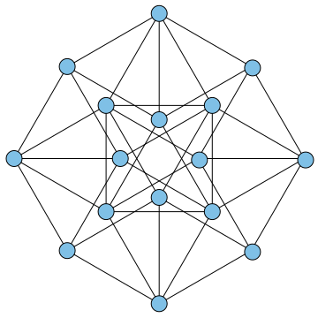
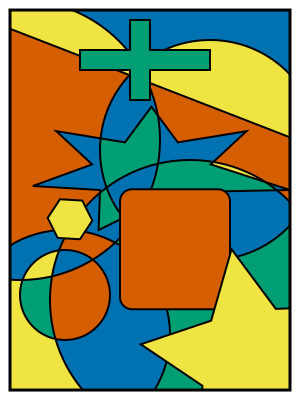

# AI가 80년 수학 난제를 무너뜨렸다, 그 증명은 사람이 다시 썼다

_에르되시 단위거리 추측 반증과 _

## Executive Summary

> [!callout]
> 2026년 5월 20일, OpenAI는 자사 내부 범용 추론 모델이 1946년에 제기된 **에르되시 단위거리 추측**을 반증했다고 발표했다. 80년 동안 어떤 수학자도 풀지 못했고, 대부분이 참이라고 믿어 온 문제다. 이 글은 그 사건과, 그 사건이 데이터·AI 실무자에게 남긴 질문을 본다.

> 결과의 품질은 만만치 않았다. 필즈상 수상자 Tim Gowers가 최고 권위지 **Annals of Mathematics** 게재를 망설임 없이 추천할 정도였다. 그런데 외부 수학자 아홉 명이 검증한 것은 모델의 원본 출력이 아니라 사람이 다듬은 **'편집된 추론'**이었고, 그들은 그 증명을 다시 사람의 언어로 옮겨 적어야 했다.

> 이 사건은 AI가 진짜 새로운 지식을 만들 수 있다는 증거인 동시에, 그 지식을 무엇으로 믿을 것인가라는 질문을 던진다. 신뢰의 근거는 모델이 얼마나 강력한가가 아니라 그 결과가 얼마나 추적 가능하고 재현 가능한가에 있다. 출처·과정·재현성이라는 데이터의 렌즈로 이 돌파구를 다시 읽는다.

### 주요 수치

출처: Alon et al., [arXiv 2605.20695](https://arxiv.org/abs/2605.20695) · Sawin, [arXiv 2605.20579](https://arxiv.org/abs/2605.20579)

<!-- stat-card -->
**80년** — 버틴 추측의 수명 — 1946년 제기 후 첫 반증(2026)

<!-- stat-card -->
**n1.014** — 새로 열린 하한 — 멈춰 있던 지수를 1+상수로(Sawin)

<!-- stat-card -->
**9명** — 검증·재작성한 수학자 — AI 출력을 사람 언어로 다시 씀

<!-- stat-card -->
**0건** — 공개된 원본 추론 — 외부 검증자는 편집된 요약만 봄

## 80년 동안 모두가 믿은 한 줄

문제 자체는 초등학생도 이해할 수 있다. 평면 위에 점을 n개 찍는다. 이때 정확히 거리가 1인 점의 쌍은 최대 몇 개나 만들 수 있을까. Paul Erdős가 1946년에 던진 이 질문은 단위거리 문제(unit distance problem)라고 불린다. 기하학에서 가장 단순한 축에 드는 물음이다.

*▲ 단위거리 그래프 예시(16점, 40쌍) — 파란 원 사이의 선분이 정확히 거리 1인 쌍. n개 점에서 이 쌍의 최대 개수가 에르되시 추측의 핵심이다. | Source: [Wikimedia Commons](https://commons.wikimedia.org/wiki/File:Unit_distance_16_40.svg) (CC0)*

Erdős의 추측은 그 답이 거의 선형, 즉 점의 개수에 비례하는 수준을 크게 넘지 않는다는 것이었다. 수식으로는 최대 n1+o(1) 쌍 정도다. 1984년 Spencer·Szemerédi·Trotter가 상한 O(n4/3)를 증명한 뒤로, 이 상한은 42년 동안 한 번도 개선되지 않았다. 반대편의 하한도 n1+c/loglog n 수준에 머물러, 추측이 옳다는 쪽을 계속 떠받치는 것처럼 보였다.

Erdős 본인은 확신하지 못했다고 전해진다. 그러나 수학계의 정서는 추측이 참이라는 쪽으로 기울어 있었다. 그래서 사람들의 노력은 대부분 추측을 증명하려는 방향에 모였다. 반례를 만들려는 시도가 없었던 것은 아니다. 토론토의 József Solymosi는 "우리 중 여럿이 반례를 구성해 보려 했다"고 말한다. 다만 다들 곧 막혔고, 믿음은 그대로 남았다.

> [!callout]
> 여기에 이 사건의 첫 번째 반전이 있다. 80년 동안 풀리지 않은 이유 중 하나는 난도 자체가 아니라 **방향**이었다. 추측이 맞다고 믿었기에, 그것을 깨는 구성을 끝까지 밀어붙일 동기를 가진 사람이 드물었다. 믿음은 탐색을 좁힌다.

## 사람이 포기한 길을 끝까지 간 AI

반증을 만든 것은 OpenAI의 내부 범용 추론 모델이다. 수학 전용으로 설계된 AlphaProof 같은 시스템이 아니라, ChatGPT나 Codex를 구동하는 것과 비슷한 일반 모델이라는 점을 OpenAI의 Sebastian Bubeck과 Noam Brown이 확인했다. 모델은 수학적 논증을 사실상 "한 번에" 생성했고, 이후 Codex와의 인간 상호작용을 거쳐 논문 형태로 다듬어졌다. 최종 분량은 약 125쪽에 이른다.

놀라운 것은 결론보다 경로였다. 모델이 집어 든 도구는 **대수적 정수론**이었다. 쉽게 말하면 점을 평면 위에 직접 흩뿌리는 대신, 구조가 훨씬 풍부한 '수의 세계'에서 점들을 먼저 설계한 다음 평면으로 되돌려 놓는 발상이다. 구체적으로는 복소 곱셈을 가진 수체(CM field), Golod–Shafarevich 무한 유체탑(class field tower), 분할 소 아이디얼 같은 개념들이다. 평면 위 점 집합을, 크기가 1인 대수적 수들의 원소로 보고 복소평면 ℂ에 매립한 뒤 ℝ2로 투영하는 방식이다. 단위거리 문제에서 이 분야의 무거운 기계장치를 빌려 오려던 사람은 거의 없었다.

*▲ 페터슨 그래프의 단위거리 매립 — 평면에 배치했을 때 모든 변의 길이가 정확히 1이 되는 구성. AI가 대수적 수의 세계에서 설계한 점 집합도 이와 같이 복소평면에서 ℝ²로 투영된다. | Source: [Wikimedia Commons](https://commons.wikimedia.org/wiki/File:Petersen_graph,_unit_distance.svg) (Public Domain)*

결과는 n1+ε 쌍을 가지는 점 집합이 임의로 큰 n에 대해 존재한다는 것이었다. 거의 선형이라던 추측을 정면으로 반박하는, 지수가 1+상수로 뛰어오르는 질적 도약이다. Will Sawin은 별도 논문에서 이 하한을 명시적인 수치 n1.014로 못 박았고, 이후 n1.0318까지 끌어올렸다. 같은 방법으로 닿을 수 있는 한계는 약 1.2143으로 추정된다.

수학자들이 주목한 것은 AI의 끈기였다. 2025년 10월에 한 차례 망신을 당한 적이 있는 Thomas Bloom은 이번엔 공동 저자로 참여해, AI의 강점을 "사람이라면 시간 낭비라고 일찍 접었을 경로를 끈질기게 따라가는 능력"이라고 표현했다. Jacob Tsimerman은 "알려진 모든 방법을 다 시도할 수 있을 뿐 아니라, 수학자보다 더 오래, 더 험한 물에서 버틸 수 있다"고 덧붙였다.

> [!callout]
> 2025년 10월의 사건은 이번 결과를 읽는 좋은 대조군이다. 당시 OpenAI의 한 임원은 "GPT-5가 미해결 에르되시 문제 10개를 풀었다"고 알렸다가 며칠 만에 글을 내렸다. 모델이 기존 문헌에 있던 해법을 검색해 온 것이었고, 폭로한 사람이 바로 Bloom이었다. 그때는 검색, 이번엔 생성. 같은 회사의 7개월 차이가 그대로 신뢰의 시험대가 됐다.

## 아홉 명의 수학자가 한 일

결과와 같은 날, 외부 수학자 아홉 명의 동반 논문이 공개됐다. 제목은 "Remarks on the Disproof of the Unit Distance Conjecture", 저자는 Noga Alon, Thomas F. Bloom, W. T. Gowers, Daniel Litt, Will Sawin, Arul Shankar, Jacob Tsimerman, Victor Wang, Melanie Matchett Wood다. 필즈상 수상자와 각 분야의 일급 연구자가 모인 명단이다.

*▲ 폴 에르되시(1992년) — 1946년 단위거리 문제를 제기한 헝가리 수학자. 아홉 명의 수학자들이 검증하고 다시 쓴 것은 그가 80년 전에 던진 질문의 답이었다. | Source: [Wikimedia Commons](https://commons.wikimedia.org/wiki/File:Erdos_budapest_fall_1992_(cropped).jpg) (CC BY-SA 2.0)*

이들이 한 일은 검토 도장을 찍는 것이 아니었다. AI가 내놓은 증명을 사람이 이해할 수 있는 형태로 다시 쓰는 작업이었다. 핵심 아이디어를 단순화하고 일반화해 정리했으며, AI의 논증이 건너뛴 보조 정리에는 완전하고 엄밀한 증명을 새로 채워 넣었다. Daniel Litt는 정확성 자체는 몇 시간 만에 확인할 수 있었다고 말한다. Will Sawin은 원래 여러 개의 분할 소수가 필요했던 구성을 단 하나의 분할 소수로 단순화했고, 주말을 들여 최적화를 탐색했다.

평가는 후했다. Arul Shankar는 "매우 아름다운 아이디어를 깔끔하게 실행했고 서술도 잘돼 있다"고 했다. Daniel Litt는 "선행 지표가 아니라, 결과 그 자체로 흥미로운 첫 사례"라고 평했다. 그리고 Tim Gowers는 이 증명을 **Annals of Mathematics**에 "망설임 없이" 추천할 수 있다고 밝혔다. 기계가 만든 논증이 처음으로 일류 저널의 문턱에 닿은 순간이다.

> [!callout]
> 동반 논문에는 솔직한 인정도 담겼다. 이 결과를 인간 수학자가 독립적으로 발견했을 가능성도 있었지만, 추측이 맞다는 믿음 때문에 반증을 찾을 동기 자체가 약했다는 것이다. AI는 그 믿음이 없었기에, 아무도 끝까지 가지 않은 길을 갔다. 사람의 역할은 그 길을 사람이 걸을 수 있는 길로 포장하는 데 있었다.

## 보이지 않는 원본, 편집된 추론

여기서 데이터의 질문이 시작된다. OpenAI가 공개한 것은 세 가지다. 완성된 증명 텍스트, 수학자 아홉 명의 동반 논문, 그리고 모델 추론의 **편집된 요약**이다. 공개되지 않은 것이 하나 있다. 모델이 처음에 토해 낸 원본 출력 그 자체다.

동반 논문은 'AI 증명'을 이렇게 정의한다. OpenAI 내부 모델이 수학적으로 한 번에 생성한 뒤, Codex와의 인간 상호작용을 통해 논문 파일로 개선된 결과물. 이 정의에는 원본과 최종 사이의 경계가 흐릿하다. 어디까지가 모델이 스스로 만든 것이고, 어디부터가 사람이 다듬은 것인지 외부에서는 가를 수 없다. 외부 검증자들이 검증한 대상은 엄밀히 말하면 모델의 원본 출력이 아니라 그 출력의 편집본이다.

무엇이 공개됐고 무엇이 가려졌는지를 나란히 두면 윤곽이 분명해진다. 결과가 옳은지를 따지는 일과, 그 결과에 이른 길을 들여다볼 수 있는지를 따지는 일은 전혀 다른 문제다.

공개된 것

완성된 증명 텍스트, 수학자 9명의 동반 논문, 모델 추론을 사람이 다듬은 편집된 요약. 결과의 정확성은 검증 가능하다.

가려진 것

모델의 원본 raw 출력, 생성 당시의 전체 추론 과정, 그리고 같은 조건에서 다시 돌렸을 때 같은 결과가 나오는지에 대한 정보.

이 차이는 사소하지 않다. 컴퓨터가 수학 증명에 결정적으로 기여한 첫 사례인 1976년 4색 정리를 떠올려 보면 분명하다. 그때도 논란은 컸지만, 핵심은 검증 가능성이 보존됐다는 데 있다. 프로그램과 점검해야 할 경우들의 목록이 공개됐고, 다른 연구자가 독립적으로 코드를 다시 짜 같은 결론에 도달할 수 있었다. 절차가 재현 가능했다는 뜻이다. 이번에는 결과물은 검증할 수 있어도, 그것을 만든 과정과 원본은 외부에서 다시 밟아 볼 수 없다.

*▲ 4색 정리 지도 채색(1976년 컴퓨터 보조 증명) — 이 증명은 프로그램과 검증 목록이 공개돼 누구나 독립적으로 재현할 수 있었다. 이번 AI 반증과의 결정적 차이다. | Source: [Wikimedia Commons](https://commons.wikimedia.org/wiki/File:Four_Colour_Map_Example.svg) (Public Domain)*

> [!callout]
> 남는 질문은 단순하다. 같은 모델에 같은 프롬프트를 주면 다시 이 증명이 나오는가. 이 물음에 자신 있게 답할 수 있는 사람은 OpenAI 바깥에 없다. 결과의 옳음과 과정의 재현성은 다른 문제이고, 이번에 공개된 것은 전자뿐이다.

## 신뢰는 모델이 아니라 과정에서 온다

과학이 어떤 주장을 믿어 온 방식은 늘 같았다. 데이터와 방법과 과정을 투명하게 공개하고, 누구든 같은 조건에서 다시 밟아 같은 결과에 이를 수 있게 하는 것. 신뢰의 근거는 발견자가 얼마나 뛰어난가가 아니라 그 발견이 얼마나 추적 가능한가에 있었다. AI가 지식의 생산자로 들어선 지금도 이 원칙은 달라지지 않는다.

그래서 AI가 만든 결과물은 데이터처럼 다뤄야 한다. 어떤 모델이 어떤 과정을 거쳐 만들었는지(출처), 원본에서 편집본으로 어떻게 바뀌었는지(버전), 같은 조건에서 같은 결과가 재현되는지(재현성). 이 세 가지가 명시되지 않은 출력은, 결과가 옳더라도 신뢰를 유보할 수밖에 없다. 이번 반증은 출처와 버전의 경계가 흐릿하고 재현성은 확인되지 않은 채로 공개됐다.

대안의 방향도 이미 보인다. Google DeepMind 계열의 접근은 Lean 같은 형식 증명 언어로 결과를 표현해, 기계가 한 줄씩 자동으로 검증할 수 있게 만든다. 이 경우 신뢰는 사람의 평판이나 모델의 명성이 아니라 검증기를 다시 돌릴 수 있다는 사실에서 나온다. OpenAI는 강력한 결과를 택하면서 투명성은 일부 양보했고, 그 선택의 비용이 바로 이번에 드러난 검증의 공백이다.

데이터 실무자에게 이 사건은 익숙한 구조의 가장 극적인 판본이다. 우리가 모델 출력을 받아들일 때 묻는 질문은 같다. 이 결과는 어떤 입력과 어떤 과정에서 나왔는가. 그 과정을 다시 밟을 수 있는가. 결과만 받고 과정을 받지 못하면, 옳은 답이라도 그것은 신뢰가 아니라 신앙에 가깝다. AI가 만든 지식이 늘어날수록, 결과에 붙는 검증 가능한 흔적의 가치는 함께 커진다.

> [!callout]
> AI가 80년 난제를 무너뜨린 것은 분명한 진전이다. 동시에 그 증명을 사람이 다시 옮겨 적어야 했고, 원본은 끝내 공개되지 않았다는 사실도 같은 무게로 남는다. AI가 새 지식을 만들 수 있다는 것과, 그 지식을 검증 가능하게 만드는 일은 별개다. 후자의 책임은 여전히 사람과 과정의 몫이다.

## FAQ

## 참고문헌

### R.1. 학술 논문

- 1.Alon N, Bloom TF, Gowers WT, Litt D, Sawin W, Shankar A, Tsimerman J, Wang V, Wood MM. (2026). "[Remarks on the Disproof of the Unit Distance Conjecture](https://arxiv.org/abs/2605.20695)." arXiv:2605.20695.
- 2.Sawin W. (2026). "[An Explicit Lower Bound for the Unit Distance Problem](https://arxiv.org/abs/2605.20579)." arXiv:2605.20579. — 하한 n1.014 명시.

### R.2. 공식 문서

- 3.OpenAI. (2026). "[Unit Distance Remarks](https://cdn.openai.com/pdf/74c24085-19b0-4534-9c90-465b8e29ad73/unit-distance-remarks.pdf)." 증명 텍스트 + 편집된 추론 요약 (PDF).

읽어주셔서 감사합니다. AI가 만든 결과를 만날 때마다 "이 결과가 어떤 과정에서 나왔고, 그 과정을 다시 밟을 수 있는가"를 함께 묻는 습관이, 결과의 옳음과 신뢰를 구분하는 가장 단단한 기준이 되어 줄 것입니다. 이 주제에 대한 생각이나 반론이 있으시면 언제든 나눠 주세요.

**(주)페블러스 데이터 커뮤니케이션팀**  
2026년 6월 19일
