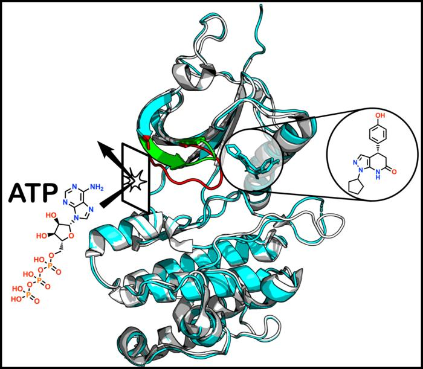
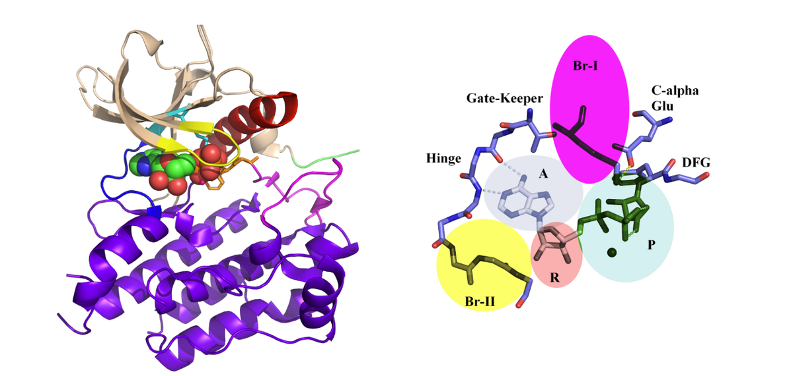
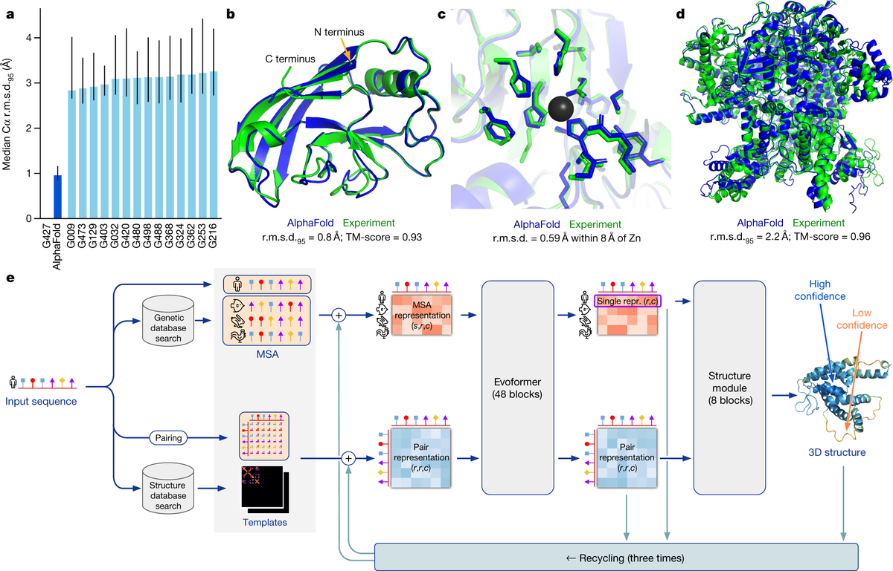

# AI Knew the Shapes It Had Seen; Experiment Opened the One It Hadn

_AlphaFold2/3 and Boltz-2 all missed PKMYT1_

## Executive Summary

> [!callout]
> A research team at the Icahn School of Medicine at Mount Sinai has found a drug-binding site no one had seen before in the cancer target protein PKMYT1. What makes the study, published in JACS on June 2, 2026, interesting is less the discovery itself than who missed it. The latest AI prediction tools — AlphaFold2 and AlphaFold3, Boltz-2, and even molecular dynamics simulation — were all brought to bear, and not one of them picked out this binding site. This piece looks at what that blank space means through the lens of data.

> Avner Schlessinger, the professor who led the work, put it this way: "AI was very accurate at predicting protein shapes we already knew, but it missed the entirely unexpected binding pocket that only experiment could reveal." The site exists only briefly, opening atop the protein's dynamic, ever-shifting shape. Since that form was absent from the training data, it is almost unsurprising that a model strong at reproducing learned shapes could not reach it.

> In the end, what opened the pocket was measured data — X-ray crystallography. Predicted data and measured data are not the same data. One reproduces a pattern the model already knows; the other carries a signal drawn from reality for the first time. Where the boundary of discovery is drawn in drug development is exactly what this one small pocket reveals.

### Key Figures

Three numbers compress the discovery: the count of AI tools that missed the new binding site, the scale of human kinases that share a similar ATP site and make selectivity hard, and the size of the chemical change that moved the binding site somewhere else entirely.

Source: [Icahn School of Medicine at Mount Sinai (2026)](https://www.mountsinai.org/about/newsroom/2026/scientists-uncover-hidden-drug-binding-pocket-in-cancer-protein-highlighting-the-power-and-limitations-of-ai-drug-discovery)

<!-- stat-card -->
**All 4** — AI tools that missed the new pocket — AlphaFold2/3, Boltz-2, molecular dynamics

<!-- stat-card -->
**500+** — kinases with a similar ATP site — the selectivity problem of the old strategy

<!-- stat-card -->
**1 change** — chemical tweak that switched the binding site — hidden pocket → ordinary ATP site

*▲ PKMYT1 protein with its newly found allosteric binding site (green-highlighted region) — the hidden pocket that sits apart from the conventional ATP site and that no AI tool predicted. Inset circle: chemical structure of the drug molecule that binds in this pocket. | Source: [EurekAlert! / AAAS (2026)](https://www.eurekalert.org/news-releases/1130589)*

## An ATP Site Too Alike

PKMYT1 is a kinase protein that helps regulate how cells grow and divide. In cancer, that regulation goes awry, so there is hope that blocking PKMYT1 could halt a cancer cell's runaway growth. That is why it has long been counted among the promising targets for drug development.

The problem is where to block it. Until now, most kinase inhibitors have aimed at the seat where ATP sits. But there are more than 500 human kinases, and their ATP-binding sites look very much alike. That means a drug aimed at one site easily latches onto the wrong kinase. Hitting only the intended target is hard, and side effects and poor selectivity follow.

So researchers have long wished for an allosteric site — a spot other than the ATP seat where a drug can bind and tune the protein's function. If that site has a shape unique to PKMYT1, a drug could aim precisely at this protein alone without touching other kinases. That is exactly the kind of site this study found.

> [!callout]
> The crux is that this allosteric pocket is not a fixed structure. It reveals itself only briefly, atop the protein's dynamic, ever-shifting form — a pocket that stays closed most of the time. The chance to design a precise drug was there, but that chance opened only in the moments the protein was in motion.

*▲ ATP-binding pocket of cKIT kinase (PDB: 1PKG). The conserved sub-regions on the right — Hinge, Gate-Keeper, DFG, and others — are shared across more than 500 human kinases, which is the root cause of the selectivity problem for conventional kinase inhibitors. | Source: [Wikimedia Commons, CC BY-SA 4.0](https://commons.wikimedia.org/wiki/File:Kinase_active_001.png)*

## What AI Got Right and What It Missed

The team left no recent tool unused. They ran AlphaFold2, which has become synonymous with protein structure prediction, its successor AlphaFold3, and the newly prominent Boltz-2, and they also ran molecular dynamics calculations that simulate how a protein moves. The results split along a clear line. The already-known shape of PKMYT1 was reproduced well, but the hidden allosteric pocket was predicted by none of the tools.

The person who pointed out this limit came from the side that has pushed AI drug discovery hardest. Avner Schlessinger, who led the study, directs Mount Sinai's center for AI-based small-molecule drug discovery. Coming from a researcher as well positioned as anyone to trust AI prediction, his plain admission of the tool's blank space makes the assessment that follows land harder.

"AI was very accurate at predicting protein shapes we already knew. But it missed the entirely unexpected binding pocket that we could uncover only through experiment."
                        — Avner Schlessinger, Icahn School of Medicine at Mount Sinai

Why did this happen? AlphaFold-family models learn from protein structures that have already been solved, inferring with precision how a similar sequence will fold. Within the space of shapes they have learned, they are remarkably accurate. But this pocket appears only while the protein is moving — a form that effectively did not exist in the training data. Asking a model to produce a shape it has never seen is the same as asking it to imagine the world outside the patterns it holds.

Just how sensitive this protein is became clearer during the discovery itself. The team observed that a single tiny chemical change was enough to move the drug molecule away from the hidden pocket and onto the ordinary ATP-binding site. The very location of binding flipped wholesale with a slight difference. For something happening on so narrow a margin, a prediction model good at reproducing static, average structures is hard-pressed to catch it in advance.

*▲ AlphaFold2 performance and architecture (Jumper et al., 2021, Nature). Panels b–d compare predicted structures (blue) with experimental ones (green) — on shapes present in the training data, the match is striking. The pocket in the PKMYT1 study was absent from that data. | Source: [Wikimedia Commons, CC BY 4.0](https://commons.wikimedia.org/wiki/File:AlphaFold_2.png)*

## Experiment Opened the Pocket

What actually opened the pocket was X-ray crystallography — a measurement technique that looks directly, at the atomic level, at where a molecule binds to a protein. Building on AlphaFold2's structure prediction, the team first narrowed the field of candidate compounds through virtual screening, then confirmed the real binding structure with X-ray crystallography and validated it with biochemical and cellular experiments. AI helped with the search, but what proved the new site existed was the experimental data.

*▲ Protein crystals used in X-ray crystallography. Shining X-rays through these crystals and analyzing the diffraction pattern determines the protein's three-dimensional structure at atomic resolution — the technique that revealed PKMYT1's hidden pocket. | Source: [CSIRO / Wikimedia Commons, CC BY 3.0](https://commons.wikimedia.org/wiki/File:CSIRO_ScienceImage_296_Protein_Crystals_Use_in_XRay_Crystallography.jpg)*

The meaning of this division of labor matters. AI prediction is strong at sweeping quickly through the space of structures we already know and pointing to the likeliest spots. Experiment, by contrast, pries open the space of structures no one has ever seen. The two are not rivals; they do different kinds of work. This study is a case that drew that boundary line in sharp relief.

Michael Lazarus, a co-investigator, says the discovery is a fresh reminder of why experimental validation remains essential. However refined a model becomes, the region it never learned stays empty regardless of the model's confidence. That blank is filled not by a bigger model, but only by data that measured reality directly.

"A very small chemical change moved the molecule from this hidden pocket to a much more conventional mode of binding."
                        — Michael Lazarus, Icahn School of Medicine at Mount Sinai

## Predicted Data vs. Measured Data

Put this story into the language of data and it shrinks to a single sentence. Predicted data and measured data are not the same data. The structure AlphaFold returns is the result of reproducing a learned pattern; the structure X-ray crystallography returns is a measurement drawn from reality for the first time. Both wear the same label, "the protein's structure," but the nature of the trust inside each is different.

A model fills in the most plausible answer within the distribution it learned. So it is strong on known shapes and fills blanks with confidence. The trouble is that the same confidence can look just as high outside the training distribution. Faced with a shape absent from its data, as this pocket was, the model's silence did not mean "there is nothing here" but "I have never seen this." Fail to tell the two apart, and you mistake a blank for a discovery.

That is why the boundary of discovery is drawn not by the size of the model but by the kind and quality of the data. What was measured and fed into training, and whether that measurement captured only the protein's static average or its dynamic moments as well, decides the region a model can reach. It is not a bigger model but better-measured data that opens new ground.

> [!callout]
> **Editor's Note.** This is the point where Pebblous's talk of data quality connects. What fills the blanks a model cannot confidently complete is, in the end, measured data drawn from reality. Telling apart the region where prediction can be trusted from the region that needs measurement — that boundary is exactly what this discovery showed on the front lines of drug development.

AI was strong on the shapes it knew, and only experiment opened the pocket it did not. The next time a model falls silent before a blank, it is worth asking again whether that silence means "none" or "never seen." What answers that question is not a bigger model, but more honestly measured data. Thank you for reading to the end.

**Pebblous Data Communication Team**  
June 19, 2026

## References

### R.1. Academic Papers

- 1.Herrington, N. B., Khamrui, S., Zhao, Y., Lansiquot, C., Wu, R., Pandey, G., Lazarus, M. B., & Schlessinger, A. (2026). "[Allosteric Inhibition of PKMYT1 Induces a Unique, Inactive ATP Binding Site Conformation](https://doi.org/10.1021/jacs.6c05178)." Journal of the American Chemical Society. DOI: 10.1021/jacs.6c05178

### R.2. Press & Industry

- 2.Icahn School of Medicine at Mount Sinai. (2026). "[Scientists Uncover Hidden Drug-Binding Pocket in Cancer Protein, Highlighting the Power and Limitations of AI Drug Discovery](https://www.mountsinai.org/about/newsroom/2026/scientists-uncover-hidden-drug-binding-pocket-in-cancer-protein-highlighting-the-power-and-limitations-of-ai-drug-discovery)." [Press release].
- 3.EurekAlert! (2026). "[Scientists uncover hidden drug-binding pocket in cancer protein](https://www.eurekalert.org/news-releases/1130589)." AAAS.
- 4.Technology Networks. (2026). "[Hidden Drug Target in Cancer Protein Reveals Limits of AI Drug Discovery](https://www.technologynetworks.com/informatics/news/hidden-drug-target-in-cancer-protein-reveals-limits-of-ai-drug-discovery-413290)."
