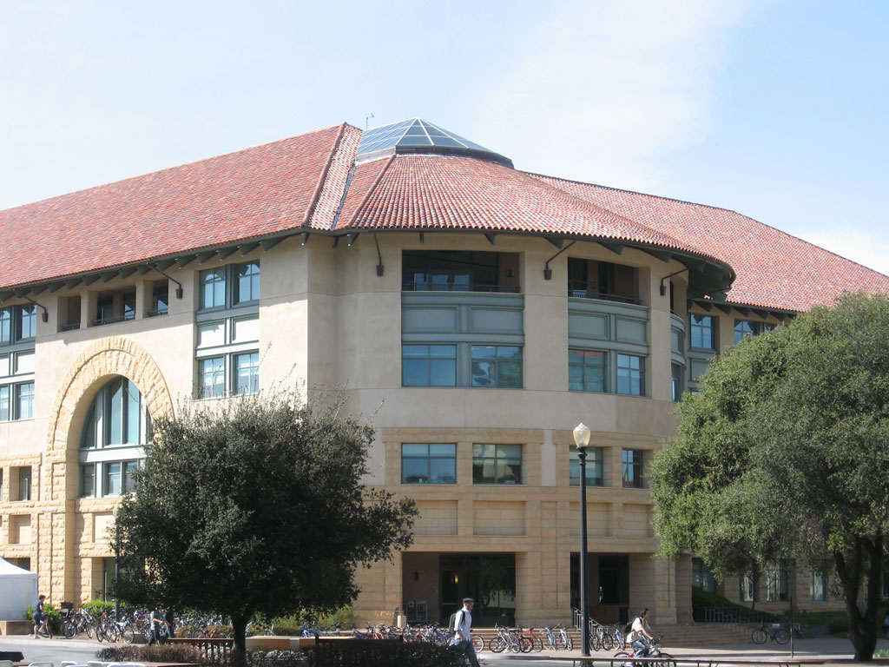

# The AI Entry-Level Hiring Squeeze Most Believe In, Few Have Felt

_62% of workers believe AI is cutting junior hiring while only 31% have felt it, and Stanford_

## Executive Summary

> [!callout]
> The belief that AI is cutting entry-level hiring is everywhere in the labor market. When Indeed Flex asked roughly 2,000 workers in the US and UK, 62% said so. Yet only 31% said they had personally seen that change in their own field. Belief runs exactly twice as far as experience.

> That does not mean the squeeze is imaginary. When Stanford analyzed data from the largest US payroll processor, employment among 22-to-25-year-old early-career workers in the most AI-exposed jobs had fallen 13 to 16%. A survey measures what people feel; a payroll ledger measures how many were actually hired. When the two gauges disagree, the one that moves policy and hiring first is usually the louder, more alarming feeling.

> What this moment really calls for is reading emotion data and measured data side by side. Whether the same AI shrinks junior hiring in one place or grows it in another comes down to a single axis: automation versus augmentation.

<!-- stat-card -->
**62%** — Workers who believe it is shrinking — Indeed Flex survey (2,000 US·UK)

<!-- stat-card -->
**31%** — Workers who actually experienced it — Half the level of belief

<!-- stat-card -->
**13-16%** — Drop in young hiring in AI-exposed jobs — Stanford payroll data (ages 22-25)

<!-- stat-card -->
**65%** — Firms hiring the same or more juniors this year — Hiring plans stay steady

## 62% and 31%: Two Numbers in One Survey

In July 2026, the staffing platform Indeed Flex asked roughly 2,000 workers in the US and UK how AI is changing hiring ([PR Newswire](https://www.morningstar.com/news/pr-newswire/20260721cg08350/nearly-two-thirds-of-workers-believe-ai-is-reducing-entry-level-hiring-according-to-indeed-flex-survey)). 62% said "AI is replacing routine tasks, so companies are cutting entry-level hiring." Yet only 31% said they had personally experienced that change in their own field. The number who believe is twice the number who have seen it.

Other numbers in the same survey are just as telling. Asked about the biggest obstacles in the job market, respondents still named pay (30%) and competition (25%) first, with AI ranking below both. 34% said AI had made them less confident about competing in today's labor market. What these figures capture is not the actual hiring ledger but the temperature of people's anxiety. What the survey measures is feeling, and fear usually runs ahead of the statistics.

Put the survey that measures feeling next to the payroll ledger that measures actual hiring, and the gap becomes visible. The left side of the figure below is the survey perception we just saw; the right side is the payroll ledger we examine later. First see how differently the two describe the same phenomenon of "AI and entry-level hiring."

## Inside Companies, the Story Sounds Different

Employer-side surveys have their own texture. [HR Dive](https://www.hrdive.com/news/new-grads-have-to-compete-with-ai-for-entry-level-roles-hiring/825810/) summarized a ResumeTemplates survey of 1,000 hiring managers and a joint Cognizant-Pearson study: 48% said they would rather invest in AI tools than hire and train new college graduates, and 55% had already shifted part of their entry-level hiring budget to AI tools.

More striking is the optimism the same managers hold. In this research, 94% of HR leaders said AI will create new entry-level roles within five years, and 96% expected the junior role to shift toward managing and supervising AI. The hand moving budget to AI now and the mouth promising to reopen junior roles later coexist inside a single organization.

*▲ A commencement ceremony packed with new graduates. Employer budgets are shifting toward AI, but survey data shows hiring plans themselves have not shrunk nearly as much | Source: [Wikimedia Commons (CC BY 2.0)](https://commons.wikimedia.org/wiki/File:College_graduate_students.jpg)*

And in the same research, 65% said they plan to hire the same number of new graduates as last year, or more, this year. Budget is shifting to AI, but the hiring door has not closed. What's more, companies' biggest complaint about new hires was not AI but the fundamentals. Work ethic, basic document comprehension, and professional email writing came up more often than AI. Even the employer voice sits at a distance from the simple story that "AI is eliminating entry-level jobs."

## But the Payroll Data Really Did Move

Up to this point everything is survey data, that is, about what people feel and plan. What does the actual hiring ledger say? Brynjolfsson and colleagues at the Stanford Digital Economy Lab analyzed individual-level data from ADP, the largest US payroll processor. The paper is titled ["Canaries in the Coal Mine."](https://digitaleconomy.stanford.edu/publication/canaries-in-the-coal-mine-six-facts-about-the-recent-employment-effects-of-artificial-intelligence/)

Since generative AI spread in earnest in late 2022, employment of 22-to-25-year-old early-career workers in the most AI-exposed jobs fell by a relative 13 to 16%. Among software developers alone, the drop reaches about 20%. By contrast, employment of senior workers in the same jobs, and of workers in jobs with low AI exposure, stayed stable. The adjustment came through hiring less, not through cutting wages. Fear had simply run ahead, but it was not without grounds.

*▲ Stanford's Gates Computer Science Building. The "Canaries in the Coal Mine" study cited above comes from the Stanford Digital Economy Lab's analysis of ADP payroll data | Source: [Wikimedia Commons (Public Domain)](https://commons.wikimedia.org/wiki/File:StanfordGatesCS.jpg)*

> [!callout]
> That said, even this measured data leaves causation in dispute. Some researchers argue the drop in young employment may not be AI's doing but an artifact of a cyclical hiring slowdown overlapping with age-cohort effects. Being measured does not make the interpretation automatically true. That is precisely why the numbers need to be read apart.

## Why the Same AI Yields Opposite Outcomes

So why does the same AI shrink junior hiring at one company and grow it at another? The fork lies in whether AI replaces human work or assists it. Used to replace (automation), it lowers the number of juniors needed for execution work; used to assist (augmentation), juniors become productive faster, so hiring holds or rises.
