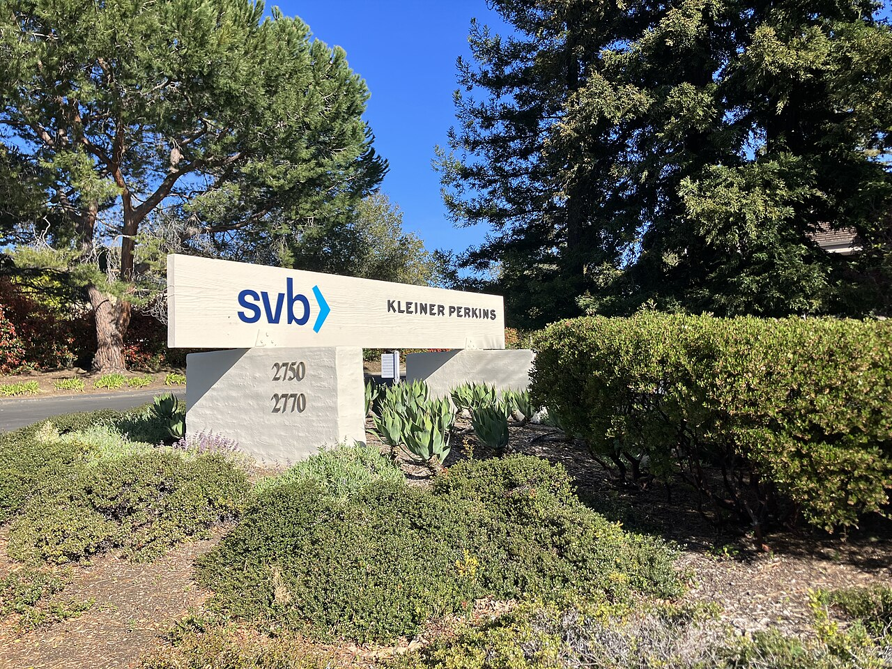

# Pre-ChatGPT Unicorns Lost 68% of Their Valuation

_A survival playbook for startups in an era when AI-native status decides who gets funded_

## Executive Summary

> [!callout]
> As of June 2026, more than 220 U.S. startups once celebrated as "unicorns" have slipped below the $1 billion valuation mark. Of the 857 U.S. unicorns tracked by PitchBook, roughly half have gone more than three years without raising new capital, frozen in place. This article follows the data to ask why companies founded before ChatGPT lost their value all at once, and how that same shift is now reaching Korea's startup ecosystem.

> The most painful number belongs to 2021. Companies whose last round closed that year saw their valuations fall by 68% on average. Prices set in an era of easy money simply collapsed when measured against the new standards of the AI age. Not everyone fell, though. Over the same period, AI-native companies were valued at 10 to 50 times revenue, tracing the opposite curve.

> The investor's question has grown simple: "Is this company AI-native, or not?" For founders, it is a brutal but clear test. How did that test come to be, and what road is left for the companies locked out of down rounds, IPOs, and acquisitions alike?

### Key Figures

Source: [CNBC · PitchBook (2026-06-01)](https://www.cnbc.com/2026/06/01/ai-startup-valuations-pre-chatgpt.html)

<!-- stat-card -->
**220+** — Fallen Unicorns — Former unicorns whose valuation dropped below $1B

<!-- stat-card -->
**−68%** — The Cost of 2021 — Average valuation drop for firms that raised last in 2021

<!-- stat-card -->
**75** — SaaS Hit Hardest — The most-hit sector, twice the count of second-place fintech

<!-- stat-card -->
**81%** — AI Concentration — Share of global VC capital going to AI firms in Q1 2026

## Half the Unicorns Have Stalled

The word "unicorn" once carried the romance of rarity. A private startup valued above $1 billion was, by itself, a symbol of success. Yet the data from 2026 paints a different picture. PitchBook counts as many as 857 U.S. unicorns, but nearly half of them, roughly 428, have not raised a single dollar of new capital in more than three years. Their valuations live on paper while no cash comes in; they are, in effect, companies at a standstill.

*▲ Sand Hill Road in Menlo Park, long the center of venture capital. The capital that once looked safest moved the fastest. | Source: [Wikimedia Commons](https://commons.wikimedia.org/wiki/File:SVB_Kleiner_Perkins_Menlo_Park_April_2023.jpg)*

Among them, more than 220 have dropped below the $1 billion line. The industry calls them "fallen unicorns." How far they fell depended on when they last raised. Firms that caught the last train in 2021, when money was most abundant, lost 68% of their value on average; those from 2022 fell 52%. The more richly they were priced, the further they dropped.

What matters is that the damage clustered in one place. Sort the fallen unicorns by sector, and enterprise SaaS leads overwhelmingly with 75 companies, twice the count of second-place fintech. "Software that makes money on subscriptions" was once seen as the safest place to invest. Today it stands on the most precarious ground.

Familiar names made the list, too. Calendar tool Calendly, beauty brand Glossier, and wealth-management fintech Betterment, names that once defined an era, became subjects of revaluation. Among consumer brands, D2C stars like Savage X Fenty, Rothy's, and Brooklinen wobbled as well. The problem was not any single company's mistake. The market's standard itself had changed.

Immad Akhund, CEO of fintech startup Mercury, captured what the list has in common in a single sentence. "For a lot of these companies, it's not just that their cost structure is from a pre-AI era; the product itself is from a pre-AI era." Tightening the belt to run operations leaner will not solve that. The moment AI does the job a product used to do, and does it better, the company's reason for existing begins to shake.

> [!callout]
> The drop in unicorn valuations cannot be explained by recession or interest rates alone, because over the same period more money than ever poured into AI companies. The money did not disappear; it moved. Understanding the direction of that move is where this article begins.

## SaaS Loses Its Reason to Exist

Why was SaaS, of all things, shaken the hardest? The value of traditional SaaS came from a model: "sell software that automates a particular task, priced by the seat, one per user." More employees meant more licenses and more revenue. But as generative AI began handling the task itself, the intermediate layer wedged between software and user is disappearing.

David Zhu, a former DoorDash engineering lead, put it bluntly but clearly. "Workflow-based enterprise SaaS companies will be disrupted or disappear within the next ten years." If software merely transcribes a fixed set of work steps into screens and buttons, its reason for being weakens the moment AI performs those steps whole.

Real cases bear this out. As so-called "vibe coding" tools have emerged, even non-developer employees now build small apps tailored to their own work. The reason to subscribe to an outside SaaS shrinks. The premise of seat-based pricing, the assumption that every person needs a tool, is being shaken.

### 2.1. Legal and Marketing, the First to Be Touched

Legal tech is a prime example. As traditional legal-research and document-generation startups contracted, AI-based legal tool Harvey raised $300 million at a $3 billion valuation. The promise that AI could handle in hours, at a tenth of the cost, a review that took lawyers days drew the capital in. Marketing technology (MarTech) is similar. AI-based solutions are rapidly taking over the ground that legacy marketing-automation tools used to hold.

Samir Kaul of Khosla Ventures summed up the nature of the change in terms of headcount efficiency. "Fifty engineers do what 500 used to do five years ago." If the people needed to produce the same result have dropped to a tenth, the price tag on software, set in proportion to headcount, cannot help but shake along with it.

> [!callout]
> SaaS is collapsing not because the products got worse. It is because AI now does the work those products used to do, faster and cheaper, opening a path to the result without passing through the software at all. When the basis for the value disappears, the price follows it.

## The One Thing Investors Now Watch

From an investor's vantage, the market has split in two. On one side are AI-native companies growing at unprecedented speed; on the other are the rest, crossing a funding desert. SaaStr's Jason Lemkin called it a "fundamentally bifurcated market." Get caught in between, and raising money grows steadily harder.

The numbers show the gap. AI-native startups carry enterprise value-to-revenue (EV/Revenue) multiples of 10 to 50 times, with a median around 25 times. Category leaders sometimes exceed 100 times. Traditional SaaS, by contrast, sits at 2.5 to 7 times today. The 2021 peak was 6.7 times, so the valuations AI firms now command run several times the old SaaS boom.

Efficiency metrics justify the gap. The companies Bessemer calls "AI Supernovas" generate $1.13 million in annual recurring revenue (ARR) per employee, four to five times the traditional SaaS average. The $100 million ARR that 2010s SaaS reached by mobilizing 300 to 500 employees, AI-native companies hit with fewer than 100. AI coding startup Cognition won a $26 billion valuation on the strength of a product built entirely with AI.

The concentration of capital is even more extreme. In the first quarter of 2026, 81% of global VC funding flowed to AI companies, and within that, the top three deals (OpenAI, Anthropic, xAI) took 67% of the total. Even among companies wearing the AI label, the winners are sorted out once again.

> [!callout]
> What changed is the investor's gaze. Where a story about "how we plan to use AI" once earned points, the question now is "whether AI is actually built into this company's assets." Real numbers that AI produces, gross margin, retention, compute economics, have become the basis for valuation. Not a promise, but a structure.

## The Trap of Closed Exits

A company whose value has fallen can buy time if it raises fresh capital. The problem is that the path is blocked. Companies founded before ChatGPT find themselves with three doors shut at once.

The first door is the down round, raising money at a lower valuation than before. In that case, the stakes of existing investors and employees are heavily diluted. When the value of employees' stock options collapses, talent walks out the door. So many companies, trying to avoid a down round, end up putting off any fundraising attempt at all.

The second door is the IPO. What the public market wants to see right now is an AI growth story. A company that cannot present that narrative will struggle to get a foot in the IPO window. The third door, acquisition, is narrow too. There are few buyers willing to pay full price for a company with no compelling AI assets. In the end, a fire-sale acquisition or a shutdown remains as the realistic exit.

*▲ The Nasdaq MarketSite. What the public market wants to see right now is an AI growth story. | Source: [Wikimedia Commons](https://commons.wikimedia.org/wiki/File:Nasdaq_MarketSite_(51494550508).jpg)*

The employment figures reveal that pressure. Cumulative tech-sector layoffs in the U.S. reached 123,653 in 2026, up 65% from the same period a year earlier. In the single month of May, 38,242 people lost their jobs, the highest in two years. The leading reason cited for layoffs was AI, for the third month running. Meta described cuts of about 8,000 as a decision tied directly to its AI infrastructure investment.

> [!callout]
> For a company with three doors shut, the remaining option comes down to one: turn toward becoming AI-native. But that turn requires engineering talent and enough capital to weather it. The sharpest pain of this trap is that the companies who need it most are the ones short of both.

## The Wave Reaches Korea

This is not a story about the United States alone. A shift of the same grain is appearing in Korea's early-stage startup ecosystem. The number of funding deals for early-stage startups under three years old fell from 749 to 327, more than cut in half. It has become that much harder for a freshly launched company to raise its first round.

*▲ Pangyo Techno Valley. The same grain of concentration seen in the U.S. is spreading through Korea's funding climate. | Source: [Wikimedia Commons](https://commons.wikimedia.org/wiki/File:Pangyo_Techno_Valley.jpg)*

The interesting part is the amount. Heading into 2026, the deal count fell 14% year over year, yet the total investment amount rose 96%. The money has not disappeared; it has concentrated in a small number of AI and large companies. The capital concentration seen in the U.S. is replaying in the same shape in Korea.

Korea's AI startups, however, are still thin on stamina. The average R&D spend of a domestic AI startup is 590 million won, about a third of the all-industry average, and a substantial part of the core R&D budget depends on government subsidies. The fact that more than 80% of talent and capital is clustered in the capital region is cited as another structural weakness. The will to turn AI-native is there, but the foundation to support that turn is not yet sufficient.

On the ground, cooler voices are heard. The perception is that, as capital tilts toward AI, the technology gap between Korea and Silicon Valley has not narrowed but widened. While U.S. startups, backed by abundant capital and talent, accelerate their AI-native turn, domestic companies on a thin foundation lack the very capacity to attempt the same shift. A gap widens not when the one chasing stands still, but when the one in front runs faster.

> [!callout]
> For Korean founders, this data cuts both ways. It is the pressure of a funding environment reorganizing rapidly around AI, and at the same time the opportunity of many seats still left empty. The question is whether you are ready to take them. And the starting point of that readiness, more often than not, is data.

## Two Roads to Survival

So what should a company founded before ChatGPT do? Pull the data and the cases together, and the realistic paths converge into two. They look like opposite directions, but both share the same root: putting "what AI cannot easily replicate" at the center.

### 6.1. Rebuild AI-Native

The first is to keep your existing team, customers, and domain knowledge intact while redesigning the product as AI-native from the ground up. This is not bolting AI onto an existing product as one more feature; it is redrawing the very way the product works on the premise of AI. Having customers and data already in hand is a clear advantage over a fresh startup beginning from a blank page. The precondition, though, is engineering capacity and capital enough to weather the transition.

### 6.2. Defend the Territory AI Cannot Reach

The second is to fortify a narrow, deep domain that AI cannot easily imitate. Vertical markets bound by heavy regulation, dependent on deep trust relationships, or requiring long-accumulated domain expertise belong here. Unlike the general work that general-purpose AI is rapidly eroding, in these areas the barrier to entry itself becomes a shield. It is not flashy, but it is the most solid survival strategy.

Whichever road you take, one common premise holds. To go AI-native, you must in the end be able to train models on your own data. If training data and fine-tuning data are tangled, the AI pivot only spins in place. Now that the market's standard has shifted from "AI story" to "AI asset," at the bottom of that asset lies well-ordered data.

> [!callout]
> Editor's Note

> Beneath the polarization this article traces lies one shared variable: data quality. Whether a company is turning AI-native or defending a narrow domain, to make a model its own it must first have its training and fine-tuning data in order. That is why Pebblous focuses on AI-Ready Data and data-quality diagnostics. In an era when the market has begun to ask about "AI assets," building the foundation that holds those assets up is where we stand.

## References

### Industry & Press

- 1.CNBC. (2026). "[AI is crushing startup valuations for pre-ChatGPT firms](https://www.cnbc.com/2026/06/01/ai-startup-valuations-pre-chatgpt.html)." CNBC, 2026-06-01.
- 2.The Next Web. (2026). "[AI crushes startup valuations for pre-ChatGPT companies](https://thenextweb.com/news/ai-startup-valuations-pre-chatgpt-fallen-unicorns)." TNW.
- 3.Business Model Analyst. (2026). "[AI Boom Wipes Out 220+ Unicorns Built Before ChatGPT](https://businessmodelanalyst.com/ai-boom-fallen-unicorns-pre-chatgpt-startups/)."
- 4.Tom's Hardware. (2026). "[Tech sector cut US jobs by 38,242 in May 2026](https://www.tomshardware.com/tech-industry/artificial-intelligence/tech-sector-cut-us-jobs-by-38242-in-may)."
- 5.AI Times. (2026). "[Nearly half of domestic AI startups expected to fold within three years](https://www.aitimes.com/news/articleView.html?idxno=204609)." (in Korean)

### Data & Research

- 6.PitchBook. (2026). "[Unicorn startup tracker](https://pitchbook.com/news/articles/unicorn-startups-list-trends)." Data source.
- 7.Qubit Capital. (2026). "[AI Startup Valuation Multiples: 10x–50x Range](https://qubit.capital/blog/ai-startup-valuation-multiples)."
- 8.Eqvista. (2026). "[AI vs SaaS Valuation Multiples](https://eqvista.com/ai-vs-saas-valuation-multiples/)."
- 9.Menlo Ventures. (2025). "[2025 State of Generative AI in the Enterprise](https://menlovc.com/perspective/2025-the-state-of-generative-ai-in-the-enterprise/)."
- 10.Carta. (2025). "[How the SaaS fundraising scene is shifting in the age of AI](https://carta.com/data/saas-industry-spotlight-Q3-2025/)." Q3 2025.
- 11.THE VC. (2026). "[Korea Startup Investment Statistics, April 2026](https://thevc.kr/discussions/korea_startup_funding_2026_04)." (in Korean)
