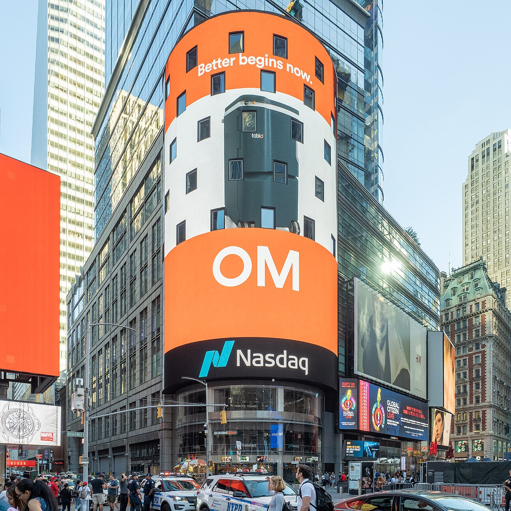
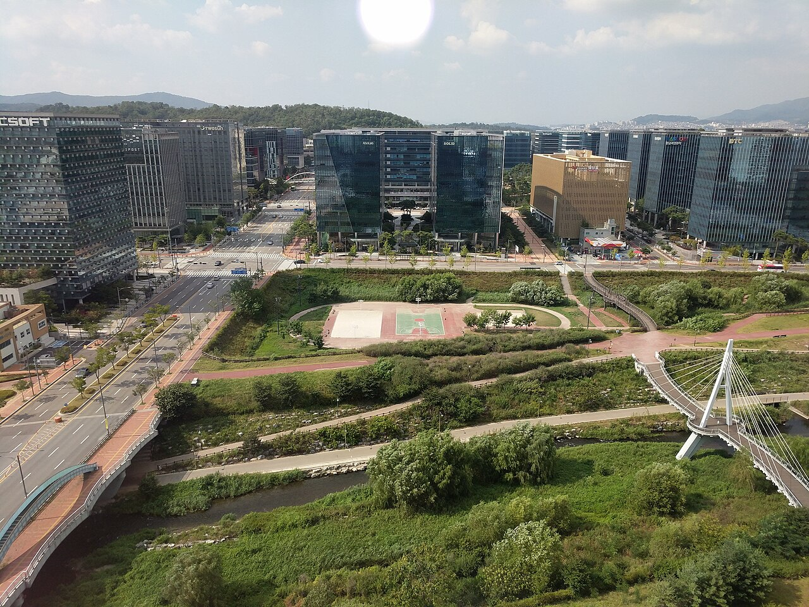

# 챗GPT 이전 유니콘들이 밸류의 68%를 잃었다

_AI 네이티브 여부로 투자가 결정되는 시대의 스타트업 생존 전략_

## Executive Summary

> [!callout]
> 2026년 6월, 한때 "유니콘"으로 불리던 미국 스타트업 220곳 이상이 기업 가치 10억 달러 선 아래로 내려앉았다. PitchBook이 집계한 미국 유니콘 857곳 가운데 절반가량은 3년 넘게 새 투자를 받지 못한 채 멈춰 서 있다. 이 글은 ChatGPT 이전에 세워진 회사들이 왜 이렇게 한꺼번에 가치를 잃었는지, 그리고 그 흐름이 한국 창업 생태계까지 어떻게 번지고 있는지를 데이터로 따라간다.

> 가장 아픈 숫자는 2021년이다. 그 해 마지막 투자를 받은 기업들의 가치는 평균 68% 빠졌다. 자금을 흥청망청 받던 시기에 비싸게 매겨진 몸값이 AI 시대의 잣대 앞에서 무너진 결과다. 다만 모두가 무너진 건 아니다. 같은 시기 AI 네이티브 기업은 매출 대비 10배에서 50배의 가치를 인정받으며 정반대 곡선을 그렸다.

> 투자자의 질문은 단순해졌다. "이 회사는 AI 네이티브인가, 아닌가." 창업자에게는 잔인하지만 명료한 기준이다. 그 기준은 어떻게 만들어졌고, 다운라운드도 IPO도 인수도 막힌 회사들에게는 어떤 길이 남아 있을까.

### 주요 수치

출처: [CNBC · PitchBook (2026-06-01)](https://www.cnbc.com/2026/06/01/ai-startup-valuations-pre-chatgpt.html)

<!-- stat-card -->
**220+** — 폴른 유니콘 — 기업 가치가 $1B 아래로 추락한 전 유니콘

<!-- stat-card -->
**−68%** — 2021년 막차의 대가 — 2021년 마지막 라운드 기업의 평균 밸류 하락

<!-- stat-card -->
**75개** — SaaS 직격 — 가장 많이 무너진 섹터, 2위 핀테크의 두 배

<!-- stat-card -->
**81%** — AI 쏠림 — Q1 2026 전 세계 VC 자금 중 AI 기업 비중

## 유니콘의 절반이 멈췄다

유니콘이라는 말에는 희소함의 낭만이 있었다. 기업 가치 10억 달러를 넘긴 비상장 스타트업은 그 자체로 성공의 상징이었다. 그런데 2026년의 데이터는 다른 풍경을 보여준다. PitchBook 집계로 미국 유니콘은 857곳까지 늘었지만, 그중 절반에 가까운 약 428곳은 3년 넘게 새로운 자금을 한 푼도 받지 못했다. 가치는 장부에만 남아 있고 현금은 들어오지 않는, 사실상 정지 상태의 회사들이다.

*▲ 벤처 자금의 중심지였던 멘로파크 샌드힐로드. 한때 가장 안전해 보이던 자본이 가장 빠르게 옮겨 갔다. | Source: [Wikimedia Commons](https://commons.wikimedia.org/wiki/File:SVB_Kleiner_Perkins_Menlo_Park_April_2023.jpg)*

그중에서도 220곳 이상은 기업 가치가 10억 달러 선 아래로 내려갔다. 업계는 이들을 "폴른 유니콘(fallen unicorn)"이라 부른다. 마지막으로 투자받은 시점이 언제냐에 따라 낙폭이 갈렸다. 자금이 가장 풍부했던 2021년에 막차를 탄 기업들은 평균 68%가 빠졌고, 2022년 기업들도 52% 줄었다. 비싸게 매겨질수록 더 멀리 떨어진 셈이다.

피해가 한 곳에 몰렸다는 점이 중요하다. 폴른 유니콘을 섹터별로 나눠 보면 엔터프라이즈 SaaS가 75곳으로 압도적 1위다. 2위인 핀테크의 두 배에 이른다. 한때 "구독으로 돈을 버는 소프트웨어"는 가장 안전한 투자처로 여겨졌지만, 지금은 가장 위태로운 자리에 서 있다.

이름이 알려진 회사들도 명단에 올랐다. 일정 관리 도구 Calendly, 뷰티 브랜드 Glossier, 자산관리 핀테크 Betterment처럼 한 시대를 풍미한 이름들이 가치 재평가의 대상이 됐다. 소비자 브랜드 쪽에서는 Savage X Fenty, Rothy's, Brooklinen 같은 D2C 스타들도 흔들렸다. 문제는 개별 회사의 실수가 아니었다. 시장의 기준 자체가 바뀐 것이다.

핀테크 스타트업 Mercury의 CEO 임마드 아쿤드는 이 명단의 공통점을 한 문장으로 짚었다. "이 회사들 상당수는 비용 구조만 AI 이전 시대의 것이 아니라, 제품 자체가 AI 이전 시대의 것이다." 허리띠를 졸라매 운영을 효율화한다고 풀릴 문제가 아니라는 뜻이다. 제품이 풀어주던 일을 AI가 더 잘 해내는 순간, 회사가 존재할 이유 자체가 흔들린다.

> [!callout]
> 유니콘의 가치 하락은 경기 침체나 금리 탓만으로 설명되지 않는다. 같은 기간 AI 기업으로는 사상 최대 자금이 몰렸기 때문이다. 돈이 사라진 게 아니라 옮겨 갔다. 그 이동의 방향을 이해하는 것이 이 글의 출발점이다.

## SaaS의 존재 이유가 지워진다

왜 하필 SaaS가 가장 크게 흔들렸을까. 전통적인 SaaS의 가치는 "특정 업무를 자동화하는 소프트웨어를, 사용자 수만큼 좌석(seat) 단위로 판다"는 모델에서 나왔다. 직원이 늘면 라이선스도 늘고 매출도 따라 늘었다. 그런데 생성형 AI가 그 업무 자체를 직접 처리하기 시작하면서, 소프트웨어와 사용자 사이에 끼어 있던 중간 단계가 사라지고 있다.

전 DoorDash 엔지니어링 책임자 David Zhu의 진단은 거칠지만 분명하다. "워크플로우 기반 엔터프라이즈 SaaS 회사들은 앞으로 10년 안에 파괴되거나 사라질 것이다." 정해진 업무 절차를 화면과 버튼으로 옮겨 놓는 소프트웨어라면, 그 절차를 AI가 통째로 수행하는 순간 존재 이유가 약해진다는 뜻이다.

실제 사례가 이를 뒷받침한다. 이른바 "바이브 코딩(vibe coding)" 도구가 등장하면서, 개발자가 아닌 직원도 자기 업무에 맞는 작은 앱을 직접 만들어 쓴다. 굳이 외부 SaaS를 구독할 이유가 줄어든다. 좌석 단위 과금 모델의 전제, 즉 "사람마다 도구가 필요하다"는 가정이 흔들리는 것이다.

### 2.1. 법률과 마케팅, 가장 먼저 닿은 곳

리걸테크가 대표적이다. 전통적인 법률 리서치·문서 생성 스타트업이 위축되는 사이, AI 기반 법률 도구 Harvey는 30억 달러 가치로 3억 달러를 조달했다. 변호사가 며칠 걸리던 검토를 AI가 몇 시간에, 그것도 10분의 1 비용으로 처리한다는 약속이 자금을 끌어들였다. 마케팅 기술(MarTech)도 비슷하다. 기존 마케팅 자동화 도구가 차지하던 자리를 AI 기반 솔루션이 빠르게 대체하고 있다.

Khosla Ventures의 Samir Kaul은 변화의 본질을 인력 효율로 요약했다. "엔지니어 50명이 5년 전 500명이 하던 일을 한다." 같은 결과를 내는 데 필요한 사람이 10분의 1로 줄었다면, 사람 수에 비례해 매기던 소프트웨어의 가격표도 함께 흔들릴 수밖에 없다.

> [!callout]
> SaaS가 무너지는 건 제품이 나빠져서가 아니다. AI가 그 제품이 대신해 주던 일을 더 싸고 빠르게 해내면서, 소프트웨어를 거치지 않고도 결과에 도달하는 길이 열렸기 때문이다. 가치의 근거가 사라지면 가격도 따라 사라진다.

## 투자자가 지금 보는 한 가지

투자자 입장에서 시장은 둘로 쪼개졌다. 한쪽에는 전례 없는 속도로 성장하는 AI 네이티브 기업이 있고, 다른 쪽에는 자금 사막을 건너는 나머지 회사들이 있다. SaaStr의 Jason Lemkin은 이를 "근본적으로 양분된 시장"이라 불렀다. 그 사이에 끼어 있으면 자금을 받기가 점점 어려워진다.

숫자가 격차를 보여준다. AI 네이티브 스타트업은 매출 대비 기업 가치(EV/Revenue) 배수가 10배에서 50배, 중앙값으로 25배 안팎이다. 카테고리를 선도하는 곳은 100배를 넘기도 한다. 반면 전통 SaaS는 현재 2.5배에서 7배에 머문다. 2021년 고점이 6.7배였으니, 지금 AI 기업이 받는 평가는 옛 SaaS 호황기의 몇 배에 달한다.

효율 지표가 이 격차를 정당화한다. Bessemer가 'AI 슈퍼노바'로 부르는 기업들은 직원 1인당 연간 반복 매출(ARR)이 113만 달러로, 전통 SaaS 평균의 네다섯 배다. 2010년대 SaaS가 직원 300~500명을 동원해 도달하던 1억 달러 ARR을, AI 네이티브 기업은 100명 미만으로 찍는다. AI 코딩 스타트업 Cognition은 AI만으로 개발한 제품을 앞세워 260억 달러 가치를 인정받았다.

자금의 쏠림은 더 극단적이다. 2026년 1분기 전 세계 VC 자금의 81%가 AI 기업으로 흘러갔고, 그중에서도 상위 세 건(OpenAI, Anthropic, xAI)이 전체의 67%를 가져갔다. AI라는 단어가 붙은 회사 사이에서도 승자가 다시 한번 갈리는 구조다.

> [!callout]
> 달라진 건 투자자의 시선이다. 예전에는 "AI를 어떻게 활용할 계획인가"라는 스토리만으로 점수를 얻었다면, 지금은 "AI가 이 회사의 자산에 실제로 박혀 있는가"를 본다. 총이익률, 고객 유지율, 컴퓨트 경제성처럼 AI가 만들어내는 실제 수치가 평가의 기준이 됐다. 약속이 아니라 구조다.

## 출구가 막힌 순환 함정

가치가 떨어진 회사라도 새 자금을 받으면 시간을 벌 수 있다. 문제는 그 길이 막혀 있다는 점이다. ChatGPT 이전에 창업한 회사들은 세 개의 문이 동시에 닫힌 상황에 놓여 있다.

첫 번째 문은 다운라운드다. 이전보다 낮은 가치로 투자받는 것인데, 이 경우 기존 투자자와 임직원의 지분이 크게 희석된다. 직원들이 들고 있던 스톡옵션의 가치가 무너지면 인재 이탈로 이어진다. 그래서 많은 회사가 다운라운드를 피하려다 아예 투자 시도 자체를 미룬다.

두 번째 문은 상장이다. 지금 공모 시장이 보고 싶어 하는 건 AI 성장 스토리다. 그 서사를 제시하지 못하는 회사는 IPO 창구에 명함을 내밀기 어렵다. 세 번째 문인 인수도 좁다. 매력적인 AI 자산이 없는 회사를 제값에 사 줄 곳은 드물다. 결국 헐값 인수나 폐업이 현실적인 출구로 남는다.

*▲ 나스닥 마켓사이트. 공모 시장이 보고 싶어 하는 건 AI 성장 스토리뿐이다. | Source: [Wikimedia Commons](https://commons.wikimedia.org/wiki/File:Nasdaq_MarketSite_(51494550508).jpg)*

고용 지표에 그 압력이 드러난다. 2026년 미국 기술 업종의 누적 해고는 12만 3,653명으로 전년 동기보다 65% 늘었다. 5월 한 달에만 3만 8,242명이 일자리를 잃어 2년 내 최고치를 기록했다. 해고 사유 1위는 석 달 연속 AI였다. Meta는 약 8,000명 감원을 AI 인프라 투자와 직접 연결된 결정이라고 설명했다.

> [!callout]
> 세 개의 문이 닫힌 회사에게 남은 선택지는 결국 하나다. AI 네이티브로 방향을 트는 것이다. 다만 그 전환에는 엔지니어링 인력과 버틸 수 있는 자금이 필요하다. 가장 절실한 회사일수록 그 두 가지가 부족하다는 것이 이 함정의 가장 아픈 지점이다.

## 한국에 닿은 파도

이 흐름은 미국만의 이야기가 아니다. 한국 초기 스타트업 생태계에도 같은 결의 변화가 나타난다. 업력 3년 이내 초기 단계 스타트업의 투자 건수는 749건에서 327건으로 절반 넘게 줄었다. 갓 시작한 회사가 첫 자금을 받기가 그만큼 어려워졌다는 뜻이다.

*▲ 판교 테크노밸리. 한국 스타트업의 자금 환경에도 미국과 같은 결의 쏠림이 번지고 있다. | Source: [Wikimedia Commons](https://commons.wikimedia.org/wiki/File:Pangyo_Techno_Valley.jpg)*

흥미로운 건 금액이다. 2026년 들어 투자 건수는 전년 대비 14% 줄었지만, 투자 금액은 오히려 96% 늘었다. 돈이 사라진 게 아니라, 적은 수의 AI·대형 기업에 집중됐다는 신호다. 미국에서 본 자금 쏠림이 한국에서도 같은 모양으로 재현되고 있다.

다만 한국 AI 스타트업의 체력은 아직 얇다. 국내 AI 스타트업의 평균 R&D 비용은 5.9억 원으로 전 산업 평균의 3분의 1 수준이고, 핵심 연구개발 재원의 상당 부분을 정부 보조금에 의존한다. 인력과 자본이 수도권에 80% 넘게 몰려 있다는 점도 구조적 취약성으로 꼽힌다. AI 네이티브로 전환하려는 의지는 있지만, 그 전환을 떠받칠 토대가 충분치 않은 상황이다.

현장에서는 더 냉정한 목소리도 나온다. 자금이 AI로 쏠리는 사이 한국과 실리콘밸리의 기술 격차가 좁혀지기는커녕 오히려 더 벌어졌다는 인식이다. 풍부한 자본과 인재를 등에 업은 미국 스타트업이 AI 네이티브 전환에 속도를 내는 동안, 토대가 얇은 국내 회사들은 같은 전환을 시도할 여력 자체가 부족하기 때문이다. 격차는 따라잡으려는 쪽이 멈춰 있을 때가 아니라, 앞선 쪽이 더 빨리 달릴 때 벌어진다.

> [!callout]
> 한국 창업자에게 이 데이터는 양면적이다. 자금 환경이 빠르게 AI 중심으로 재편된다는 압박이면서, 동시에 아직 비어 있는 자리가 많다는 기회이기도 하다. 문제는 그 기회를 잡을 준비가 됐느냐다. 그리고 그 준비의 출발점은 대개 데이터다.

## 살아남는 두 갈래 길

그렇다면 ChatGPT 이전에 창업한 회사는 무엇을 해야 할까. 데이터와 사례를 종합하면 현실적인 길은 두 갈래로 모인다. 정반대 방향처럼 보이지만, 둘 다 "AI가 쉽게 복제할 수 없는 것"을 중심에 둔다는 점에서 같은 뿌리를 갖는다.

### 6.1. AI 네이티브로 다시 짓기

첫 번째는 기존 팀, 고객, 도메인 지식을 그대로 안고 제품을 처음부터 AI 네이티브로 재설계하는 길이다. AI를 기존 제품에 기능 하나로 덧붙이는 게 아니라, 제품의 작동 방식 자체를 AI를 전제로 다시 그리는 작업이다. 이미 확보한 고객과 데이터가 있다는 점은 백지에서 시작하는 신생 기업보다 분명한 강점이다. 단, 엔지니어링 역량과 전환을 버틸 자금이 전제 조건이다.

### 6.2. AI가 넘보지 못하는 영역 지키기

두 번째는 AI가 쉽게 흉내 낼 수 없는 좁고 깊은 영역을 요새화하는 길이다. 강한 규제가 걸려 있거나, 깊은 신뢰 관계가 필요하거나, 오랜 도메인 전문성이 쌓여야 하는 수직 시장이 여기 해당한다. 범용 AI가 빠르게 잠식하는 일반 업무와 달리, 이런 영역은 진입 장벽 자체가 방어막이 된다. 화려하진 않지만 가장 견고한 생존 전략이다.

어느 길을 택하든 공통의 전제가 하나 있다. AI 네이티브로 가려면 결국 자기 데이터로 모델을 길들일 수 있어야 한다는 점이다. 학습 데이터와 파인튜닝 데이터가 엉켜 있으면 AI 피벗도 겉돈다. 시장의 기준이 "AI 스토리"에서 "AI 자산"으로 옮겨 간 지금, 그 자산의 바닥에는 정돈된 데이터가 깔려 있다.

> [!callout]
> Editor's Note

> 이 글이 짚은 양극화의 바닥에는 데이터 품질이라는 공통 변수가 있다. AI 네이티브로 전환하려는 회사든, 좁은 영역을 지키려는 회사든, 모델을 자기 것으로 만들려면 학습·파인튜닝에 쓰일 데이터부터 정돈돼 있어야 한다. 페블러스가 AI-Ready Data와 데이터 품질 진단에 집중하는 이유도 여기에 있다. 시장이 "AI 자산"을 묻기 시작한 시대에, 그 자산을 받칠 토대를 만드는 일이 우리의 자리다.

## 참고문헌

### 업계·보도

- 1.CNBC. (2026). "[AI is crushing startup valuations for pre-ChatGPT firms](https://www.cnbc.com/2026/06/01/ai-startup-valuations-pre-chatgpt.html)." CNBC, 2026-06-01.
- 2.The Next Web. (2026). "[AI crushes startup valuations for pre-ChatGPT companies](https://thenextweb.com/news/ai-startup-valuations-pre-chatgpt-fallen-unicorns)." TNW.
- 3.Business Model Analyst. (2026). "[AI Boom Wipes Out 220+ Unicorns Built Before ChatGPT](https://businessmodelanalyst.com/ai-boom-fallen-unicorns-pre-chatgpt-startups/)."
- 4.Tom's Hardware. (2026). "[Tech sector cut US jobs by 38,242 in May 2026](https://www.tomshardware.com/tech-industry/artificial-intelligence/tech-sector-cut-us-jobs-by-38242-in-may)."
- 5.AI타임스. (2026). "[국내 AI 스타트업, 3년 내 절반 가량 폐업](https://www.aitimes.com/news/articleView.html?idxno=204609)."

### 데이터·리서치

- 6.PitchBook. (2026). "[Unicorn startup tracker](https://pitchbook.com/news/articles/unicorn-startups-list-trends)." 데이터 소스.
- 7.Qubit Capital. (2026). "[AI Startup Valuation Multiples: 10x–50x Range](https://qubit.capital/blog/ai-startup-valuation-multiples)."
- 8.Eqvista. (2026). "[AI vs SaaS Valuation Multiples](https://eqvista.com/ai-vs-saas-valuation-multiples/)."
- 9.Menlo Ventures. (2025). "[2025 State of Generative AI in the Enterprise](https://menlovc.com/perspective/2025-the-state-of-generative-ai-in-the-enterprise/)."
- 10.Carta. (2025). "[How the SaaS fundraising scene is shifting in the age of AI](https://carta.com/data/saas-industry-spotlight-Q3-2025/)." Q3 2025.
- 11.THE VC. (2026). "[2026년 4월 한국 스타트업 투자 통계](https://thevc.kr/discussions/korea_startup_funding_2026_04)."
