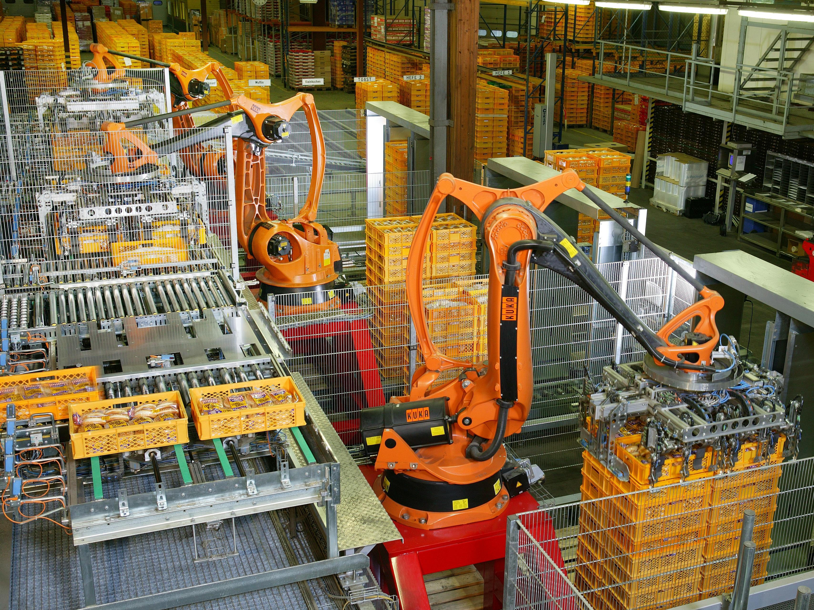
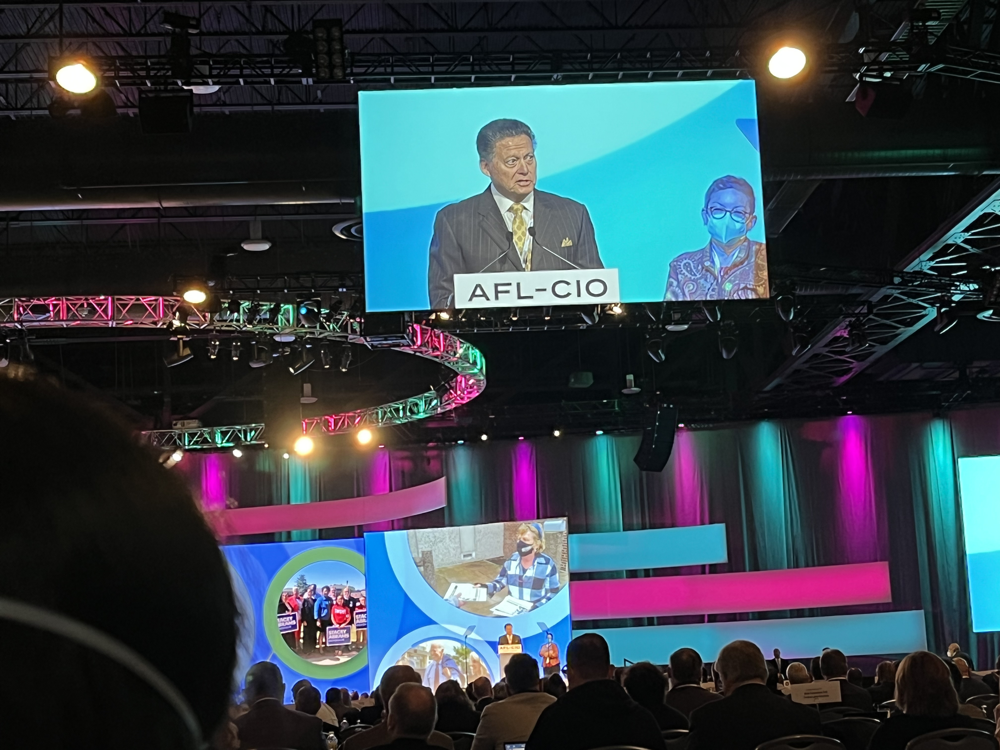

# The Only Thing Protecting Jobs Right Now Is Organizational Inertia

_Brookings names the real buffer against AI_

## Executive Summary

> [!callout]
> About 75% of adults fear losing their job to AI, yet the ground is strangely quiet. In an NBER study surveying 6,000 executives across the US, UK, Germany, and Australia, more than 80% of firms said AI had produced no measurable effect on their headcount over the past three years. The forecasts weren't wrong. The impact simply hasn't arrived yet.

> Brookings pins the cause of that delay in a single sentence. What has protected workers so far is not pro-labor design, not the cost of the technology, not labor regulation, and not bargaining power — it is the plain "friction" of organizations that cannot yet put new technology to work. And removing exactly that friction is what AI does. Today's shield is tomorrow's target.

> This piece asks how we should spend the time that friction has bought us. Where the friction was thin, entry-level hiring, it has already been breached (early-career employment in AI-exposed roles is down by as much as 16%), and the window to design a buffer is narrower than it looks.

<!-- stat-card -->
**80%+** — Firms reporting "zero AI hiring impact" — NBER, 6,000 executives — mass layoffs not yet here

<!-- stat-card -->
**1%** — Job cuts directly attributable to AI — Gartner — the rest have other causes

<!-- stat-card -->
**79%** — Organizations struggling to adopt AI — The real substance of the "friction" shielding workers

<!-- stat-card -->
**−16%** — Entry-level hiring in AI-exposed roles — The thin spot collapsing quietly, first

## Why Mass Layoffs Haven't Come Yet

The gap between fear and reality is wide. Across multiple polls, roughly 75% of adults worry about losing work to AI, and that worry ranks higher than concerns about safety or national security. Yet the labor-market indicators are quiet. When NBER surveyed 6,000 executives across the US, UK, Germany, and Australia, it found that 70% of firms use AI, but more than 80% reported no measurable effect on hiring or productivity over the past three years. Executives spent only about 1.5 hours a week on AI. Even the same study's three-year forecast is mild: it projects a headcount decline of just 0.7%, and about two-thirds of even that decline would come not from layoffs but from attrition — not backfilling those who retire. The mass-layoff scenario isn't even inside the projection graph yet.

Dissecting the causes of job cuts tells the same story. Gartner estimates that only about 1% of the layoffs to date are directly attributable to AI-driven productivity gains. The rest come from familiar causes — over-hiring corrections, high interest rates, an economic slowdown. Oxford Economics sums it up: firms "do not appear to be replacing workers with AI at any meaningful scale."

*▲ KUKA industrial robot arms automate bread palletizing at a German bakery. Automation has reshaped factory floors for decades — yet its measured impact on employment consistently defies the alarm | Source: [Wikimedia Commons (PD)](https://commons.wikimedia.org/wiki/File:Factory_Automation_Robotics_Palettizing_Bread.jpg)*

So the first distinction matters. "The forecast was wrong" and "it hasn't arrived yet" are entirely different claims. Most credible diagnoses point to the latter. Layoffs are absent not because AI is incapable, but because that capability hasn't yet flowed inside organizations. What that bottleneck is — that's where this piece begins.

> [!callout]
> The quiet is not the absence of risk; it's that something sits between the risk and reality. Identify what that "something" is, and you can also gauge how long this reprieve will last.

## It Wasn't Policy or Bargaining Power That Protected Workers

Brookings's workforce-policy report contains the sentence that frames this whole piece. The disruption of the labor market has been held back so far "largely by the organizational frictions seen in prior waves of technology adoption — not by the pro-worker design of AI tools, nor the cost of adopting the technology, nor formal labor regulation, nor workers' bargaining power."

The author negates, one by one, the four candidates commonly credited with protecting workers — pro-labor AI design, the cost of adoption, labor regulation, and bargaining power.

| Candidate credited with protecting workers | Why it wasn't the shield |
| --- | --- |
| Pro-labor AI design | Tools aren't designed to protect workers. Productivity and cost savings come first. |
| Cost of adoption | API and subscription costs are already low and keep falling. They form no real barrier. |
| Labor regulation | No federal law requires firms to disclose whether AI was involved in mass layoffs. |
| Bargaining power | Private-sector union membership is below 6%. The more exposed the role, the weaker the organizing. |
| What remains: organizational friction | Adoption lag, implementation hurdles, the time-gap to deployment on the ground. The only effective shield. |

*▲ The 2022 AFL-CIO Convention in Philadelphia. America's largest union federation — yet private-sector union membership has since fallen below 6%, leaving most workers, especially those in AI-exposed roles, without collective bargaining coverage | Source: [Wikimedia Commons (PD)](https://commons.wikimedia.org/wiki/File:2022_AFL-CIO_Convention_(52151114321).jpg)*

The last row is the crux. Cross out the four, and one reason remains: the sluggishness it takes an organization to actually put new technology to work. Brookings defines this as adoption lag, internal implementation hurdles, and the delay between when a technology becomes usable and when it's deployed on the ground — and stresses that it amounts only to a "temporary reprieve."

How thin the shield is becomes clear on the bargaining-power side. What Brookings calls a "massive mismatch" — the fact that jobs with higher AI exposure are, if anything, less likely to be unionized — means the people most exposed to the risk are the least organized. If a shield has been held by inertia rather than by institutions, then the moment that inertia loosens, there is nothing left to protect.

> [!callout]
> The fact that workers are protected today by organizational sluggishness rather than by institutions implies two things. First, no one designed this protection and no one is obligated to defend it. Second, when it disappears, nothing automatically takes its place.

## The Shield Is the Target

Here we reach the heart of the argument. The friction protecting workers right now is precisely what AI has set out to remove. Coordination, documentation, approval chains, middle management, cross-departmental alignment — everything that makes an organization sluggish is a shield today, but eliminating that friction is exactly the core use case of generative AI. Which means the shield and the target are the same thing.

Evidence that the friction is real is everywhere in adoption. In WRITER's 2026 enterprise survey, 79% of organizations said they were struggling to adopt AI (a double-digit increase year over year), and 54% of the C-suite admitted "AI adoption is tearing the company apart." 56% reported power struggles and confusion, and 78% experienced tension between IT and other departments.
