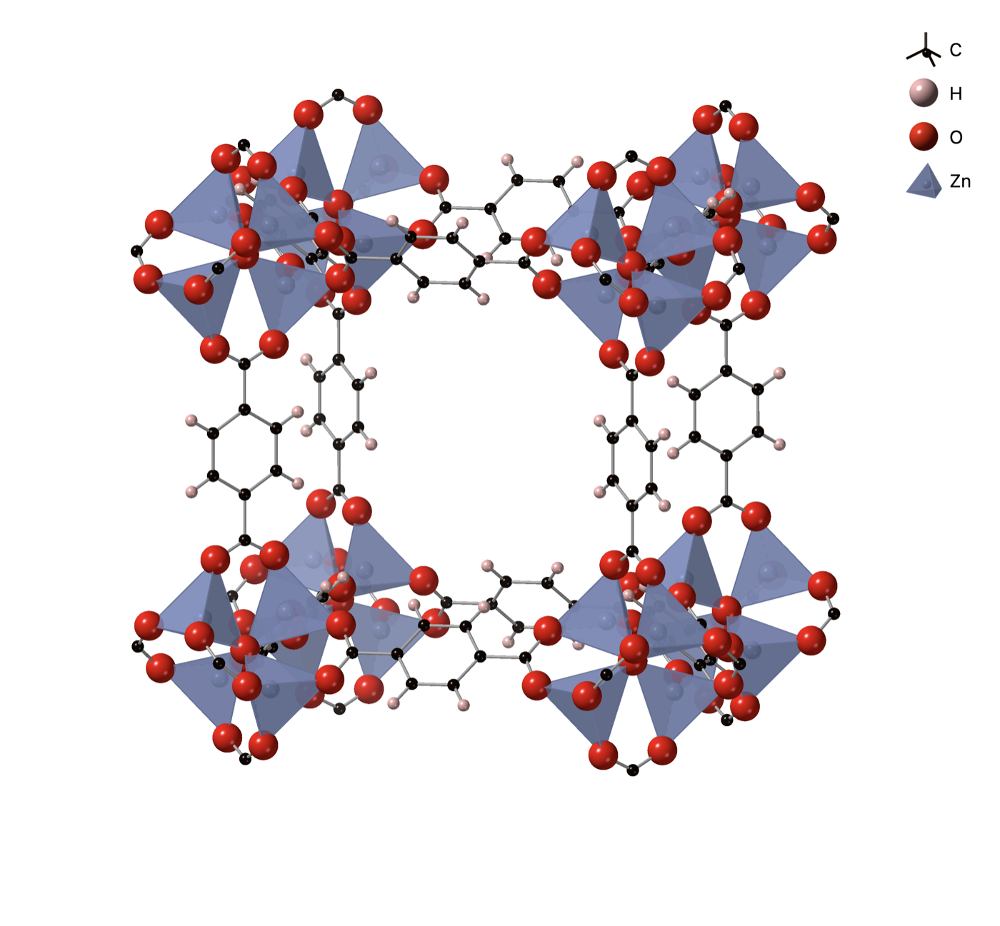

# 신소재 발견에서 AI를 만드는 일은 노력의 1%였다

_네이처 머티리얼스에 실린 EPFL·헤리엇와트 연구진 코멘트가 짚은 재료과학 AI의 데이터 병목_

## Executive Summary

> [!callout]
> 인공지능은 이미지와 언어를 데이터로 뚫었습니다. 데이터를 더 쌓을수록 모델이 좋아지는 스케일링 법칙이 그 성취를 밀어 온 엔진이었습니다. 그런데 같은 공식을 신소재 발견에 그대로 옮기면 멈춥니다. 네이처 머티리얼스가 EPFL의 베렌트 스밋과 헤리엇와트대의 수사나 가르시아에게 청탁한 코멘트 「The data-only illusion in materials discovery」의 결론입니다. 이 글은 그 반론이 무엇을 짚었고, 데이터를 다루는 사람에게 어떤 질문을 남기는지 따라갑니다.

> 스밋이 링크드인에 남긴 요약에 따르면, 실제 프로젝트에서 AI 자체를 만드는 데 든 노력은 전체의 약 1%였습니다. 나머지 99%는 응용에 쓸 만한 고품질 데이터를 확보하는 데 들어갔습니다. 이미지·언어 AI에서는 웹과 대규모 코퍼스라는 데이터가 이미 존재했지만, 재료과학에서는 데이터를 만드는 일 자체가 연구입니다. 병목은 알고리즘이 아니라 고충실도 데이터를 만들어 내는 루프에 있다는 진단입니다.

> 페블러스 블로그를 오래 읽어 온 독자라면 '모델보다 데이터'라는 명제가 익숙할 것입니다. 이 글은 그 명제의 한 겹 아래를 봅니다. 데이터가 애초에 부족하고 만들기도 어려운 도메인에서는, 많은 데이터가 좋은 발견을 보장하지 못합니다. 그 간극은 결국 AI-Ready Data에 하나의 질문을 되돌려 줍니다. 우리 데이터는 양이 문제인가, 맥락이 문제인가.

코멘트가 남긴 숫자 네 개가 이 이야기의 뼈대입니다. 노력의 1%와 99%, 지금까지 보고된 금속-유기 골격체(MOF)의 규모, 그리고 그중 실제로 성능이 측정된 것의 수입니다.

<!-- stat-card -->
**1%** — AI 모델 구축에 든 노력 — 신소재 발견 프로젝트 전체 중

<!-- stat-card -->
**99%** — 데이터 확보에 든 노력 — 응용 가능한 고품질 데이터 생성

<!-- stat-card -->
**~90,000** — 보고된 MOF 종 — 가상으로 그려진 후보 물질

<!-- stat-card -->
**1~2** — 실측 데이터를 갖춘 MOF — 탄소 포집 성능이 측정된 것

## 통하던 공식이 멈춘 자리

지난 몇 년의 AI 성취에는 하나의 공식이 있었습니다. 데이터를 더 많이, 더 크게 쌓으면 모델이 알아서 좋아진다는 것입니다. 이미지 생성과 언어 모델이 그 공식의 증거였습니다. 인터넷에는 사진과 문장이 이미 넘쳐 났고, 모델은 그 바다를 삼키면서 커졌습니다. 데이터는 '거기에 있는 것'이었고, 연구의 일은 그것을 잘 정제해 모델에 붓는 쪽에 가까웠습니다.

재료과학 앞에서 이 공식이 멈춘다는 것이 스밋과 가르시아의 출발점입니다. 네이처 머티리얼스는 두 사람에게 AI와 재료 발견의 미래에 대한 코멘트를 청탁했고, 그들이 내놓은 답은 낙관의 확장이 아니라 조건의 확인이었습니다. 인공지능이 이미지·언어를 바꿔 놓은 것은 맞지만, 재료과학에서는 데이터의 희소성과 합성의 복잡성이 다른 접근을 요구한다는 것입니다.

> [!callout]
> 차이는 데이터가 놓인 자리에 있습니다. 이미지·언어에서는 데이터가 이미 존재하는 자원이지만, 재료과학에서는 데이터를 만들어 내는 일 자체가 연구의 본체입니다. 새 물질 하나의 성능을 알려면 그 물질을 실제로 합성하고 실험실에서 측정해야 합니다. 웹을 긁어모으는 것과는 비용의 차원이 다릅니다.

## AI를 만드는 일은 노력의 1%였다

스밋은 링크드인에서 자신들의 작업을 한 줄로 요약했습니다. AI 자체를 만드는 데 든 노력은 전체의 약 1%에 불과했다는 것입니다. 나머지 99%는 그 AI가 실제로 쓸모 있게 작동하도록 만드는 데이터, 즉 응용에 바로 투입할 수 있는 고품질 데이터를 확보하는 과정에 들어갔습니다. 화제가 되는 쪽은 늘 모델이지만, 정작 시간과 품이 쏠린 곳은 데이터였습니다.

이 비율이 이미지·언어 AI와 정반대라는 점이 중요합니다. 그쪽에서는 데이터가 먼저 있었고 모델을 키우는 일이 승부처였습니다. 재료과학에서는 순서가 뒤집힙니다. 모델은 상대적으로 쉽게 세울 수 있지만, 그 모델을 학습시키고 검증할 데이터가 세상에 충분히 존재하지 않습니다. 데이터를 확보한다는 말이 '수집한다'가 아니라 '실험으로 만들어 낸다'에 가깝기 때문입니다.

그래서 두 사람은 병목을 알고리즘이 아니라 데이터 생성의 루프에서 찾습니다. 더 영리한 모델이 부족해서가 아니라, 그 모델을 지탱할 고충실도 데이터를 만들어 내는 과정이 느리고 비싸기 때문에 발견이 더디다는 것입니다. 스케일링 법칙이 전제하는 '데이터는 얼마든지 늘릴 수 있다'는 조건이, 재료과학에서는 처음부터 성립하지 않습니다.

## 9만 종의 후보, 실측은 한둘

이 격차를 가장 선명하게 보여 주는 사례가 금속-유기 골격체, 줄여서 MOF입니다. 금속 이온과 유기 분자가 그물처럼 얽혀 만드는 다공성 결정 구조로, 내부의 미세한 구멍에 기체를 붙잡아 둘 수 있어 탄소 포집과 가스 저장의 유력한 후보로 꼽힙니다. 구조를 조금씩 바꿔 가며 무수히 많은 변형을 상상할 수 있다는 점이 MOF의 매력입니다.

*▲ 금속-유기 골격체(MOF-5)의 결정 구조. 아연 산화물 클러스터(파란 사면체)와 유기 링커가 얽혀 다공성 격자를 이룬다 — 보고된 구조만 약 9만 종. | Source: [Wikimedia Commons (CC BY-SA 4.0)](https://commons.wikimedia.org/wiki/File:MOF-5_Crystal_Structure.png)*

문제는 상상과 실측 사이의 거리입니다. 스밋에 따르면 지금까지 보고된 MOF는 약 9만 종에 이릅니다. 그런데 그중 실제로 탄소 포집 성능을 검증할 만한 실험 데이터를 갖춘 것은 한둘에 불과합니다. 9만 개의 후보가 그려졌지만, 그 후보가 목표한 일을 정말 해내는지 측정된 사례는 사실상 없다시피 한 셈입니다.

> [!callout]
> 이 비대칭은 우연이 아니라 구조적입니다. 가상으로 그릴 수 있는 물질의 수와, 실제로 합성해 측정할 수 있는 물질의 수 사이에는 근본적인 격차가 있습니다. 합성 자체가 어렵고, 실험 검증에는 시간과 비용이 크게 들기 때문입니다. AI가 후보를 대량으로 쏟아 낼수록 이 격차는 오히려 벌어집니다. 그리려는 속도는 빠르지만, 만들어 측정하는 속도는 그대로이기 때문입니다.

모델을 학습시키려면 정답이 붙은 데이터가 필요합니다. 9만 종의 후보가 있어도 성능이 측정된 것이 한둘뿐이라면, 모델이 배울 실측 정답은 거의 없는 것과 같습니다. 데이터가 '적다'는 말로도 부족합니다. 애초에 만들어지지 않았기 때문입니다.

## 화학적 통찰이 예측을 물질로 바꾼다

그렇다면 답은 무엇일까요. 스밋과 가르시아의 결론은 AI를 버리자는 것이 아닙니다. AI는 강력한 도구이되, 깊은 화학적 통찰과 결합할 때에만 가상의 예측을 실제 물질로 바꿀 수 있다는 것입니다. 후보를 그리는 일과, 그중 정말로 안정적이고 합성 가능하며 목적한 성능을 내는 후보를 골라내는 일은 다른 작업입니다. 뒤쪽에는 화학 원리와 물리적 제약, 그리고 실험 검증이 함께 들어가야 합니다.

도메인 지식은 여기서 장식이 아니라 필터입니다. 어떤 구조가 실험실에서 실제로 만들어질 수 있는지, 어떤 조합이 애초에 불안정한지, 측정값의 어디까지를 신뢰할 수 있는지를 아는 것은 화학자의 통찰입니다. 이 통찰이 없으면 모델은 그럴듯하지만 만들 수 없는 후보의 목록을 무한히 늘릴 뿐입니다. 병목이 데이터 생성의 루프에 있다는 진단이 곧, 그 루프를 이끄는 것이 도메인 전문성이라는 뜻이기도 합니다.

이런 문제의식이 이 코멘트 한 편에서 끝나는 것도 아닙니다. 비슷한 논쟁이 다른 저널의 관점 논문으로 이어졌고, 동아시아 과학계에서도 재료과학이 AI 신화를 맹신해선 안 된다는 논조로 번졌습니다. 한 연구실의 반론이라기보다, 데이터가 귀한 분야가 스케일링 낙관론과 부딪치며 공통으로 마주친 벽에 가깝습니다.

페블러스 블로그도 재료과학 AI의 성공 사례를 여러 번 다뤘습니다. 합성 전에 초전도체를 예측한 모델, 생성 모델이 놓친 후보를 겨눈 강화학습 같은 이야기입니다. 이번 코멘트는 그 성공들과 어긋나지 않습니다. 다만 그런 성공이 예외가 아니라 일반 원칙이 되려면, 모델의 예측이 화학적 통찰과 실험 검증의 루프 안에 놓여야 한다는 조건을 덧붙입니다.

## 양의 문제인가, 맥락의 문제인가

재료과학의 사례는 데이터를 다루는 모든 조직에 하나의 질문을 넘겨줍니다. 우리가 흔히 말하는 '깨끗한 데이터'는 대개 양과 형식의 문제를 가리킵니다. 결측치를 채우고, 형식을 맞추고, 중복을 지우는 일입니다. 그런데 재료과학이 보여 준 병목은 그보다 앞에 있습니다. 데이터가 담고 있어야 할 도메인 맥락, 즉 화학적 통찰에 해당하는 현장 지식이 빠지면, 아무리 깔끔한 데이터도 실제 발견으로 이어지지 못합니다.

이 구분을 조직의 언어로 옮기면 이렇습니다. AI가 답을 내지 못할 때, 원인은 두 갈래입니다. 데이터가 양적으로 부족한 경우와, 데이터가 충분하되 그 데이터에 업종·공정·현장의 맥락이 빠져 있는 경우입니다. 앞쪽이라면 더 모으면 됩니다. 뒤쪽이라면 아무리 모아도 모델의 예측이 실제 의사결정으로 번역되지 않습니다. AI-Ready Data가 '깨끗함'을 넘어 '도메인 맥락'까지 담아야 하는 이유가 여기에 있습니다.

그래서 이 글은 답 대신 질문을 남깁니다. 지금 당신의 조직에서 AI가 기대만큼 답을 내지 못한다면, 그것은 데이터가 적어서입니까, 아니면 그 데이터에 도메인 맥락이 빠져서입니까. 재료과학은 두 가지가 동시에 병목이 될 수 있음을 극단적인 형태로 보여 줍니다. 그 극단이, 덜 극단적인 우리의 데이터에도 같은 질문을 던집니다.

<!-- stat-card -->
**Editor's Note** — 페블러스는 AI 학습에 들어가기 전 데이터의 품질과 맥락을 진단하고 정비하는 일을 다룹니다. 재료과학 코멘트가 던진 메시지를 우리의 언어로 옮기면, 데이터의 가치는 양과 청결만으로 결정되지 않는다는 것입니다. 그 데이터가 어떤 도메인 맥락을 담고 있느냐가, 결국 모델의 예측이 현실에서 쓸 수 있는 결과가 되는지를 가릅니다.

## 참고문헌

### 학술 논문

- 1.Smit, B. & García, S. (2026). "[The data-only illusion in materials discovery](https://www.nature.com/articles/s41563-026-02578-7)." Nature Materials.
- 2.Cheetham, A. K. & Seshadri, R. (2024). "[Artificial Intelligence Driving Materials Discovery? Perspective on the Article: Scaling Deep Learning for Materials Discovery](https://pubs.acs.org/doi/10.1021/acs.chemmater.4c00643)." Chemistry of Materials.

### 1차 소스 · 저자 발언

- 3.Smit, B. (2026). "[The data-only illusion in materials discovery](https://www.linkedin.com/posts/berend-smit-b58551300_the-data-only-illusion-in-materials-discovery-activity-7450846962565890048-9YOg)." LinkedIn 포스트.

### 기관·보도

- 4.EPFL Laboratory of Molecular Simulation (LSMO). (2026). "[The data-only illusion in materials discovery](https://www.epfl.ch/labs/lsmo/the-data-only-illusion-in-materials-discovery/)." EPFL.
- 5.텐센트 뉴스(腾讯新闻). (2026). "[材料科学不能迷信AI神话](https://news.qq.com/rain/a/20260422A043O500)."
