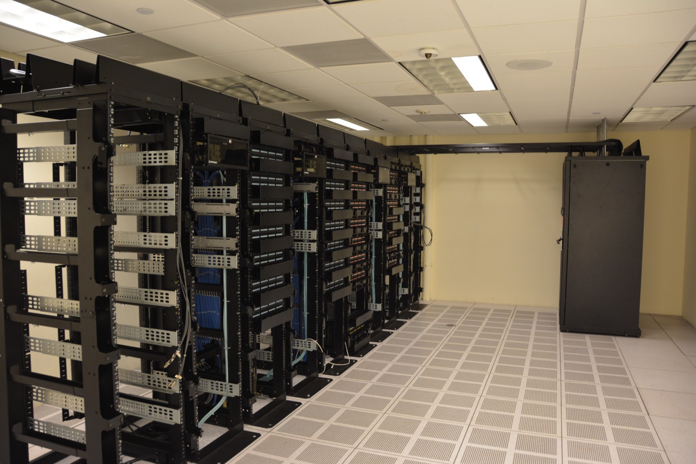

# Nature Urges Scientists to Move AI Off Mega Data Centres

_A Nature comment cites 485 terawatt-hours of data centre power and 71% local opposition, and asks labs to run open-weight models on their own servers_

## Executive Summary

> [!callout]
> Most of the AI tools a researcher uses sit inside someone else's building. A comment published in Nature on 11 August 2026 argues that this arrangement is not inevitable. The premise that AI-driven science requires a huge centralised facility is simply wrong, the authors write, and universities and research institutes should invest in their own servers running open-weight models rather than buying commercial subscriptions.

> The heaviest number the comment leans on is local sentiment. In a Gallup survey released this past May, 71% of Americans opposed an AI data centre being built in their own area, and about half of the stated reasons came down to water and electricity use. That does not lead straight to the conclusion that an in-house server saves money. A cluster with low utilisation costs more than the cloud, and several failures of exactly that kind are already on the record.

> Another question waits behind the one about power. Once the tools come inside the institution, what stays on the record, and who keeps that record: the institution or the individual?

### Key Figures

Source: [Nature comment (d41586-026-02451-2)](https://www.nature.com/articles/d41586-026-02451-2), IEA, Gallup, NVIDIA

<!-- stat-card -->
**485 TWh** — World data centre power last year — About what Germany generates in a year, and the IEA expects it to double by 2030

<!-- stat-card -->
**71%** — Oppose construction in their area — 48% opposed strongly, and about half the stated reasons were water and electricity use

<!-- stat-card -->
**$600bn** — Five companies' AI infrastructure spend this year — Amazon, Alphabet, Microsoft, Meta and Oracle combined, up 36% on last year

<!-- stat-card -->
**120 billion** — Parameters a laptop chip runs locally — On an NVIDIA RTX Spark carrying 128GB of unified memory

## How the Data Centre Bill Reaches the Lab

Data centres worldwide consumed roughly 485 terawatt-hours of electricity last year. That is close to what Germany generates in a year, and about 1.5% of global generation. The IEA expects the figure to double by 2030, reaching 945 terawatt-hours. In the same agency's most recent analysis, data centre power demand grew 17% during 2025 alone, far outpacing the 3% growth in overall electricity demand.

*▲ An example photo of the physical footprint a large data centre facility can occupy (Utah Data Center, USA) | Source: [Wikimedia Commons (Swilsonmc, CC BY-SA 3.0)](https://commons.wikimedia.org/wiki/File:Utah_Data_Center.jpg)*

The money runs in the same direction. Combined capital spending this year by Amazon, Alphabet, Microsoft, Meta and Oracle passes $600 billion. That is 36% more than last year, and credit analysts estimate that about three quarters of it goes into GPUs, servers, network equipment and data centre buildings.

The route by which these numbers reach a researcher is not the electricity bill. In a Gallup survey released this past May, 71% of Americans opposed an AI data centre being built in their area, and 48% opposed it strongly. Asked why, 18% named water use and another 18% named electricity use, so resource concerns accounted for about half the answers, while 16% pointed to noise and air and water pollution. Gallup framed this sentiment as a major obstacle to the expansion of AI compute, and noted that it could turn into local organising and litigation.

There are already cases where that sentiment turned into procedure. On 17 February the city council of San Marcos, Texas, voted 5 to 2 against rezoning for a $1.5 billion data centre campus. The plan called for five buildings of 380 megawatts each on a 200-acre site, and the vote came at the end of an eight-hour meeting in which residents objected over water use and the environment. On 16 June the city went further and passed an ordinance banning data centres inside city limits, becoming the first city in Texas to block them, and a state senator signalled a lawsuit. About half of the 248 data centres planned across Texas, however, are slated for unincorporated areas that a city ordinance cannot reach.

The three people who wrote the comment come from environmental research rather than the AI industry. They are Cassidy K. Buhler, a postdoctoral researcher in environmental data science at the University of Colorado Boulder; Fernando Pérez, an associate professor of statistics at UC Berkeley; and Carl Boettiger, an associate professor in the same university's Department of Environmental Science, Policy and Management. They have built research computing environments themselves while working with climate and biodiversity data, and that experience is what the comment rests on.

Here is the point the comment presses. The free academic accounts and discounted plans researchers use today are subsidies resting on an assumption that this expansion continues. If neither the environmental cost nor the subsidised price of access can run indefinitely, then where the tools sit now decides the conditions of research a few years out.

## Advanced AI Does Not Run Only in Giant Facilities

While big-tech data centres handle billions of chatbot queries a day, the impression has hardened that advanced AI runs only in giant facilities. The comment's authors, drawing on their own experience, argue that this is not true. Building where solar power is abundant does solve the electricity problem and can sidestep local objections, which sounds reasonable enough, but the claim that a giant facility is a precondition for AI-based science is the part that is wrong.

The analogy they reach for is the history of the personal computer. Early computers filled a room, then came down onto a desk, and now sit on a lap. The AI era is only a few years old, the comment notes, and the same signs of shrinking are already visible. Their example is NVIDIA's new laptop chip, the RTX Spark, built to run models such as Google's Gemma 4 locally on laptops from Dell, HP and others. Apple's laptop chips have supported local models for several years already.

The RTX Spark's specifications back the analogy with concrete numbers. Announced jointly by NVIDIA and Microsoft on 31 May, the chip links a 20-core Grace CPU with a Blackwell RTX GPU carrying 6,144 CUDA cores over NVLink-C2C, with CPU and GPU sharing up to 128GB of unified memory. NVIDIA describes one petaflop of FP4 compute running a 120-billion-parameter model locally, and more than 30 laptops carrying the chip arrive this autumn.

*▲ The RTX Spark chip, announced jointly by NVIDIA and Microsoft on 31 May | Source: [NVIDIA Newsroom](https://nvidianews.nvidia.com/news/nvidia-microsoft-windows-pcs-agents-rtx-spark)*

Some of this needs no waiting for autumn hardware. The 12-billion-parameter version of Gemma 4 is designed to run on devices with 16GB of unified memory, and quantised to four bits its weights fit under 8GB. The speed is not generous, though. User measurements on a 16GB Mac mini M4 land around 12 tokens per second, workable for conversation and frustrating for long generations. On a device in this class it is context length rather than the weights that fills memory first, which pushes you toward a context of about 30,000 tokens.

Another of the comment's examples gives a better sense of scale for a lab. A single server rack the size of a small refrigerator can handle roughly 50 people sending questions and getting answers at the same time. Open-weight models have climbed to where they rival closed commercial ones on many tasks, and the remaining barrier is less performance than the technical know-how to stand one up and keep it running. The authors attach that caveat to their own recommendation.

## An In-House Server Gets Cheaper Above 60% Utilisation

The comment's diagnosis is that many research teams already have the capacity to stand up a server instead of buying a subscription, and that institutions still do not invest in that direction. So where does that inertia come from? A subscription ends with a single payment, while an in-house server has to keep meeting one condition: utilisation.

Analyses through 2026 mostly place the break-even point in the range of 60% to 70% sustained utilisation. Below that the cloud wins, and above it owned hardware pulls ahead on a three-year depreciation schedule. Many of these figures come from GPU cloud providers and server manufacturers writing to their own interests, so the safer reading treats them as a range to test against your own institution's usage curve. Hourly pricing for an H100 instance falling from the $7 range at launch to under $2.50 with specialist providers keeps shaking the calculation as well.

The load pattern of university research sits especially awkwardly with that condition. Training runs in bursts of days or weeks, and afterwards the cluster stands empty while results are reviewed and the next experiment is prepared. There are several reports of teams buying hardware because the hourly rate looked cheap and then leaving 60% of it idle. One company spent $6.8 million on 512 H100s, never designed a scheduling plan, and stalled at 34% utilisation. Once it had added power, cooling and three more engineers, it was paying more than the $800,000 monthly cloud bill it had left behind.

*▲ An example photo of in-house server infrastructure an institution would build (not a GPU-specific rack) | Source: [Wikimedia Commons (Carl Lender, CC BY 2.0)](https://commons.wikimedia.org/wiki/File:Datacenter_Server_Racks_(22370909788).jpg)*

So the comment's proposal reads closer to reality as an arrangement that brings steady inference onto institutional servers and rents outside capacity for bursty training, rather than as a call to bring all compute in-house. That is in fact the common configuration in 2026. On top of it, the 0.5 to 1 person per cluster needed to operate the thing never appears on a GPU bill and is a cost all the same. Without that person, the in-house server does not get built.

> [!callout]
> The claim that an in-house server is always cheaper does not hold. But the comment's argument does not hang on cost savings alone. Its second half is that where the tools sit decides the researcher's control along with the environmental burden.

## Downloading the Weights Adds Things You Must Record

The problem of an API-served model changing without notice is one this blog covered earlier this month in [Doing Science with a Tool You Cannot Reproduce](/blog/closed-model-science-reproducibility/en/). Once the weights behind an alias are swapped, there is no way to run an experiment from a few months ago under the same conditions. The conclusion there was that reproducibility is another name for provenance.

Download the weights onto an institutional server and that drift disappears. In exchange, new items arrive that have to be written down. Which weight file you used can be pinned with a hash, but even with the same weights the output can differ with the quantisation settings, the numerical precision, the version of the inference runtime, and which GPU it ran on. A result inferred in FP4 and a result inferred in BF16 do not always agree for the same model on the same prompt. Moving local means bringing those variables into a place where you record them yourself instead of receiving them from a provider.

What you can record splits by where the tool sits.
