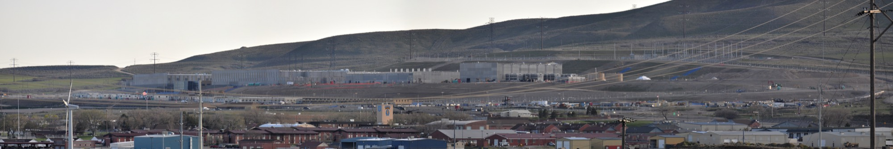
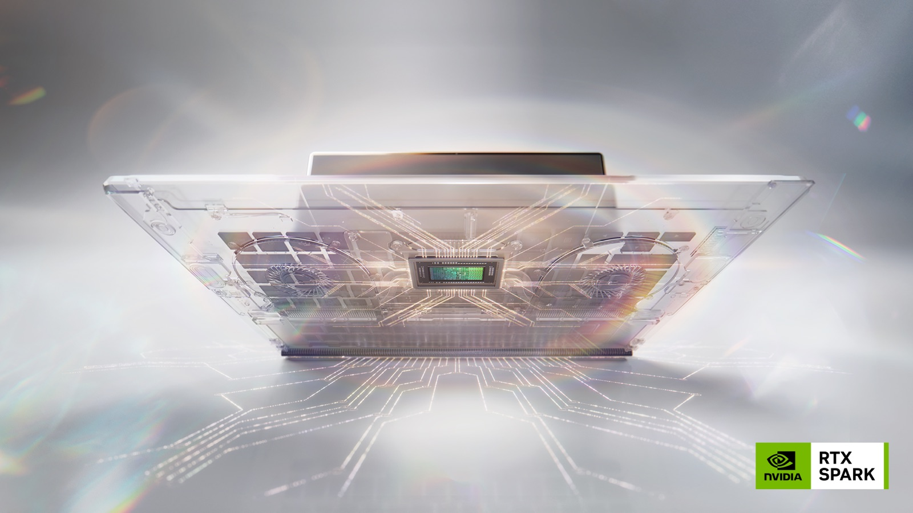

# AI 데이터센터를 떠나 연구실 서버로 가자는 과학자들

_전력 485테라와트시와 지역 반대 71%를 배경으로 네이처에 실린 오픈 웨이트 전환 제안_

## Executive Summary

> [!callout]
> 연구자가 쓰는 AI 도구는 대부분 남의 건물 안에 있습니다. 2026년 8월 11일 네이처에 실린 논평은 그 배치가 필연이 아니라고 말합니다. 거대한 중앙집중 시설이 있어야 AI로 과학을 할 수 있다는 전제 자체가 틀렸고, 대학과 연구소는 상용 구독을 사는 대신 오픈 웨이트 모델을 얹은 자체 서버에 투자해야 한다는 것이 논지입니다.

> 논평이 근거로 드는 숫자 가운데 가장 무거운 것은 지역 여론입니다. 갤럽이 지난 5월 발표한 조사에서 미국인 71%가 자기 지역에 AI 데이터센터가 들어서는 데 반대했고, 반대 이유의 절반가량이 물과 전력 사용이었습니다. 다만 자체 서버가 곧 절약이라는 결론으로 바로 이어지지는 않습니다. 가동률이 낮은 클러스터는 클라우드보다 비싸지고, 그 실패 사례도 이미 여러 건 있습니다.

> 전력 다음에 오는 질문이 하나 더 있습니다. 도구를 기관 안으로 들여오면 무엇이 기록으로 남는가, 그리고 그 기록을 기관이 남길 것인가 개인이 남길 것인가입니다.

### 주요 수치

출처: [Nature 논평(d41586-026-02451-2)](https://www.nature.com/articles/d41586-026-02451-2), IEA, 갤럽, NVIDIA

<!-- stat-card -->
**485 TWh** — 지난해 세계 데이터센터 전력 — 독일 한 해 발전량 수준이고, IEA는 2030년까지 두 배가 된다고 봅니다

<!-- stat-card -->
**71%** — 지역 내 건설 반대 — 강하게 반대가 48%였고, 반대 이유의 절반가량이 물과 전력 사용입니다

<!-- stat-card -->
**6,000억 달러** — 5개사 올해 AI 인프라 지출 — 아마존·알파벳·마이크로소프트·메타·오라클 합계로, 지난해보다 36% 늘었습니다

<!-- stat-card -->
**1,200억** — 노트북 칩이 로컬로 돌리는 파라미터 — 통합 메모리 128GB를 실은 NVIDIA RTX Spark 기준입니다

## 데이터센터 청구서가 연구실까지 오는 길

전 세계 데이터센터는 지난해 약 485테라와트시의 전력을 썼습니다. 독일이 한 해에 만드는 전력과 비슷한 양이고, 세계 발전량의 1.5% 정도입니다. IEA는 이 수치가 2030년까지 두 배가 되어 945테라와트시에 이를 것으로 봅니다. 같은 기관의 최신 분석에서 데이터센터 전력 수요는 2025년 한 해에만 17% 늘었고, 전체 전력 수요 증가율 3%를 크게 앞질렀습니다.

*▲ 대규모 데이터센터 시설이 차지하는 물리적 규모를 보여주는 예시 사진(미국 유타 데이터센터) | Source: [Wikimedia Commons (Swilsonmc, CC BY-SA 3.0)](https://commons.wikimedia.org/wiki/File:Utah_Data_Center.jpg)*

돈의 규모도 같은 방향입니다. 아마존과 알파벳, 마이크로소프트, 메타, 오라클 다섯 회사의 올해 설비투자 합계는 6,000억 달러를 넘어섭니다. 지난해보다 36% 많고, 이 가운데 약 4분의 3이 GPU와 서버, 네트워크 장비, 데이터센터 건물로 들어간다는 것이 신용분석 기관들의 추정입니다.

연구자에게 이 숫자가 도달하는 경로는 전기요금이 아닙니다. 갤럽이 지난 5월 발표한 조사에서 미국인 71%가 자기 지역의 AI 데이터센터 건설에 반대했고, 48%는 강하게 반대했습니다. 반대 이유를 물었을 때 물과 전력 사용을 각각 18%가 꼽아 자원 문제가 절반가량을 차지했고, 소음과 대기와 수질 오염을 꼽은 응답이 16%였습니다. 갤럽은 이 여론을 AI 연산 확장의 주요 장애물로 정리하면서, 지역 단위 활동과 소송으로 번질 가능성을 함께 적었습니다.

이 여론이 절차로 나타난 사례도 이미 있습니다. 텍사스 샌마르코스 시의회는 지난 2월 17일 15억 달러 규모 데이터센터 단지의 용도지역 변경을 5대 2로 거부했습니다. 200에이커 부지에 380메가와트급 건물 다섯 채를 올리는 계획이었고, 여덟 시간 동안 이어진 회의에서 주민들이 물 사용과 환경을 이유로 반대한 뒤에 나온 결정이었습니다. 이 도시는 6월 16일 시 경계 안의 데이터센터를 금지하는 조례까지 통과시켜 텍사스에서 처음으로 데이터센터를 막은 도시가 됐고, 주 상원의원이 소송을 예고했습니다. 다만 텍사스에 계획된 데이터센터 248곳 가운데 절반가량은 시 조례가 닿지 않는 비법인 지역에 들어설 예정입니다.

논평을 쓴 세 사람은 AI 업계가 아니라 환경 연구 쪽에 있습니다. 콜로라도대 볼더 캠퍼스에서 환경 데이터 과학을 연구하는 박사후연구원 캐시디 뷸러, UC 버클리 통계학과 부교수 페르난도 페레스, 같은 학교 환경과학·정책·관리학과 부교수 칼 뵈티거입니다. 기후와 생물다양성 데이터를 다루면서 연구용 계산 환경을 직접 꾸려 온 사람들이고, 논평의 근거도 그 경험입니다.

논평이 짚는 지점은 여기입니다. 지금 연구자가 쓰는 학술용 무료 계정과 할인 요금제는 이 확장이 계속된다는 가정 위에 놓인 보조금입니다. 환경 비용도, 보조금 형태의 접근료도 무한정 이어질 수 없다면, 지금 도구를 어디에 둘지가 몇 년 뒤 연구 조건을 정합니다.

## AI는 거대 시설에서만 돌지 않는다

빅테크 데이터센터가 하루 수십억 건의 챗봇 질의를 처리하는 동안, 고급 AI는 거대 시설에서만 돌아간다는 인상이 굳었습니다. 논평의 저자들은 자기 경험에 비추어 그것이 사실이 아니라고 반박합니다. 태양광이 풍부한 곳에 지으면 전력도 해결되고 주민 반대도 피할 수 있다는 논리는 그럴듯하지만, 거대 시설이 AI 기반 과학의 전제 조건이라는 대목이 틀렸다는 것입니다.

근거로 드는 비유는 개인용 컴퓨터의 역사입니다. 초기 컴퓨터는 방 하나를 채웠고, 그다음 책상 위로 내려왔고, 지금은 무릎 위에 있습니다. AI 시대는 아직 몇 년밖에 되지 않았지만 같은 축소의 신호가 이미 보인다고 논평은 적습니다. 예로 든 것이 NVIDIA의 새 노트북 칩 RTX Spark로, 델과 HP 등의 노트북에서 구글 Gemma 4 같은 모델을 로컬로 돌리는 용도입니다. 애플의 노트북 칩은 이미 수년째 로컬 모델을 지원해 왔습니다.

RTX Spark의 사양은 이 비유를 구체적인 수치로 받쳐 줍니다. NVIDIA와 마이크로소프트가 지난 5월 31일 함께 발표한 이 칩은 20코어 Grace CPU와 CUDA 코어 6,144개를 실은 Blackwell RTX GPU를 NVLink-C2C로 묶고, CPU와 GPU가 최대 128GB의 통합 메모리를 함께 씁니다. FP4 기준 1페타플롭의 연산으로 1,200억 파라미터 모델을 로컬에서 돌린다는 것이 NVIDIA의 설명이고, 이 칩을 실은 노트북 30종 이상이 올가을에 나옵니다.

*▲ NVIDIA와 마이크로소프트가 지난 5월 31일 함께 공개한 RTX Spark 칩 | Source: [NVIDIA Newsroom](https://nvidianews.nvidia.com/news/nvidia-microsoft-windows-pcs-agents-rtx-spark)*

올가을 하드웨어를 기다릴 필요가 없는 부분도 이미 있습니다. Gemma 4의 120억 파라미터 판은 통합 메모리 16GB 기기에서 돌아가도록 설계됐고, 4비트로 양자화하면 가중치가 8GB 안쪽에 들어갑니다. 다만 속도가 넉넉하지는 않습니다. 16GB 맥미니 M4로 돌려 본 사용자 측정은 초당 12토큰 내외로, 대화에는 쓸 만하지만 긴 생성에는 답답한 수준입니다. 이 급의 기기에서 메모리를 먼저 채우는 것도 가중치가 아니라 문맥 길이여서, 문맥을 3만 토큰 정도로 줄여 쓰게 됩니다.

연구실 단위의 규모감은 논평이 든 다른 예가 더 잘 보여 줍니다. 소형 냉장고 크기의 서버 랙 하나면 대략 50명이 동시에 질문을 보내고 답을 받는 정도를 감당한다는 것입니다. 오픈 웨이트 모델의 성능은 많은 과제에서 닫힌 상용 모델에 견줄 만한 수준까지 올라왔습니다. 다만 남은 장벽이 성능보다 그것을 세우고 유지할 기술적 노하우 쪽이라는 단서를 논평은 함께 달아 둡니다.

## 가동률 6할부터 자체 서버가 싸진다

많은 연구팀이 구독을 사는 대신 서버를 세울 역량을 이미 갖고 있는데도 기관은 아직 그 방향에 투자하지 않는다는 것이 논평의 진단입니다. 그렇다면 그 관성이 어디서 오는지 따져 볼 만합니다. 구독은 결제 한 번으로 끝나지만, 자체 서버는 가동률이라는 조건을 계속 채워야 합니다.

2026년의 여러 분석은 손익분기를 대체로 지속 가동률 60~70% 구간에 놓습니다. 그 아래에서는 클라우드가 유리하고, 위에서는 3년 상각을 기준으로 자체 장비가 앞선다는 정리입니다. 다만 이 수치들은 GPU 클라우드 사업자와 서버 제조사가 각자의 이해에 맞춰 내놓은 것이 많아, 자기 기관의 실제 사용 곡선에 견주어 봐야 하는 범위로 읽는 편이 안전합니다. H100 인스턴스 시간당 단가가 출시 초기 7달러대에서 전문 사업자 기준 2.5달러 아래로 내려온 것도 이 계산을 계속 흔듭니다.

대학 연구의 부하 패턴은 이 조건과 특히 어긋납니다. 학습은 며칠에서 몇 주간 몰아서 돌아가고, 그 뒤에는 결과를 검토하고 다음 실험을 준비하는 동안 클러스터가 비어 있습니다. 시간당 단가가 싸다는 이유로 장비를 사 두고 그 6할을 놀린 사례가 여러 건 나와 있습니다. 512장의 H100에 680만 달러를 쓴 한 회사는 일정 설계를 하지 않아 가동률이 34%에 머물렀습니다. 전력과 냉각, 추가 엔지니어 세 명까지 더하고 나니 이전에 쓰던 월 80만 달러 클라우드 청구서보다 오히려 더 많은 비용이 들었습니다.

*▲ 기관이 직접 세우는 서버 인프라의 예시 사진(GPU 전용 랙은 아님) | Source: [Wikimedia Commons (Carl Lender, CC BY 2.0)](https://commons.wikimedia.org/wiki/File:Datacenter_Server_Racks_(22370909788).jpg)*

그래서 논평의 제안은 모든 연산을 기관 안으로 들여오라는 뜻으로 읽기보다, 상시로 돌아가는 추론을 기관 서버로 내리고 폭발적인 학습 작업은 외부를 빌려 쓰는 배치로 읽는 편이 현실에 가깝습니다. 실제로 2026년의 흔한 구성이 그렇습니다. 여기에 클러스터당 운영 인력 0.5~1명은 GPU 청구서에 잡히지 않지만 반드시 드는 비용입니다. 그 인력을 확보하지 못하면 자체 서버는 서지 않습니다.

> [!callout]
> 자체 서버가 언제나 싸다는 주장은 성립하지 않습니다. 다만 논평의 논지는 비용 절감에만 걸려 있지 않습니다. 도구가 어디에 놓여 있는지가 환경 부담과 함께 연구자의 통제권을 정한다는 쪽이 뒤쪽 절반입니다.

## 가중치를 내려받으면 기록할 것이 늘어난다

API로 서빙되는 모델이 공지 없이 바뀐다는 문제는 이 블로그에서 지난 8월 [재현할 수 없는 도구로 하는 과학](/blog/closed-model-science-reproducibility/ko/)에서 다뤘습니다. 별칭 뒤의 가중치가 교체되면 몇 달 전 실험을 같은 조건으로 다시 돌릴 방법이 없고, 그래서 재현성은 결국 프로버넌스의 다른 이름이라는 것이 그 글의 결론이었습니다.

가중치를 내려받아 기관 서버에 얹으면 그 드리프트는 사라집니다. 대신 적어 두어야 할 항목이 새로 생깁니다. 어느 가중치 파일을 썼는지는 해시로 고정할 수 있지만, 같은 가중치라도 양자화 설정과 수치 정밀도, 추론 런타임의 버전, 그리고 어느 GPU에서 돌렸는지에 따라 출력이 달라질 수 있습니다. FP4로 추론한 결과와 BF16으로 추론한 결과는 같은 모델의 같은 프롬프트에도 늘 일치하지 않습니다. 로컬로 옮긴다는 것은 이 변수들을 공급자에게서 받아 오는 대신 직접 기록할 자리로 가져온다는 뜻입니다.

기록할 수 있는 항목은 도구를 어디에 두느냐에 따라 이렇게 갈립니다.
