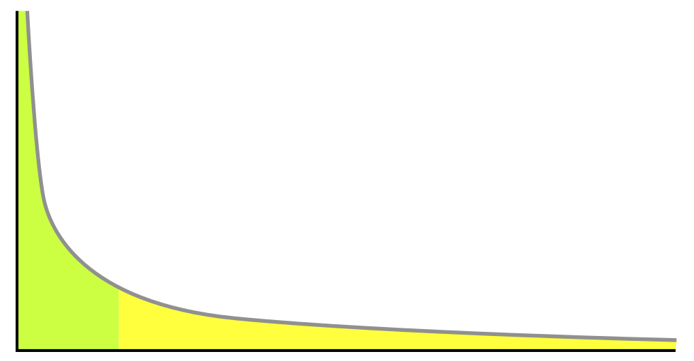
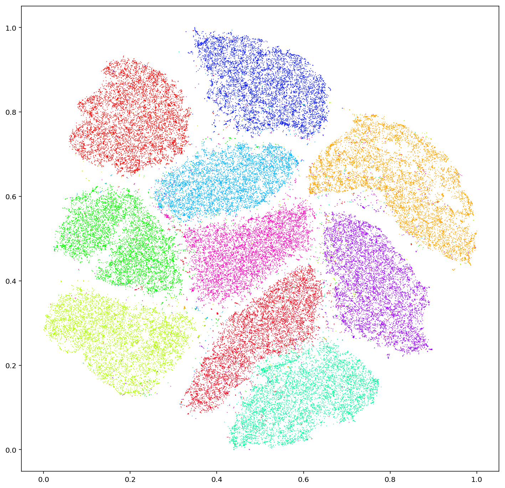
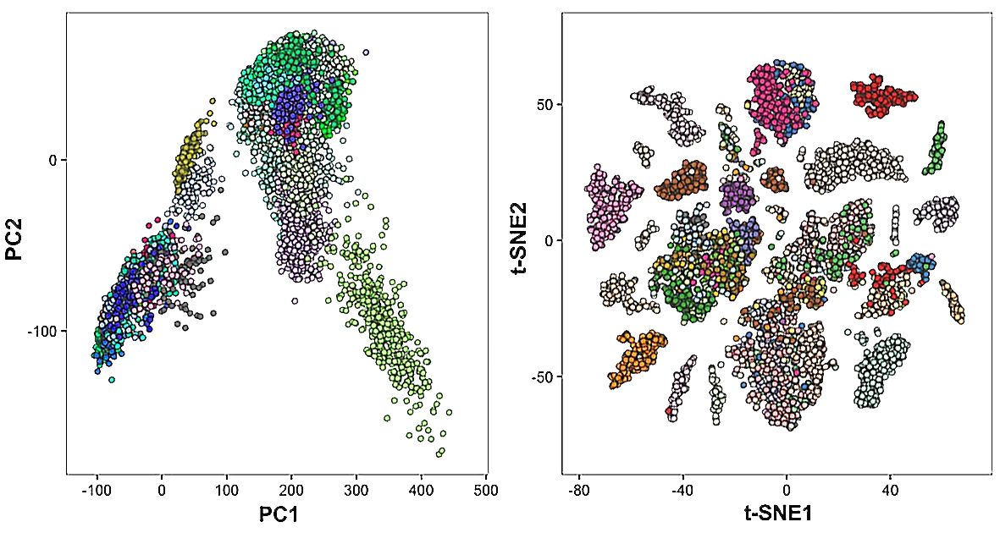

# 120,000 Images Can Still Be Wrong

_Five diagnostic signals for AI-Ready Data — what DataClinic learned from 12 million images_

## Executive Summary

> [!callout]
> Most AI project failures begin with the data, not the model. Gartner forecasts that by 2030, half of all AI agent deployment failures will trace back to data governance issues. Yet few teams can answer the question — "Is this data fit for AI training?" — with diagnosis rather than intuition.

> This post distills the five signals Pebblous DataClinic has repeatedly observed while diagnosing 134 datasets and 12 million images — integrity, balance, pixel diversity, feature-space distribution, and class separability. Each signal is measured across a three-stage diagnostic structure (pixel layer L1 and task layers L2/L3) and mapped to the quality measures defined in ISO 5259-2, showing how a failure in any one signal cascades into a specific kind of model failure.

> The conclusion is simple. AI-Ready Data is not "perfect data" — it is "diagnosed data." Only when all five signals turn green does the dataset earn the right to enter training. A model trained without diagnosis inherits the ambiguity of the data it was fed, no matter how plausible its predictions appear.

<!-- stat-card -->
**6%** — Label Errors — ImageNet val set (Cornell)

<!-- stat-card -->
**11.2%** — Extreme Imbalance — 15 of 134 datasets > 100×

<!-- stat-card -->
**61** — Overlapping Classes — Places365 feature space

<!-- stat-card -->
**91→** — Surface looks fine — Deepfake L1 trap

<!-- stat-card -->
**3 Axes** — Quality Frame — Accuracy · Consistency · Completeness

## Clean on the Surface, Broken Underneath — What L1 Misses That L2/L3 Catches

Viewing image data through a single layer is a common way to be fooled. Datasets that look clean at the pixel level often collapse during training, and the cleanliness was never the problem. DataClinic splits diagnosis into three stages: L1 is the pixel-level health check, L2 is feature-space analysis on a general-purpose embedding (Wolfram 1280-dim), and L3 is precision diagnosis with domain-specific models.

One case makes the need for three layers concrete. Star-MNIST passes every L1 grade with flying colors, but its L2 Geometry score drops to "poor." A dataset that looks pristine at the pixel level has scrambled class boundaries in embedding space. Polishing the surface and inspecting the substance are different operations.

DataClinic's L1–L3 measures map one-to-one with the quality measures (QM) of ISO 5259-2. Completeness (Com-ML), Consistency (Con-ML), Balance (Bal-ML), Diversity (Div-ML), Similarity (Sim-ML), Representativeness (Rep-ML), Effectiveness (Eft-ML), and Accuracy (Acc-ML) each connect to one of the five signals. Standards stop being abstract documents when they reduce to measurable numbers — that is the moment data governance becomes a measurable activity.

> [!callout]
> **Key observation**: Datasets can look healthy on the surface and be rotten underneath. Pixel statistics may be clean while class boundaries are tangled in embedding space. A Deepfake dataset that scores 91 at L1 turns out to have Fake and Real almost completely mixed at L2. AI-Ready status cannot be decided by a single diagnostic layer.

## Signal 1 — Integrity: When the Data Itself Lies

The first signal to inspect is the honesty of the data. Do the image files open? Are there empty frames hidden in the corpus? Above all, do the labels actually match the content? DataClinic measures this with `L1_integrity` and `L1_missingValue`, mapped to ISO 5259-2 Completeness (Com-ML-1) and Consistency (Con-ML-1/3).

Northcutt's 2021 analysis from the Cornell AI Lab was striking. About 6% of the ImageNet validation set was mislabeled — a dataset the academic community had used as a benchmark for over a decade. The assumption that "scale will compensate for noise" is at its most dangerous exactly when this signal is weak. The model accepts wrong labels as truth, and any accuracy figure built on top of them becomes a number disconnected from reality.


*▲ Per-class samples from MNIST, the canonical handwritten-digit dataset. Even labels that look unambiguous to humans can be wrong for roughly 6% of an entire validation set (Northcutt et al., 2021). | Source: [Wikimedia Commons — Josef Steppan (CC BY-SA 4.0)](https://commons.wikimedia.org/wiki/File:MnistExamples.png)*

Another pattern recurs across the 134 datasets DataClinic has diagnosed. A missing-value rate that scores "good" overall can still be a hidden failure when the gaps concentrate in a single class. If Class A has 0% missing and Class B has 30%, the model effectively never learns Class B. Averages hide the truth.

> [!callout]
> **Reading the signal**: When label integrity is low, the model learns wrong answers. The most common mistake is trying to mask integrity problems with scale. 120,000 images do not help when 7,000 of them carry wrong labels — the model dutifully learns 7,000 lies alongside the rest.

## Signal 2 — Balance: Minority Classes Don't Get Learned

The second signal reveals itself in the simplest chart possible. Image counts per class — a bar chart in which some columns rise like mountains and others sit flat on the floor. DataClinic's `L1_classBalance` measures this gap and corresponds to ISO 5259-2 Balance (Bal-ML-1/2/3).

Of the 134 datasets DataClinic has diagnosed, 15 (11.2%) had class imbalance ratios exceeding 100×. The most extreme case was OpenImages, where the smallest class contained 3 images and the largest 220,154 — a 70,000× gap. A model trained on such a dataset might report 95% accuracy, but most of that 95% comes from the majority classes, while the minority classes are effectively ignored.


*▲ The classic long-tail distribution. A few head classes carry abundant samples while the tail classes — collectively large — receive too few samples for the model to actually learn them. | Source: [Wikimedia Commons — Hay Kranen (Public Domain)](https://commons.wikimedia.org/wiki/File:Long_tail.svg)*

On unbalanced data, accuracy becomes a tool for hiding the truth. Without F1-score, precision-recall curves, and per-class evaluation, you cannot know what the model actually does. The deeper problem sits earlier in the workflow: many teams never plot the class distribution at all. The chart that takes a single line of code stays unplotted, and the model quietly learns an invisible bias.

> [!callout]
> **Reading the signal**: Class imbalance over 100× effectively erases minority classes from the learning process. Before adding more data, look at the distribution. A single bar chart can break the illusion that 120,000 images create.

## Signal 3 — Pixel Diversity: Scale and Variety Are Not the Same

The third signal violates intuition more often than any other. More images do not mean more variety. DataClinic's `L1_statistics` measures how diverse resolution, brightness, and channel distributions are within each class, mapped to ISO 5259-2 Diversity (Div-ML-1/2/3).

Two versions of the Birds dataset offer an instructive contrast. Birds 450 resized everything to 224 pixels, erasing the variation in camera, distance, and lighting along the way — and earned a "poor" L1_statistics grade. Birds 525 kept the original resolutions (45px–4,763px), preserving pixel-level diversity, and received a "good" grade on the same measure. Same birds. Different dataset. Different fate.

ImageNet provides the more sobering case. A massive dataset with over 1.43 million images received a "poor" grade on `L1_statistics`. Scale does not guarantee diversity. 100,000 images taken under the same lighting, background, and conditions may carry less training value than 10,000 images shot under varied ones. The classic failure mode where a model breaks in a new environment has its roots here.

> [!callout]
> **Reading the signal**: The equation "more images = better data" is false. When pixel diversity is low, the model performs well only inside the conditions it was trained on, and stumbles the moment those conditions change. Diversity is a question of distribution, not count.

## Signal 4 — Feature Space: The Duplicates and Outliers Pixels Can't Show You

With the fourth signal, the inspection leaves the world of pixels and enters the world of embeddings. DataClinic's L2 stage projects every image into a general-purpose embedding space (Wolfram, 1280-dim) and analyzes density and cluster structure inside it. `L2_geometry` and `L2_distribution` measure this domain, mapped to ISO 5259-2 Similarity (Sim-ML-1/2/3) and Representativeness (Rep-ML-1).


*▲ MNIST projected to 2D via t-SNE. Each color is a digit class; inter-cluster distance and density are exactly the signals DataClinic reads — but on a 1280-dim Wolfram embedding rather than raw pixels. | Source: [Wikimedia Commons — Kyle McDonald (CC BY 2.0)](https://commons.wikimedia.org/wiki/File:T-SNE_Embedding_of_MNIST.png)*

The first problem visible in feature space is near-duplicates. Different crops of the same image, or subtly modified copies, cluster unnaturally tight at a single point, and the model spends training cycles re-learning them. Stanford and MIT researchers (Recht et al., 2019) revealed that ImageNet's train and validation sets contain data leakage — raising direct questions about the reliability of model performance numbers measured on that dataset.

The second problem is outliers. An image labeled Class A but sitting closer to Class B in feature space is most likely a labeling error. When DataClinic diagnosed a Korean traditional ink-wash painting dataset (Report #194), the overall score was 57, and `L2_distribution` dropped to "Medium." Some of the 74 classes had drifted into each other's territory in feature space. The labeling looked tidy on the surface, but boundaries had collapsed once the data was embedded.

> [!callout]
> **Reading the signal**: Duplicate images waste training cycles and force biased repetition. Outliers may be signals of mislabeling. Neither is visible from pixels alone — you have to visualize the feature space. That is exactly why DataClinic's Data Diet feature prunes redundancy from high-density clusters.

## Signal 5 — Separability: When the Model Isn't Wrong, the Data Is Ambiguous

The fifth signal surfaces last and matters most. How clearly are class boundaries drawn? Are images within the same class close to each other, and far from images in other classes? DataClinic measures separability with `L2_dataLens`, `L3_geometry`, and `L3_distribution`, mapped to ISO 5259-2 Effectiveness (Eft-ML-1/2/3) and Accuracy (Acc-ML-7).

Places365 demonstrates what this signal really means. At the surface (L1) the classes were evenly distributed and pixel diversity looked solid. But the L2 analysis revealed **61 classes** overlapping in feature space. "Library" and "office," "beach" and "coastline" are categories humans themselves confuse — and that ambiguity passes straight to the model as a training signal.


*▲ PCA (left) vs t-SNE (right) projections of the same data. Whether classes appear interleaved or distinctly clustered is the visual signature of separability — the same plane on which Places365's 61 overlapping classes and Deepfake's Fake/Real mixture become legible. | Source: [Wikimedia Commons (CC BY-SA 4.0)](https://commons.wikimedia.org/wiki/File:T-SNE_and_PCA.png)*

A more dramatic case is the Deepfake face dataset (Report #169). With over 190,000 images and an L1 total score of 91, the dataset looked excellent on the surface. The L2 analysis told a different story: Fake and Real images were almost entirely interleaved in feature space. The fundamental difficulty of deepfake detection was visible at the data layer. The L3 stage compresses the 1280-dim embedding into lower dimensions through domain-specific models, measuring separability with even more precision.

> [!callout]
> **Reading the signal**: When class separability is low, no model — however good — can avoid confusion. The responsibility shifts from the model to the data. The AI is not getting it wrong; the data is ambiguous. Trying to drive up accuracy on poorly separated data is, in essence, trying to answer the wrong question.

## Five Signals in One Table — What Breaks When Each One Fails

Diagnosis that fits inside one table is what eventually changes the decision. We put each of the five signals on the same row as the DataClinic measure that reads it, the ISO 5259-2 quality measure it answers to, and the specific way the model breaks when that signal turns red.

| Signal | DataClinic Measure | ISO 5259 QM | Failure Mode |
| --- | --- | --- | --- |
| Integrity | L1_integrity, L1_missingValue | Com-ML-1, Con-ML-1/3 | Learns wrong answers as facts |
| Balance | L1_classBalance | Bal-ML-1/2/3 | Minority classes ignored |
| Pixel Diversity | L1_statistics | Div-ML-1/2/3 | Generalization failure |
| Feature Distribution | L2_geometry, L2_distribution | Sim-ML-1/2/3, Rep-ML-1 | Duplicate learning, outlier bias |
| Separability | L2_dataLens, L3_geometry | Eft-ML-1/2/3, Acc-ML-7 | Class confusion |

****````****``****``****````****````

After diagnosing 134 datasets and 12 million images, the most frequent pattern DataClinic encounters is "high surface scores with low depth scores." Datasets that pass L1 but collapse at L2/L3 force model training to begin already carrying hidden risk. Only the datasets that pass all five signals earn the label "AI-Ready."

> [!callout]
> **Practical note**: It is not unusual for a dataset that scores 65 at first to climb above 90 after the identified problems are fixed. Data cleaning is not about adding more — it is about aligning the signals. Before chasing another 120,000 images, look at the five signals of the data you already have. It is faster and more accurate.

## AI-Ready Data — When All Signals Turn Green

AI-Ready Data is not perfect data. It is data in which all five signals have been measured, the status of each is known, and a recovery plan exists for any signal that has fallen. Diagnosability matters more than perfection; traceability matters more than cleanliness.

Pebblous defines its data quality work along three axes — accuracy, consistency, and completeness — for exactly this reason. Integrity and separability connect to accuracy; balance and feature distribution to consistency; pixel diversity and missing values to completeness. The five signals are the measurable expression of those three axes. Where DataClinic's diagnosis ends, Data Greenhouse (agentic autonomous data operations) begins, training and monitoring diagnosed data on its own.

Pebblous DataClinic is now used by customers across 34 countries and is registered as an Innovation Product by Korea's Public Procurement Service. But the tool matters less than the shift in question. From "Do we have enough data?" to "Has the data been diagnosed?" The five signals are the starting point of that shift — and the success of an AI project tracks more closely with the answer to that question than with the choice of model.

> [!callout]
> **Closing question**: Of the five signals in the dataset you are about to train on, how many have you actually measured? If the answer is "none," diagnosis comes before training. 120,000 images can still be wrong, and unmeasured data remains nothing more than potential until it is measured.
