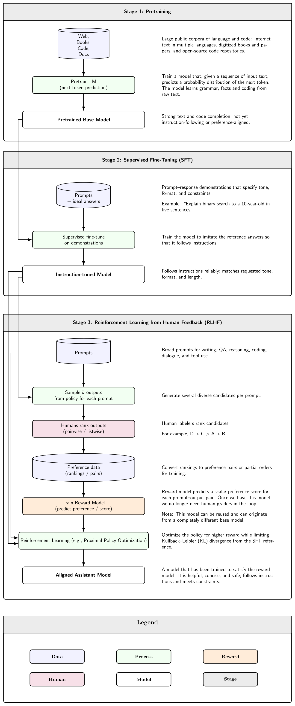
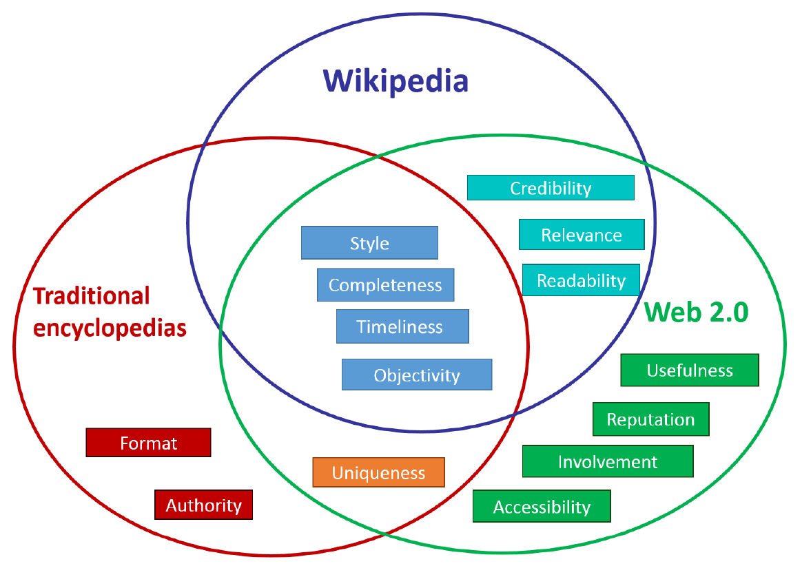
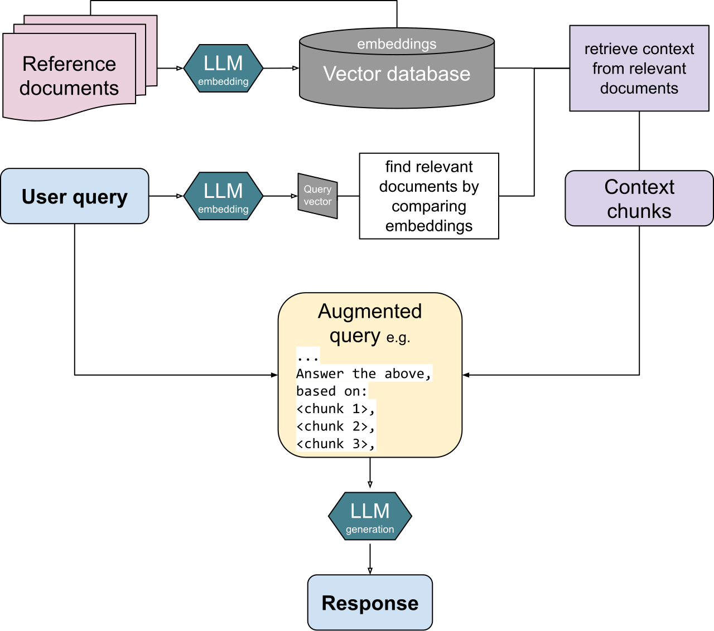

# It Starts With the Data, Not the Model

_The four things data must have in the era of LLMs and agents_

## Executive Summary

> [!callout]
> Many AI projects fall short of expectations even with a strong model in hand. It is tempting to blame the model architecture or the prompt, but a large share of these failures begins one step earlier, in the data. This article is a guide to answering one question — "Is our data in a state we can actually use for AI?" — not by intuition, but by concrete criteria.

> In a survey by the data reliability company Monte Carlo, roughly 30% of generative AI projects were reported to stall because of data quality problems. In other words, tidying up the data often yields a bigger gain than swapping out the model. AI-Ready Data does not mean perfect data. It means data whose quality fits its intended use, whose origin and transformation history can be traced, and whose access and accountability are managed.

> Below we work through the definition of AI-Ready Data, the seven quality dimensions that tie directly to model performance, the role of metadata and lineage, why governance has grown heavier in the era of LLMs and agents, and the additional conditions that RAG and agent environments demand. The final section offers a step-by-step set of checkpoints you can apply starting today.

### Key Figures

The four numbers below tell the same story from different angles. Around 30% of generative AI projects stall because of data quality rather than the model, and more than half — 55% — of the causes behind hallucination, where an LLM gives an answer that does not match reality, trace back to data. Conversely, when data is well prepared in a searchable form and connected to the model, the hallucination rate drops from 50% to 13.9%. Underscoring this shift, the market for lineage tools that track where data came from and how it was transformed is growing 23.1% a year.

Sources: Monte Carlo, IJCOA · SQ Magazine, arXiv 2411.12759, GlobeNewswire (Apr 2026)

<!-- stat-card -->
**30%** — Data-driven failure — Gen-AI projects that stall on data quality

<!-- stat-card -->
**55%** — Hallucination cause — Share of LLM hallucination tied to data

<!-- stat-card -->
**50→13.9%** — RAG effect — Hallucination rate before vs. after retrieval

<!-- stat-card -->
**23.1%** — Lineage market CAGR — Annual growth of the data lineage market

## What AI-Ready Data Means

The phrase "good data" has been around for a long time. Data with no typos, few blanks, and a uniform format. That standard was enough when a person was reading a report or building a dashboard. But once models — not people — began learning from data and using it for inference, the bar for "usable" moved. AI-Ready Data is the name for that shifted bar.

Gartner defines AI-Ready Data as data that "represents all the patterns, errors, and edge cases that can appear within the intended AI use case." The crux is that phrase — "intended use." The same data can be ready or not ready depending on what it is used for. Documents meant for fact retrieval fall short if you drop them straight into model training, and data refined for training may be too stale for real-time recommendation.

### 1.1. Requirements That Change With the Use Case

AI uses data in four broad ways: large-scale pretraining, fine-tuning for a specific task, RAG — retrieving external documents at inference time and attaching them — and agents that call tools and carry out work on their own. Each places different demands on the data. Training wants vast volume and representativeness; RAG wants a searchable structure and trustworthy sources; agents demand access permissions and traceability of their actions.

*▲ The three stages of LLM training (pretraining → fine-tuning → RLHF) and the data each one needs — the conditions on data change with the use case | Source: [Wikimedia Commons](https://commons.wikimedia.org/wiki/File:Three-stage_large_language_model_training_workflow.svg)*

### 1.2. How It Differs From Traditional "Clean Data"

Where traditional data quality focused on accuracy and consistency of format, AI-Ready Data adds three things on top. The first is representativeness: the data must resemble the distribution of situations you will actually meet. The second is lineage: you must be able to follow where data came from and how it changed. The third is governance: who can access it, with what permission, and who is accountable must be defined. Without these three, data can look clean yet still be hard to trust with AI.

> [!callout]
> **One-line definition**: AI-Ready Data is data that, for a specific AI use case, meets the bars of accuracy, completeness, consistency, timeliness, and representativeness; whose origin and transformation history can be traced; and whose access and accountability are managed. It is not "perfect data" but "data prepared for a purpose and traceable."

## Seven Quality Dimensions That Make or Break Your Model

Data quality is not a single score but a set of axes. Data quality surveys from IBM and academia typically list around eight dimensions; the seven that matter most in an AI context, mapped to model performance, are below. Reading each one alongside "how the model fails when this breaks" turns an abstract quality discussion into a concrete diagnostic list.

*▲ The dimensions that make up information quality — completeness, timeliness, and uniqueness remain core axes in any data-quality discussion too | Source: [Wikimedia Commons](https://commons.wikimedia.org/wiki/File:Wiki-quality-dimensions.png)*

### 2.1. The Four Foundational Dimensions

The four oldest axes are still the ones that break most often.

- •**Accuracy**: Do the values match reality? Train on wrong data and the model accepts wrong patterns as fact — and the accuracy numbers stacked on top become numbers unrelated to the truth.
- •**Completeness**: Are the values you need present without gaps? When too much is missing, the model never learns some patterns at all and its results lean toward the data that remains.
- •**Consistency**: Is the same entity represented the same way across systems? If "Robert Smith" and "Bob Smith" are treated as two people, the model splits one entity in two and gets confused.
- •**Timeliness**: Does the data reflect the present? Models trained on frozen, past data tend to hallucinate more when asked about recent events.

### 2.2. The Three Dimensions the AI Era Added

Once model training joined the list of uses, three more axes rose sharply in importance.

- •**Representativeness**: Does the data resemble the real distribution? A skewed sample makes a skewed model. Analyses of LLM hallucination, which find that training-data bias accounts for the largest share, bear this out.
- •**Validity**: Do values fit the expected range, format, and type? A string in a date field or a negative number in a probability field lets errors spread quietly throughout the training pipeline.
- •**Uniqueness**: Are records free of duplication? When duplicates pile up, the model mistakes a pattern for being more frequent than it is and over-learns it.

These seven dimensions are not independent checkboxes; they interlock. When consistency breaks, the measurement of uniqueness goes off; when representativeness is lacking, accuracy numbers look good only for certain groups. So rather than watching one or two metrics, it is safer to record the state of all seven axes for every dataset.

> [!callout]
> **A practitioner's view**: Raising data quality by one notch often brings a larger performance gain than reworking the model architecture. Measure which dimension is weak first, and where to spend effort becomes clear.

## Metadata and Lineage — Data's Résumé

If quality is the "state" of data, metadata and lineage are its "history." Metadata is data about data — origin, collection method, owner, retention period, the legal basis for collection, consent status, and the like. Lineage goes a step further, recording the path: where data started, what transformations it went through, and which tables and models it flowed into.

### 3.1. What Happens Without Lineage

When a model returns a strange answer and lineage is broken, the hunt for the cause leads into a maze, because you cannot trace back which transformation of which source created the problem. With lineage that reaches down to the column level, you can trace a faulty output back to the input it came from and fix a single spot. Debugging time shrinks, and the same mistake stops repeating.

### 3.2. Regulation Is Making Lineage Mandatory

Lineage is moving from optional to obligatory. The EU AI Act enforces most of its obligations, including those for general-purpose AI (GPAI), from August 2, 2026, requiring that the origin and processing of training data be documented. Answering the question "Can you explain what this model learned?" presupposes lineage records. Against this backdrop, the data lineage market is projected to grow from about US$1.78 billion in 2025 to about US$2.19 billion in 2026, a 23.1% annual rate.

*▲ The European Parliament chamber that passed the EU AI Act — documenting the origin and processing of training data has become a legal obligation | Source: [Wikimedia Commons (Diliff)](https://commons.wikimedia.org/wiki/File:European_Parliament_Strasbourg_Hemicycle_-_Diliff.jpg)*

> [!callout]
> **The point**: Metadata and lineage are easy to overlook day to day, then prove their value the moment something breaks or a regulator asks. If you do not record them while gathering the data, the cost of reconstructing them later is far higher.

## Governance — Infrastructure of Trust

Data governance is the framework for systematically managing the quality, security, privacy, and access permissions of the data AI handles. Think of it as a set of commitments: set the rules, check who is keeping them, and correct course when they are broken. As LLMs and agents began reading and writing data deep inside organizations, the weight of governance grew considerably heavier.

### 4.1. What Governance Covers

Putting Gartner's components of AI data governance into practitioner's terms gives the following.

- •**Validation and verification**: Inspect data regularly not only in development but also while it is in production.
- •**Version control**: Keep versions of the data so you can respond to drift in its distribution and roll back when something goes wrong.
- •**Continuous regression testing**: Repeatedly check whether the data or model has quietly degraded.
- •**Observability metrics**: Monitor the delivery, freshness, and accuracy of data to make its health visible.
- •**Bias and ethics management**: Filter out biased data ahead of time and set ethical standards for using real customer data in training.

### 4.2. Agents Make Governance Harder

Agents read data and call tools without going through human approval at every step. It is not unusual for a fleet that started with dozens of agents to swell into the hundreds or thousands. At that point, unless you record which agent can access which data and what it did, control becomes practically impossible. The risk of RAG surfacing sensitive information while searching internal documents, or of personally identifiable information (PII) slipping into fine-tuning, comes from the same root. Governance is the institutional device that blocks that risk.

> [!callout]
> **A shift in perspective**: See governance as "regulation that slows you down" and you will keep putting it off. But in the agent era, governance is the very infrastructure that lets you scale automation with confidence. Trust is what lets you hand over authority, and handing over authority is what makes automation meaningful.

## Added Conditions for the RAG and Agent Era

The center of gravity in using AI is shifting from training to application. Rather than train a new model, more and more teams attach internal data to an existing model through retrieval (RAG) or let agents call tools to get work done. As the center of gravity moves toward the application stage, the conditions demanded of the data change too.

### 5.1. What RAG Demands of Data

When a question comes in, RAG retrieves relevant documents and feeds them to the model. Because the quality of retrieval becomes the quality of the answer, shaping data into a "searchable form" becomes critical. The key parts are chunking that splits documents into appropriate semantic units, embeddings tuned to the domain, hybrid search that uses vector and keyword search together, and a layer that re-ranks and filters the results. In practice, the point where retrieval fails is almost always the search step, not the model. The report that hallucination dropped from about 50% to 13.9% when retrieval augmentation was wired in properly shows just how much making data searchable can do.

*▲ How RAG works — documents are embedded into a vector DB, the chunks closest to the query are pulled and attached to the prompt to generate the answer. Retrieval quality becomes answer quality | Source: [Wikimedia Commons](https://commons.wikimedia.org/wiki/File:RAG_diagram.svg)*

### 5.2. What Agents Demand of Data

Agents judge for themselves what to read and how to act. So two more things are needed. First, scope of access: the data an agent uses for a decision must stay within an allowed boundary. Second, an action record: what an agent read and what it did must remain as part of the lineage so it can be audited later. When agents pass data among themselves, the permission and source information attached to that data must travel with it — otherwise permissions leak along the way.

> [!callout]
> **In short**: If data for training was "abundant and representative," data for RAG and agents is "searchable, permission-defined, and action-traceable." Even the same data has to be prepared again when the way it is used changes.

## Practical Checkpoints — Starting Today

Once you understand the concepts, the next step is applying them. Try to have everything at once and you will never start. Split the work into stages — assessment, pipeline, governance, then RAG/agent specialization — and you can begin with a single small dataset. The items below include suggested targets, on the assumption that you will adjust them to your own organization's situation.

### 6.1. Step 1 — Assess the Current State

- •Build an inventory of your core data sources. Gather origin, refresh cadence, and owner into a single table.
- •Score the four axes of accuracy, completeness, consistency, and timeliness to expose where you are weak.
- •Measure your missing-value and duplicate rates. It varies by data type, but under 5% missing and duplicate in your key columns is a reasonable first target.

### 6.2. Step 2 — Build the Pipeline

- •Define a metadata schema. Make origin, the legal basis for collection, consent status, and transformation history mandatory fields.
- •Turn on column-level lineage tracking. Snowflake, Databricks, BigQuery and others record much of it automatically through built-in features.
- •Wire quality validation automatically into the pipeline. The cost of finding a problem after deployment is far higher than the cost of catching it before.

### 6.3. Step 3 — Apply Governance

- •Classify data access permissions into tiers and spell out the scope an AI agent is allowed to reach.
- •Apply the same masking policy for personal and sensitive information to the sources RAG searches.
- •Turn on data drift monitoring and periodically compare the distribution at training time with the current one.

### 6.4. Step 4 — RAG/Agent Specialization (Where Applicable)

- •Consider moving from fixed-size chunking to context-aware chunking.
- •Set up hybrid search that combines vector search with keyword (BM25) search.
- •Put a layer in place to re-rank and filter retrieval results, and fold agents' action logs into the lineage.

> [!callout]
> **Where to start**: You do not have to finish all four steps at once. Pick your single most important dataset and run Step 1 assessment on it, and the vague question "Is our data in a state we can use for AI?" turns into a set of measurable items. Data that has not been measured is not prepared — it is merely a possibility.

> [!callout]
> **Editor's Note**: Pebblous defines data quality along three axes — accuracy, consistency, and completeness — and uses DataClinic to diagnose a dataset and show, in measurable form, which signal has broken down. The seven dimensions and the lineage-and-governance lens covered in this article are the thinking behind that diagnosis. If you are interested in shifting the question from "Do we have enough data?" to "Has our data been diagnosed?", we suggest starting by measuring the quality dimensions of the data you already hold.

## References

### Academic Papers

- 1.Zhou, Y., Tu, F., Sha, K., Ding, J., & Chen, H. (2024). "[A Survey on Data Quality Dimensions and Tools for Machine Learning](https://arxiv.org/abs/2406.19614)." _IEEE International Conference on Artificial Intelligence Testing (AITest 2024)_.
- 2.Sng, G., Zhang, Y., & Mueller, K. (2024). "[A Novel Approach to Eliminating Hallucinations in Large Language Model-Assisted Causal Discovery](https://arxiv.org/abs/2411.12759)." arXiv:2411.12759.

### Industry Reports & Press

- 3.SQ Magazine. (2026). "[LLM Hallucination Rate Up to 82%: 40+ Stats (2026)](https://sqmagazine.co.uk/llm-hallucination-statistics/)."
- 4.Gartner. (2024). "[Gartner Predicts 30% of Generative AI Projects Will Be Abandoned After Proof of Concept By End of 2025](https://www.gartner.com/en/newsroom/press-releases/2024-07-29-gartner-predicts-30-percent-of-generative-ai-projects-will-be-abandoned-after-proof-of-concept-by-end-of-2025)." Gartner Newsroom.
- 5.Research and Markets / GlobeNewswire. (2026). "[Data Lineage for Large Language Model (LLM) Training Market Report 2026](https://www.globenewswire.com/news-release/2026/04/20/3277230/28124/en/data-lineage-for-large-language-model-llm-training-market-report-2026-total-revenue-set-to-more-than-double-during-2026-2030-as-ai-investments-and-compliance-needs-rise.html)."

### Official Documents

- 6.Gartner. (2025). "[AI-Ready Data Essentials to Capture AI Value](https://www.gartner.com/en/articles/ai-ready-data)." Gartner Articles.
- 7.IBM. (2026). "[Why AI Data Quality Is Key To AI Success](https://www.ibm.com/think/topics/ai-data-quality)." IBM Think.
- 8.European Parliament and Council of the EU. (2024). "[Regulation (EU) 2024/1689 — EU AI Act, Articles 10 & 53](https://artificialintelligenceact.eu/article/10/)." Official Journal of the EU.
