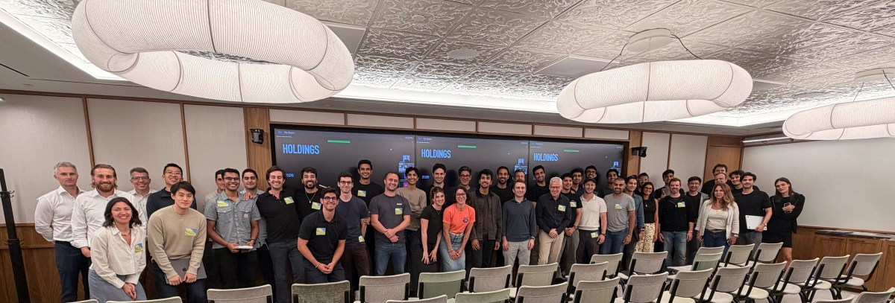

# 회계법인 50곳의 업무 기록을 사들인 AI 롤업

_20억 달러를 조달한 Thrive Holdings가 세무 신고 7,000건을 98% 정확도로 처리했다_

## Executive Summary

> [!callout]
> Thrive Holdings가 새로 조달한 20억 달러는 AI 스타트업이 아니라 동네 회계법인과 IT 서비스 회사를 사는 데 쓰입니다. 이번 조달로 기업가치는 120억 달러가 됐고 소프트뱅크와 D1 캐피털 파트너스, 알티미터 캐피털이 들어왔습니다. 플랫폼에 올라온 회사는 이미 70곳을 넘었습니다.

> 회계 부문 Current가 OpenAI와 함께 만든 세무 신고 에이전트는 신고서 7,000건 이상을 98% 정확도로 처리했습니다. 같은 발표에서 회사는 현장 업무와 현지 판단, 전문가 서명은 AI가 대체하지 않는다고 못박았습니다. 두 문장을 나란히 놓으면 나머지 2%를 누가 언제 찾아내는가라는 질문이 남습니다.

> 질문을 데이터 실사 쪽으로 옮겨 보면 답이 어디에 있는지가 보입니다. 정확도를 재려면 정답이 있어야 하고, 회계에서 그 정답은 인수한 법인들이 수십 년간 쌓아 둔 신고서와 서명 이력 안에 있습니다. 롤업의 배수가 갈리는 자리도 대개 거기입니다.

### 주요 수치

앞의 두 숫자는 이 전략이 지금까지 만든 규모와 성과이고, 뒤의 두 숫자는 그 성과가 값으로 바뀌려면 통과해야 하는 관문입니다.

출처: [TechCrunch (2026-08-12)](https://techcrunch.com/2026/08/12/openai-backed-thrive-holdings-raises-2b-to-bring-ai-to-the-enterprise/), [The Finance Story](https://thefinancestory.com/private-equity-accounting-roll-ups-hitting-reality-check)

<!-- stat-card -->
**70곳 이상** — 플랫폼에 올라온 회사 — 회계 50곳 이상, IT 20곳 안팎

<!-- stat-card -->
**36배** — 헬프데스크 해결 시간 단축 — IT 부문 Shield 기준

<!-- stat-card -->
**최소 140건** — 98%가 남긴 나머지 2% — 7,000건으로 환산, 오류 정의는 미공개

<!-- stat-card -->
**4~6배 → 7~10배** — 회계법인 EBITDA 배수 — 전통 법인과 PE 플랫폼의 거래 구간

## 20억 달러가 산 것은 회사 70곳이다

Thrive Holdings는 조슈아 쿠슈너의 Thrive Capital에서 갈라져 나온 지주회사입니다. AI를 만들어 파는 대신 AI를 심을 회사를 사들입니다. 회계 부문 Current에는 회계법인 50곳 이상과 전문가 2,000명 이상이 모여 있고, IT 서비스 부문 Shield에는 20곳 안팎이 들어와 있습니다. Current의 전신은 2023년 출발한 Crete Professionals Alliance입니다.

*▲ Current·Shield 산하로 모인 회계·IT 서비스 전문가들. 70곳이 넘는 인수 대상 각각에서 이런 팀들이 통째로 넘어온다 | Image Credits: Thrive Holdings, via [TechCrunch (2026-08-12)](https://techcrunch.com/2026/08/12/openai-backed-thrive-holdings-raises-2b-to-bring-ai-to-the-enterprise/)*

새로 받은 자금의 일부는 세 번째 축으로 갑니다. 건물과 인프라 같은 물리적 자산에 붙는 규제 대응 서비스입니다. 회계와 IT를 먼저 고른 이유는 업계에서 흔히 꼽는 조건과 겹칩니다. 처리량이 많고 규칙이 정해져 있으며 결과가 문서로 남습니다. 그리고 이런 회사가 파는 상품은 결국 사람의 시간이라, 처리 시간이 줄면 마진이 곧바로 움직입니다.

여기까지는 전형적인 사모펀드 롤업과 다르지 않습니다. 달라지는 지점은 인수와 함께 넘어오는 물건입니다. 회계법인 한 곳을 사면 고객 명부와 인력만 오는 것이 아니라, 그 법인이 몇 년에 걸쳐 만든 신고서와 조서, 검토 메모, 수정 이력이 함께 옵니다. IT 회사를 사면 헬프데스크 티켓과 응대 기록이 옵니다. 인수 계약서에 자산으로 적히는 항목은 아니지만, 업무를 대신할 에이전트를 만들고 그 결과가 맞는지 확인하는 재료는 그쪽에 있습니다.

같은 소프트웨어를 밖에서 사다 붙이는 회사와 이 구조의 차이도 거기서 생깁니다. 밖에서 산 도구는 이 법인이 지난해 어떤 고객의 어떤 항목에서 무엇을 놓쳤는지 모릅니다. 70곳을 한 지붕 아래 모으면 그 기록이 한곳에 쌓이고, 쌓인 기록은 다음 자동화의 학습과 검증 재료가 됩니다. 사들인 것을 회사라고 부르든 업무 기록이라고 부르든, 값이 붙는 쪽은 후자에 가깝습니다.

## OpenAI가 받는 대가는 지분이다

2025년 12월 OpenAI는 Thrive Holdings의 지분을 가져갔습니다. 조건은 공개되지 않았고, 포트폴리오 회사의 성과에 따라 그 지분이 커지는 구조로 알려졌습니다. 대신 OpenAI는 자기 직원을 포트폴리오 회사 안으로 보내 제품을 만들고 시스템을 심습니다. 응용연구를 총괄하는 보리스 파워는 Thrive Holdings 쪽 직책을 함께 맡고 있습니다. 세무 신고 에이전트도 OpenAI의 코딩 에이전트 Codex를 써서 양쪽이 함께 만들었습니다.

소프트웨어 회사가 좌석 수나 호출 건수로 돈을 받는 방식과는 계산이 다릅니다. 고객사가 실제로 더 벌어야 파는 쪽도 법니다. 그러면 모델이 현장에서 얼마나 맞히는지가 매출 지표가 되고, 그 확인은 고객사의 업무 기록 위에서만 가능합니다. 회계법인 50곳이 매년 만드는 신고서는 이 구조에서 평가 데이터의 역할을 겸합니다.

같은 형태의 거래가 여럿입니다. OpenAI는 TPG와 브룩필드, 베인 캐피털이 받치는 The Deployment Company와도 엮여 있고, 앤스로픽은 Ode를 통해 비슷한 자리를 잡았습니다. 제너럴 캐탈리스트는 회계법인 Accrual을 포함해 전문 서비스 회사를 직접 사들이는 조직을 만들었습니다. 모델을 파는 경쟁이 업무를 사는 경쟁으로 옮겨 가고 있다고 읽어도 무리가 없습니다.

비판도 같이 나왔습니다. Thrive Capital이 양쪽에 지분을 걸치고 OpenAI 인력이 안에 들어가 있는 구조에서는, 성과가 시장의 수요에서 나온 것인지 내부 지원에서 나온 것인지 밖에서 가리기 어렵다는 지적입니다. 회사 쪽은 채워지지 않은 수요가 분명히 있었고 여러 포트폴리오 회사가 먼저 AI 도구를 찾고 있었다고 반박했습니다. 어느 쪽 말이 맞는지는 결국 숫자로 갈리는데, 맨 앞에 놓인 숫자가 98%입니다.

## 98%가 말하지 않는 140건

발표된 성과는 세 가지입니다. 세무 신고 7,000건 이상 처리, 정확도 98%, 참여 법인의 신고 준비 시간 30% 이상 단축. IT 쪽에서는 헬프데스크 해결 시간이 36배 빨라졌고 최근 한 달 사이 배포한 맞춤형 에이전트 수가 두 배가 됐습니다. 처리량과 속도만 놓고 보면 자동화가 먹힌 사례입니다.

나머지 2%를 건수로 바꾸면 140건입니다. 7,000건이 하한이므로 실제로는 그보다 많습니다. 그런데 이 계산에는 확인되지 않은 전제가 하나 있습니다. 98%의 분모가 공개되지 않았습니다. 신고서 한 건을 통째로 맞혔는지 세는 것과, 신고서 안의 항목 하나하나를 맞혔는지 세는 것은 전혀 다른 숫자입니다. 신고서 한 건에 항목이 수백 개라면 항목 정확도 98%는 사실상 모든 신고서에 오류가 있다는 뜻이 됩니다.
