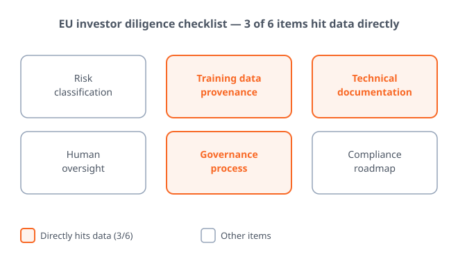
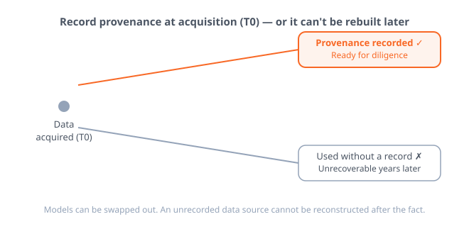
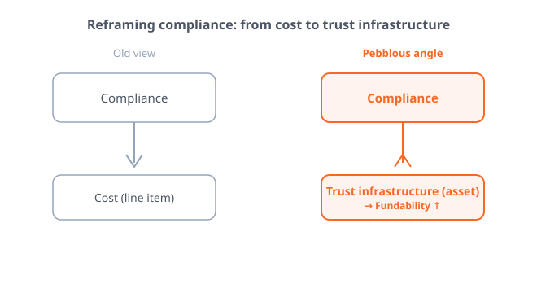

# AI Startup Valuations Now Turn on Data Governance

_In the data room, investors ask for data provenance, audit logs, and governance records before the product roadmap_

## Executive Summary

> [!callout]
> When an AI startup lines up its next round, the first document investors open in the data room is changing. Ahead of the product roadmap and the revenue metrics now sit the paperwork proving where the training data came from, the audit logs, and the record of governance processes. The venture due-diligence question is moving from "what does the product do" to "can you prove how you handle your data."

> The diligence checklist European investors have started using to vet AI startups reduces to six items, and half of them hinge on data. A prepared company clears the bar with an internal assessment for €10K–50K, while a company that walks into diligence unready pays €50K–200K later for a third-party conformity assessment (vctr.media). In front of the same regulation, the cost splits asymmetrically.

> With the EU AI Act's transparency obligations and its enforcement powers over general-purpose AI (GPAI) taking effect in August 2026, that clock is already being priced into diligence practice. The ability to prove data provenance, quality, and audit logs is becoming both regulatory capacity and a trust asset that pulls in capital. The checklist and the cost bands make that shift concrete in numbers.

Four numbers frame this shift: the gap in conformity-assessment cost that regulatory readiness opens up, the share of the investor checklist that data occupies, the maximum fine the EU AI Act carries, and the enforcement clock that pulled all of this forward.

<!-- stat-card -->
**€10K–200K** — Conformity assessment cost — The gap readiness opens (vctr.media)

<!-- stat-card -->
**3 / 6** — Data-related diligence items — Half the investor checklist

<!-- stat-card -->
**3% of revenue** — Max EU AI Act fine — Global revenue or €15M

<!-- stat-card -->
**2026.08** — Transparency & GPAI effective — The rule that moved the clock

## The Due-Diligence Question Changed

Until recently, what an investor asked for when opening the data room was a familiar list: product roadmap, traction metrics, unit economics. For an AI startup, you added a page of model-performance benchmarks and you were done. But a new layer of diligence, one that attaches only to AI, has emerged in how European funds vet AI companies.

The EU investor checklist compiled by the venture-practice outlet vctr.media runs to six items: risk classification, training-data provenance, technical documentation, human-in-the-loop safeguards, governance processes, and a compliance roadmap. Of these, three—training-data provenance, technical documentation, and governance processes—land squarely on data. Half of the six questions, in effect, demand that you "prove your data."

*▲ Pebblous original diagram — 3 of the 6 items on the EU investor diligence checklist land directly on data (reconstructed from vctr.media)*

In the same piece, Ivanna Honina, Head of Legal at the online-learning company Preply, reports that European investors have started checking AI Act conformity from the earliest stages of a deal. The center of gravity of the question has moved—from "what can your product do" to "can you prove where your data came from." The first question is answered with a demo; the second can only be answered with records.

> [!callout]
> **Key observation**: In diligence, data governance is no longer supporting paperwork for the legal team—it has become an item that opens and closes deals. A company that cannot prove data provenance stops at this gate no matter how good the product is.

## Readiness Splits Cost and Speed

The clock behind this shift comes from regulation. The EU AI Act's transparency obligations and its enforcement powers over general-purpose AI (GPAI) take effect in August 2026, with high-risk system obligations following after. The statute itself has been covered in detail elsewhere, so here we compress it to a single line: as the enforcement date nears, investors are pulling those standards forward into diligence well before the rules fully apply. (Background: [the EU AI Act August 2026 deadline report](https://blog.pebblous.ai/report/eu-ai-act-august-2026-deadline-reality/en/))

*▲ An EU AI Act advocacy campaign outside the European Parliament in Strasbourg, 2023 — the law's transparency obligations are now being pulled forward into diligence checklists | Source: [EKO / Wikimedia Commons (CC BY 2.0)](https://commons.wikimedia.org/wiki/File:EKO_-_AI_ACT_-_Strasbourg_Parliament_-_52886760084.jpg)*

Cost splits asymmetrically along readiness. In the bands vctr.media lays out, an internal governance review runs €10K–50K and building a baseline governance package runs €15K–40K. By contrast, a company that enters diligence unready and has to obtain a third-party conformity assessment jumps to €50K–200K. Companies that prepared in advance clear the bar at the low end; only the companies caught flat-footed pay the high end.

More painful than cost is speed. Industry analyses such as prometai observe that diligence on a compliance-unready deal stretches 30–45 days longer (this is a self-reported estimate, so it is safer to read it as direction rather than a hard figure). In the weeks a round slips, market conditions and negotiating leverage change. While a prepared company closes fast at low cost, an unprepared one closes late at high cost. Valuations divide along that difference.

> [!callout]
> **Reading the signal**: Regulatory readiness is not a "do it or not" cost—it is a "when do you pay it" cost. Pay early and it is cheap and fast; defer and it is expensive and slow. In front of the same regulation, that asymmetry hardens into a valuation gap between companies.

## Why Data Governance Is the Axis of Diligence

There is a reason data keeps reappearing across a six-item checklist. Models can be swapped out—if performance falls short, you drop in a better architecture. But proof of where training data came from cannot be manufactured retroactively. When, where, and under what rights you acquired data is an accreting asset: if you do not record it in the moment, it cannot be reconstructed later.

From an investor's vantage point, this means the nature of the risk is different. Product risk can be reduced with time and capital, but the risk of being unable to prove data provenance does not disappear when you pour in more money. Copyright disputes, license violations, and retroactive privacy problems cannot be undone once they surface after a deal has closed. That is why audit logs and data lineage have shifted from "nice to have" to "cannot be without" in diligence.

*▲ Pebblous original diagram — data provenance must be recorded at the moment of acquisition (T0); once missed, it cannot be reconstructed*

GDPR showed the precedent. In the early days after its 2018 rollout, many companies treated records of personal-data processing as a formality. A few years later, GDPR paperwork became a barrier that actually blocked deals in M&A and investment diligence. Companies that had not prepared could not cram years of records together at the last minute. The same curve is likely to repeat with the AI Act and data governance.

> [!callout]
> **Key observation**: Data governance became the axis of diligence because it is the one item you can only build up in advance. Provenance and audit logs cannot be invented later, so the gap between companies that record now and those that do not widens over time.

## Compliance Is Not a Cost—It's Trust Infrastructure

Get this far and you can see the point where the old adage that "compliance is a cost" flips in the capital markets. If a company that can prove data provenance, quality, and audit logs raises capital faster and cheaper, then data readiness is not a line of spending but an asset that lifts valuation. Readiness becomes fundability.

*▲ Pebblous original diagram — compliance is not a line of spending but trust infrastructure and a fundability asset*

This view expands data readiness from a technical task to a question of organizational capability. "AI-ready" is no longer the state of a single dataset but the ability to prove, at the level of the whole organization, where data came from and how it has been managed. This is where Pebblous's long-standing definition of AI-ready data—not "perfect data" but "diagnosed and traceable data"—meets the language of the capital markets.

So the question a startup should be asking now is not "can we avoid the regulation" but "can we prove the origin and history of our data today, right now." If the answer is "not yet," the next round's valuation is likely to be decided not by the product but by that gap. Data governance is not something you do grudgingly because regulation demands it—it is the infrastructure that builds investor trust ahead of time.

> [!callout]
> **Closing question**: Can your company hand a diligence team the provenance and audit logs of its training data within a few days? That answer already tells you much of the valuation you will receive in the next round.

## References

- 1.VCTR Media. (2026). "[The $1M Due Diligence Question: Why EU Funds Are Rejecting AI Startups Over AI Act Compliance](https://vctr.media/en/diligence-2026-what-eu-investors-will-now-check-in-ai-startups-334997/)."
- 2.PrometAI. (2025). "[AI Regulatory Trends 2025: Impact on Startup Fundraising & Growth](https://prometai.app/blog/ai-regulatory-trends-2025-impact-on-startup-fundraising-growth)."
- 3.Holland & Knight LLP. (2026). "[US Companies Face EU AI Act's Possible August 2026 Compliance Deadline](https://www.hklaw.com/en/insights/publications/2026/04/us-companies-face-eu-ai-acts-possible-august-2026-compliance-deadline)." Holland & Knight Insights.
