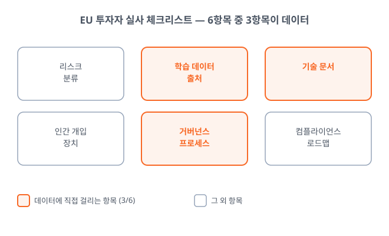
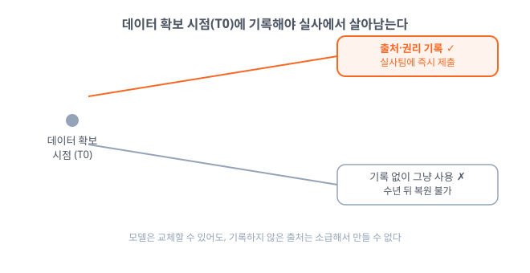
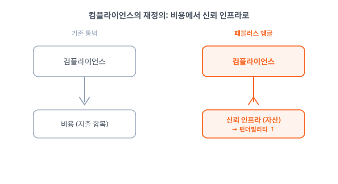

# AI 스타트업 밸류에이션, 이제 데이터 거버넌스가 가른다

_투자자는 데이터룸에서 제품 로드맵보다 데이터 출처·감사 로그·거버넌스 문서를 먼저 요구한다_

## Executive Summary

> [!callout]
> AI 스타트업이 다음 라운드를 준비할 때, 투자자가 데이터룸에서 먼저 열어보는 문서가 달라지고 있습니다. 제품 로드맵과 매출 지표 앞에, 학습 데이터의 출처를 증명하는 문서와 감사 로그, 거버넌스 프로세스 기록이 놓입니다. 벤처 실사(due diligence)의 질문이 "제품이 무엇을 하는가"에서 "데이터를 어떻게 다루는지 증명할 수 있는가"로 옮겨가고 있기 때문입니다.

> EU 투자자들이 AI 스타트업을 심사할 때 쓰기 시작한 실사 체크리스트는 여섯 항목으로 정리되고, 그중 절반이 데이터에 걸려 있습니다. 준비된 회사는 내부 평가로 €1만~5만에 통과하지만, 준비 없이 실사에 들어간 회사는 제3자 인증기관 평가에 €5만~20만을 뒤늦게 치릅니다(vctr.media). 같은 규제 앞에서 비용이 비대칭으로 벌어지는 것입니다.

> EU AI Act의 투명성 의무와 범용 AI(GPAI) 제재권이 2026년 8월 발효되면서, 이 시계는 실사 관행에 미리 반영되고 있습니다. 데이터 출처·품질·감사 로그를 증명할 수 있는 역량은 규제 대응력인 동시에 자본을 끌어오는 신뢰 자산으로 바뀌고 있습니다. 실사 체크리스트와 비용 구간이 그 변화를 구체적인 숫자로 드러냅니다.

아래 네 숫자가 이 변화의 뼈대입니다. 규제 준비도가 벌려 놓는 적합성 평가 비용의 격차, 투자자 체크리스트에서 데이터가 차지하는 비중, EU AI Act가 물리는 과징금 상한, 그리고 이 모든 변화를 앞당긴 시행 시계입니다.

<!-- stat-card -->
**€1만~20만** — 적합성 평가 비용 — 준비도가 가르는 격차 (vctr.media)

<!-- stat-card -->
**3 / 6** — 데이터 관련 실사 항목 — 투자자 체크리스트의 절반

<!-- stat-card -->
**매출 3%** — EU AI Act 최대 과징금 — 글로벌 매출 또는 €1,500만

<!-- stat-card -->
**2026.08** — 투명성·GPAI 발효 — 실사 시계를 앞당긴 규제

## 실사의 질문이 바뀌었다

얼마 전까지 투자자가 데이터룸을 열며 요구한 것은 익숙한 목록이었습니다. 제품 로드맵, 트랙션 지표, 유닛 이코노믹스. AI 스타트업이라면 여기에 모델 성능 벤치마크 한 장을 더 얹으면 됐습니다. 그런데 유럽 펀드들이 AI 회사를 심사하는 과정에는 AI에만 붙는 실사 계층이 새로 생겼습니다.

벤처 실무 매체 vctr.media가 정리한 EU 투자자용 실사 체크리스트는 여섯 항목입니다. 리스크 분류, 학습 데이터 출처, 기술 문서, 인간 개입 장치, 거버넌스 프로세스, 컴플라이언스 로드맵. 이 가운데 학습 데이터 출처와 기술 문서, 거버넌스 프로세스 세 항목이 곧바로 데이터에 걸립니다. 여섯 개 질문 중 절반이 "당신의 데이터를 증명하라"고 요구하는 셈입니다.

*▲ 페블러스 원본 도식 — EU 투자자용 실사 체크리스트 6항목 중 3항목이 데이터에 직접 걸린다 (vctr.media 기준 재구성)*

같은 기사에서 온라인 교육 기업 Preply의 법무 총괄 Ivanna Honina는 유럽 투자자들이 이제 딜 초기 단계에서부터 AI Act 적합성을 확인하기 시작했다고 전합니다. 질문의 무게중심이 옮겨간 것입니다. "당신의 제품이 무엇을 할 수 있는가"에서 "당신의 데이터가 어디에서 왔는지 증명할 수 있는가"로. 앞의 질문은 데모로 답하지만, 뒤의 질문은 기록으로만 답할 수 있습니다.

> [!callout]
> **핵심 관찰**: 실사에서 데이터 거버넌스는 더 이상 법무팀의 부속 서류가 아니라 딜을 여닫는 항목이 됐습니다. 데이터 출처를 증명하지 못하는 회사는 제품이 아무리 좋아도 이 관문에서 멈춥니다.

## 준비도가 비용과 속도를 가른다

이 변화의 시계는 규제에서 나옵니다. EU AI Act의 투명성 의무와 범용 AI(GPAI)에 대한 제재권은 2026년 8월 발효되고, 고위험 시스템 의무는 그 뒤로 이어집니다. 법 조문 자체의 해설은 이미 다른 글에서 자세히 다뤘으니 여기서는 한 문장으로 줄입니다. 시행일이 다가오면서, 투자자들은 규제가 완전히 적용되기 전부터 실사에 그 기준을 앞당겨 반영하고 있습니다. (배경: [EU AI Act 2026년 8월 시행일 리포트](https://blog.pebblous.ai/report/eu-ai-act-august-2026-deadline-reality/ko/))

*▲ 2023년 스트라스부르 EU 의회 앞 EU AI Act 지지 캠페인 — 이 법의 투명성 의무가 이제 실사 체크리스트에 앞당겨 반영된다 | Source: [EKO / Wikimedia Commons (CC BY 2.0)](https://commons.wikimedia.org/wiki/File:EKO_-_AI_ACT_-_Strasbourg_Parliament_-_52886760084.jpg)*

비용은 준비도에 따라 비대칭으로 벌어집니다. vctr.media가 제시한 구간을 보면, 내부에서 거버넌스를 점검하는 평가는 €1만~5만, 기본 거버넌스 패키지 구축은 €1.5만~4만 선입니다. 반면 준비 없이 실사에 들어가 제3자 인증기관의 적합성 평가를 받아야 하는 경우 €5만~20만으로 뜁니다. 미리 갖춘 회사는 낮은 쪽 비용으로 통과하고, 발등에 불이 붙은 회사만 높은 쪽 비용을 치르는 구조입니다.

비용보다 더 아픈 것은 속도입니다. prometai 같은 업계 분석은 컴플라이언스 준비가 안 된 딜의 실사 기간이 30~45일 더 늘어난다고 관측합니다(자체 추정치이므로 방향성으로만 읽는 편이 안전합니다). 라운드가 몇 주 밀리는 사이 시장 조건과 협상력은 바뀝니다. 준비된 회사가 낮은 비용으로 빨리 닫는 동안, 준비 안 된 회사는 높은 비용으로 늦게 닫습니다. 밸류에이션은 이 차이 위에서 갈립니다.

> [!callout]
> **신호 읽기**: 규제 준비도는 "하느냐 마느냐"의 비용이 아니라 "언제 치르느냐"의 비용입니다. 미리 치르면 싸고 빠르고, 미뤄서 치르면 비싸고 느립니다. 같은 규제 앞에서 이 비대칭이 회사 간 밸류에이션 격차로 굳어집니다.

## 왜 데이터 거버넌스가 실사의 축인가

여섯 항목의 체크리스트에서 유독 데이터가 반복 등장하는 데는 이유가 있습니다. 모델은 교체할 수 있습니다. 성능이 부족하면 더 나은 아키텍처로 갈아끼우면 됩니다. 그러나 학습 데이터의 출처 증빙은 사후에 소급해서 만들어낼 수 없습니다. 언제, 어디서, 어떤 권리로 데이터를 확보했는지는 그 순간에 기록하지 않으면 나중에 복원되지 않는 축적 자산입니다.

투자자 관점에서 이것은 리스크의 성격이 다르다는 뜻입니다. 제품 리스크는 시간과 자본으로 줄일 수 있지만, 데이터 출처를 증명하지 못하는 리스크는 돈을 더 넣는다고 사라지지 않습니다. 저작권 분쟁, 라이선스 위반, 개인정보 소급 문제는 딜이 닫힌 뒤에 터져도 되돌릴 수 없습니다. 그래서 감사 로그와 데이터 계보(lineage)는 실사에서 "있으면 좋은 것"이 아니라 "없으면 안 되는 것"으로 위치가 바뀌었습니다.

*▲ 페블러스 원본 도식 — 데이터 출처는 확보 시점(T0)에 기록해야 하며, 기록하지 않으면 소급해서 만들 수 없다*

선례는 GDPR이 보여줬습니다. 2018년 시행 초기에는 많은 회사가 개인정보 처리 기록을 형식적인 서류로 여겼습니다. 그러나 몇 년 지나자 GDPR 대응 문서가 인수합병과 투자 실사에서 딜을 실제로 막는 장벽이 됐습니다. 준비하지 않은 회사는 뒤늦게 몇 년 치 기록을 벼락치기로 만들 수 없었습니다. AI Act와 데이터 거버넌스에도 같은 곡선이 반복될 가능성이 높습니다.

> [!callout]
> **핵심 관찰**: 데이터 거버넌스가 실사의 축이 된 것은 그것이 유일하게 "미리 쌓아둘 수밖에 없는" 항목이기 때문입니다. 출처와 감사 로그는 나중에 지어낼 수 없으므로, 지금 기록하는 회사와 그렇지 않은 회사의 격차가 시간이 갈수록 벌어집니다.

## 컴플라이언스는 비용이 아니라 신뢰 인프라다

여기까지 오면 "컴플라이언스는 비용"이라는 오래된 통념이 자본시장에서 뒤집히는 지점이 보입니다. 데이터 출처·품질·감사 로그를 증명할 수 있는 회사가 더 빠르고 낮은 비용으로 자금을 유치한다면, 데이터 준비도는 지출 항목이 아니라 밸류에이션을 끌어올리는 자산입니다. 준비도가 곧 펀더빌리티(fundability)가 되는 것입니다.

*▲ 페블러스 원본 도식 — 컴플라이언스는 지출 항목이 아니라 신뢰 인프라이자 펀더빌리티 자산이다*

이 관점은 데이터 준비도를 기술 과제에서 조직 역량의 문제로 확장합니다. 'AI-레디'는 더 이상 데이터셋 하나의 상태가 아니라, 데이터가 어디서 왔고 어떻게 관리됐는지를 조직 차원에서 증명할 수 있는 능력을 뜻하게 됩니다. 페블러스가 AI-레디 데이터를 "완벽한 데이터"가 아니라 "진단되고 추적 가능한 데이터"로 정의해 온 이유가 여기서 자본시장의 언어와 맞닿습니다.

그래서 지금 스타트업이 던져야 할 질문은 "규제를 피할 수 있는가"가 아니라 "우리 데이터의 출처와 이력을 오늘 당장 증명할 수 있는가"입니다. 그 답이 "아직"이라면, 다음 라운드의 밸류에이션은 제품이 아니라 그 공백에서 결정될 가능성이 큽니다. 데이터 거버넌스는 규제가 요구해서 마지못해 하는 일이 아니라, 투자자의 신뢰를 미리 쌓아두는 인프라입니다.

> [!callout]
> **마무리 질문**: 지금 우리 회사는 학습 데이터의 출처와 감사 로그를 며칠 안에 실사팀에 제출할 수 있습니까? 그 답이 곧 다음 라운드에서 받게 될 밸류에이션의 상당 부분을 미리 말해줍니다.

## 참고문헌

- 1.VCTR Media. (2026). "[The $1M Due Diligence Question: Why EU Funds Are Rejecting AI Startups Over AI Act Compliance](https://vctr.media/en/diligence-2026-what-eu-investors-will-now-check-in-ai-startups-334997/)."
- 2.PrometAI. (2025). "[AI Regulatory Trends 2025: Impact on Startup Fundraising & Growth](https://prometai.app/blog/ai-regulatory-trends-2025-impact-on-startup-fundraising-growth)."
- 3.Holland & Knight LLP. (2026). "[US Companies Face EU AI Act's Possible August 2026 Compliance Deadline](https://www.hklaw.com/en/insights/publications/2026/04/us-companies-face-eu-ai-acts-possible-august-2026-compliance-deadline)." Holland & Knight Insights.
