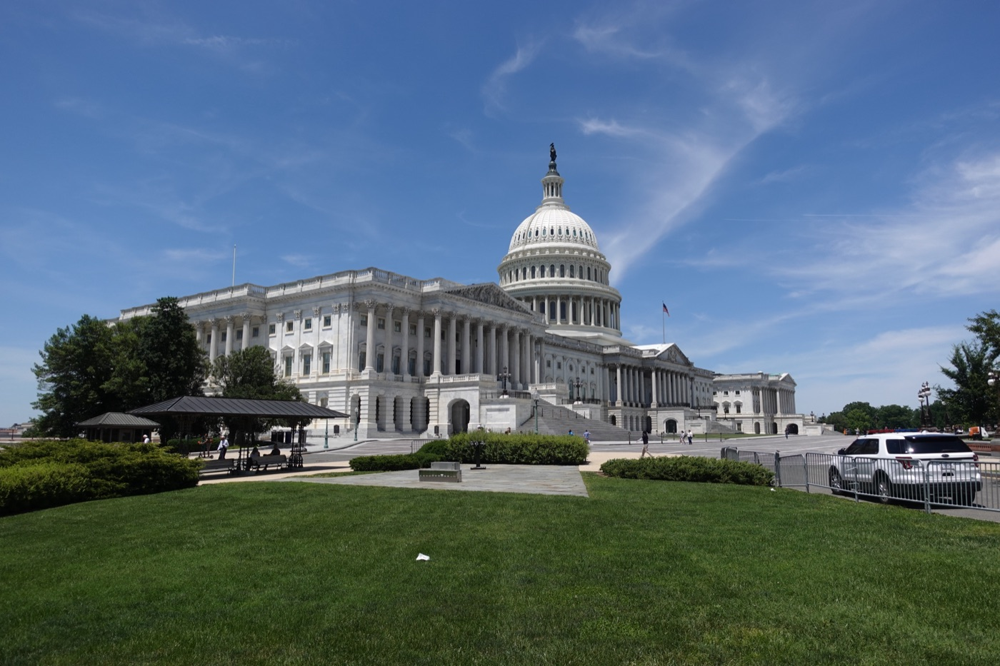
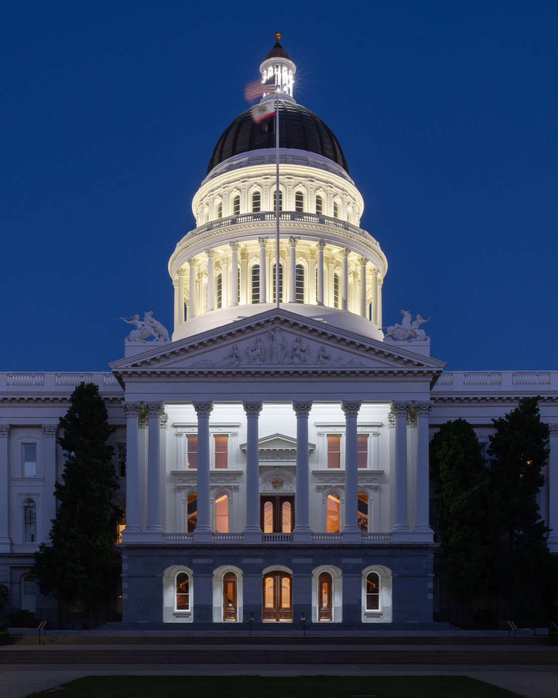

# AI

_After losing preemption 99–1 in the Senate, the industry is reopening the fight with super PAC cash_

## Executive Summary

> [!callout]
> Money is trying to decide whether to regulate AI before anyone decides how. Ahead of the 2026 midterms, super PACs built by the AI industry are pouring cash toward a single goal: getting the federal government to preempt and neutralize the AI regulations that individual states have passed. But this fight has already ended once, in Congress. The Senate stripped the preemption clause out of the budget reconciliation bill by a vote of 99 to 1. This article looks at why a fight lost by a congressional vote is being reopened through campaign money, and what the stakes mean for anyone who works with data.

> The scale of the money is already large enough to bend the momentum of politics. Two pro-AI super PACs have raised more than $200 million by announced and fundraising figures, and what that money targets is the set of AI regulations that 38 states enacted in 2025. Most of these laws focus on consumer protection, such as deepfake labeling and chatbot disclosures, but among them are transparency mandates like California's AB 2013, which requires disclosing the sources and types of training data. If preemption wins, that disclosure obligation is frozen along with everything else.

> Pebblous previously examined, from a data standpoint, [the federal effort to pause California's AB 2013 for three years](../../great-american-ai-act-preemption/en/). This article adds the next layer: where that moratorium gets its funding. And the norm underlying AI-ready data — whether the obligation to disclose the sources of training data survives — may be decided in campaign finance before it is ever settled in a technical standards debate.

### Key Figures

Sources: [Public Citizen](https://www.citizen.org/article/corporate-supremacist-super-pacs-500-million-midterm-crypto-ai-sports-betting/), [The Nation](https://www.thenation.com/article/politics/crypto-ai-super-pacs-election-spending-big-tech-dark-money-2026/), [CNBC](https://www.cnbc.com/2026/07/09/ai-companies-election-spending.html)

Four numbers capture the shape of this fight at a glance. The industry lost 99 to 1 in Congress, yet super PAC money has crossed $200 million. The target is the AI laws passed by 38 states, and the first person that money actually took aim at is a New York legislator. Each figure is counted at a different time and scope, so read them together with the context below.

<!-- stat-card -->
**99–1** — Senate preemption defeat — Vote that stripped the state-AI-law preemption clause from the reconciliation bill

<!-- stat-card -->
**$200M+** — AI super PAC fundraising — Combined for the two largest AI PACs (announced and raised, first half of 2026)

<!-- stat-card -->
**38 states** — AI laws enacted in 2025 — The body of state law preemption targets (The Nation's count)

<!-- stat-card -->
**$3.3M** — Single primary attack ad — Aimed at Alex Bores in NY-12 (Think Big, under Leading the Future)

## A Fight Lost in Congress, Reopened at the Ballot Box

What the AI industry wants has long been clear: one national framework instead of fifty different state rules, and federal preemption that overrides state law with that framework. In 2025 this demand actually reached the threshold of legislation. A preemption clause that would block state AI regulation for several years was written into the budget reconciliation bill. The result was a rout. The Senate deleted the clause by a vote of 99 to 1 before the bill was signed. That is how strong the bipartisan opposition was.

*▲ The Senate deleted the state AI law preemption clause from the reconciliation bill by a vote of 99 to 1 | Source: [Wikimedia Commons](https://commons.wikimedia.org/wiki/File:Capitol_Building_of_the_United_States_20240601.jpg)*

The fight that seemed to be over in Congress, however, comes back in through a different door. Having lost the vote, the industry has started aiming at the people who cast those votes — the congressional candidates themselves. The vehicle is the super PAC. Instead of giving money directly to candidates, they build independent-expenditure groups that support candidates friendly to preemption and attack those who oppose it. House Majority Leader Steve Scalise said state laws "hurt innovation" and that preemption "will be the foundation of whatever we do," while Democrat Ted Lieu noted there is bipartisan opposition to "preemption with no alternative in its place." The industry is trying to route around this deadlock inside Congress with money from outside it.

And this money is no longer sitting in pledges — it is already moving. By the end of June, pro-AI PACs had deployed at least $44 million to 40 House and Senate candidates. Leading the Future alone backed 28 candidates, of whom 25 advanced through their primaries. What matters is that these are figures measured by actual spending and win rates, not by announced pledges. The strategy of pushing the preemption agenda through elections is less a plan than a machine already in operation.

> [!callout]
> **The point**: Preemption has already been rejected once, by a vote in Congress. What is happening now is a second attempt to reverse that decision, with the stage moved from legislative deliberation to campaign finance. The contested ground is no longer the content of regulation but who gets elected to write it.

## Whose Money, and How Much

At the center of the money is Leading the Future. Launched in January 2026, this super PAC is roughly $125 million by announced size, with about $70 million in cash on hand at the end of the first quarter. Its major backers include OpenAI president Greg Brockman ($25 million), venture firm a16z ($25 million), Palantir co-founder Joe Lonsdale, and Silicon Valley investor Ron Conway. A second pillar is Public First Action, a nonprofit seeded by Anthropic (about $20 million), and a third is Innovation Council Action, a Republican-leaning group led by Trump adviser David Sacks that has pledged to raise $100 million.

*▲ OpenAI president Greg Brockman is one of the major backers behind Leading the Future's $25 million commitment | Source: [Wikimedia Commons](https://commons.wikimedia.org/wiki/File:Disrupt_SF_TechCrunch_Disrupt_San_Francisco_2019_-_Day_2_(48838200316)_(cropped).jpg)*

The numbers shift depending on how you count them. The watchdog Public Citizen tallied Big Tech and AI super PAC spending recorded in FEC filings at $60 million, which is the amount actually spent and reported. By announced and fundraising figures, however, the two largest AI PACs combine to more than $200 million. Meta's $65 million pledge to a state-level PAC and Anthropic's $20 million pledge have not yet appeared in FEC filings. So rather than lumping everything into one total, it is better to read these figures by asking whether each is an announced amount, funds raised, or reported spending.

This structure is not unfamiliar. It almost exactly replicates the playbook of Fairshake, the super PAC the crypto industry ran successfully in 2024. Leading the Future shares the political strategist Josh Vlasto with Fairshake and has even carried over the operating structure of "party-specific affiliated PACs plus candidate scorecards." Daniel Weiner of the Brennan Center says, "You see industries with very clear agendas jumping aggressively at the opportunity." AI money is now moving down the road that crypto paved first.

What stands out is that this money does not pick sides. The AI PACs maintain affiliated PACs on both the Democratic and Republican sides, backing any candidate "friendly to a federal framework" regardless of party. This approach has made even the White House uncomfortable. There were reports that a White House figure described the sight of the industry buying up candidates in both parties at once as "a slap in the face." In one case, the industry pushed back against AI legislation championed by a Republican governor and intervened even in a Florida race. In other words, before the goal of steering regulation in a particular direction, party allegiance is secondary.

> [!callout]
> **Why it matters**: This is no longer lobbying by individual companies but an entire industry building standardized political-money machinery to push a regulatory agenda. Because a model proven in crypto has now moved to AI, this approach is likely to settle in as a recurring structure rather than a one-off event.

## The Data Clauses Buried in the 38 State Laws

What preemption seeks to neutralize is not abstract "state regulation" but a concrete bundle of laws. In 2025 alone, 38 states enacted AI regulations. Most of these laws are deployment-stage safeguards: deepfake labeling, disclosures that a chatbot is not a person, consumer protection. But some of them target the raw material of data itself. This is exactly where this political fight translates into a data governance problem.

The laws on the data axis are ones Pebblous has already covered. California's AB 2013 requires generative AI developers to publish a summary of their training data — its sources, types, copyright status, whether it includes personal information, and whether synthetic data was used. Illinois SB315 mandates third-party audits for frontier models, and Colorado's AI Act requires transparency for high-risk automated decision systems. All three laws touch the same question: can anyone outside a company find out what data a model was built on?

*▲ California's AB 2013 requires generative AI developers to disclose the sources, types, and copyright status of their training data | Source: [Wikimedia Commons](https://commons.wikimedia.org/wiki/File:California_State_Capitol_during_blue_hour-3982.jpg)*

So the jurisdictional dispute of "does federal preemption win, or do state laws hold?" becomes an entirely different sentence when translated into the language of people who work with data. It becomes: does the obligation to disclose the sources of training data survive? When Pebblous earlier covered [the Great American AI Act's three-year preemption draft](../../great-american-ai-act-preemption/en/), the first target that draft named explicitly was AB 2013. This money war is an attempt to take aim at that same target again, this time from outside Congress.

> [!callout]
> **The translation rule**: The outcome of this fight is the survival or death of training-data transparency mandates. While consumer-protection clauses like deepfake labeling and chatbot disclosures take the headlines, what directly affects data practice is the disclosure obligation frozen alongside them, one layer down.

## New York's 12th District as a Microcosm

How this money actually moves is compressed into a single Democratic primary in New York's 12th District. The figure at the center is state assemblyman Alex Bores, the legislator who introduced New York's AI safety law, the RAISE Act. When the person who wrote the regulation tried to move up to Congress, super PAC money from both sides poured onto him at once.

*▲ New York state assemblyman Alex Bores sponsored the RAISE Act and was targeted by super PAC money from both sides at once | Source: [New York State Assembly / Wikimedia Commons](https://commons.wikimedia.org/wiki/File:AlexBoresAssemblyHeadshot.jpg)*

On one side, the Jobs and Democracy PAC under Public First Action spent $2.3 million to help Bores. At the same time, on the other side, Think Big under Leading the Future deployed $3.3 million on attack ads to defeat him. What is interesting is the content of the attack ads: they barely mentioned AI regulation at all. In other words, the money took aim not at a particular policy but at a particular person. Defeating this legislator was the goal first, and the reason never surfaced on the face of the ads.

Here a contradiction comes into view. Leading the Future has claimed that it supports New York's RAISE Act. Yet it deployed $3.3 million in attack ads targeting the author of that very law. The gap between the stated rationale — "we only want a consistent national framework, not blanket opposition to state laws" — and where the money actually went was laid bare in a single congressional district.

> [!callout]
> **The microcosm**: NY-12 sums up the character of this fight. The money does not argue over the text of the law. It elects or defeats the people who write and defend it. It is a structure in which the fate of a norm is decided by the choice of a person, not by a policy debate.

## Norms Are Decided by Money, Not Technical Standards

People who tend to data governance usually assume that norms are set in technical standards committees or legislative deliberation — debates over which items to disclose, how to design an audit, how to record data lineage. But what this case shows is that the survival of a norm can be decided elsewhere before that debate even begins. Whether a disclosure mandate like AB 2013 survives depends on the election results of the coming months.

This is not the problem of any one party, nor of any single company. It is a structural problem: the practice of an industry routing around norms with money instead of contesting them on the merits is taking hold. The preparation available to those who work with data is to build the capability that will be required in common no matter which way the regulatory model tilts — keeping a traceable record of the sources, copyright status, and personal-information handling of training data. Whether the regulation demanding disclosure survives or an audit-centered model takes its place, the question you must answer is the same: what data was this model built on?

> [!callout]
> **Closing**: The norms of AI-ready data may be decided in campaign finance before they are settled in technical standards. But whichever regulatory model wins, being ready to prove the lineage of your data remains the work of practitioners. Even while the fate of a norm is shaken by money, keeping your own data organized so you can answer where it came from is the only preparation entirely within your control.

## References

### Press Coverage

- 1.CNBC. (2026). "[What AI companies want for the millions they're spending on elections](https://www.cnbc.com/2026/07/09/ai-companies-election-spending.html)." _CNBC_. — Background on the Senate's 99-1 vote against state AI law preemption, and a tally of 109 state AI laws enacted as of July 1, 2026.
- 2.Public Citizen. (2026). "[Corporate "Supremacist" Super PACs: $500 Million for the Midterms](https://www.citizen.org/article/corporate-supremacist-super-pacs-500-million-midterm-crypto-ai-sports-betting/)." _Public Citizen_. — A tally of $517M in total corporate super PAC spending, and $60M in FEC-reported Big Tech/AI spending.
- 3.The Nation. (2026). "[Crypto and AI-Funded Super PACs Are Metastasizing](https://www.thenation.com/article/politics/crypto-ai-super-pacs-election-spending-big-tech-dark-money-2026/)." _The Nation_. — The source of the "38 states" figure. Details on Leading the Future's and Public First Action's funding scale, and the Alex Bores episode in New York's 12th district.

### Pebblous Corpus

- 4.Pebblous Data Communication Team. (2026). "[A Three-Year Federal Reprieve Over 38 States' AI Laws — How the Great American AI Act Erases California's AB 2013](/blog/great-american-ai-act-preemption/en/)." _Pebblous Blog_. — The prior coverage this piece builds on, covering how a draft of the Great American AI Act named California's AB 2013 as an explicit target for preemption.
