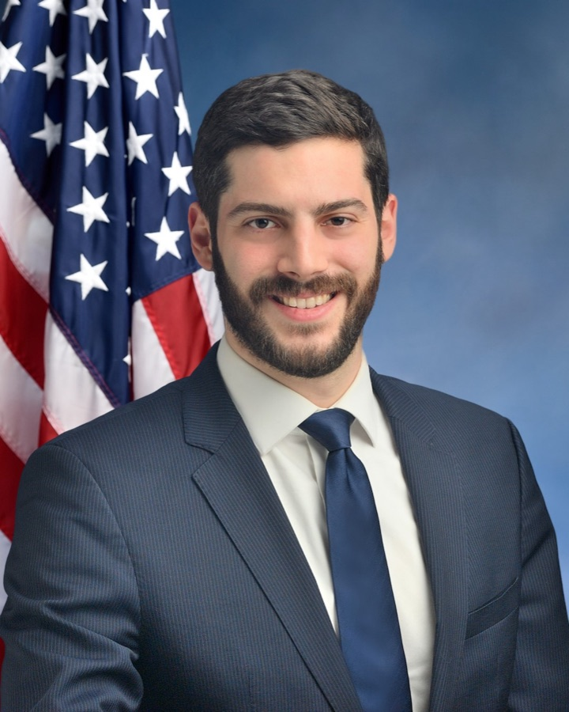

# 38개 주 AI법을 무력화하려는 AI 업계의 중간선거 자금

_연방 상원에서 99대1로 진 주법 선점 싸움을 업계가 슈퍼팩 자금으로 다시 열고 있다_

## Executive Summary

> [!callout]
> AI를 어떻게 규제할지가 아니라, 규제할지 말지를 돈이 먼저 정하려 합니다. 2026년 중간선거를 앞두고 AI 업계가 만든 슈퍼팩들이 하나의 목표를 향해 자금을 쏟고 있습니다. 주(州)가 만든 AI 규제법을 연방 차원에서 선점(preemption)해 무력화하는 것입니다. 그런데 이 싸움은 이미 국회에서 한 번 끝났습니다. 연방 상원이 예산조정법안에서 선점 조항을 99대1로 삭제했기 때문입니다. 이 글은 국회 표결로 진 싸움이 왜 다시 선거 자금으로 열리는지, 그리고 그 판돈이 데이터를 다루는 사람에게 무엇을 뜻하는지 봅니다.

> 자금의 규모는 이미 정치판의 관성을 바꿀 만큼 커졌습니다. AI 우호 슈퍼팩 두 곳이 발표·모금 기준으로 2억 달러 넘게 끌어모았고, 그 돈이 겨냥하는 것은 2025년에 38개 주가 제정한 AI 규제법입니다. 이 법들의 상당수는 딥페이크·챗봇 고지 같은 소비자 보호가 주력이지만, 그중 캘리포니아 AB 2013처럼 학습 데이터의 출처와 유형을 공개하라는 투명성 의무도 함께 걸려 있습니다. 선점이 이기면 그 공개 의무가 함께 동결됩니다.

> 페블러스는 앞서 [연방이 캘리포니아 AB 2013을 3년간 멈추려 한다는 사실](../../great-american-ai-act-preemption/ko/)을 데이터 관점에서 다뤘습니다. 이번 글은 그 유예가 어디서 자금을 받는지를 이어 붙입니다. AI-레디 데이터의 규범, 곧 "학습 데이터의 출처를 밝힐 의무가 살아남느냐"는 문제는 기술 표준 논의보다 앞서 선거 자금에서 먼저 갈릴 수 있습니다.

### 주요 수치

출처: [Public Citizen](https://www.citizen.org/article/corporate-supremacist-super-pacs-500-million-midterm-crypto-ai-sports-betting/), [The Nation](https://www.thenation.com/article/politics/crypto-ai-super-pacs-election-spending-big-tech-dark-money-2026/), [CNBC](https://www.cnbc.com/2026/07/09/ai-companies-election-spending.html)

네 숫자가 이 싸움의 구도를 한눈에 보여 줍니다. 국회에서는 99대1로 졌지만, 슈퍼팩 자금은 2억 달러를 넘겼습니다. 표적은 38개 주가 제정한 AI법이고, 그 자금이 실제로 겨눈 첫 인물은 뉴욕주의 한 입법자입니다. 각 숫자의 집계 시점과 범위는 서로 다르니, 아래 맥락 설명과 함께 읽어야 합니다.

<!-- stat-card -->
**99–1** — 상원 선점 부결 — 예산조정법안에서 주 AI법 선점 조항이 삭제된 표결

<!-- stat-card -->
**$2억+** — AI 슈퍼팩 모금액 — 두 최대 AI 팩 합산(발표·모금 기준, 2026년 상반기)

<!-- stat-card -->
**38개 주** — 2025년 제정 AI법 — 선점이 겨냥하는 주법군(The Nation 집계)

<!-- stat-card -->
**$3.3M** — 단일 예비선거 공격광고 — 뉴욕 12구 Alex Bores를 겨냥(Leading the Future 산하 Think Big)

## 국회에서 진 싸움, 선거판에서 다시 연다

AI 업계가 원하는 것은 오래전부터 분명했습니다. 주마다 다른 AI 규제 대신 하나의 전국 프레임워크, 그리고 그 프레임워크가 주법을 덮어쓰는 연방 선점입니다. 이 요구는 2025년에 실제로 법안 문턱까지 갔습니다. 예산조정법안에 주의 AI 규제를 여러 해 동안 막는 선점 조항이 실렸던 것입니다. 결과는 완패였습니다. 상원이 그 조항을 99대1로 삭제한 뒤 법안이 서명됐습니다. 초당적 반대 정서가 그만큼 뚜렷했다는 뜻입니다.

*▲ 연방 상원은 예산조정법안의 주 AI법 선점 조항을 99대1로 삭제했습니다 | Source: [Wikimedia Commons](https://commons.wikimedia.org/wiki/File:Capitol_Building_of_the_United_States_20240601.jpg)*

국회에서 끝난 줄 알았던 싸움은 그러나 다른 문으로 다시 들어옵니다. 표결에서 진 업계가 이번에는 그 표를 던지는 사람들, 곧 의원 후보를 겨냥하기 시작했습니다. 방법은 슈퍼팩입니다. 후보에게 직접 돈을 주는 대신, 선점에 우호적인 후보를 지원하고 반대하는 후보를 공격하는 독립 지출 기구를 세우는 것입니다. 하원 공화당 원내대표 스티브 스칼리스는 주법이 "혁신을 해친다"며 선점이 "무엇을 하든 기초가 될 것"이라고 말했고, 민주당 테드 리우는 "아무 대안 없는 선점"에는 초당적 반대가 있다고 지적했습니다. 국회 안의 이 교착을 업계는 국회 밖의 자금으로 우회하려 합니다.

그리고 이 돈은 아직 서약에 머물러 있지 않고 이미 움직이고 있습니다. AI 우호 팩들은 6월 말까지 하원·상원 후보 40명에게 최소 4,400만 달러를 집행했습니다. Leading the Future 한 곳만 봐도 후보 28명을 지원했고 그중 25명이 예비선거를 통과했습니다. 발표된 서약액이 아니라 실제 집행과 승률로 잡히는 숫자라는 점이 중요합니다. 업계가 선거를 통해 선점 의제를 밀어붙이는 전략은 구상이 아니라 이미 작동하는 기계에 가깝습니다.

> [!callout]
> **핵심**: 선점은 의회 표결로 이미 한 번 부결됐습니다. 지금 벌어지는 일은 그 결정을 뒤집으려는 두 번째 시도이고, 무대가 입법 심의에서 선거 자금으로 옮겨갔습니다. 규제의 내용이 아니라 규제할 사람을 누가 뽑느냐가 다투는 지점이 됐습니다.

## 누구의 돈이, 얼마나

자금의 중심에는 Leading the Future가 있습니다. 2026년 1월에 출범한 이 슈퍼팩은 발표 기준 1억 2,500만 달러 규모로, 1분기 말 현금 보유는 약 7,000만 달러였습니다. 주요 후원자는 OpenAI 사장 그렉 브록먼(2,500만 달러)과 벤처캐피털 a16z(2,500만 달러), 그리고 팔란티어 공동창업자 조 론스데일과 실리콘밸리 투자자 론 콘웨이입니다. 두 번째 축은 Anthropic이 시드 자금을 댄 비영리 Public First Action(약 2,000만 달러), 세 번째는 공화 성향으로 트럼프 고문 데이비드 색스가 주도하고 1억 달러 조성을 서약한 Innovation Council Action입니다.

*▲ OpenAI 사장 그렉 브록먼은 Leading the Future에 2,500만 달러를 후원한 주요 인사 중 한 명입니다 | Source: [Wikimedia Commons](https://commons.wikimedia.org/wiki/File:Disrupt_SF_TechCrunch_Disrupt_San_Francisco_2019_-_Day_2_(48838200316)_(cropped).jpg)*

집계 방식에 따라 숫자는 달라집니다. 감시단체 Public Citizen은 FEC 공시에 잡힌 빅테크·AI 슈퍼팩 지출을 6,000만 달러로 집계했는데, 이는 실제로 지출돼 신고된 액수입니다. 반면 발표·모금 기준으로 보면 두 최대 AI 팩의 합산은 2억 달러를 넘습니다. Meta가 주 단위 팩에 서약한 6,500만 달러나 Anthropic의 2,000만 달러 서약은 아직 FEC 공시에 잡히지 않은 상태입니다. 그러니 하나의 총액으로 뭉뚱그리기보다, 발표액인지 모금액인지 신고된 지출액인지를 구분해 읽어야 합니다.

이 구조는 낯설지 않습니다. 암호화폐 업계가 2024년에 성공시킨 슈퍼팩 Fairshake의 플레이북을 거의 그대로 복제했기 때문입니다. Leading the Future는 Fairshake와 같은 정치전략가 조시 블라스토를 공유하고, "정당별 산하 팩 + 후보 스코어카드"라는 운영 구조까지 옮겨 왔습니다. 브레넌 센터의 대니얼 와이너는 "업계들이 아주 명확한 의제를 갖고 그 기회에 적극적으로 뛰어드는 걸 본다"고 말합니다. 크립토가 먼저 닦아 놓은 길 위에서, AI 자금이 지금 같은 방식으로 움직이고 있습니다.

눈에 띄는 것은 이 자금이 여야를 가리지 않는다는 점입니다. AI 팩들은 민주·공화 양쪽에 산하 팩을 두고 "연방 프레임워크에 우호적인" 후보라면 당적을 따지지 않고 지원합니다. 이 방식은 정작 백악관마저 불편하게 만들었습니다. 산업이 양당 후보를 동시에 사들이는 모습을 두고 백악관 인사가 "뺨을 맞은 격"이라고 표현했다는 보도가 나왔을 정도입니다. 공화 성향 주지사가 미는 AI 입법에 업계가 반발해 플로리다 선거에까지 개입한 사례도 있습니다. 규제를 어느 방향으로 끌고 가느냐는 목표 앞에서 당파는 부차적이라는 뜻입니다.

> [!callout]
> **왜 중요한가**: 개별 회사의 로비가 아니라, 산업 전체가 표준화된 정치자금 기구를 세워 규제 의제를 밀어붙이는 단계로 넘어왔습니다. 크립토에서 검증된 모델이 AI로 옮겨온 만큼, 이 방식은 일회성 이벤트가 아니라 반복되는 구조로 자리 잡을 가능성이 큽니다.

## 38개 주법 중 데이터가 걸린 조항들

선점이 무력화하려는 대상은 추상적인 "주 규제"가 아니라 구체적인 법의 묶음입니다. 2025년 한 해에만 38개 주가 AI 규제법을 제정했습니다. 이 법들의 대부분은 딥페이크 표시, 챗봇이 사람이 아님을 알리는 고지, 소비자 보호 같은 배포 단계의 안전장치입니다. 그러나 그중 일부는 데이터의 재료 자체를 겨냥합니다. 바로 여기서 이 정치 싸움이 데이터 거버넌스의 문제로 번역됩니다.

데이터 축에 해당하는 법들은 페블러스가 이미 다뤄 온 것들입니다. 캘리포니아 AB 2013은 생성형 AI 개발사에 학습 데이터의 출처, 유형, 저작권 상태, 개인정보 포함 여부, 합성 데이터 사용 여부까지 요약해 공개하도록 요구합니다. 일리노이 SB315는 프론티어 모델에 제3자 감사를 의무화하고, 콜로라도 AI법은 고위험 자동화 결정 시스템의 투명성을 요구합니다. 세 법 모두 "모델이 어떤 데이터로 만들어졌는지 외부가 알 수 있는가"라는 질문에 닿아 있습니다.

*▲ 캘리포니아 AB 2013은 생성형 AI 학습 데이터의 출처·유형·저작권 상태 공개를 의무화합니다 | Source: [Wikimedia Commons](https://commons.wikimedia.org/wiki/File:California_State_Capitol_during_blue_hour-3982.jpg)*

그래서 "연방 선점이 이기느냐, 주법이 버티느냐"라는 관할권 다툼은, 데이터를 다루는 사람의 언어로 옮기면 전혀 다른 문장이 됩니다. 학습 데이터의 출처를 공개할 의무가 살아남느냐 하는 것입니다. 앞서 페블러스가 [Great American AI Act의 3년 선점 초안](../../great-american-ai-act-preemption/ko/)을 다뤘을 때, 그 초안이 명시적으로 지목한 첫 표적이 바로 AB 2013이었습니다. 이번 자금 전쟁은 그 표적을 국회 밖에서 다시 조준하는 시도입니다.

> [!callout]
> **번역 규칙**: 이 싸움의 승패는 곧 학습 데이터 투명성 의무의 존폐입니다. 딥페이크 표시나 챗봇 고지 같은 소비자 보호 조항이 헤드라인을 차지하는 동안, 데이터 실무에 직접 영향을 주는 것은 그 아래에 함께 묶여 동결되는 출처 공개 의무입니다.

## 뉴욕 12구가 보여준 축소판

이 자금이 실제로 어떻게 움직이는지는 뉴욕 12구의 한 민주당 예비선거가 압축해 보여 줍니다. 주인공은 주 하원의원 알렉스 보레스입니다. 그는 뉴욕의 AI 안전법인 RAISE Act를 발의한 입법자입니다. 규제를 만든 사람이 연방 의회로 진출하려 하자, 양쪽의 슈퍼팩 자금이 동시에 그에게 쏟아졌습니다.

*▲ 뉴욕주 하원의원 알렉스 보레스는 RAISE Act 발의자이며, 양쪽 슈퍼팩 자금이 동시에 그를 겨냥했습니다 | Source: [New York State Assembly / Wikimedia Commons](https://commons.wikimedia.org/wiki/File:AlexBoresAssemblyHeadshot.jpg)*

한쪽에서는 Public First Action 산하의 Jobs and Democracy PAC가 보레스를 돕는 데 230만 달러를 썼습니다. 동시에 다른 쪽에서는 Leading the Future 산하의 Think Big이 그를 떨어뜨리는 공격광고에 330만 달러를 집행했습니다. 흥미로운 것은 공격광고의 내용입니다. AI 규제 이슈는 거의 언급하지 않았습니다. 다시 말해 자금이 겨눈 것은 특정 정책이 아니라 특정 인물이었습니다. 이 입법자를 떨어뜨린다는 목표가 먼저였고, 이유는 광고 표면에 드러나지 않았습니다.

여기서 자기모순이 드러납니다. Leading the Future는 자신들이 뉴욕 RAISE Act를 지지한다고 주장해 왔습니다. 그런데 그 법의 저자를 겨냥해 330만 달러짜리 공격광고를 집행했습니다. "일관된 전국 프레임워크를 원할 뿐 주법에 전면 반대하는 것은 아니다"라는 명분과, 실제 자금이 향한 곳 사이의 간극이 한 선거구에서 그대로 노출된 셈입니다.

> [!callout]
> **축소판**: 뉴욕 12구는 이 싸움의 성격을 요약합니다. 자금은 법 조문을 두고 논쟁하지 않습니다. 그 법을 만들고 지킬 사람을 뽑거나 떨어뜨립니다. 규범의 운명이 정책 토론이 아니라 인물 선택으로 결정되는 구조입니다.

## 규범은 기술 표준이 아니라 자금에서 갈린다

데이터 거버넌스를 챙기는 사람은 보통 규범이 기술 표준 위원회나 입법 심의에서 정해진다고 생각합니다. 어떤 항목을 공개할지, 감사를 어떻게 설계할지, 데이터 계보를 어떻게 기록할지 같은 논의 말입니다. 그러나 이번 사례가 보여 주는 것은 그 논의가 시작되기도 전에 규범의 존폐가 다른 곳에서 결정될 수 있다는 사실입니다. AB 2013 같은 공개 의무가 살아남을지 여부는 향후 몇 달의 선거 결과에 달려 있습니다.

이것은 어느 한 정당의 문제도, 특정 회사의 문제도 아닙니다. 산업이 규범을 기술로 다투는 대신 자금으로 우회하는 방식이 정착하고 있다는 구조의 문제입니다. 데이터를 다루는 쪽에서 할 수 있는 대비는 규제 모델이 어느 쪽으로 기울든 공통으로 요구되는 역량을 갖추는 것입니다. 학습 데이터의 출처와 저작권, 개인정보 처리 내역을 추적 가능하게 기록해 두는 일입니다. 공개를 요구하는 규제가 살아남든, 감사 중심 모델이 대신 들어서든, 답해야 하는 질문은 같기 때문입니다. 이 모델은 어떤 데이터로 만들어졌는가.

> [!callout]
> **마무리**: AI-레디 데이터의 규범은 기술 표준이 아니라 선거 자금에서 먼저 갈릴 수 있습니다. 그러나 어느 규제 모델이 이기든 데이터의 계보를 증명할 준비는 여전히 실무의 몫으로 남습니다. 규범의 존폐가 자금에 흔들리는 동안에도, 자기 데이터가 어디서 왔는지 답할 수 있게 정리해 두는 일은 스스로 통제할 수 있는 유일한 대비입니다.

## 참고문헌

### 언론 보도

- 1.CNBC. (2026). "[What AI companies want for the millions they're spending on elections](https://www.cnbc.com/2026/07/09/ai-companies-election-spending.html)." _CNBC_. — 상원의 주 AI법 선점 조항 99대1 부결 배경, 2026년 7월 1일 기준 주 AI법 109건 제정 집계.
- 2.Public Citizen. (2026). "[Corporate "Supremacist" Super PACs: $500 Million for the Midterms](https://www.citizen.org/article/corporate-supremacist-super-pacs-500-million-midterm-crypto-ai-sports-betting/)." _Public Citizen_. — 기업 슈퍼팩 총 지출 $517M 집계, FEC 공시 기준 빅테크·AI 지출 $60M.
- 3.The Nation. (2026). "[Crypto and AI-Funded Super PACs Are Metastasizing](https://www.thenation.com/article/politics/crypto-ai-super-pacs-election-spending-big-tech-dark-money-2026/)." _The Nation_. — "38개 주" 수치의 출처. Leading the Future·Public First Action 자금 규모, 뉴욕 12구 Alex Bores 사례.

### 페블러스 코퍼스

- 4.페블러스 데이터 커뮤니케이션팀. (2026). "[38개 주 AI법 위에 3년 연방 유예 — Great American AI Act가 캘리포니아 AB 2013을 지운다](/blog/great-american-ai-act-preemption/ko/)." _Pebblous Blog_. — 이 글이 잇는 이전 커버리지. Great American AI Act 초안이 캘리포니아 AB 2013을 명시적 표적으로 지목했다는 사실을 다룸.
