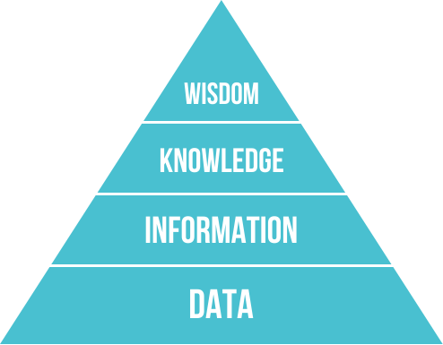

# 사람에게 물었는데, 점점 AI가 답하고 있다

_설문 응답의 최대 45%가 AI일 수 있다 — _

## Executive Summary

> [!callout]
> 사람에게 직접 물어 모은 설문 데이터는 사회과학의 토대입니다. 그런데 그 응답 가운데 최대 45%에 AI가 쓴 텍스트가 섞여 있을 수 있다는 분석이 2026년 6월 Nature에 실렸습니다. 사람의 목소리를 담으려고 만든 데이터에, 점점 더 사람이 아닌 답이 들어차고 있다는 이야기입니다. 이 글은 그 사건을 데이터 품질의 관점에서 읽습니다.

> 더 깊은 문제는 응답자가 몰래 챗봇을 베끼는 데서 그치지 않습니다. 연구자가 직접 AI를 합성 응답자로 세워 원하는 결과를 뽑아내는 'silicon samples'까지 등장했고, 한 심리학자는 이를 두고 "사기와 구별되지 않는다"고 했습니다. 사람의 응답과 기계의 응답을 가르던 경계가 흐려지는 중입니다.

> 그래서 데이터 품질에 질문이 하나 늘었습니다. 지금까지 품질은 정확성·완전성·일관성의 문제였지만, 이제 그 위에 "이 응답을 정말 사람이 썼는가"라는 진위가 얹혔습니다. 사람이 쓴 데이터의 값이 다시 오르는 이유이기도 합니다.

### 주요 수치

출처: [David Adam, Nature Vol. 654 (2026)](https://www.nature.com/articles/d41586-026-01726-y)

아래 네 숫자는 같은 흐름의 다른 단면입니다. 응답을 모으는 입구의 오염(최대 45%)부터 지식이 쌓이는 출구의 AI 초록(약 1/3)과 제출 급증(42%), 그리고 그 사이를 잇는 속도(논문 한 편 1시간)까지 이어집니다. 사람의 의견에서 시작해 사람의 검토로 닫히던 사회과학의 회로에, 기계가 양쪽 끝에서 동시에 끼어들고 있다는 뜻입니다.

<!-- stat-card -->
**최대 45%** — AI가 섞인 응답 — 한 설문 분석에서 AI 생성 텍스트가 의심된 응답 비율

<!-- stat-card -->
**약 1/3** — AI가 쓴 초록 — 2026년 2월 한 저널 제출 초록 중 대부분 AI 작성 수준

<!-- stat-card -->
**42%** — 제출 급증 — ChatGPT 출시 이후 한 저널의 논문 제출 증가율

<!-- stat-card -->
**1시간** — 논문 한 편 — 실제 설문 데이터로 28페이지 논문을 완성한 시간

## 사람에게 물었는데 AI가 답한다

심리학자 라루카 릴라(Raluca Rilla)는 설문 응답을 들여다보다 어색한 문장을 발견했습니다. 자기 감정을 묻는 질문에 한 응답자가 "나는 인간과 같은 방식으로 혼란을 겪지 않는다(I don't experience confusion in the same way humans do)"라고 적은 것입니다. 사람이 챗봇에 질문을 던지고 그 답을 그대로 붙여 넣었다는 신호였습니다. 그가 추정한 오염 규모는 응답의 최대 45%에 이릅니다.

왜 이런 일이 벌어질까요. 아마존 메커니컬 터크나 프롤리픽 같은 크라우드소싱 플랫폼에서는 응답 하나하나에 작은 보상이 걸려 있고, 빨리 많이 답할수록 돈이 됩니다. 응답자 입장에서는 AI에 질문을 넣고 답을 복사하는 편이 합리적인 선택이 되어 버립니다. 데이터를 모으는 쪽은 사람의 생각을 샀다고 믿지만, 실제로 도착하는 것은 기계의 문장인 경우가 늘고 있습니다.

*▲ 18세기 자동 체스 기계 '메커니컬 터크' 내부 구조 (1789). 기계 안에는 사람이 숨어 있었다. 이제 그 역이 벌어진다 — 사람처럼 보이는 설문 응답 안에 AI가 숨는다. | Source: [Wikimedia Commons (Public Domain)](https://commons.wikimedia.org/wiki/File:Racknitz_-_The_Turk_3.jpg)*

> [!callout]
> **한 줄 요약**: 사람에게 물어 모은 데이터에, 점점 더 사람이 아닌 답이 돌아옵니다. 응답의 진위가 흔들리기 시작한 지점입니다.

## 더 깊은 문제, 합성 응답자

응답자가 몰래 AI를 쓰는 것은 그래도 비의도적 오염입니다. 더 까다로운 것은 연구자가 직접 AI를 응답자로 세우는 경우입니다. 심리학자 말테 엘손(Malte Elson)은 연구자가 AI 모델에 나이·학력·정치 성향 같은 파라미터를 지정해 원하는 응답자 집단을 통째로 만들어낼 수 있다고 경고합니다. 이른바 'silicon samples', 우리말로 옮기면 AI 합성 응답자입니다. 데이터를 모으는 것이 아니라 생성하는 것이고, 원하는 결과가 나오도록 조정할 수 있으니 엘손은 이를 "사기와 구별되지 않는다"고 표현했습니다.

*▲ 트랜스포머(Transformer) 아키텍처. 인코더-디코더 레이어를 겹쳐 쌓은 이 설계가 오늘날 대형 언어 모델(LLM)의 기반이다. 연구자가 '파라미터를 지정해 합성 응답자 집단을 만든다'는 것은 이 모델 위에서 이루어진다. | Source: [Wikimedia Commons (CC BY 4.0)](https://commons.wikimedia.org/wiki/File:Transformer,_stacked_layers_and_sublayers.png)*

지식을 생산하는 속도 자체도 빨라졌습니다. 정치학자 데이비드 레이저(David Lazer)는 실제 설문 데이터를 AI에 넣어 28페이지짜리 논문을 단 1시간 만에 완성하는 과정을 보여 줬습니다. 한 경영학 저널은 ChatGPT가 나온 뒤 제출 논문이 42% 늘었고, 2026년 2월 기준으로는 제출 초록의 약 3분의 1이 대부분 AI로 작성된 수준에 이르렀습니다. 사람의 응답에서 시작해 사람의 검토를 거쳐 쌓이던 지식의 흐름에, 기계가 양쪽 끝에서 동시에 끼어들고 있는 셈입니다.

> [!callout]
> 심리학자 비외른 호멜(Björn Hommel)은 이 상황을 두고 "행동과학과 사회과학에 대한 신뢰가 무너지는 시점에 다가가고 있다"고 말했습니다. 데이터가 오염되면 그 위에 세운 결론도, 결론을 믿는 마음도 함께 흔들립니다.

## 품질의 새 축, 진위

그동안 데이터 품질을 이야기할 때 기준은 분명했습니다. 값이 정확한가, 빠진 곳은 없는가, 앞뒤가 일관되는가. 라벨 오류와 편향, 결측값을 잡아내는 일이 품질 관리의 중심이었습니다. 모두 "이 값이 맞는가"를 묻는 질문이었습니다.

이번 사건은 결이 다른 질문을 하나 더 얹습니다. "이 값을 누가, 무엇이 만들었는가." 같은 응답이라도 사람이 쓴 것과 기계가 쓴 것은 가치가 다릅니다. 사람의 의견을 측정하려는 데이터에 기계의 문장이 섞이면, 값이 아무리 정확하고 일관돼 보여도 애초에 측정하려던 대상이 아닌 것이 됩니다. 진위(authenticity)는 정확성·완전성·일관성과 나란히 놓이는 새로운 품질의 축입니다.

그리고 이것은 사회과학만의 문제가 아닙니다. 소비자 리뷰, 사용자 피드백, 헬스케어 설문, 시장조사처럼 사람의 목소리를 전제로 모은 데이터는 모두 같은 위험에 놓여 있습니다. 그래서 진짜 사람이 쓴 응답, 곧 human-origin 데이터가 점점 귀해지고, 귀해지는 만큼 값이 오릅니다. 누구나 그럴듯한 문장을 무한히 찍어낼 수 있게 된 시대에, 사람이 직접 남긴 흔적은 오히려 희소한 자원이 됩니다.

*▲ DIKW 피라미드: Data → Information → Knowledge → Wisdom. 데이터 진위(authenticity)가 흔들리면 피라미드 전체가 불안정해진다. | Source: [Wikimedia Commons (CC BY-SA 3.0)](https://commons.wikimedia.org/wiki/File:DIKW_Pyramid.svg)*

> [!callout]
> **관점의 전환**: 품질의 질문이 "값이 맞는가"에서 "사람이 만든 데이터인가"로 한 칸 넓어졌습니다. 진위가 측정 가능한 품질 지표로 들어오는 순간, 사람-데이터의 가치는 다시 오릅니다.

## 사람과 기계를 가려내는 법

다행히 손을 놓고 있는 것은 아닙니다. 연구자들은 이미 몇 가지 방어선을 세우고 있습니다. 가장 직접적인 방법은 함정 문항(honeypot)입니다. 사람은 자연스럽게 무시하지만 AI는 곧이곧대로 따르는 질문을 설문에 심어 두고, 거기에 걸려드는 응답을 걸러냅니다. 응답이 끝난 뒤가 아니라 수집하는 순간에 진위를 검증하려는 시도입니다.

*▲ 사이버보안의 허니팟(honeypot) 개념도. 미끼 서버를 통해 침입자를 탐지하는 이 원리가, 설문에서는 '사람은 자연스럽게 무시하지만 AI는 곧이곧대로 따르는' 함정 문항으로 이식됐다. | Source: [Wikimedia Commons (CC BY-SA 3.0)](https://commons.wikimedia.org/wiki/File:Honeypot_diagram.jpg)*

응답의 내용만이 아니라 응답이 만들어진 과정을 보는 방법도 있습니다. 답하는 데 걸린 시간, 타이핑과 붙여넣기의 패턴 같은 행동 메타데이터는 사람의 응답과 복사된 기계의 응답을 구분하는 단서가 됩니다. 한발 더 나아가면, 이 데이터가 어디서 어떤 채널과 방법으로 수집됐는지를 기록하는 출처 추적(provenance) 자체가 품질 지표로 올라섭니다. "어디서 왔는가"를 모르는 데이터는 이제 신뢰하기 어렵습니다.

정리하면, 데이터를 점검할 때 확인할 항목이 하나 늘었습니다. 정확성과 완전성 옆에 "이 데이터를 사람이 만들었는가"가 나란히 서기 시작했습니다. 진위는 더 이상 감으로 짐작할 일이 아니라, 함정 문항과 행동 신호와 출처 기록으로 측정해야 할 품질 지표입니다. 사람에게 물어 모은 데이터가 정말 사람의 것인지를 확인하는 일이, 데이터를 다루는 모두의 새로운 기본기가 되어 가고 있습니다.

> [!callout]
> **마무리**: AI가 설문을 오염시키며 드러난 것은 데이터 품질의 빈자리였습니다. 정확성과 일관성만으로는 채울 수 없는 그 자리에 진위가 들어섭니다. 사람-데이터의 가치를 지키는 첫걸음은, 그 데이터가 사람의 것인지부터 측정하는 일입니다.

## 참고문헌

- 1.Adam, D. (2026). "[Will AI ruin the social sciences — or revolutionize them?](https://www.nature.com/articles/d41586-026-01726-y)." _Nature_, Vol. 654, pp. 22–24. — 설문 응답의 최대 45%에 AI 생성 텍스트가 섞일 수 있다는 분석, 연구자가 AI 합성 응답자(silicon samples)를 만드는 위험, 그리고 honeypot 등 대응책을 다룬 기사. 본문 수치·인용(Rilla, Elson, Lazer, Hommel)은 이 기사를 출처로 한다.
