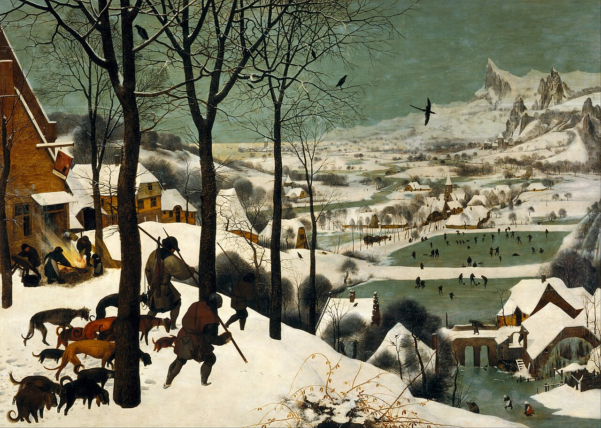
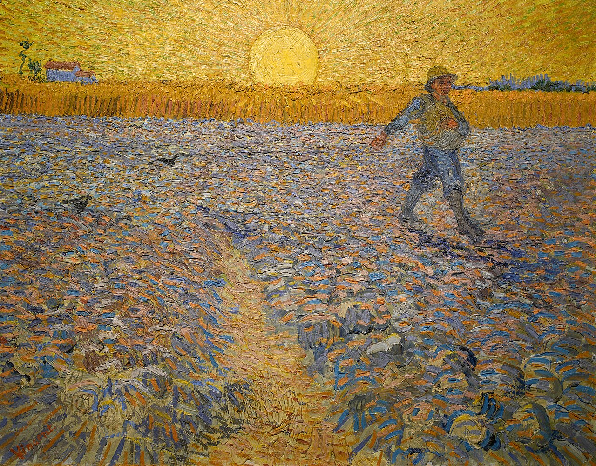
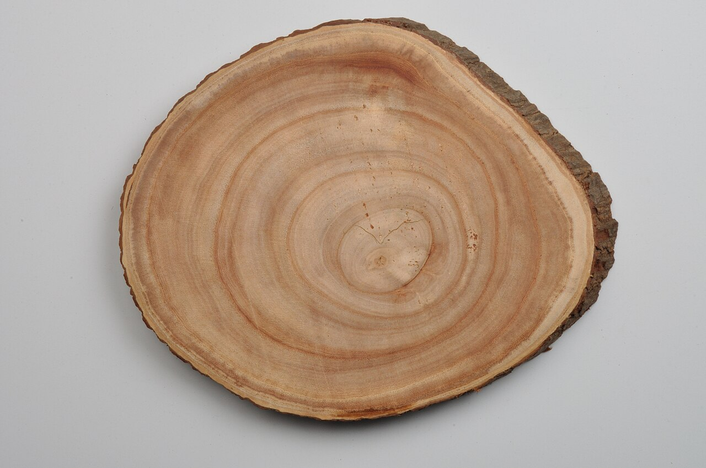
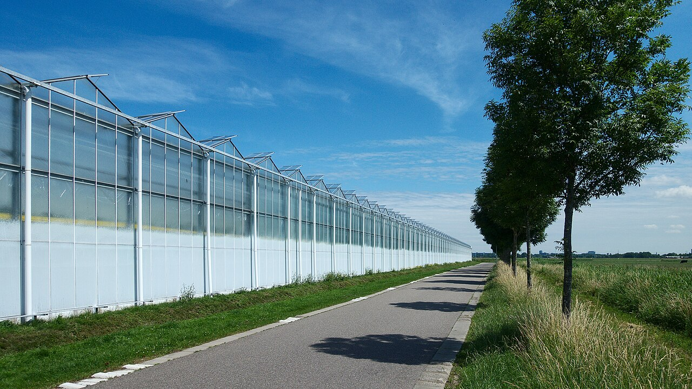

# Using an AI Tool and Growing Data Are Not the Same Thing

_Four axes that separate an AI tool from a data greenhouse_

## Executive Summary

> [!callout]
> Most of the AI tools we reach for every day are closer to hunting. Feed in a topic and one article comes out; one prompt and one image comes out. Each result depends on your skill and the luck of the day, the way a single catch depends on the wind and the animal's tracks. That is where the familiar frustration comes from — the outputs pile up, but the capability does not, and the moment you stop, the larder empties again.

> This piece works through that frustration with an old contrast: hunting versus farming. The data greenhouse that Pebblous talks about is farming. You plant a seed, and sun, rain, and time do the growing for you; the land — your data and your content — grows richer the more you tend it. The line between a tool and an environment is not autonomy alone. It runs along four axes: agency, time, trust, and state. An agent that is merely autonomous can still be hunting.

> To state the conclusion up front: a tool lends you an action, while a greenhouse grows the thing itself. Hunting takes from nature; farming raises something with it. This is not an argument that one is superior. It is a question about which side your own organization is standing on right now.

## Why the Hunter's Larder Keeps Emptying

Hunting is the act of bringing back one catch per attempt. You draw the bow, hit one animal, and put that one animal in the larder. A good hunt feeds you well, but the next meal starts again from scratch. However skilled you are, you depend each time on the day's wind and the animal's tracks. The moment the hunter sets down the bow, the larder begins to empty.

*▲ Hunters returning from the hunt. The one catch goes into the larder, but the field is unchanged. | Source: [Pieter Bruegel the Elder, Hunters in the Snow (1565), Wikimedia Commons (Public Domain)](https://commons.wikimedia.org/wiki/File:Pieter_Bruegel_the_Elder_-_Hunters_in_the_Snow_(Winter)_-_Google_Art_Project.jpg)*

Feeding a topic into an AI writer and receiving one article back is exactly this. The prompt is the bow, and the result is the one animal you bring home. This time it came out well; next time something feels off. The same prompt gives you a different result today than it did yesterday. To get a good outcome you have to summon the skill all over again, and the moment you let go, nothing grows on its own.

So a lot of practitioners describe the same hollow feeling. The output folder fills up fast, yet the organization's capability does not accumulate at the same rate. A hundred articles have piled up, but the hundred-and-first still begins bare-handed. Just as yesterday's deer does not help today's hunt, yesterday's output does not make today's work any easier. There is meat in the larder, but the field is unchanged.

> [!callout]
> The essence of hunting is that the output stays and the process disappears. What was caught, and how, lives only in the hunter's head; only results accumulate in the larder. There is no structural reason for the next hunt to be better than the last.

## What the Farmer Does Differently

A farmer does not take; a farmer raises. The act of sowing a seed is small, but everything after it is done by sun, rain, and time. While the hunter roams the field all day for a single animal, the farmer tends another plot while the sown seed grows. And crucially, the land grows richer the more it is worked. One year's harvest improves the next year's soil, and a channel cut once makes the next season's irrigation easier.

*▲ The act of sowing is small; everything after it is done by sun, rain, and time. | Source: [Vincent van Gogh, The Sower (1888), Wikimedia Commons (Public Domain)](https://commons.wikimedia.org/wiki/File:Sower_at_Sunset_-_Vincent_Van_Gogh.jpg)*

A greenhouse takes farming one step further. Instead of leaving the harvest to the weather outside, it regulates light, temperature, and water within a controlled environment, growing crops year-round. Plants grow even in winter, and a bad season is far less likely to empty the larder outright. It does not work against nature; rather, people design the conditions under which nature does its work well.

The idea of tending something living like a garden is not, in fact, new. Among people who work with software there has long been a notion that a good system is not erected all at once like a building, but cultivated and grown like a garden, tended without end. Unlike a structure that is finished once it is built, a living thing improves under a caring hand and turns rough when neglected. Data and content are no different.

This is why Pebblous uses the word Greenhouse. It is a declaration to treat data and content not as game to be caught once, but as crops that grow on their own given the right conditions and grow richer the more they are tended. It is not a brand name chosen to impress, but a metaphor that points to a stance toward AI. Hunting takes from nature; farming raises something with it.

> [!callout]
> The difference between farming and hunting is not a difference of diligence. It is the difference between bringing back the output and growing the land on which the output grows. And this difference can be drawn more precisely along four axes.

## Who Does the Work, and When Does It Get Better? — Agency and Time

The common industry explanation reduces the difference between a tool and an agent to autonomy alone. Run by rules and it is a tool; reason toward a goal on its own and it is an agent. That is not wrong, but it is not enough. Autonomy is only one of four axes, and without the other three you will mistake a merely autonomous hunt for an environment.

### 3.1. Agency — From Operator to Gardener

A tool is held and wielded directly by a person. When the hand stops, the work stops. An environment is different. The agent works autonomously, and instead of touching every task, the person oversees the critical junctures — the gates. The role shifts from operator to gardener. A gardener does not grow plants by pulling on each leaf. They cut the channels, decide where to thin, and judge when to harvest. The human role does not vanish; it moves from moment-to-moment execution to the seat of decisive judgment.

### 3.2. Time — Used Once, or Making the Next Cycle Better?

A tool is used once and done — episodic. There is no bridge between this task and the next. An environment runs as a continuous loop, where diagnosis and improvement make the next cycle better. The weakness found this time becomes the default for the next task, and land tended once makes the next harvest easier. The deepest line dividing hunting from farming is exactly this direction of time.

Here a twist is in order. An autonomous agent does not automatically become farming. The developer Marco Somma wrote of today's agents: "Current agent systems can only learn forward; they cannot re-forge the ground they stand on. It is hunting with a better memory, not farming." Catching one animal more cleverly and making the field itself fertile are different things. If the direction of time does not point toward the next cycle, then however autonomous it is, it is still hunting.

## Can You Believe It, Can You Build On It? — Trust and State

If agency and time describe how the work is done, trust and state describe whether you can believe the result and build on it. Without these two axes, even an autonomous, continuous system returns to the beginning every time.

### 4.1. Trust — Does Only the Output Remain, or Does Provenance Grow With It?

A tool leaves only the output. The one animal is there, but when, by whom, and on what judgment it was caught lives only in the hunter's memory. So every time you receive a result you have to inspect it from scratch. An environment lets provenance — the record of what passed through whose hands and when — grow right alongside the output. Who did what at which stage, and which checks it passed, accumulate like the rings of a tree.

Provenance is not a stamp you sign once and forget. The content-authenticity standard C2PA and the data-quality standard ISO/IEC 5259 say much the same thing. It is recorded again at each stage, and the relationship between raw material and processing accumulates like a graph. The reason you do not have to re-inspect everything from the top each time is that trust has grown up beside the result. The hunter's larder holds only meat, but the farmer's land also keeps a record of how the crop grew.

*▲ Tree rings inscribe how the tree grew right into the cross section. Provenance grows beside the output the same way. | Source: [Wikimedia Commons (CC BY-SA)](https://commons.wikimedia.org/wiki/File:Tree_Trunk_Cross_Section_-_Kolkata_2011-06-04_3687.JPG)*

### 4.2. State — Stateless, or Alive?

Large language models are stateless by default. Once a single call ends, its context is gone, and the next call starts empty-handed again. Memory does not arise on its own; it appears only when you design an external store for it. This is why a tool starts from scratch every time.

An environment is a living system in which a run is durable and recoverable. Even if it stops midway or the system goes down, it follows the journal and checkpoints to resume what it was doing. Just as a long-growing crop is not wiped out entirely by one cold night and grows again the next day, a long task does not become a blank page from a single interruption. It is the difference between a rooted crop and a single bloom that wilts the moment it is picked.

Bring the four axes together, and the same task splits this way depending on whether you treat it as a hunt or as farming.

| Axis | Hunting (AI tool) | Farming (data greenhouse) |
| --- | --- | --- |
| Agency | A person holds and wields it directly. When the hand stops, the work stops. | The agent works autonomously; the person oversees at the gates. From operator to gardener. |
| Time | Used once and done. No bridge between tasks. | A continuous loop where diagnosis and improvement make the next cycle better. |
| Trust | Only the output remains. You re-inspect from scratch every time. | Provenance grows right alongside the output. |
| State | Stateless. When the call ends, the context is gone. | A living system where the run is durable and recoverable. |

## The Content Greenhouse — Catching an Article vs. Growing One

Let me set the abstraction down on the ground for a moment. The most familiar example is writing. On one side is an AI writer that spits out an article when you feed it a topic. It is convenient and fast. But what it does is a hunt that brings back one animal. The article comes out, yet how it came out does not remain; the next article starts bare-handed again; and if you discover after publishing that one fact was wrong, you have to fix that single article on its own.

On the other side is a content greenhouse. Autonomous production, a publish-approval gate, provenance, and pre- and post-publication revision are not separate features running apart but turn as one body. The agent grows the draft, the person oversees at the juncture of publishing, and what passed through which stage and how is recorded alongside the article. The work does not end at publication either, so whatever needs fixing grows back within the same flow. It is not the act of catching one article, but of growing the field in which articles grow.

*▲ Instead of leaving the harvest to the weather outside, a greenhouse grows crops year-round in a controlled environment. | Source: [Rob Oo, Wikimedia Commons (CC BY 2.0)](https://commons.wikimedia.org/wiki/File:Greenhouse_alley_-_Flickr_-_Rob_Oo.jpg)*

The three greenhouses Pebblous envisions — content, data, and agent — are not different crops but three fields tended by the same operating philosophy. Content, data, and the agents that work on top of them are all treated not as game caught once, but as crops raised under the right conditions. In fact, the Pebblous blog, this article included, grows on exactly that flow. A sister piece that handles the same metaphor from the angle of data collection and synthesis,
                        [Data for Physical AI: To Hunt or to Cultivate](/project/PhysicalAI/data-greenhouse-vision.html), comes from the same soil.

> [!callout]
> What makes a content greenhouse better than an AI writer is not that it produces articles faster. It is that the process and the trust behind an article remain beside it, and that the land makes the next article easier. The meat you catch is one meal; the field you raise feeds the next meal too.

## Are You Using AI as a Tool, or Growing It as an Environment?

A tool lends you an action; a greenhouse grows the thing itself. Hunting takes from nature; farming raises something with it. To stress it again, this is not a claim that one side is always right. For work you can use once and throw away, for light tasks where luck is good enough, hunting is faster and more fitting. The trouble starts when you hold the hunter's tool and still expect the larder to fill up.

So let me leave the four axes as a checklist. Picture the AI your organization uses now, and ask: Does a person have to touch every moment, or oversee at the gates? Does this task make the next task easier, or do you start bare-handed every time? Does only the result remain, or does the record of how that result came to be remain with it? When it is interrupted, does it return to the beginning, or carry on what it was doing?

If your answers lean toward the hunting side, then the frustration of outputs piling up while capability does not may come less from picking the wrong tool and more from a stance toward AI that has stayed in hunting. Sharpening a tool further and building the land where crops can grow are different kinds of effort. Are you borrowing AI as a tool, or growing it as an environment? In the end, the one who decides that answer is not the hand on the bow, but the eye on the land.

## References

- 1.Somma, M. (2025). "[Intelligence, Farming, and Why AI Is Still Mostly in Its Tool Phase](https://dev.to/marcosomma)." DEV Community.
- 2.C2PA Technical Working Group. (2025). "[C2PA Specification: Coalition for Content Provenance and Authenticity](https://c2pa.org/specifications/)." C2PA.
- 3.ISO/IEC JTC 1/SC 42. (2023). "[ISO/IEC 5259 Series: Data Quality for Analytics and Machine Learning](https://www.iso.org/standard/81088.html)." International Organization for Standardization.
