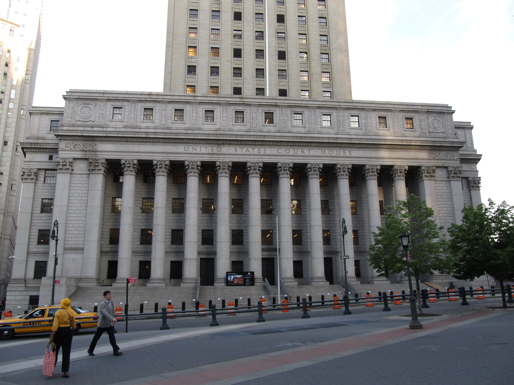

# Meta Wasn

_How the Meta and Anthropic rulings turned data provenance into a damages figure_

## Executive Summary

> [!callout]
> In May 2026, five publishers led by Elsevier sued Meta and Mark Zuckerberg personally. The dispute sits in an unexpected place. It is not "Llama trained on our books" but "where and how did Meta get those books." The complaint alleges that the company torrented 267 terabytes from pirate sources, masked its IP addresses to evade tracking, and stripped out copyright notices. What stands in the dock is not the model but the way the data was acquired.

> That shift is already settling into case law. Anthropic won a summary-judgment ruling that "training an AI is fair use," yet lost on "downloading and hoarding pirated data" and settled for $1.5 billion — the largest publicly disclosed recovery in the history of U.S. copyright litigation. The moment courts began separating training from data acquisition, a governance phrase like "unknown data provenance" converted directly into a damages award and an order to destroy copies.

> For anyone who works with data, the signal is clear: a model's value is moving from performance benchmarks to the pedigree of its data. This piece threads three strands — Meta, Anthropic, and the Korean lawsuits — onto the single line of data provenance, and asks why the ability to explain where your data came from is becoming infrastructure.

### Key Figures

Sources: [Holland & Knight](https://www.hklaw.com/en/insights/publications/2026/05/major-publishers-challenge-ai-training-practices), [NPR](https://www.npr.org/2025/09/05/nx-s1-5529404/anthropic-settlement-authors-copyright-ai), [Digital Journal](https://www.digitaljournal.com/article/what-enterprise-procurement-teams-actually-find-when-they-evaluate-ai-data-partners/)

Four numbers carry the weight of this case at a glance: the volume of data Meta is accused of pulling from pirate sites, the sum Anthropic put on the table to settle, how empty provenance verification still is on the data-trading floor, and what it costs to fill that gap after the fact. Inside these figures sits a single fact — provenance is not an abstraction; it is money.

<!-- stat-card -->
**267TB** — Works Meta downloaded — The scale allegedly torrented from pirate sites such as LibGen

<!-- stat-card -->
**$1.5B** — Anthropic settlement — ~$3,000 per work × ~500,000 works — the largest disclosed U.S. copyright recovery

<!-- stat-card -->
**78%** — Can't verify training data — Share of AI data partners that couldn't validate their training data in procurement reviews

<!-- stat-card -->
**4–5×** — Cost of retrofitting docs — Cost of reconstructing provenance later, plus months of launch delay

## The Defendant Is the Data's Provenance, Not Llama

On May 5, 2026, five publishers — Elsevier, Cengage, Hachette, Macmillan, and McGraw Hill — along with bestselling author Scott Turow, filed a complaint in the Southern District of New York. The defendants are Meta Platforms and Mark Zuckerberg personally. The case is captioned **Elsevier v. Meta**, No. 1:26-cv-03689. It has a different texture from the familiar "an AI trained on my writing" framing.

What the complaint takes aim at is how the data was obtained. It alleges that to train Llama, Meta torrented more than 267 terabytes of copyrighted works from shadow libraries such as LibGen and Anna's Archive — many times the size of the Library of Congress's print collection. On top of that, it claims Meta masked its IP addresses during torrenting to evade detection, and removed copyright management information (CMI) and copyright notices from the books to cover their origin. The filing also describes circumstances suggesting that, in the spring of 2023, Meta abandoned formal licensing negotiations and chose the pirate route instead.

*▲ Meta Platforms headquarters, Menlo Park, California. Elsevier and four other publishers named Meta and Mark Zuckerberg personally as defendants in Elsevier v. Meta. | Source: [Wikimedia Commons](https://commons.wikimedia.org/wiki/File:Meta_Platforms_Headquarters_Menlo_Park_California.jpg)*

So the claims split in two. One is willful copyright infringement; the other is liability for the CMI removal itself. The crux of the dispute is not what the model output, but how the data was gathered and which markings were erased. Meta has said it will "defend aggressively" and the case is ongoing — but the center of gravity of the question has plainly moved.

> [!callout]
> **The point**: In this suit the risk lives not inside the model but at the door where the data enters. What divides liability is less what was trained on than where the data came from, how it was acquired, and which markings were stripped on the way in.

## The Line the Court Drew: Training Is Fair Use, Hoarding Is Liability

Why the Meta suit drills into acquisition becomes clear once you look at a ruling one step ahead. In **Bartz v. Anthropic**, Judge William Alsup drew a line in a June 2025 summary-judgment ruling. Training a model on lawfully acquired books is transformative and therefore fair use. But downloading and hoarding pirated copies is a separate act of infringement. The same company saw one activity split in two — winning on the front half and losing on the back.

*▲ The Thurgood Marshall US Courthouse, home of the Southern District of New York. Judge Alsup's summary-judgment ruling in Bartz v. Anthropic — the precedent that split training from data acquisition — came down in this building. | Source: [Wikimedia Commons](https://commons.wikimedia.org/wiki/File:Thurgood_Marshall_U.S._Courthouse_(Home_of_the_U.S._Court_of_Appeals_for_the_Second_Circuit_and_S.D.N.Y.)_(7237324632).jpg)*

That led to the September 2025 settlement. Even though the fair-use defense partly held, Anthropic agreed to pay $1.5 billion. The target was roughly 500,000 works pulled from pirate databases such as LibGen and PiLiMi, at around $3,000 per work. The settlement terms included destroying those copies, and the deal was limited to past training conduct, leaving disputes over model outputs wide open.

Not every court sees it the same way. Around the same time, in **Kadrey v. Meta**, Judge Chhabria leaned toward the view that "training itself is fair use whether or not the data's source was lawful." So there is a subtle split among courts over how much acquisition method bears on the fair-use analysis. On one point, though, they all point the same way: if you separately download and hoard pirated data, that act of hoarding generates liability of its own.

> [!callout]
> **Why it matters**: The moment courts separate "training" from "data acquisition and storage," where you got the data becomes an independent source of liability — regardless of whether the model works well and lawfully. The weight of provenance comes precisely from this split.

## What $1.5 Billion Translated: Unknown Provenance Is a Damages Figure

Translate $1.5 billion into a data team's language and it reads like this: roughly $3,000 per work times about 500,000 works. A one-line governance memo that says "the data's provenance is unclear" was converted into an invoice with a price tag on every single book. Add the order to destroy the copies, and you also inherit the operational cost of unwinding and erasing the data you trained on.

What makes this arithmetic frightening is its additive structure. Each individual work is a small amount, but once a class action bundles 500,000 of them into a single class, the total explodes. A dataset whose provenance you cannot explain is not one dispute — it is a bomb that holds as many simultaneous claims as the items inside it. The volume of data effectively acts as a multiplier on risk.

The lessons legal analysts have drawn from this settlement point to the same place. Lawful data sourcing is a precondition for the fair-use defense, and the illegal shortcut comes back as the more expensive road. Provenance was not a compliance document; it was the variable that set the number of digits on the invoice.

> [!callout]
> **In one line**: Unknown provenance is no longer a documentation flaw — it is an accounting line item. If you cannot explain a dataset's pedigree, you carry the damages exposure of every item it contains.

## Buyers and Regulators Ask for the Pedigree First

It is not only courts that scrutinize provenance. Regulators and the market have begun demanding the data's pedigree at the same time. On the regulatory side, the EU AI Act enters substantive force in August 2026. General-purpose and high-risk models must publish a summary of their training data's sources and composition, and breaches carry up to €15 million or 3% of global revenue. The provision demands traceability from the moment data is gathered through to deployment.

*▲ The European Parliament hemicycle, Strasbourg. The EU AI Act enters substantive force in August 2026, requiring general-purpose and high-risk models to publish a summary of their training data's sources — with penalties up to €15M or 3% of global revenue. | Source: [Wikimedia Commons](https://commons.wikimedia.org/wiki/File:European_Parliament_Strasbourg_Hemicycle_-_Diliff.jpg) (CC BY-SA 3.0, Diliff)*

The market is moving even faster. As autonomous-driving and robotics programs cross into mass production, the evaluation criteria of the procurement teams that buy data have moved beyond unit price and labeling volume to data lineage, security certifications, and operational maturity. Asking for "ISO 42001 certification or a roadmap" in vendor questionnaires is becoming standard. And the figures coming off the floor are painful: 78% of AI data partners cannot verify their training data, and 77% cannot trace its origins. Enterprise deals collapse over a single documentation gap, regardless of technical strength.

The same question has reached Korean courtrooms. In January 2025, the three terrestrial broadcasters KBS, MBC, and SBS filed Korea's first AI news-training lawsuit against Naver, alleging unauthorized use of their news data for AI training; in February 2026 they also sought an injunction and damages against OpenAI. The issue is identical to the one abroad: what is the legal basis for the right to use that data, and how will you explain its provenance? Because the AI Framework Act that took effect in January 2026 does not explicitly fill the training-data and copyright gap, for now the answers are written by the courts.

> [!callout]
> **What changed**: The parties asking about provenance have widened from courts to regulators and buyers. Whoever buys a model now asks for the data's pedigree before performance benchmarks, and a supplier who cannot produce those papers is eliminated before sitting down at the table.

## The Next Diligence Is Data Lineage, Not Weights

Put all three strands of the case in one place and a single direction appears. The Meta suit put data acquisition in the dock; the Anthropic settlement put a price tag on unknown provenance; and regulation and procurement pulled that price tag back to the stage before a deal is even struck. The yardstick for valuing a model asset is shifting from the performance of its weights to the proof of its data lineage.

*▲ Server racks in a data center used to store AI training data. Tracking which data was taken, from where, under what rights, and how it was processed has become an infrastructure problem — not just a compliance checkbox. | Source: [Wikimedia Commons](https://commons.wikimedia.org/wiki/File:Wikimedia_Foundation_Servers-8055_13.jpg) (CC BY-SA 3.0, Victorgrigas)*

Brought down to practice, what to prepare is clear: keep a traceable record of which data you took, from where, under what rights, when, and how you processed it. Try to reconstruct that record after the fact and costs jump four- to fivefold while launches slip by months. Only organizations that build provenance into the pipeline from the start get a runway where, no matter which of a lawsuit, a regulator, or a buyer's diligence lands first, they can answer with the same papers.

At the table where models are bought and sold, the diligence document that comes next is unlikely to be a weights file. It will be a pedigree document: where you got this data, and how you prove the right to it. Whether regulation demands disclosure, a court assigns liability, or a buyer checks the lineage, the question you must answer ultimately converges on one. What data was this model made from, and can you explain it?

> [!callout]
> **Closing**: Provenance is becoming not a compliance document but the infrastructure that closes deals and forestalls lawsuits. In the next era, the first asset everyone who buys and sells models will check is the ability to explain where a dataset came from.

## References

### Industry & Press

- 1.Holland & Knight. (2026). "[Major Publishers Challenge AI Training Practices in Landmark Copyright Suit Against Meta](https://www.hklaw.com/en/insights/publications/2026/05/major-publishers-challenge-ai-training-practices)." _Holland & Knight Insights_. — Summary of Elsevier v. Meta: 267TB, IP masking, CMI removal, Zuckerberg named personally.
- 2.Norton Rose Fulbright. (2026). "[AI in Litigation Series: An Update on AI Copyright Cases in 2026](https://www.nortonrosefulbright.com/en/knowledge/publications/ce8eaa5f/ai-in-litigation-series-an-update-on-ai-copyright-cases-in-2026)." _Norton Rose Fulbright_. — Overview of 2026's key rulings and the "training ≠ pirated hoarding" split doctrine.
- 3.NPR. (2025). "[Anthropic pays authors $1.5 billion to settle copyright infringement lawsuit](https://www.npr.org/2025/09/05/nx-s1-5529404/anthropic-settlement-authors-copyright-ai)." _NPR_. — Reporting on the $1.5B Bartz v. Anthropic settlement.
- 4.Buchanan Ingersoll & Rooney. (2026). "[Anthropic's Copyright Settlement: Lessons for AI Developers and Deployers](https://www.bipc.com/anthropic%E2%80%99s-copyright-settlement-lessons-for-ai-developers-and-deployers)." _BIPC_. — Developer- and deployer-side lessons on lawful sourcing as the precondition for fair use.
- 5.Digital Journal. (2026). "[What enterprise procurement teams actually find when they evaluate AI data partners](https://www.digitaljournal.com/article/what-enterprise-procurement-teams-actually-find-when-they-evaluate-ai-data-partners/)." _Digital Journal_. — Procurement demand for lineage and ISO 42001, the 78%/77% verification-gap figures, and 4–5× retrofit cost.
- 6.The Seoul Shinmun. (2026). "[Will indiscriminate AI data scraping be reined in? A flood of copyright suits against tech giants](https://www.seoul.co.kr/news/plan/AI-lawbooks-algorithm/2026/02/06/20260206008004)." _Seoul Shinmun_. — Trends in Korean AI-training copyright suits, including the three broadcasters vs. Naver and OpenAI.

### Primary Documents

- 7.Association of American Publishers. (2026). "[Elsevier v. Meta — Complaint (Case No. 1:26-cv-03689)](https://publishers.org/wp-content/uploads/2026/05/2026-05-05-Complaint.pdf)." _S.D.N.Y._ — The complaint itself (primary source): claims of willful infringement and CMI violations.
- 8.Susman Godfrey LLP. (2025). "[Susman Godfrey Secures $1.5 Billion Settlement in Landmark AI Piracy Case](https://www.susmangodfrey.com/wins/susman-godfrey-secures-1-5-billion-settlement-in-landmark-ai-piracy-case/)." _Susman Godfrey_. — Plaintiff-side primary source for Bartz v. Anthropic.
