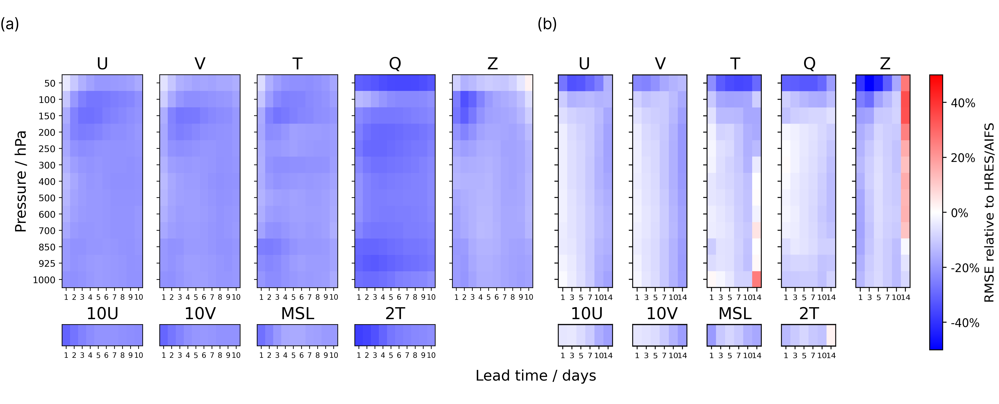
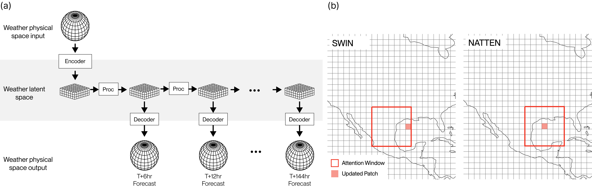
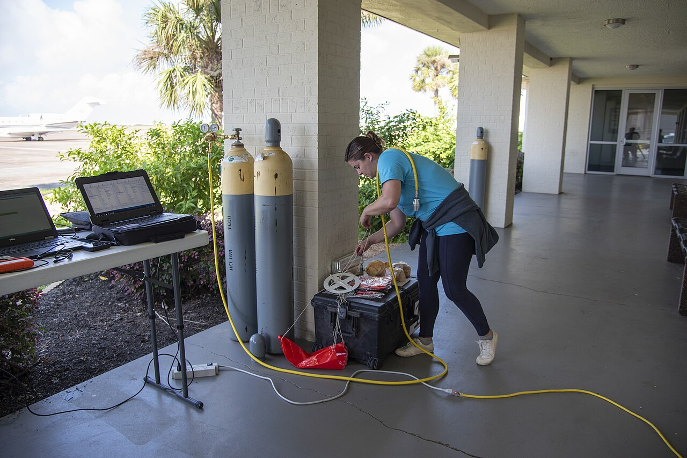

# AI Beat the Weather Agency

_What won wasn_

## Executive Summary

> [!callout]
> A startup's AI weather model has overtaken the European Centre for Medium-Range Weather Forecasts (ECMWF). WindBorne Systems' WeatherMesh-6 predicts temperatures 4.5 days out as accurately as ECMWF predicts them one day out. The obvious conclusion is "they built a better AI model." But look at the models and the story changes. WeatherMesh, Google's GraphCast, and ECMWF's own AIFS are all transformer-family designs, and at roughly one billion parameters WeatherMesh is on the small side.

> What decided the contest was the data. WeatherMesh refreshes its forecast every hour; ECMWF runs once every six. The observations feeding the model are up to eight hours fresher than the ones ECMWF starts from. Observations from roughly 400 weather balloons circling the globe go straight into the model, without passing through a government agency's intermediate products. With the same class of algorithm, the side that ate fresher data won.

> This piece follows how WeatherMesh beat ECMWF from the data's point of view rather than the model's. We start with the performance numbers, look at the evidence that architecture wasn't decisive, then lay out the difference freshness and the pipeline made. It is a case where what divided AI performance was not "how good is the model" but "how fresh is the data."

<!-- stat-card -->
**4.5 days = 1 day** — Accuracy reversal — WM-6 at 4.5 days ≈ ECMWF IFS at 1 day

<!-- stat-card -->
**Hourly** — Forecast refresh rate — ECMWF runs once per 6 hours

<!-- stat-card -->
**8 hours** — Fresher observations — vs. ECMWF initial conditions

<!-- stat-card -->
**$100k** — Training hardware — 33 RTX 4090s vs. a supercomputer

## The Forecasters Lost

In the world of weather forecasting, ECMWF has long been the name closest to the right answer. Operated jointly by European member states, its numerical model, IFS, has been the de facto benchmark for global forecast accuracy for decades, and it runs on a supercomputer worth hundreds of millions of dollars. Yet in 2026, WeatherMesh-6 — an AI model from WindBorne Systems, founded by Stanford students in 2019 — passed that benchmark.

In a global benchmark spanning January through March 2026, WeatherMesh-6's record was unambiguous. On 2-meter surface temperature, WM-6's forecast 4.5 days out was as accurate as ECMWF IFS one day out. Its ensemble root-mean-square error (RMSE) ran up to 38% below IFS, and against ECMWF's own AI model AIFS it led at every lead time out to 15 days. Its three-day forecast of wind speed at 100 meters was 7–11% more accurate than AIFS.

*▲ WeatherMesh's RMSE advantage over ECMWF HRES and AIFS (blue favors WeatherMesh). It leads across nearly every variable and lead time. | Source: [WeatherMesh-3, arXiv:2503.22235](https://arxiv.org/abs/2503.22235)*

> [!callout]
> **What's surprising**: not that a small startup beat a large institution, but how it did so. WeatherMesh used neither a bigger model nor a stronger supercomputer than ECMWF. So where did the reversal come from? To find the answer, you have to look at the data, not the model.

## The Architectures Look Alike

It is tempting to explain the reversal as "a smarter model." But place the models side by side and that explanation wobbles. WeatherMesh uses a SWIN-family vision transformer. Google DeepMind's GraphCast, Huawei's Pangu-Weather, and ECMWF's AIFS all share the same era of deep-learning structures — transformers or graph neural networks. At the level of broad architecture, they resemble one another.

*▲ WeatherMesh's encoder–latent space–decoder structure and SWIN-family attention. It shares its broad architecture with contemporary weather AIs. | Source: [WeatherMesh-3, arXiv:2503.22235](https://arxiv.org/abs/2503.22235)*

Scale doesn't explain WeatherMesh's edge either. With about one billion parameters, WeatherMesh is small not only next to trillion-parameter language models but next to its rival weather models too. Its earlier version, WM-3, achieved better performance with 15 times less compute than GraphCast and more than 10 times less than Pangu-Weather. In other words, it didn't win by being bigger.

Recent academic results point the same way. The 2025 FastNet study found that the choice of model architecture is not the only — or even the most important — factor separating performance. When the researchers kept GraphCast's architecture and changed only the loss function, the effective resolution improved from 1,250 km to 160 km. An improvement larger than any structural change came from how the data was handled. Ablation experiments that stripped Pangu-Weather's components one by one likewise found that optimizing the training procedure mattered more than Earth-specific design.

> [!callout]
> **The takeaway**: similar architecture, a smaller model, less compute. If all three hold at once, WeatherMesh's edge isn't inside the model. It is outside it — in the path the data travels to get there.

## The Real Edge Was Data Freshness

Forecast accuracy comes from two things: how well the model mimics the physics of the atmosphere, and how close to the present moment the initial conditions are. If two models mimic physics about equally well, the remaining variable is the freshness of those initial conditions. This is precisely where WeatherMesh dug in.

The most direct difference is the refresh rate. ECMWF recomputes its forecast four times a day, once every six hours. WeatherMesh-6 refreshes every hour, and its earlier version WM-5c was the world's first global model to update continuously at 20-minute intervals. Compare the two at the same instant and the observations WeatherMesh starts from are up to eight hours newer than ECMWF's. In a fast-changing atmosphere, eight hours is not a small gap.

The table below sets the two approaches side by side on the data dimension. The split isn't in model size or structure — it's in how often and how freshly the data arrives.

| Dimension | WeatherMesh | ECMWF |
| --- | --- | --- |
| Forecast refresh rate | Hourly (WM-6) / 20 min (WM-5c) | 6 hours |
| Initial-condition freshness | Up to 8 hours newer | Baseline |
| Observation path | Direct ingestion of sources, incl. own balloons | Centered on agency products |
| Observation types | 11 (satellite, radar, balloon, etc.) | Traditional assimilation system |

****************

Founder John Dean sums up the strategy in a sentence: "I personally don't understand the business model of being an AI weather company without a dataset advantage." He goes further, saying that even if you removed ECMWF's initial conditions and forecast from its own data alone, the model would still do quite well. It is a declaration that the moat is the data, not the model.

*▲ Fusing multiple observation sources in latent space and refreshing forecasts continuously through a recurrent loop (↻). Refresh rate and freshness are decided here. | Source: [WeatherMesh-3, arXiv:2503.22235](https://arxiv.org/abs/2503.22235)*

> [!callout]
> **The core observation**: the freshness gap was the accuracy gap. Even when two models begin a forecast at the same moment, the one fed data eight hours newer starts from a line that much closer to the present. In a forecast looking days ahead, that difference at the starting line follows the run all the way to the end.

## The Pipeline Beats the Supercomputer

Fresh data doesn't just appear. WindBorne makes its data and carries it itself. The company keeps roughly 400 weather balloons launched from 15 sites worldwide constantly aloft, and feeds those observations straight into the model — without passing through the intermediate products of agencies like ECMWF or NOAA. It removed, from the start, the latency and information loss introduced at every intermediate layer. WindBorne's head of AI explains that the decision to ingest its own balloon observations directly into the model, rather than leaning on ECMWF's dataset, was — after a year of model tuning — the turning point that lifted performance a full step. The leap came from changing the path data takes in, not from a better algorithm.

*▲ Preparing a weather balloon launch. WindBorne feeds observations from roughly 400 balloons worldwide straight into the model, bypassing intermediate agencies. | Source: [NASA / Wikimedia Commons](https://commons.wikimedia.org/wiki/File:NASA_Meteorologists_Launch_Weather_Balloon_Before_Research_Flight_(AFRC2018-0287-284).jpg)*

The data is varied, too. WeatherMesh-6 integrates 11 different observation types: microwave imagers, high-resolution infrared sounders, geostationary satellite imagery, radar composites, and the company's own balloon observations. Because one source can fill in when another is empty, dependence on any single source is low. To learn new observation types efficiently, it also encodes only the difference between an observation and the existing forecast value, rather than feeding the raw observation in.

All of this runs on 33 RTX 4090 graphics cards — about $100,000 of hardware. Next to a national supercomputer worth hundreds of millions, it looks like a toy. WM-3 produced a 14-day forecast in 12 seconds on a single RTX 4090. If the side short on compute beat the side awash in it, what decided the contest wasn't the amount of compute but what that compute was fed.

> [!callout]
> **The strategy in brief**: WindBorne's edge comes not from a smarter model but from a shorter, fresher data path. It sources observations directly, strips out intermediate layers, diversifies sources, and refreshes often. Those four things aren't the vocabulary of meteorology — they're the language of the data pipeline.

## A Weather Textbook for AI-Ready Data

Pull the WeatherMesh story out of meteorology and a familiar question remains. When we build an AI service, we usually ask "which model should we use?" first. We look for a bigger model, a newer architecture, more GPUs. Yet this case shows that, with the same algorithm, the side fed data that is fresher, more varied, and routed through a shorter path wins. It is a signal that the order of the questions should change.

Translate WeatherMesh's four strategies into plain terms and they become items on a data-quality checklist: freshness (how often is it refreshed?), diversity (are the sources skewed to one place?), directness (is the path from source to model short?), and whether that path stays reliable. These conditions aren't written on the model card, but they are what actually divides performance. Proven in weather forecasting, they hold no differently for fraud detection, recommendation, or autonomous operations.

Back in practice, the questions get simple. How often is the data feeding our model refreshed? How many sources are there, and what happens if one of them cuts out? How many steps lie between the source and the model, and how many days leak away in between? If you can answer these before going looking for a better model, you've already applied half the lesson WeatherMesh taught ECMWF.

> [!callout]
> **In one line**: it wasn't the model that won, it was the data. A case where performance was divided not by "how good is the model" but by "how fresh is the data" proves, in the language of meteorology, why investment in the data pipeline should come before investment in the model.

## References

### Academic

- 1.Du, H., et al. (2025). "[WeatherMesh-3: Fast and Accurate Operational Global Weather Forecasting](https://arxiv.org/abs/2503.22235)." arXiv:2503.22235.
- 2.Daub, et al. (2025). "FastNet: Effective Resolution and the Role of Training Methodology in AI Weather Models." (Shows that training methodology, not architecture, governs effective resolution.)

### Industry & Press

- 3.TechCrunch. (2026). "[This AI weather startup is out-forecasting government agencies](https://techcrunch.com/2026/06/01/this-ai-weather-startup-is-out-forecasting-government-agencies/)." June 1, 2026.

### Official Documentation

- 4.WindBorne Systems. "[Introducing WeatherMesh-6](https://windbornesystems.com/blog/introducing-wm-6)." WindBorne Blog.
- 5.WindBorne Systems. "[How We Built Our Record-Breaking AI Model: WeatherMesh](https://windbornesystems.com/blog/how-we-built-our-record-breaking-ai-model-weathermesh)." WindBorne Blog.
