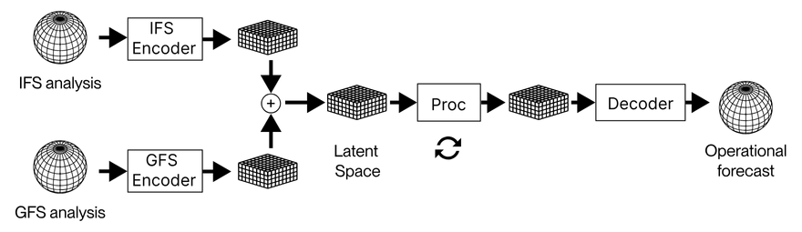

# AI가 기상청을 이겼다

_이긴 건 모델이 아니라 데이터 신선도였다_

## Executive Summary

> [!callout]
> 한 스타트업의 AI 날씨 모델이 유럽중기예보센터(ECMWF)를 제쳤습니다. WindBorne Systems의 WeatherMesh-6은 4.5일 뒤 기온 예보를 ECMWF의 1일 예보만큼 정확하게 맞혔습니다. 자연스럽게 떠오르는 결론은 "더 좋은 AI 모델을 만들었구나"입니다. 그런데 모델을 들여다보면 이야기가 달라집니다. WeatherMesh도, 구글의 GraphCast도, ECMWF의 AIFS도 모두 비슷한 트랜스포머 계열이고, WeatherMesh의 규모는 10억 파라미터 남짓으로 오히려 작은 축에 속합니다.

> 승부를 가른 것은 데이터였습니다. WeatherMesh는 예보를 매 시간 갱신하는데 ECMWF는 6시간마다 한 번 돌립니다. 모델에 들어가는 관측값은 ECMWF가 쓰는 것보다 최대 8시간 더 최신입니다. 전 세계를 도는 기상 기구 400기의 관측을 정부 기관의 중간 산출물을 거치지 않고 모델에 직접 넣습니다. 같은 알고리즘이라도 더 신선한 데이터를 먹은 쪽이 이긴 것입니다.

> 이 글은 WeatherMesh가 ECMWF를 이긴 과정을 모델이 아니라 데이터의 관점에서 따라갑니다. 성능 수치를 먼저 확인하고, 아키텍처가 결정적이지 않다는 근거를 본 뒤, 신선도와 파이프라인이 만든 차이를 정리합니다. "얼마나 좋은 모델인가"가 아니라 "얼마나 신선한 데이터인가"가 AI 성능을 가른 사례입니다.

<!-- stat-card -->
**4.5일 = 1일** — 예보 정확도 역전 — WM-6 4.5일 ≈ ECMWF IFS 1일

<!-- stat-card -->
**매 시간** — 예보 갱신 주기 — ECMWF는 6시간에 1회

<!-- stat-card -->
**8시간** — 더 신선한 관측 — ECMWF 초기 조건 대비

<!-- stat-card -->
**$100k** — 훈련 하드웨어 — RTX 4090 33대 vs 슈퍼컴

## 기상청이 졌다

기상 예보의 세계에서 ECMWF는 오랫동안 정답에 가장 가까운 이름이었습니다. 유럽 회원국들이 함께 운영하는 이 센터의 수치예보모델 IFS는 수십 년간 전 지구 예보 정확도의 사실상 기준점이었고, 수천억 원짜리 슈퍼컴퓨터 위에서 돌아갑니다. 그런데 2026년, 2019년에 스탠퍼드 학생들이 창업한 WindBorne Systems의 AI 모델 WeatherMesh-6이 그 기준점을 넘었습니다.

2026년 1월부터 3월까지의 글로벌 벤치마크에서 WeatherMesh-6의 성적은 분명했습니다. 지상 2m 기온 기준으로, WM-6이 4.5일 뒤를 내다본 예보가 ECMWF IFS의 1일 예보만큼 정확했습니다. 앙상블 예보의 평균 제곱근 오차(RMSE)는 IFS보다 최대 38% 낮았고, ECMWF가 자체 개발한 AI 모델 AIFS와 비교해도 15일에 이르는 모든 리드타임에서 앞섰습니다. 100m 고도 풍속 3일 예측은 AIFS보다 7~11% 더 정확했습니다.

*▲ WeatherMesh가 ECMWF HRES·AIFS 대비 보인 RMSE 우위(파란색이 우세). 거의 모든 변수와 리드타임에서 앞선다. | Source: [WeatherMesh-3, arXiv:2503.22235](https://arxiv.org/abs/2503.22235)*

> [!callout]
> **무엇이 놀라운가**: 작은 스타트업이 거대 기관을 이긴 사건 자체가 아니라, 그것을 가능하게 한 방식입니다. WeatherMesh는 ECMWF보다 더 큰 모델도, 더 강한 슈퍼컴퓨터도 쓰지 않았습니다. 그렇다면 이 역전은 어디에서 왔을까요. 답을 찾으려면 모델이 아니라 데이터를 봐야 합니다.

## 아키텍처는 다들 비슷하다

성능 역전을 "더 똑똑한 모델"로 설명하고 싶은 유혹이 있습니다. 그런데 모델을 나란히 놓고 보면 그 설명이 흔들립니다. WeatherMesh는 SWIN 계열의 비전 트랜스포머를 씁니다. 구글 딥마인드의 GraphCast, 화웨이의 Pangu-Weather, ECMWF의 AIFS도 모두 트랜스포머나 그래프 신경망 같은 같은 시대의 딥러닝 구조를 공유합니다. 아키텍처의 큰 틀에서는 서로 비슷합니다.

*▲ WeatherMesh의 인코더–잠재공간–디코더 구조와 SWIN 계열 어텐션. 동시대 기상 AI들과 큰 틀을 공유한다. | Source: [WeatherMesh-3, arXiv:2503.22235](https://arxiv.org/abs/2503.22235)*

규모도 WeatherMesh의 우위를 설명하지 못합니다. WeatherMesh의 파라미터는 약 10억 개로, 수조 개 파라미터의 대형 언어 모델은 물론이고 경쟁 기상 모델과 비교해도 작은 편입니다. 이전 버전인 WM-3은 GraphCast보다 15배 적은 연산으로, Pangu-Weather보다 10배 이상 적은 연산으로 더 나은 성능을 냈습니다. 더 크게 만들어서 이긴 것이 아니라는 뜻입니다.

학계의 최근 결과도 같은 방향을 가리킵니다. 2025년 FastNet 연구는 모델 아키텍처 선택이 성능을 가르는 유일한, 혹은 가장 중요한 요인이 아니라고 밝혔습니다. 연구진이 GraphCast와 동일한 아키텍처에서 손실 함수만 바꾸자, 유효 해상도가 1,250km에서 160km로 좋아졌습니다. 어떤 구조 변경보다 큰 개선이 데이터를 다루는 방식에서 나온 것입니다. Pangu-Weather의 구성 요소를 하나씩 제거한 실험에서도, 지구 특화 설계보다 훈련 절차의 최적화가 더 중요하다는 결과가 나왔습니다.

> [!callout]
> **정리**: 비슷한 아키텍처, 더 작은 모델, 더 적은 연산. 이 세 가지가 동시에 성립한다면, WeatherMesh의 우위는 모델 안에 있지 않습니다. 모델 바깥, 데이터가 들어오는 길에 있습니다.

## 진짜 차이는 데이터 신선도였다

기상 예보의 정확도는 두 가지에서 나옵니다. 모델이 대기의 물리를 얼마나 잘 흉내 내는가, 그리고 모델이 출발하는 초기 조건이 얼마나 현재에 가까운가. 두 모델의 물리 흉내 실력이 비슷하다면, 남는 변수는 초기 조건의 신선도입니다. WeatherMesh는 바로 이 지점을 파고들었습니다.

가장 직접적인 차이는 갱신 주기입니다. ECMWF는 하루 네 번, 6시간마다 예보를 새로 계산합니다. WeatherMesh-6은 매 시간 예보를 갱신하고, 이전 버전인 WM-5c는 20분 간격으로 연속 갱신하는 세계 최초의 글로벌 모델이었습니다. 같은 순간에 두 모델을 비교하면, WeatherMesh가 출발점으로 삼은 관측값이 ECMWF의 것보다 최대 8시간 더 최신이었습니다. 빠르게 변하는 대기에서 8시간은 작지 않은 격차입니다.

아래 표는 두 접근의 데이터 측면을 나란히 놓은 것입니다. 모델의 크기나 구조가 아니라, 데이터가 얼마나 자주, 얼마나 신선하게 들어오는가에서 갈립니다.

| 항목 | WeatherMesh | ECMWF |
| --- | --- | --- |
| 예보 갱신 주기 | 매 시간 (WM-6) / 20분 (WM-5c) | 6시간 |
| 초기 조건 신선도 | 최대 8시간 더 최신 | 기준값 |
| 관측 데이터 경로 | 자체 기구 등 원천 직접 ingestion | 기관 산출물 중심 |
| 관측 유형 수 | 11종 (위성·레이더·기구 등) | 전통 동화 체계 |

****************

창업자 John Dean의 말은 이 전략을 한 문장으로 요약합니다. "데이터셋 우위 없이 AI 날씨 회사를 한다는 비즈니스 모델이 저는 개인적으로 이해가 안 됩니다." 그는 한 발 더 나아가, ECMWF의 초기 조건을 빼고 자체 데이터만으로 예보해도 여전히 꽤 잘할 것이라고 말했습니다. 모델이 아니라 데이터가 회사의 해자라는 선언입니다.

*▲ 여러 관측 소스를 잠재 공간에서 융합하고 순환 구조(↻)로 예보를 연속 갱신하는 흐름. 갱신 주기와 신선도가 여기서 갈린다. | Source: [WeatherMesh-3, arXiv:2503.22235](https://arxiv.org/abs/2503.22235)*

> [!callout]
> **핵심 관찰**: 신선도 격차가 곧 정확도 격차였습니다. 두 모델이 같은 시각에 예보를 시작해도, 8시간 더 최신 데이터를 받은 쪽은 그만큼 현재에 가까운 출발선에 섭니다. 며칠 뒤를 내다보는 예보에서 이 출발선의 차이는 끝까지 따라붙습니다.

## 파이프라인이 슈퍼컴을 이긴다

신선한 데이터는 그냥 주어지지 않습니다. WindBorne은 데이터를 직접 만들고, 직접 나릅니다. 회사는 전 세계 15개 지점에서 띄운 기상 기구 약 400기를 상시 비행시키며, 여기서 나온 관측을 ECMWF나 NOAA 같은 기관의 중간 산출물을 거치지 않고 모델에 직접 넣습니다. 중간 레이어를 거칠 때마다 생기는 지연과 정보 손실을 처음부터 없앤 것입니다. WindBorne의 AI 책임자는 ECMWF 데이터셋에 기대는 대신 자체 기구 관측을 직접 모델에 넣은 결정이, 1년에 걸친 모델 튜닝을 거쳐 성능을 한 단계 끌어올린 전환점이었다고 설명합니다. 더 나은 알고리즘이 아니라 데이터가 들어오는 경로를 바꾼 것이 도약의 계기였던 셈입니다.

*▲ 기상 기구 발사 준비 장면. WindBorne은 전 세계 약 400기의 기구 관측을 중간 기관을 거치지 않고 모델에 직접 넣는다. | Source: [NASA / Wikimedia Commons](https://commons.wikimedia.org/wiki/File:NASA_Meteorologists_Launch_Weather_Balloon_Before_Research_Flight_(AFRC2018-0287-284).jpg)*

데이터의 종류도 다양합니다. WeatherMesh-6은 마이크로파 영상기, 고분해능 적외선 사운더, 정지궤도 위성 영상, 레이더 복합 자료, 자체 기구 관측까지 11종의 서로 다른 관측을 통합합니다. 한 소스가 비어도 다른 소스가 메우는 구조라, 단일 출처에 대한 의존이 낮습니다. 새 관측 유형을 효율적으로 학습하기 위해, 관측값을 그대로 넣는 대신 관측값과 기존 예보값의 차이만 인코딩하는 방식도 씁니다.

이 모든 것이 RTX 4090 그래픽카드 33대, 약 10만 달러어치 하드웨어 위에서 돌아갑니다. 수천억 원짜리 국가 슈퍼컴퓨터와 비교하면 장난감처럼 보이는 규모입니다. WM-3은 단일 RTX 4090 한 대로 14일 예보를 12초 만에 만들어 냈습니다. 연산이 부족한 쪽이 연산이 넘치는 쪽을 이겼다면, 승부를 가른 것은 연산량이 아니라 그 연산에 무엇을 먹였는가입니다.

> [!callout]
> **전략의 요점**: WindBorne의 우위는 더 똑똑한 모델이 아니라 더 짧고 신선한 데이터 경로에서 나옵니다. 원천 관측을 직접 확보하고, 중간 레이어를 걷어내고, 출처를 다양화하고, 자주 갱신합니다. 이 네 가지는 기상학 용어가 아니라 데이터 파이프라인의 언어입니다.

## AI-Ready Data의 기상학 교과서

WeatherMesh 이야기를 기상학 밖으로 끌고 나오면, 익숙한 질문 하나가 남습니다. AI 서비스를 만들 때 우리는 보통 "어떤 모델을 쓸까"부터 묻습니다. 더 큰 모델, 더 새로운 아키텍처, 더 많은 GPU를 찾습니다. 그런데 이 사례는 같은 알고리즘이라도 더 신선하고, 더 다양하고, 더 짧은 경로로 들어온 데이터를 받은 쪽이 이긴다는 것을 보여 줍니다. 질문의 순서가 바뀌어야 한다는 신호입니다.

WeatherMesh의 네 가지 전략을 일반 언어로 옮기면 그대로 데이터 품질의 항목이 됩니다. 신선도(얼마나 자주 갱신되는가), 다양성(출처가 한쪽에 쏠려 있지 않은가), 직접성(원천에서 모델까지 경로가 짧은가), 그리고 그 경로가 안정적으로 유지되는가. 모델 카드에는 적히지 않지만 성능을 실제로 가르는 조건들입니다. 기상 예보에서 검증된 이 조건들은 사기 탐지든 추천이든 자율 운영이든 다르지 않습니다.

실무로 돌아오면 질문은 단순해집니다. 우리 모델에 들어가는 데이터는 얼마나 자주 갱신됩니까. 출처는 몇 개이고, 한 곳이 끊기면 어떻게 됩니까. 원천에서 모델까지 몇 단계를 거치고, 그 사이에서 며칠이 새고 있습니까. 더 좋은 모델을 찾기 전에 이 질문들에 먼저 답할 수 있다면, WeatherMesh가 ECMWF에게 가르친 교훈을 이미 절반은 적용한 셈입니다.

> [!callout]
> **한 줄 요약**: 이긴 건 모델이 아니라 데이터였습니다. "얼마나 좋은 모델인가"가 아니라 "얼마나 신선한 데이터인가"가 성능을 가른 이 사례는, 데이터 파이프라인에 대한 투자가 모델에 대한 투자보다 먼저여야 하는 이유를 기상학의 언어로 증명합니다.

## 참고문헌

### 학술

- 1.Du, H., et al. (2025). "[WeatherMesh-3: Fast and Accurate Operational Global Weather Forecasting](https://arxiv.org/abs/2503.22235)." arXiv:2503.22235.
- 2.Daub, et al. (2025). "FastNet: Effective Resolution and the Role of Training Methodology in AI Weather Models." (아키텍처가 아닌 훈련 방법론이 유효 해상도를 좌우함을 보인 연구.)

### 업계·보도

- 3.TechCrunch. (2026). "[This AI weather startup is out-forecasting government agencies](https://techcrunch.com/2026/06/01/this-ai-weather-startup-is-out-forecasting-government-agencies/)." 2026-06-01.

### 공식 문서

- 4.WindBorne Systems. "[Introducing WeatherMesh-6](https://windbornesystems.com/blog/introducing-wm-6)." WindBorne Blog.
- 5.WindBorne Systems. "[How We Built Our Record-Breaking AI Model: WeatherMesh](https://windbornesystems.com/blog/how-we-built-our-record-breaking-ai-model-weathermesh)." WindBorne Blog.
