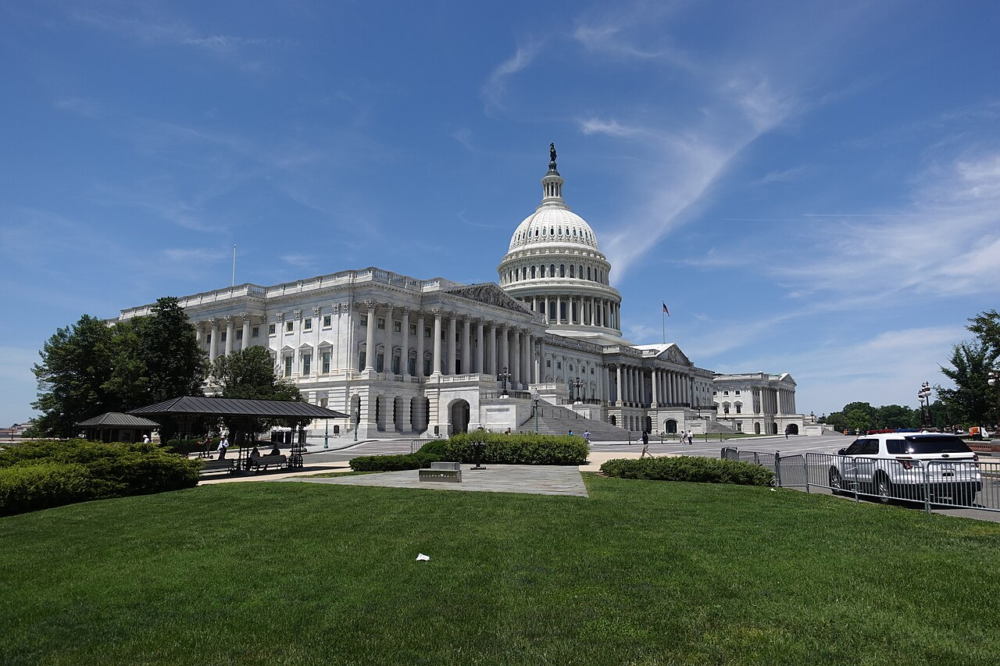
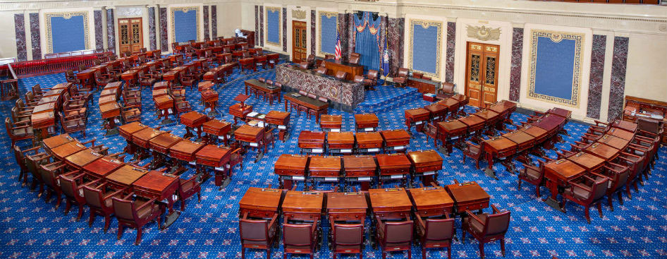
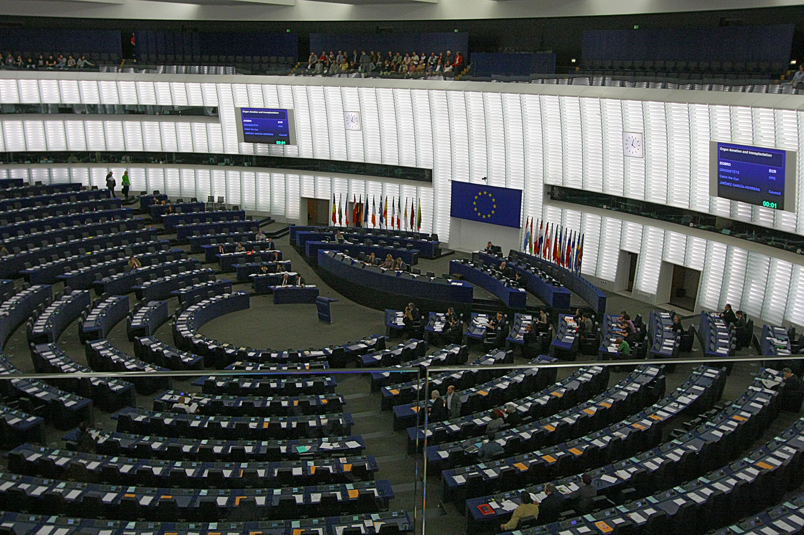

# Report an AI Wrong, and the Law Protects the Worker

_The insider who witnessed the data decision becomes the first evidence of AI accountability_

## Executive Summary

> [!callout]
> For the first time, U.S. federal law is moving to protect workers who report an "AI violation" directly. The Senate's AI Whistleblower Protection Act (S.1792) and GAAIA, a discussion draft released in June 2026, share the same principle: even if a company hands you an NDA or an arbitration clause, an employee can still report a violation of AI-related law to regulators and to Congress. This piece reads what those bills change through the lens of data governance.

> Until now, AI regulation has mostly policed outcomes — a discriminatory hiring decision, a fraudulent deepfake, an output that already exists. The new bills shift the center of gravity upstream. The person who saw which data a model was trained on, and which risks it was shipped with anyway — the insider with access to the data and model decisions — is placed on the stand as a legally protected witness.

> For data engineers and ML engineers, this is not abstract policy news. It is a structure in which the everyday work of choosing training data and signing off on a deployment becomes legal evidence. We've laid out the point where data governance spills past compliance and into labor rights, in four scenes.

### Key Figures

Four numbers sketch the outline of this shift: who tried to raise the alarm first, what a retaliated whistleblower gets back, which size of company has to disclose its data and model decisions, and what it costs to break those duties. Every figure below is explained again in the body.

Sources: [Time](https://time.com/6985866/openai-whistleblowers-interview-google-deepmind/), [Senate Judiciary Committee](https://www.judiciary.senate.gov/press/rep/releases/grassley-introduces-ai-whistleblower-protection-act), [California SB 53](https://leginfo.legislature.ca.gov/)

<!-- stat-card -->
**13** — Right to Warn signatories — Current and former OpenAI and DeepMind staff on the 2024 open letter

<!-- stat-card -->
**2×** — Back pay on retaliation — Reinstatement plus double back pay with interest plus legal fees

<!-- stat-card -->
**$500M** — GAAIA disclosure threshold — Data and model disclosure for frontier developers above $500M revenue

<!-- stat-card -->
**$1M** — California SB 53 penalty cap — For violations of whistleblower protection and safety-incident reporting

## The Contract That Silenced the Truth

In May 2024, it came to light that departing OpenAI employees had been forced into a choice. Sign a sweeping non-disclosure and non-disparagement clause, or forfeit vested equity worth millions of dollars. In effect, it demanded silence about the company for life, covering even facts already in the open. Anonymous employees filed a complaint with the Securities and Exchange Commission (SEC), saying they were bound so tightly they could not even raise a legal report.

A month later, 13 current and former employees of OpenAI and Google DeepMind published an open letter titled "Right to Warn." Their argument was plain: AI companies have a financial incentive to dodge oversight, and internal governance alone cannot check that incentive. What they asked for was simple — a right to raise safety concerns with regulators, with boards, and with the public.

> [!callout]
> This is the structural reason existing whistleblower law barely reaches AI. To borrow the words of former OpenAI researcher Daniel Kokotajlo, AI is still a field without dedicated regulation. Because it is not a regulated industry, there was no legal channel to report a violation and no shield to protect the person who reported it. Many of the risks are not even defined as illegal yet, so the old law cannot protect the person who saw them.

The result was silence. Stacking trade secrets on top of NDAs turned locking safety flaws inside the company into standard practice. In November 2024, Suchir Balaji — a former researcher who had publicly analyzed the legal and ethical problems in ChatGPT's training data and was preparing to testify in the New York Times v. OpenAI lawsuit — died suddenly. The case was widely cited as a stark example of how exposed an insider can be.

*▲ The U.S. Capitol Building, where the AI Whistleblower Protection Act (S.1792) and the GAAIA discussion draft are under deliberation. | Source: [Wikimedia Commons (CC BY-SA 4.0)](https://commons.wikimedia.org/wiki/File:Capitol_Building_of_the_United_States_20240601.jpg)*

## Washington Steps In for the First Time

Legislation to break the silence is moving along two tracks — one narrow and fast, the other broad and ambitious. Both share a single principle: a company cannot strip away the right to report through a contract it wrote.

### 2.1. AI Whistleblower Protection Act (S.1792 / H.R.3460)

Senators Chuck Grassley (R-Iowa) and Chris Coons (D-Delaware) introduced it on a bipartisan basis, and in the House, Ted Lieu (D-California) and Jay Obernolte (R-California) filed a companion bill. The protected parties are current and former employees and contractors of AI companies. When they report an "AI violation" or an "AI security vulnerability," they are shielded from firing, demotion, harassment, and discrimination.

A few design choices stand out. The reporter does not have to prove that a violation occurred; it is enough to meet a good-faith standard — a reasonable belief that one did. The bodies that can receive a report run wide, from federal law enforcement and regulators to the Attorney General and Congress. The remedies for retaliation are concrete too: reinstatement with seniority, double back pay with interest, compensatory damages, and attorney's fees are all spelled out. Above all, no contract — no NDA or arbitration clause — can waive this right.

More than 20 organizations back the bill, including the National Whistleblower Center, the Government Accountability Project, and the Center for Democracy & Technology. That said, the current draft leaves out financial rewards such as a whistleblower bounty.

*▲ The U.S. Senate Chamber. Senators Grassley (R) and Coons (D) introduced S.1792, the bipartisan AI Whistleblower Protection Act, in this chamber. | Source: [United States Senate / Public Domain](https://commons.wikimedia.org/wiki/File:United_States_Senate_Floor.jpg)*

### 2.2. The Great American AI Act (GAAIA) — the Bigger Picture

GAAIA (the Great American Artificial Intelligence Act), a 269-page discussion draft released on June 4, 2026, extends the same protection far more broadly. Jay Obernolte and Lori Trahan (D-Massachusetts) introduced it, and six members — including House Speaker Mike Johnson — signed on as co-sponsors. Its whistleblower protection reaches not only frontier AI companies but employees and independent contractors of every employer.

The data-governance provisions matter more from this article's angle. Large frontier developers above $500 million in revenue must publish a risk framework, and with every new model deployment, disclose a report covering the release date, supported languages, output modalities, intended uses, restrictions, risk assessment, and mitigations. That disclosure then goes through third-party audit by an Independent Verification Organization (IVO). Decisions about data and models, in other words, are written down and put up for outside verification.

> [!callout]
> GAAIA touches labor data as well. If an employer with 100 or more workers made AI a "substantial factor" in a mass layoff, it amends the WARN Act to require disclosure of the type of AI used, the estimated share of jobs lost to it, and any retraining efforts. It places an AI workforce research hub inside the Department of Labor and has the Bureau of Labor Statistics and the Census Bureau survey AI-adoption data. The draft is not without controversy, though: it also carries a clause that lets the federal government preempt state AI "development" rules for three years and limits state authority — which is why its odds of passing before the August recess look dim.

## The Person Who Saw the Data Is the First Evidence

This is where the story reaches the people who handle data directly. AI regulation so far has mostly looked at the output — whether a hiring algorithm screened out a particular group, whether a deepfake deceived someone. But the chain of responsibility that leads to that output begins much further upstream.

- •What data was it trained on?
- •Which biases was it shipped with, knowingly?
- •How were the safety evaluations recorded?
- •Who decided it was "ready to ship"?

The answers to these questions do not live in the logs alone. They live in the heads and records of the people who chose the training data, read the evaluation results, and pressed the deploy button. That person is exactly who the new bills set out to protect. A data engineer, an ML engineer, a safety researcher becomes a legally protected witness as the "person who saw the data." The deepest shift in this legislation is the idea that the first evidence of AI accountability is not a system log but the insider who witnessed the decision.

The same current shows up on the compliance side. Training data itself is starting to be recognized as a risk. Copyright-infringing data, biased sources, illegal content soon turn into IP disputes, discrimination suits, and regulatory sanctions. In a 2026 analysis, the law firm Debevoise & Plimpton concludes that recording data sources, documenting data-quality assessments, logging access to training data, and tracing data lineage are now compliance essentials.

> [!callout]
> This is where governance meets labor rights. A well-kept data-governance record becomes a whistleblower's means of self-defense, because a record that says "I objected to this decision" increasingly carries legal weight. When AI systems are held to account, the central question keeps converging on one thing: who knew about the decision. Recording data lineage is no longer just a matter of engineering hygiene — it is also a device that protects the person who signed off on the decision.

## Where Things Stand Now

The fate of the U.S. federal bills is still open. GAAIA is unlikely to pass before the August recess, and the AI Whistleblower Protection Act is still working its way through committee. Yet the direction already looks set, because this is not an American phenomenon alone.

- •**EU** — In November 2025, the EU AI Office opened a dedicated channel for reporting AI Act violations anonymously. From August 2, 2026, the EU Whistleblower Directive applies explicitly to AI Act violations.
- •**California** — SB 53 was signed in September 2025 and is already in force. It requires large model developers to publish a risk framework, report critical safety incidents within 15 days, and protect whistleblowers, with penalties of up to $1 million per violation.
- •**South Korea** — The AI Basic Act took effect on January 22, 2026, making Korea the world's second comprehensive AI regulatory framework after the EU. Its focus, however, is on high-impact and generative AI obligations; whistleblower protection is not yet part of it.

*▲ European Parliament plenary in Strasbourg. The EU AI Office opened a dedicated anonymous reporting channel for AI Act violations in November 2025; the EU Whistleblower Directive applies explicitly to the AI Act from August 2026. | Source: [Wikimedia Commons (CC BY 2.0)](https://commons.wikimedia.org/wiki/File:Hemicycle_of_Louise_Weiss_building_of_the_European_Parliament,_Strasbourg.jpg)*

Once these laws settle in, every organization that makes decisions about AI enters a changed structure of accountability. It means the person who chose the data, the person who deployed the model, and the person who watched the process can no longer be hidden behind a contract. In English, and especially in Korean, writing that treats this subject at the intersection of data governance and labor rights is still rare — and that gap is part of why we're writing it now.

> [!callout]
> **Editor's Note.** Pebblous works on recording and verifying the lineage and quality of data. Overlay the trend above onto that work, and a data-governance record becomes more than a compliance response — it becomes a device that protects the person who made the decision. When the record of who saw which data and decided what remains, that record is at once evidence of accountability and a shield for the reporter.

## References

### Official Legislative Documents

- 1.U.S. Congress. (2026). "[S.1792 — AI Whistleblower Protection Act](https://www.congress.gov/bill/119th-congress/senate-bill/1792/text)." Congress.gov, 119th Congress.
- 2.U.S. Senate Judiciary Committee. (2026). "[Grassley Introduces AI Whistleblower Protection Act](https://www.judiciary.senate.gov/press/rep/releases/grassley-introduces-ai-whistleblower-protection-act)." Press Release.
- 3.Office of Rep. Lori Trahan. (2026). "[GAAIA Discussion Draft — Section-by-Section Summary](https://trahan.house.gov/uploadedfiles/gaaia_discussion_draft_section-by-section.pdf)." U.S. House of Representatives.

### Legal & Industry Analysis

- 4.Fisher Phillips. (2026). "[Congress Proposes First Comprehensive Federal AI Framework](https://www.fisherphillips.com/en/insights/insights/congress-proposes-first-comprehensive-federal-ai-framework)." Insights.
- 5.Debevoise & Plimpton. (2026). "[Preparing for AI Whistleblowers — 2026 Update](https://www.debevoisedatablog.com/2026/03/29/preparing-for-ai-whistleblowers-2026-update/)." Debevoise Data Blog.
- 6.Lawfare. "[Protecting AI Whistleblowers](https://www.lawfaremedia.org/article/protecting-ai-whistleblowers)." Lawfare Media.
- 7.Roll Call. (2026). "[Bipartisan AI draft proposes three-year preemption of state laws](https://rollcall.com/2026/06/04/bipartisan-ai-draft-proposes-three-year-preemption-of-state-laws/)."

### Press, Civil Society & International

- 8.Time. (2024). "[Two Former OpenAI Employees On the Need for Whistleblower Protections](https://time.com/6985866/openai-whistleblowers-interview-google-deepmind/)."
- 9.National Whistleblower Center. "[Pass the AI Whistleblower Protection Act](https://www.whistleblowers.org/campaigns/the-urgent-case-for-the-ai-whistleblower-protections-congress-must-pass-the-ai-whistleblower-protection-act/)." Campaign.
- 10.EU AI Office. (2025). "[Whistleblowing and the EU AI Act](https://artificialintelligenceact.eu/whistleblowing-and-the-eu-ai-act/)." artificialintelligenceact.eu.
