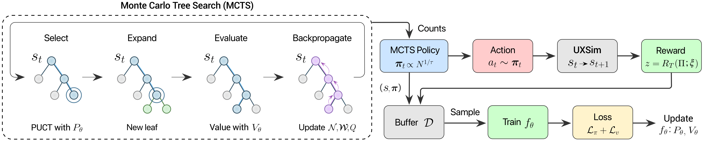
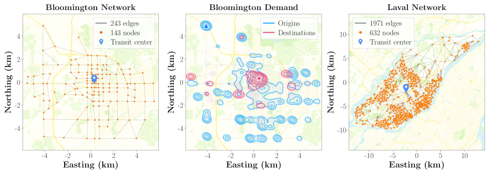

# When AI Redraws the Bus Line You Take

_AlphaTransit_

## Executive Summary

> [!callout]
> How did the bus line you take every day come to follow that exact path? It is the product of decades — city planners, operators, public petitions, budgets, and accumulated data. Academia calls this the **Transit Route Network Design Problem (TRNDP)**, and it has resisted clean algorithmic solutions for sixty years. On top of NP-hard combinatorial complexity sits something worse: **delayed feedback**. The value of any single route can only be evaluated after the entire network is drawn — the hardest case in reinforcement learning. On May 27, 2026, three authors — Bibek Poudel, Sai Swaminathan, and Weizi Li — released [**AlphaTransit** (arXiv:2605.28730)](https://arxiv.org/abs/2605.28730). **The pattern AlphaGo demonstrated on game boards — MCTS coupled with a neural policy-value network — has arrived on the road network of a real city.**

> The mechanism has two arms. A **policy network** proposes candidate route extensions; a **value network** estimates the downstream design quality of each choice. Together they guide **Monte Carlo Tree Search (MCTS)** at every decision step. The numbers are clear. On Bloomington, Indiana's real road topology with census-derived commuting demand: **service rates of 54.6% (mixed demand) and 82.1% (full transit demand)**. Versus RL alone: **+9.9pp and +11.4pp**. Versus MCTS alone: **+2.5pp and +11.2pp**. The paper's central claim is verbatim: _"coupling learned guidance with MCTS is more effective than using either approach alone for transit network design."_

> This article is written for two readers: the commuter who rides a bus every day without knowing how its route was decided, and the data practitioner who wants to meet the elegance of RL and search again in urban infrastructure. We try to be honest about what AlphaTransit solved and what it did not, and we place it within the [Spatial AI evaluation criteria](/project/UrbanGPT/spatial-ai-pebblous/en/) Pebblous proposed. **"AI designs cities"** is a headline we read slightly smaller — and slightly more precisely.

<!-- stat-card -->
**54.6%** — Mixed-demand service rate — Bloomington benchmark

<!-- stat-card -->
**82.1%** — Full transit service rate — extreme mode-shift scenario

<!-- stat-card -->
**+11.4pp** — vs RL alone — full transit scenario

<!-- stat-card -->
**+11.2pp** — vs MCTS alone — learned-guidance gain

## TRNDP — Why It's Hard

Standing at a bus stop, almost no one asks: _why does this line pass here?_ Begin to answer it and the answer is not shallow. A single route is the accumulated product of planner analyses, citizen petitions, operator budgets, and decades of ridership patterns. **How should K routes be placed on a city's road network?** Academia calls it the Transit Route Network Design Problem — TRNDP for short.

TRNDP has been a classical Operations Research problem since the 1970s. Mixed-integer programming, genetic algorithms, simulated annealing — each was tried in turn, and each exploded at city scale. The reason is straightforward. Even with a hundred road-network nodes, the number of possible route combinations becomes astronomical, and the value of any one route depends on its interaction with all the others. **The textbook definition of NP-hard.**

> [!callout]
> But TRNDP's real difficulty sits one layer below NP-hard. **Whether a single route is "good" can only be evaluated after all routes are drawn and a simulation is run.** Draw one badly and you won't know until the whole network completes. In reinforcement-learning terms this is **long-horizon credit assignment** — the problem of tracing which of 60-100 sequential decisions contributed how much to the final score. This single sentence has tripped every algorithmic attempt at TRNDP.

Go and chess carried the same burden. The value of one move cannot be known until the game ends. We know how AlphaGo solved it — **combine search (MCTS) with learning (a neural policy-value function).** AlphaTransit attempts exactly the same pattern on a road network.

## How AlphaTransit Works — MCTS + Policy-Value

What AlphaTransit does, in one sentence: **on the road-network graph, it extends routes one edge at a time until K routes are complete.** Each step is a decision; the accumulation of decisions becomes the final transit network. By analogy, it is a board game where K route decisions are played out one move at a time.

*▲ AlphaTransit overview: at each route-construction state, MCTS uses the policy-value network for Select / Expand / Evaluate / Backpropagate; visit-count statistics define an MCTS policy, sampled actions advance the state, and UXsim returns a terminal reward. | Source: [Poudel, Swaminathan & Li (2026), Figure 2 — arXiv:2605.28730](https://arxiv.org/html/2605.28730v1)*

### 2.1. Policy network and value network

The agent's brain is two neural networks. The **policy network** takes the current state (routes drawn so far + road network + demand) and outputs a probability distribution over "which edge should the route extend to next." The **value network** takes the same state and estimates "from here, how good will the final design likely be." Both networks share inputs — road graph, OD demand, existing route geometry — but their outputs differ: one is the next move, the other is the future score.

*▲ AlphaTransit's policy-value network: a shared graph-attention backbone feeds an actor head (next-edge probabilities, MCTS priors) and a critic head (state value, MCTS leaf estimates). | Source: [Poudel, Swaminathan & Li (2026), Figure 3 — arXiv:2605.28730](https://arxiv.org/html/2605.28730v1)*

### 2.2. MCTS — decision-time lookahead

If the policy and value networks provide "intuition," **Monte Carlo Tree Search** raises that intuition to "deliberation." At each decision step, MCTS expands a tree of candidate next moves guided by the policy network and evaluates leaf nodes' future quality with the value network. Promising branches are explored more deeply; hopeless ones are pruned quickly. After enough simulations, the most reliable action is selected.

This is the elegant pattern validated in AlphaGo, AlphaZero, and MuZero: **learned guidance + search.** Learning alone wobbles over long horizons; search alone is helpless in front of a vast action space. Coupled together, one illuminates the path while the other previews where it ends.

> [!callout]
> **AlphaTransit's real contribution is quantifying the synergy between the two.** The paper's stated claim is direct: _"coupling learned guidance with MCTS is more effective than using either approach alone for transit network design."_ RL alone (policy learning without explicit search) works; MCTS alone (pure search without learned guidance) works — but on long-horizon problems like city-scale transit design, the combination earns its keep. The next section shows by how much.

### 2.3. How the delayed feedback is resolved

The delayed-feedback difficulty of §1 — that a route's value reveals itself only at the end — is addressed in two ways. First, **the value network learns to estimate future quality from intermediate states.** As training proceeds, it picks up patterns of the form "this much partial structure tends to converge to service rate X." Second, **MCTS rollouts directly unfold trajectories rather than rely solely on value estimates.** When the two signals combine, the consequences of an edge-level decision sixty steps from completion become legible already at step thirty.

## Bloomington Benchmark — 54.6% / 82.1%

A long-standing weakness of TRNDP research is the poverty of its benchmarks. Mumford-60, Mumford-100, Mumford-150, Mandl-15 — synthetic cities standardized in academia. Clean, but fake. AlphaTransit chose differently. It runs on **Bloomington, Indiana's real road topology with census-derived commuting demand**, and compares directly against the sixteen real bus lines operated by Bloomington Transit.

*▲ The Bloomington, Indiana network (~152.3 km²) AlphaTransit runs on, with its census-derived demand map (blue = trip origins, red = destinations). The right panel shows the Laval, Quebec network used for out-of-distribution transfer. | Source: [Poudel, Swaminathan & Li (2026), Figure 7 — arXiv:2605.28730](https://arxiv.org/html/2605.28730v1)*

### 3.1. Two scenarios, four comparisons

Experiments run under two demand scenarios. **Mixed demand** models a realistic city where private vehicles and transit coexist — some trips never reach a bus. **Full transit demand** models the extreme case where every commute is absorbed by transit — the picture of a city in mode-shift. Under each scenario, AlphaTransit, RL alone, MCTS alone, and the real operating network are compared.

| Method | Mixed demand | Full transit | Takeaway |
| --- | --- | --- | --- |
| AlphaTransit (MCTS + policy-value) | 54.6% | 82.1% | Learning + search synergy |
| RL alone (learning, no search) | 44.7% | 70.7% | Wobbles over long horizons |
| MCTS alone (search, no learned guidance) | 52.1% | 70.9% | Inefficient in vast action space |
| Real operating network (Bloomington Transit) | baseline | baseline | Accumulated human planning |

※ AlphaTransit's margin: +9.9pp / +2.5pp (mixed) and +11.4pp / +11.2pp (full transit) over RL-alone and MCTS-alone. Source: arXiv:2605.28730.

The table tells two stories. First, **learned guidance and search cover each other's blind spots.** RL alone loses resolution over long horizons; MCTS alone has to sift through too many branches without policy guidance. Second, **the size of the synergy depends on the demand scenario.** The fact that AlphaTransit overtakes RL/MCTS-alone by roughly 11pp under full-transit demand is a signal: **the value of AI-designed transit grows sharply as a city shifts toward transit-centric mode.**

*▲ Route designs across baselines overlaid on the same Bloomington street basemap. AlphaTransit (bottom right) covers 117 nodes (81.8%) with 24.4% shared-edge overlap, more targeted than End-to-End RL's coverage-heavy 96.5%. | Source: [Poudel, Swaminathan & Li (2026), Figure 6 — arXiv:2605.28730](https://arxiv.org/html/2605.28730v1)*

> [!callout]
> One line to remember: **"AlphaTransit's truth is the truth of coupling."** Learning alone won't suffice, and search alone won't either. For long-horizon, sparse-reward problems like urban infrastructure, the meaningful difference appears when the two work together. The truth AlphaGo demonstrated on the board, AlphaTransit demonstrates again on the road network.

## AlphaGo Arrives in the City

The name "AlphaTransit" is no accident. The DeepMind lineage — **AlphaGo → AlphaZero → MuZero → AlphaFold** — set a paradigm: _learned policy-value function + search_. The name tells us that the paradigm has now reached urban-infrastructure design. The essence of the algorithm that beat Lee Sedol in 2016 was sequential decision-making under terminal reward — exactly the structure of route design, where edges are drawn one by one and service rate arrives only at the end.

### 4.1. Following the lineage

A chronological sketch of the DeepMind lineage. **AlphaGo (2016)** — supervised learning + self-play RL + MCTS beats a human champion. **AlphaZero (2017)** — drops the supervised stage, generalizes to chess and shogi. **MuZero (2019)** — learns the environment model itself, plays games whose rules it doesn't know. **AlphaFold (2020)** — a variant of the paradigm solves protein folding. **AlphaTransit (2026)** — designs public-transit routes on a city's road network. The trajectory points steadily toward **"real-world problems with less explicit rules and sparser rewards."**

### 4.2. Within the broader RL-for-cities current

RL applied to urban transport did not begin with AlphaTransit. **Traffic-signal control** has been the standard testbed for multi-agent RL since around 2018 (numerous studies built on SUMO and MATSim). **Vehicle routing** has seen MCTS-RL hybrids such as AlphaRouter. **Route heuristic learning** was shown by Lemoy et al. (2024), where GNNs learn the heuristics of evolutionary algorithms.

AlphaTransit's novelty lies in **drawing the routes themselves, from scratch.** It does not assist heuristics — it replaces them. And it does so on a real city rather than a synthetic benchmark, importing the elegant pattern of the AlphaGo lineage straight into urban-infrastructure design.

> [!callout]
> The academic implication fits in one sentence. **The "learned guidance + search" paradigm — validated in games and biology — is now extending to social systems like urban infrastructure.** What comes next? School district allocation? Emergency-room siting? Postal sorting networks? Waste-collection routes? Each is the same structural problem; each could be the next address.

## What About Seoul?

Bloomington is small — about 80,000 residents, sixteen routes. Would an algorithm that works there work in Seoul? To answer honestly, look first at the distance between the two cities.

| Item | Bloomington, IN | Seoul |
| --- | --- | --- |
| Population | ~ 80,000 | ~ 9.4 million (~120×) |
| Bus routes | 16 | 350+ (20×+) |
| Bus stops | hundreds | 8,200+ |
| Modes | Bus only | Bus + 12 subway lines + commuter rail |

### 5.1. The 2004 Seoul bus reform as precedent

Seoul has done a city-scale bus redesign before. **On July 1, 2004, after eighteen months of planning, the city overhauled its entire bus system in a single day** — a new four-tier classification (trunk/branch/express/circular), unified transfer fares, central bus-only lanes, and a route map redrawn at the city level. **One year later, daily ridership was up 14% and satisfaction had risen from 14.2% to 36.9%.** It is the historical proof that city-scale transit redesign by human planners is possible and effective.

If AlphaTransit were aimed at Seoul, the variables it would meet are not simple. **Scale** — the node count is dozens of times Bloomington's; can RL sample efficiency hold? **Multimodality** — transfer optimization with twelve subway lines lies beyond this paper. **Politics** — closing a route ties to operators' jobs and adjacent commerce. Algorithms do not handle this. **Equity** — maximizing service rate can concentrate routes in dense areas. What about the elderly in the periphery?

> [!callout]
> Partial applications, however, look already plausible. **Redesigning feeder lines** like neighborhood shuttles; **initial route design in new-town developments**, where there are no incumbent routes to displace and political cost is low; **impact simulation for routes under closure review**. AlphaTransit is not a demo of "AI redrawing Seoul's buses." It is the first serious model of **a simulator that assists planners' decisions**. Acknowledging that distance honestly is where application begins.

## Meeting UrbanGPT — A Pebblous View

Through Pebblous lenses, the landscape of city-design AI forks two ways. One is **generating cities from text** — represented by Studio Tim Fu's [UrbanGPT 2.0](/project/UrbanGPT/urbangpt2-pebblous/en/). It turns a sentence like "a street with a park, and a café next to a school" into a 3D urban layout. The other is **designing flow with reinforcement learning** — today's AlphaTransit. It takes "the OD demand of this city looks like this" and turns it into a transit network. Two facets of the same larger movement: **AI generates the form and the flow of cities.**

### 6.1. AlphaTransit read through the Spatial AI 5 criteria

From the lens of Pebblous's [Spatial AI evaluation criteria](/project/UrbanGPT/spatial-ai-pebblous/en/), AlphaTransit's strengths and gaps are both visible.

| Criterion | AlphaTransit | Why |
| --- | --- | --- |
| Geo coherence | ✓ Strong | Real road network + census coordinates |
| Scale consistency | ✓ Strong | 1:1 with real Bloomington infrastructure |
| Scenario diversity | △ Partial | Two demand scenarios; commute/late-night/events absent |
| Sim-to-Real Gap | △ Partial | Compared to real operating network; simulation limits remain |
| Human-in-the-loop / risk | ✗ Absent | No equity penalty, no citizen feedback loop |

Of the five criteria, two are strong, two are partial, and one is absent. **AlphaTransit is exemplary on data coherence and scale fidelity** — running on a real Bloomington rather than a synthetic city is, in itself, a contribution. But **how citizens participate in the algorithm, how equity is preserved**, lies beyond the paper. It is another reminder that urban-design AI is not just an algorithm problem — it is the sum of **data + algorithm + social system.**

### 6.2. Why Pebblous sits where it does

Pebblous claims the chair labeled **"data quality."** When the OD demand, road graph, and census data that AlphaTransit learns from are coherent, the algorithm's outputs become trustworthy. Biased training data biases the routes — if peripheral populations are underrepresented in the OD, the algorithm draws fewer routes there. **Data quality decides a city's equity.** Pebblous's DataGreenhouse and DataClinic touch urban-design AI at exactly that point.

> [!callout]
> If UrbanGPT generates the **form** of a city, AlphaTransit designs its **flow**. Form and flow are inseparable — where a park sits decides where a bus line goes, and where the bus goes decides where the café opens. Pebblous sees its role at the junction where the two meet, holding the data that supports both.

## The Next Step for City-Design AI

A one-sentence summary of what AlphaTransit solved: **it demonstrated quantitatively that TRNDP, on real city data, can be solved by coupling MCTS with a neural policy-value network.** The elegant pattern of the AlphaGo lineage has now touched social-system design.

The unfinished list is honestly long. **Megacity scaling** — will sample efficiency and search cost survive Seoul, Tokyo, NYC? **Multimodal integration** — not only buses but subways, bike sharing, and autonomous shuttles together. **Dynamic demand** — commute, late-night, festival, disaster across all time slices. **Equity and accessibility** — bringing the peripheral elderly into the reward function. **Citizen feedback** — letting the algorithm's outputs flow into deliberation, hearings, and re-training.

The first step, however, is not light. What AlphaTransit showed is not the proposition **"algorithms can design cities better"** but the more precise one: **"coupling learned guidance with search makes a meaningful, measurable difference in city-scale transit design."** The distance between those two statements is large — but our map of what algorithms can do inside a city is one square clearer than yesterday.

> [!callout]
> A final question. **Do algorithms design cities, do citizens design cities, or do they design cities together?** AlphaTransit is the opening of that conversation, not its answer. Pebblous holds that the conversation starts from data quality — an algorithm sees a city only as deeply as the data it was trained on.

The bus line you ride every day will look slightly different now. It is not merely someone's decision but an accumulation of data, algorithms, politics, and history. And now a small agent — one that uses learning and search hand in hand — has just arrived at that intersection.

**Pebblous Data Communication Team**  
May 28, 2026

## References

Primary sources and key secondary materials cited in this article.

### Primary Academic Sources

- 1.Poudel, B., Swaminathan, S., & Li, W. (2026). "AlphaTransit: Learning to Design City-scale Transit Routes." _arXiv:2605.28730_. [arxiv.org](https://arxiv.org/abs/2605.28730)
- 2.Poudel, B. (2026). AlphaTransit — Code Repository. [github.com](https://github.com/poudel-bibek/AlphaTransit)
- 3.Silver, D., et al. (2017). "Mastering the Game of Go without Human Knowledge" (AlphaZero). _Nature, 550_. [nature.com](https://www.nature.com/articles/nature24270)
- 4.Lemoy, R. (2024). "Learning Heuristics for Transit Network Design and Improvement with Deep Reinforcement Learning." _Transportmetrica B, 13(1)_. [arxiv.org](https://arxiv.org/abs/2404.05894)

### Seoul Bus Reform

- 5.Seoul Solution / Seoul Metropolitan Government (2014). "Reforming Public Transportation in Seoul." [seoulsolution.kr](https://www.seoulsolution.kr/en/content/1803)
- 6.UN-Habitat (2013). "Bus Reform in Seoul, Republic of Korea." Case Study Report. [unhabitat.org](https://unhabitat.org/sites/default/files/2013/06/GRHS.2013.Case_.Study_.Seoul_.Korea_.pdf)
- 7.Streetsblog USA (2018). "What American Cities Can Learn From Seoul's 2004 Bus Redesign." [usa.streetsblog.org](https://usa.streetsblog.org/2018/09/04/what-american-cities-can-learn-from-seouls-2004-bus-redesign)

### Pebblous Series

- 8.Pebblous (2026). "UrbanGPT 2.0 — Designing Cities with a Single Line of Text." [blog.pebblous.ai](/project/UrbanGPT/urbangpt2-pebblous/en/)
- 9.Pebblous (2026). "Should We Score Spatial AI? Five Criteria from PebbloSim's Perspective." [blog.pebblous.ai](/project/UrbanGPT/spatial-ai-pebblous/en/)
