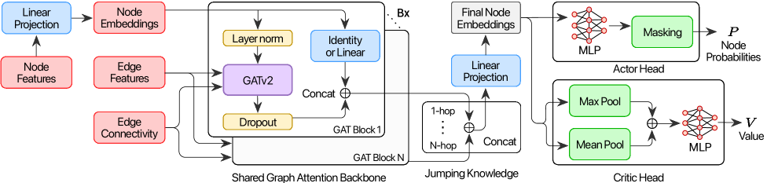
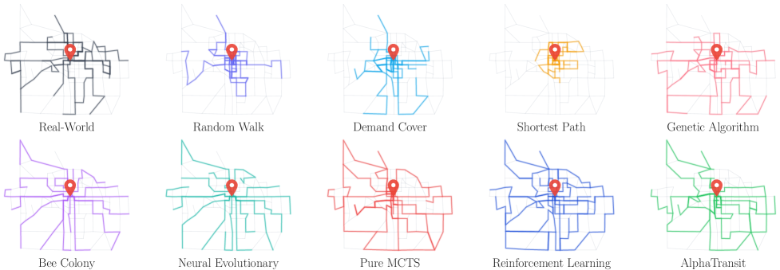
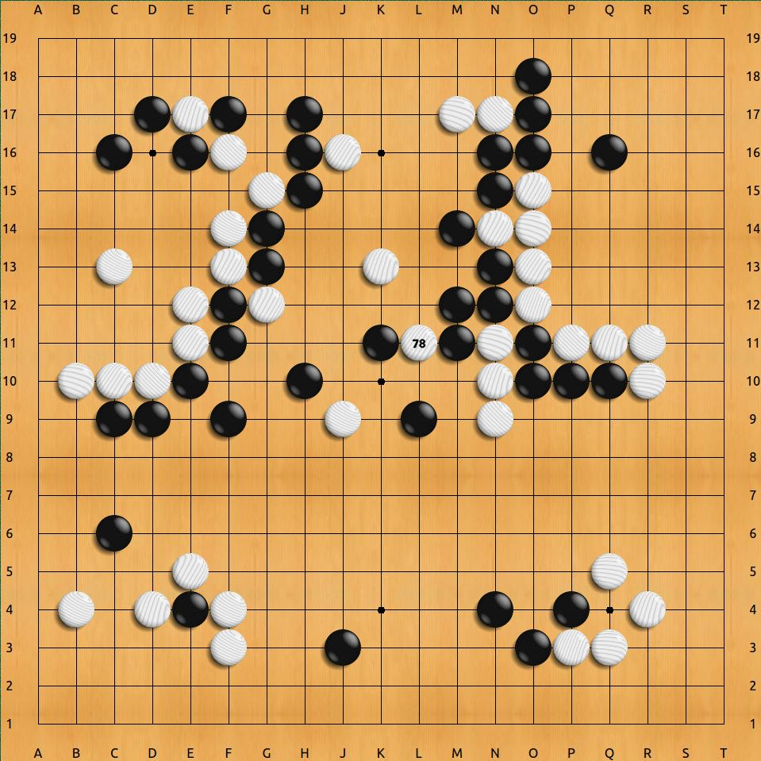

# 당신이 타는 버스를 AI가 다시 그린다면

_AlphaTransit이 보여준 MCTS + 정책가치망의 도시 노선 설계 — Bloomington 54.6% / 82.1%_

## Executive Summary

> [!callout]
> 당신이 매일 타는 버스 노선은 어떻게 그 길을 가는가. 1970년대부터 도시 계획가와 운영자, 민원과 예산, 그리고 누적된 데이터가 만들어낸 결과물이다. 학계는 이를 **대중교통 노선망 설계 문제(TRNDP, Transit Route Network Design Problem)**라고 부르며 60년 동안 풀어 왔다. NP-hard 조합 최적화에 더해, 노선 하나의 가치가 다른 노선이 모두 그려진 뒤에야 평가되는 **지연된 피드백(delayed feedback)** — 강화학습의 가장 어려운 케이스다. 2026년 5월 27일, Bibek Poudel·Sai Swaminathan·Weizi Li 세 사람이 [**AlphaTransit**(arXiv:2605.28730)](https://arxiv.org/abs/2605.28730)이라는 이름의 논문을 공개했다. **MCTS와 신경망 정책가치 함수의 결합** — AlphaGo가 게임판에서 보여준 패턴이 도시 도로망 위에 도착했다.

> 핵심 메커니즘은 두 갈래다. **정책망(Policy)**이 다음 노선 확장 후보를 제안하고, **가치망(Value)**이 그 선택이 가져올 다운스트림 품질을 추정한다. 둘이 함께 **MCTS(Monte Carlo Tree Search)**의 의사결정 단계 탐색을 안내한다. 결과는 단호하다. 인디애나주 Bloomington의 실제 도로망과 인구조사 기반 수요 데이터에서 — **서비스율 54.6%(혼합 수요) · 82.1%(전면 대중교통 수요)**. RL 단독 대비 **+9.9%p · +11.4%p**, MCTS 단독 대비 **+2.5%p · +11.2%p**. 학습된 안내(learned guidance)와 탐색을 결합한 쪽이, 둘 중 하나만 쓰는 것보다 더 효과적임을 정량으로 보였다.

> 이 글은 두 독자를 위해 쓴다. 매일 버스를 타지만 그 노선이 어떻게 정해졌는지 궁금한 시민과, 강화학습·탐색 알고리즘의 우아함을 도시 인프라에서 다시 만나고 싶은 데이터 실무자. AlphaTransit이 푼 것과 풀지 못한 것을 정직하게 정리하고, 페블러스가 보는 [Spatial AI 평가 5기준](/project/UrbanGPT/spatial-ai-pebblous/ko/)의 자리에 그것을 놓는다. **AI가 도시를 디자인한다**는 헤드라인을, 우리는 좀 더 작게, 더 정확하게 읽어 보려 한다.

<!-- stat-card -->
**54.6%** — 혼합 수요 서비스율 — Bloomington mixed demand

<!-- stat-card -->
**82.1%** — 전면 대중교통 서비스율 — full transit demand

<!-- stat-card -->
**+11.4%p** — RL 단독 대비 개선 — full transit 시나리오

<!-- stat-card -->
**+11.2%p** — MCTS 단독 대비 개선 — 학습된 안내(learned guidance) 효과

## TRNDP — 왜 풀기 어려운가

버스 정류장에 서 있을 때, "왜 이 노선이 여기를 지나가는가"를 묻는 시민은 드물다. 하지만 한 번 이 질문을 시작하면, 답은 얕지 않다. 노선 한 가닥은 도시 계획가의 통근 데이터 분석, 주민의 청원, 운영자의 예산 협상, 그리고 수십 년 누적된 운행 패턴이 겹쳐 만든 산물이다. **도시 위에 K개의 노선을 어떻게 배치할 것인가** — 학계는 이를 **대중교통 노선망 설계 문제(TRNDP, Transit Route Network Design Problem)**라고 부른다.

TRNDP는 1970년대부터 **운영 연구(Operations Research, OR)**의 고전 문제다. **정수 계획법(MILP, Mixed-Integer Linear Programming)**, 유전 알고리즘, 시뮬레이티드 어닐링이 차례로 시도되었지만, 도시 규모로 가면 모두 폭발한다. 이유는 단순하다. 도로망 노드가 100개만 되어도 가능한 노선 조합은 천문학적으로 늘어나고, 그중 한 노선의 가치는 다른 노선들과의 상호작용에 따라 달라진다. **전형적인 NP-hard.**

> [!callout]
> 그러나 TRNDP의 진짜 어려움은 NP-hard보다 한 층 더 깊은 곳에 있다. **"이 노선이 좋은가"는 모든 노선이 그려진 뒤 시뮬레이션을 돌려 봐야 알 수 있다.** 한 가닥을 잘못 그려도 전체가 완성될 때까지 모른다. 강화학습 용어로는 **긴 호흡 신용 할당(long-horizon credit assignment)** — 60~100단계의 결정 중 어느 한 수가 최종 점수에 얼마나 기여했는지 역추적해야 하는 문제다. 이 한 줄이 TRNDP를 알고리즘으로 푸는 모든 시도의 발목을 잡았다.

바둑·체스가 같은 어려움을 안고 있었다. 한 수의 가치는 게임이 끝날 때까지 알 수 없다. AlphaGo가 그것을 어떻게 풀었는지 우리는 안다 — **탐색(MCTS)과 학습(신경망 정책가치 함수)을 함께 쓰는 것.** AlphaTransit이 도시 도로망 위에서 시도한 것은 정확히 같은 패턴이다.

## AlphaTransit의 작동 — MCTS + 정책가치망

AlphaTransit이 하는 일을 한 문장으로 줄이면 이렇다. **도로망 그래프 위에서, 한 엣지씩 노선을 늘려 나가며 K개의 노선을 완성한다.** 매 단계마다 어떤 엣지로 갈지 결정해야 하고, 그 결정의 누적이 최종 노선 네트워크가 된다. 게임으로 비유하면 — 한 수씩 두며 K번의 노선 결정을 완성하는 보드 게임에 가깝다.

*▲ AlphaTransit 시스템 다이어그램 — MCTS 사이클과 정책가치망 학습 루프 | Source: [Poudel et al., arXiv:2605.28730 (Fig. 1)](https://arxiv.org/html/2605.28730v1)*

### 2.1. 정책망과 가치망

에이전트의 두뇌는 두 개의 신경망이다. **정책망(Policy Network)**은 현재 상태(이미 그려진 노선 + 도로망 + 수요)에서 "다음에 어느 엣지로 노선을 확장해야 하는가"의 확률 분포를 출력한다. **가치망(Value Network)**은 같은 상태에서 "이 상태로부터 최종 성능이 얼마나 될 것 같은가"를 추정한다. 두 망은 같은 도로망·OD 수요·기존 노선 구조를 입력으로 받지만, 출력하는 답이 다르다 — 한쪽은 다음 한 수, 한쪽은 미래의 점수.

*▲ 정책가치망 아키텍처 — GATv2 공유 백본 + Actor·Critic 헤드 분리 | Source: [Poudel et al., arXiv:2605.28730 (Fig. 2)](https://arxiv.org/html/2605.28730v1)*

### 2.2. MCTS — 의사결정 시점의 lookahead

정책망과 가치망이 "직관"을 제공한다면, **MCTS(Monte Carlo Tree Search)**는 그 직관을 "심사숙고"로 끌어올린다. 매 결정 시점마다 정책망의 추천을 따라 트리를 펼치고, 가치망으로 잎 노드의 미래 가치를 평가한다. 가능성이 보이는 가지는 더 깊이 탐색하고, 가망 없는 가지는 빨리 가지치기한다. 충분히 시뮬레이션을 돌린 뒤 가장 신뢰할 만한 행동을 선택한다.

이것이 AlphaGo·AlphaZero·MuZero에서 검증된 **"학습된 안내(learned guidance) + 탐색(search)"**의 우아한 패턴이다. 학습만으로는 긴 호흡(long-horizon)에서 흔들리고, 탐색만으로는 거대한 행동 공간 앞에서 무력해진다. 둘이 손을 잡으면 — 한쪽이 길을 비춰주고 다른 한쪽이 그 길의 끝을 미리 본다.

> [!callout]
> **AlphaTransit의 진짜 기여는 두 가지의 시너지를 정량으로 보인 것이다.** 논문이 명시하는 핵심 명제: "coupling learned guidance with MCTS is more effective than using either approach alone for transit network design." RL 단독(가치망 없는 정책 학습)도 가능하고, MCTS 단독(학습 없는 순수 탐색)도 가능하지만 — 도시 노선 설계라는 긴 호흡(long-horizon) 문제에서는 둘을 결합해야 진가가 나온다. 다음 섹션의 수치가 이를 보여준다.

### 2.3. 지연된 피드백(delayed feedback)을 어떻게 푸는가

노선의 가치가 마지막에야 드러난다는 §1의 어려움 — AlphaTransit은 이걸 두 갈래로 푼다. 첫째, **가치망이 중간 상태의 미래 가치를 추정**한다. 학습이 진행될수록 가치망은 "이 정도 노선 구조로는 결국 서비스율 X%에 도달하더라"는 패턴을 익힌다. 둘째, **MCTS의 lookahead가 가치망의 추정에 의존하지 않고 직접 trajectory를 펼쳐 본다.** 두 신호가 합쳐지면, 60단계 뒤의 결과를 30단계 시점에서도 어느 정도 가늠할 수 있게 된다.

## Bloomington 벤치마크 — 54.6% / 82.1%

TRNDP 연구의 오랜 약점은 벤치마크의 빈약함이었다. Mumford 60·100·150, Mandl 15 같은 합성 도시가 학술 표준이었다 — 깔끔하지만 가짜 도시다. AlphaTransit은 다른 길을 택했다. **인디애나주 Bloomington의 실제 도로 토폴로지와 인구조사(census) 기반 통근 수요** 위에서 실험을 돌렸다. 16개 실존 노선이 운영 중인 도시 — Bloomington Transit이 실제로 서비스하는 그 도시 위에서.

### 3.1. 두 시나리오, 네 비교

실험은 두 수요 시나리오로 진행된다. **혼합 수요(mixed demand)**는 차량과 대중교통이 공존하는 현실적 가정 — 일부 시민은 어차피 차로 이동한다. **전면 대중교통 수요(full transit demand)**는 모든 통근이 대중교통으로 흡수되는 극한 가정 — 도시가 자동차에서 모드 전환할 때의 모습이다. 두 시나리오에서 AlphaTransit, RL 단독, MCTS 단독, 그리고 비교 휴리스틱들의 서비스율을 측정한다.

| 방법 | 혼합 수요 | 전면 대중교통 | 핵심 메시지 |
| --- | --- | --- | --- |
| AlphaTransit (MCTS + 정책가치망) | 54.6% | 82.1% | 학습 + 탐색의 시너지 |
| RL 단독 (학습만, 탐색 없음) | 44.7% | 70.7% | 긴 호흡(long-horizon)에서 흔들림 |
| MCTS 단독 (탐색만, 학습 안내 없음) | 52.1% | 70.9% | 광활한 행동 공간에서 비효율 |
| 실제 운영망 (Bloomington Transit) | 기준선 | 기준선 | 인간 도시계획가의 누적 결과 |

※ AlphaTransit 대비 RL/MCTS 단독의 격차: 혼합 수요에서 +9.9%p·+2.5%p, 전면 대중교통에서 +11.4%p·+11.2%p. (출처: arXiv:2605.28730)

표가 말해 주는 것은 두 가지다. 첫째, **학습된 안내와 탐색은 서로의 약점을 보완한다.** RL 단독은 긴 호흡(long-horizon)에서 가치 추정이 흐릿해지고, MCTS 단독은 정책 안내 없이 너무 많은 가지를 살펴봐야 한다. 둘째, **혼합 수요와 전면 대중교통에서 시너지의 크기가 다르다.** 전면 대중교통 시나리오에서 AlphaTransit이 RL/MCTS 단독을 11%p씩 압도한다는 사실은, **도시가 대중교통 중심으로 모드 전환할 때 AI 설계의 가치가 비약적으로 커진다**는 신호로 읽힌다.

*▲ Bloomington 실제 도로망 위에 그려진 각 방법의 노선 — 우측 끝이 AlphaTransit | Source: [Poudel et al., arXiv:2605.28730 (Fig. 5)](https://arxiv.org/html/2605.28730v1)*

> [!callout]
> 기억할 한 줄: **"AlphaTransit이 본 진실은 결합의 진실이다."** 학습 하나로도, 탐색 하나로도 충분하지 않다. 도시 인프라처럼 긴 호흡(long-horizon)에 보상이 희소한(sparse) 문제에서는 — 두 가지가 손을 잡을 때 비로소 의미 있는 차이가 생긴다. AlphaGo가 게임판에서 보여줬던 진실을, AlphaTransit이 도로망에서 다시 보여주었다.

## AlphaGo가 도시에 도착하다

"AlphaTransit"이라는 이름은 우연이 아니다. **AlphaGo → AlphaZero → MuZero → AlphaFold**로 이어진 DeepMind 계열의 패러다임 — **학습된 정책가치 함수 + 탐색의 결합** — 이 도시 인프라 설계에 도착한 것을 이름이 말해 준다. AlphaGo가 2016년 이세돌을 이긴 그 알고리즘의 본질은 "한 수씩 두면서 최종 결과를 보상으로 받는 순차 결정 문제"였다. 노선 설계는 정확히 같은 구조다 — 한 엣지씩 그리면서 마지막에 서비스율로 보상을 받는다.

*▲ 2016년 AlphaGo vs 이세돌 4국 — 한 수씩 두며 최종 결과를 보상으로 받는 순차 결정 문제 | Source: [Wikimedia Commons (CC BY-SA 4.0)](https://commons.wikimedia.org/wiki/File:Lee-sedol-alphago-divine-move.jpg)*

### 4.1. 계보를 따라가 보면

DeepMind 계보의 시간순 정리. **AlphaGo(2016)** — 지도학습 + 자기대국 RL + MCTS의 결합으로 인간 챔피언을 이겼다. **AlphaZero(2017)** — 지도학습 없이 self-play만으로 같은 일을 했고, 바둑·체스·쇼기로 일반화됐다. **MuZero(2019)** — 환경 모델까지 학습해서 규칙을 모르는 게임도 풀었다. **AlphaFold(2020)** — 같은 패러다임의 변형이 단백질 접힘 문제를 풀었다. **AlphaTransit(2026)** — 도시 도로망 위에서 대중교통 노선을 설계한다. 진화의 방향은 점점 더 **"규칙이 덜 명확하고 보상이 sparse한 실세계 문제"**로 향한다.

### 4.2. 도시 교통 RL의 흐름 속에서

도시 교통에 RL을 적용한 시도는 AlphaTransit이 처음은 아니다. **신호등 제어**는 2018년 이후 multi-agent RL의 표준 응용 분야가 됐다(SUMO·MATSim 기반 수많은 연구). **차량 라우팅(vehicle routing)**은 AlphaRouter 등 MCTS+RL 조합이 시도되었다. **노선 휴리스틱 학습**은 Lemoy 등(2024)이 GNN으로 evolutionary algorithm의 휴리스틱을 학습하는 하이브리드를 보였다.

AlphaTransit의 새로움은 **"노선 자체를 처음부터 그린다"**에 있다. 휴리스틱을 돕는 것이 아니라, 휴리스틱을 대체한다. 합성 벤치마크가 아닌 실제 도시에서. 그리고 **AlphaGo 계보의 우아한 패턴**을 도시 인프라 설계에 그대로 가져왔다.

> [!callout]
> 학술적 함의는 한 줄이다. **게임·바이오에서 검증된 "학습된 안내 + 탐색" 패러다임이, 도시 인프라라는 사회 시스템으로 확장되고 있다.** 다음 차례는 무엇일까. 학군 배치? 응급실 입지? 우편 분류망? 폐기물 수거 노선? 각각 같은 구조의 문제이고, 같은 패러다임이 닿을 수 있다.

## 서울이라면 어떨까

Bloomington은 작다. 인구 약 8만, 16개 노선. 그 위에서 작동한 알고리즘이 서울에서도 작동할까. 이 질문을 정직하게 답하려면, 먼저 두 도시의 거리감을 봐야 한다.

*▲ 서울 간선버스 150번 — 2004년 개편 이래 350+ 노선이 도시 단위로 운영된다 | Source: [Wikimedia Commons (CC BY-SA 3.0)](https://commons.wikimedia.org/wiki/File:Seoul_Bus_150.jpg)*

| 항목 | Bloomington, IN | 서울특별시 |
| --- | --- | --- |
| 인구 | 약 8만 | 약 940만 (120배) |
| 버스 노선 수 | 16개 | 350+ 개 (20배 이상) |
| 정류장 수 | 수백 개 | 8,200+ 개 |
| 다중 모드 | 버스만 | 버스 + 지하철 12개 노선 + 광역철도 |

### 5.1. 2004년 서울 버스 개편이라는 선례

서울은 이미 도시 단위 버스망 재설계를 경험했다. **2004년 7월 1일, 1년 반의 준비 끝에 서울시는 버스 시스템 전체를 한꺼번에 바꿨다.** 간선·지선·광역·순환의 4분류 체계, 환승 할인 통합, 중앙버스전용차로, 그리고 도시 단위로 다시 그린 노선망. **1년 후 일일 승객 +14%, 만족도 14.2%에서 36.9%로** 상승했다. 인간 도시계획가들이 도시 단위 노선 개편이 실제로 가능하고, 효과가 있음을 증명한 역사적 사례다.

AlphaTransit이 서울에 적용된다면 마주칠 변수들은 단순하지 않다. **규모** — Bloomington 노드 수의 수십 배. 강화학습의 sample efficiency가 견딜 것인가. **다중 모드** — 지하철 12개 노선과의 환승 최적화는 본 논문의 범위 밖이다. **정치적 변수** — 노선 폐지는 종사자 일자리, 노선 인근 상권에 직결된다. 알고리즘이 다루지 않는다. **형평성** — 서비스율 최대화는 인구 밀집 지역에 노선을 몰아 넣을 수 있다. 변두리 노약자는 어디로 가나.

> [!callout]
> 그러나 부분 적용은 이미 가능한 것처럼 보인다. **마을버스 같은 feeder 라인 재설계**, **신도시 초기 노선 설계**(이미 그려진 노선이 없으므로 정치적 비용이 낮다), **폐지 후보 노선의 영향 시뮬레이션**. AlphaTransit은 "AI가 서울 버스를 다시 그린다"의 데모가 아니다. **인간 도시계획가의 의사결정을 보조하는 시뮬레이터**의 첫 진지한 모델이다. 그 거리감을 정직하게 인정할 때 응용이 시작된다.

## UrbanGPT와 만나는 자리 — 페블러스 관점

페블러스가 본 도시 설계 AI의 풍경은 두 갈래로 갈라진다. 한쪽은 **텍스트로 도시를 그리는 흐름** — Studio Tim Fu의 [UrbanGPT 2.0](/project/UrbanGPT/urbangpt2-pebblous/ko/)이 대표한다. "공원이 있고 학교 옆에 카페가 있는 거리"라는 한 줄을 3D 도시 레이아웃으로 바꾼다. 다른 한쪽은 **강화학습으로 흐름을 그리는 길** — 오늘의 AlphaTransit이다. "이 도시의 OD 수요가 이렇다"라는 데이터를 노선 네트워크로 바꾼다. 둘은 같은 큰 흐름의 다른 단면이다 — **AI가 도시의 형태와 흐름을 생성한다.**

### 6.1. Spatial AI 5기준으로 AlphaTransit을 읽으면

페블러스가 제안한 [Spatial AI 평가 5기준](/project/UrbanGPT/spatial-ai-pebblous/ko/)의 관점에서 AlphaTransit을 짚으면, 강점과 빈자리가 또렷이 보인다.

| 평가 기준 | AlphaTransit 평가 | 근거 |
| --- | --- | --- |
| Geo 정합성 | ✓ 강함 | 실제 도로망과 census 좌표 사용 |
| Scale 일관성 | ✓ 강함 | 실제 Bloomington 인프라 1:1 |
| 시나리오 다양성 | △ 부분적 | 혼합·전면 대중교통 2개. 출퇴근·심야·이벤트 미반영 |
| Sim-to-Real Gap | △ 부분적 | 실제 운영망과 정량 비교. 그러나 시뮬레이션 한계 인정 필요 |
| 인간 협업 / 위험 추적 | ✗ 부재 | 형평성·접근성 패널티 없음. 시민 피드백 루프 없음 |

5기준 중 두 개에서 강하고, 두 개에서 부분적이며, 한 개에서 부재하다. **AlphaTransit은 데이터 정합성·스케일 일관성에서는 모범적**이다. 합성 도시가 아닌 실제 Bloomington 위에서 작동했다는 것이 그 자체로 가치다. 그러나 **시민이 알고리즘에 어떻게 참여하는가, 형평성을 어떻게 보장하는가**는 본 논문 범위 밖이다. 도시 설계 AI는 알고리즘 문제가 아니라 **데이터 + 알고리즘 + 사회 시스템의 합산 문제**임을 다시 한번 보여 준다.

### 6.2. 페블러스가 그 자리에 있는 이유

페블러스는 **학습 데이터의 품질**이라는 자리를 노린다. AlphaTransit이 학습하는 OD 수요·도로망·census 데이터의 정합성이 보장될 때, 알고리즘의 출력도 신뢰할 수 있다. 학습 데이터가 편향되면 노선도 편향된다 — 변두리 인구가 OD에 덜 잡혀 있으면, 알고리즘은 그곳에 노선을 덜 그린다. **데이터 품질이 도시의 형평성을 결정한다.** 페블러스의 DataGreenhouse와 DataClinic은 그 지점에서 도시 설계 AI에 닿는다.

> [!callout]
> UrbanGPT가 도시의 **형태(form)**를 생성한다면, AlphaTransit은 도시의 **흐름(flow)**을 설계한다. 형태와 흐름은 떼어놓을 수 없다 — 공원이 어디에 있는지가 버스 노선을 결정하고, 버스가 어디로 가는지가 카페의 위치를 결정한다. 페블러스는 두 흐름이 만나는 자리에서, 데이터가 양쪽 모두를 받쳐 줄 수 있도록 돕는 역할을 본다.

## 도시 설계 AI의 다음 한 걸음

AlphaTransit이 푼 것을 한 문장으로 정리하면 — **TRNDP를 실제 도시 데이터 위에서 MCTS와 정책가치망의 결합으로 풀 수 있음을 정량으로 보였다.** AlphaGo 계보의 우아한 패턴이 도시 인프라 설계라는 사회 시스템에 닿은 사건이다.

남은 일은 정직하게 길다. **메가시티 스케일링** — 서울·도쿄·NYC로 갈 때 sample efficiency와 탐색 비용이 폭발하지 않을 것인가. **다중 모드 통합** — 버스만이 아니라 지하철·자전거 공유·자율주행 셔틀까지 함께. **동적 수요** — 출퇴근·심야·축제·재난의 모든 시간대. **형평성·접근성** — 변두리 노약자가 보상 함수에 들어오게. **시민 피드백** — 알고리즘의 출력이 토론·청문·재학습으로 이어지게.

그러나 첫발이 가벼운 것은 아니다. AlphaTransit이 보여 준 것은 **"알고리즘이 도시를 더 잘 설계할 수 있을 가능성"**이 아니라 **"학습된 안내와 탐색의 결합이 도시 노선 설계에서 의미 있는 수치 차이를 만든다"**이다. 그 사이의 거리는 크다 — 그러나 알고리즘이 도시에서 무엇을 할 수 있는지에 대한 우리의 지도는, 어제보다 한 칸 더 명확해졌다.

> [!callout]
> 마지막 질문 하나. **도시는 알고리즘이 설계하는가, 시민이 설계하는가, 둘이 함께 설계하는가?** AlphaTransit은 그 대화의 시작이지, 답이 아니다. 페블러스는 그 대화가 데이터의 품질로부터 출발한다고 본다 — 알고리즘은 자기가 본 데이터만큼만 도시를 본다.

당신이 매일 타는 버스 노선이 어떻게 그 길을 가게 되었는지, 이제는 조금 다르게 보일 것이다. 그것은 단순히 누군가의 결정이 아니라, 데이터·알고리즘·정치·역사가 누적된 산물이다. 그리고 그 위에 — 학습과 탐색을 함께 쓰는 작은 에이전트가 막 도착했다.

**페블러스 데이터 커뮤니케이션팀**  
2026년 5월 28일

## 참고문헌

본 글이 인용한 1차 출처와 주요 2차 자료를 정리한다.

### 학술 1차 출처

- 1.Poudel, B., Swaminathan, S., & Li, W. (2026). "AlphaTransit: Learning to Design City-scale Transit Routes." _arXiv:2605.28730_. [arxiv.org](https://arxiv.org/abs/2605.28730)
- 2.Poudel, B. (2026). AlphaTransit — Code Repository. [github.com](https://github.com/poudel-bibek/AlphaTransit)
- 3.Silver, D., et al. (2017). "Mastering the Game of Go without Human Knowledge" (AlphaZero). _Nature, 550_. [nature.com](https://www.nature.com/articles/nature24270)
- 4.Lemoy, R. (2024). "Learning Heuristics for Transit Network Design and Improvement with Deep Reinforcement Learning." _Transportmetrica B, 13(1)_. [arxiv.org](https://arxiv.org/abs/2404.05894)

### 서울 버스 개편 사례

- 5.Seoul Solution / Seoul Metropolitan Government (2014). "Reforming Public Transportation in Seoul." [seoulsolution.kr](https://www.seoulsolution.kr/en/content/1803)
- 6.UN-Habitat (2013). "Bus Reform in Seoul, Republic of Korea." Case Study Report. [unhabitat.org](https://unhabitat.org/sites/default/files/2013/06/GRHS.2013.Case_.Study_.Seoul_.Korea_.pdf)
- 7.Streetsblog USA (2018). "What American Cities Can Learn From Seoul's 2004 Bus Redesign." [usa.streetsblog.org](https://usa.streetsblog.org/2018/09/04/what-american-cities-can-learn-from-seouls-2004-bus-redesign)

### 페블러스 시리즈

- 8.페블러스 (2026). "UrbanGPT 2.0 — 텍스트 한 줄로 도시를 설계하다." [blog.pebblous.ai](/project/UrbanGPT/urbangpt2-pebblous/ko/)
- 9.페블러스 (2026). "Spatial AI에 점수를 매긴다면 — PebbloSim 관점의 평가 5기준." [blog.pebblous.ai](/project/UrbanGPT/spatial-ai-pebblous/ko/)
