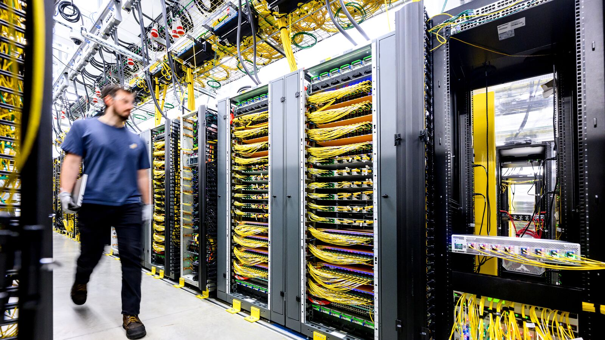

# Amazon Drops Data Center NDAs, but Who Audits the Numbers?

_Amazon_

## Executive Summary

> [!callout]
> This article puts two documents next to each other: a post Amazon published on October 2, 2026, and the tax exemption record the same company has accumulated in Indiana. The post was written by AWS CEO Matt Garman. He said Amazon no longer uses the nondisclosure agreements it had been signing with local governments, and he introduced Built Together, a program that puts more than $1 billion into data center communities over five years. The post also committed the company to publishing power use, power efficiency, water use, water efficiency, and the share of carbon-free electricity every year.

> One item never made the list of promises. Taxes. Microsoft declared in January that it would stop asking for local property tax abatements, and Amazon declined to match it, saying it is already the largest taxpayer in nearly every community where it operates. The post is not silent about taxes. It carries an estimate that Amazon will pay more than $3 billion to one county, and it does not carry the amount that county agreed to waive. Records released by the Indiana Economic Development Corporation show that Amazon claimed $561 million in state sales and use tax exemptions in 2025 alone. That is larger than the $200 million Built Together averages per year.

> Sections 1 and 2, along with the first half of section 3, are facts recorded in the announcement, in disclosure filings, and in news reporting. The second half of section 3 and all of section 4 are this article's reading of those facts through the eyes of someone who works with data.

*▲ Inside the kind of data center Amazon has pledged to publish annual power and water figures for | Source: [Amazon](https://www.aboutamazon.com/news/company-news/amazon-data-centers-built-together)*

### Key Numbers

Four numbers hang on this story. The first two are what Amazon received in one state and what it says it will spend across the country. The last two count how many states let residents check a deal like that at all: how many name who received the break, and how many report the jobs a company promised next to the jobs it created.

Sources: [Indiana Economic Development Corporation disclosure, reported by 13News (2026)](https://www.wthr.com/article/news/local/13-investigates-you-pay-sales-tax-some-indiana-data-centers-didnt-heres-what-we-found/531-ae54b7a8-d19c-47ae-9375-d9edf4e4495f), [Good Jobs First, "Cloudy Data, Costly Deals" (2025-11)](https://goodjobsfirst.org/cloudy-data-costly-deals-how-poorly-states-disclose-data-center-subsidies/), [Amazon announcement (2026-10-02)](https://www.aboutamazon.com/news/company-news/amazon-data-centers-built-together).

<!-- stat-card -->
**$561 million** — Amazon's 2025 Indiana tax exemptions — Up 1,011% in a single year from $50.5 million in 2024. This is Amazon's statewide total, not the figure for one facility

<!-- stat-card -->
**$200 million** — Built Together's average annual spending — $1 billion divided across five years, roughly 0.1% of Amazon's $220 billion capital spending plan for 2026

<!-- stat-card -->
**11 states** — States that name the companies getting the breaks — At least 36 states run tax programs aimed at data centers. Of those 11, only 5 publish the dollar amounts as well

<!-- stat-card -->
**0 states** — States reporting promised jobs next to actual jobs — No state in the country yet lets residents put the jobs a company promised beside the jobs it created

## What Amazon dropped on October 2

One sentence in the Friday post stands at the head of the announcement. "We no longer use non-disclosure agreements with the government entities we work with on our projects." It refers to the contracting practice that companies and local governments have followed when siting data centers. Residents commonly learned which company was arriving, how much electricity and water it would draw, and how much tax it would skip only after construction had started. The sentence names government entities as the counterparty. Agreements with private parties, landowners or developers among them, sit outside it.

*▲ AWS CEO Matt Garman, who published the announcement on Amazon's official blog on October 2 | Source: [Amazon](https://www.aboutamazon.com/news/company-news/amazon-data-centers-built-together)*

Built Together arrived alongside that sentence. The plan commits more than $1 billion over five years to the communities where data centers sit, and the spending falls into three branches. In education and job training, Amazon says it will connect more than 300,000 people to free degree programs within five years. It runs three dedicated training centers today and is building six more, and it plans to add sixteen on top of that for a total of twenty-five, teaching 100,000 people a year by 2028. In energy and water, it says it will upgrade the efficiency of more than 300 schools and public buildings and more than 30,000 homes, cutting monthly power bills by 20 to 40%, or roughly $700 per household per year. The third branch is a fund the community itself directs, running into the millions of dollars annually in each region that hosts a data center.

The disclosure promise covers five items. Power use, power efficiency, water use, water efficiency, and the share of carbon-free electricity, published every year. The post also put a few of the company's own marks on the record in advance. Amazon's global data center fleet averaged a power usage effectiveness of 1.14 in 2025, against an industry average of 1.25 and an average of 1.63 for enterprise server rooms. That index describes how much additional draw from cooling, lighting, and other support equipment rides on every unit of electricity the computing hardware consumes, so a figure closer to 1 is better.

One date does not appear in the post. Three days earlier, on September 29, Representative Jamie Raskin, ranking member of the House Judiciary Committee, sent a public letter to Amazon CEO Andy Jassy. Its first question opens this way: why does Amazon require state and local officials to sign nondisclosure agreements that keep them from discussing data center projects with their own constituents? The same letter went to Google, Meta, and Oracle that day. The fifth question noted that Microsoft had already stopped signing such agreements with local governments and asked why Amazon still demands them; the response deadline was October 13. The first question asked Amazon to list every data center it owns, operates, or has proposed in the United States, with the projected power and water use of each facility at full operation.

The post lays out its own backdrop as well. Garman counted more than 100 data center construction moratoria under consideration across the country and wrote that if those measures take effect, the United States "could be voting itself out of this race, with consequences that will last for generations." On where the opposition comes from, he wrote that there are "widespread reports that other countries are deliberately seeding misinformation about data centers in the U.S. to slow us down." A rebuttal to that claim was already on the record. PolitiFact reported last month that foreign influence on data center opposition has been overstated, and that there is little sign the accounts in question reached a wide audience.

## The taxes Amazon did not drop

One condition rides on the end of the nondisclosure agreements. It applies to agreements signed from now on, and existing ones will not be revisited. Amazon explained that most of its current agreements expire the moment a project becomes public. Microsoft took the other route on March 18. It said it would locate every agreement still in force worldwide and contact the relevant local governments to terminate them, while noting that it continues to use such agreements with private counterparties on matters like land acquisition.

South Bend, Indiana, shows what that difference means on the ground. The city's public works director and city engineer signed a nondisclosure agreement with Amazon over the New Carlisle data center in December 2023, and it expires in December 2026. After the agreement came to light, Mayor James Mueller issued an executive order on September 16 barring city employees from entering into nondisclosure agreements tied to data centers. Amazon's announcement followed sixteen days later, and the agreement still standing in South Bend ends this December in any case.

On taxes, Amazon drew a line. Microsoft declared on January 13 that it would stop requesting local property tax abatements, and when Amazon was asked whether it was willing to make the same commitment, it did not. The company said it is the largest taxpayer in nearly every community where it does business, and that abatements are something local governments offer first to attract a project.

Microsoft's declaration turned concrete first in LaPorte, in the same state of Indiana. The city and the school district replaced their existing arrangement on March 3. They dropped an agreement under which Microsoft would have paid up to $100 million in lieu of taxes over 40 years, and switched to Microsoft paying property taxes in full while the city redevelopment commission routes 15% of that revenue to the LaPorte school district for 20 years.

Indiana is the state where the size of Amazon's exemptions became visible as a number for the first time this year. The Indiana Economic Development Corporation reported that Amazon claimed $50.5 million in state sales and use tax exemptions in 2024 and $561 million in 2025, an increase of 1,011% in a single year. The total the state has disclosed so far for data center exemptions is $655 million across six companies, and Amazon's two-year total of $611.5 million accounts for 93% of it. That figure is the statewide total Amazon received, not the amount tied to one facility. That said, the only major campus Amazon had running in Indiana in 2025 was New Carlisle, an $11 billion site.

How the number came out is worth noting too. The state did not volunteer it. It surfaced only after tracking coverage by the Indianapolis broadcaster 13News converged with pressure from the watchdog group Good Jobs First, and the state comptroller's office explained that the exemption data had been reported to the economic development corporation but that the path carrying it into the annual financial report was missing.

Garman does raise the subject once, and the example he picks is St. Joseph County, the county New Carlisle sits in. He wrote that the taxes Amazon will pay to that county are estimated to exceed $3 billion, while the prior use of the same land would have paid just $1.2 million over the same term. This is a different tax from the $561 million above. One is the property tax a county collects; the other is the sales and use tax the state collects.

The numbers attached to that property tax change depending on who is speaking. The terms the county council approved in August 2024 cut building property taxes by 50% for 10 years and exempt 85% of the value of servers and equipment for 35 years. Bill Schalliol, the county's economic development director, described a model assuming 16 buildings and $11 billion in investment under which roughly $4 billion in taxes is collected over 35 years, $1.6 to $1.7 billion of it abated and $2.2 to $2.3 billion staying in the community. In March this year, four of the five Republican members of the county council called the same deal a "$4 billion abatement over 35 years" and sent a letter asking Amazon to renegotiate. Amazon declined to be interviewed and instead sent materials stating that it has hired more than 900 people, paid more than $7 million toward road improvements, and given more than $250,000 to 31 local businesses. The figure $4 billion appears twice in connection with the same deal and means opposite things. The county calls it the total tax collected over 35 years; the council members seeking renegotiation call it the amount waived. Amazon's $3 billion and the county model's $1.6 to $1.7 billion overlap in the same space. Whoever produces the number decides which range it covers.

Returning to the two amounts at the top, it comes out this way. The money Amazon has promised to spend across data center communities nationwide is $200 million a year, and the sales and use tax it did not pay in the single state of Indiana in 2025 was $561 million.

▲ This article places the community investment from Amazon's announcement and Indiana's disclosure record on one axis.

> [!callout]
> Subtracting one amount from the other to compute a gain or loss gives the wrong answer. Community investment is Amazon's spending and a tax exemption is revenue the public forgoes, so they belong in different places on the ledger. There is still a reason to set them next to each other. Residents have rarely seen what their community receives from Amazon and what it gives to Amazon on one screen. One of the two arrives by press release; the other takes a broadcaster several months of chasing.

## Who grades the numbers once they are public

What happened in Indiana is closer to the default than to an exception. "Cloudy Data, Costly Deals," which Good Jobs First published in November 2025, counted at least 36 states with tax incentives aimed at data centers and only 11 that disclose the names of the companies receiving them: Arizona, Connecticut, Illinois, Indiana, Minnesota, Nevada, Ohio, Pennsylvania, Texas, Washington, and Wisconsin. Those 11 do not go all the way either. Five publish the dollar amounts, four publish the number of jobs a company promised, and none report the promised jobs together with the jobs actually created.

Even among the 11 that name recipients, no state identifies the ultimate parent company. Incentives are claimed under limited liability companies set up for each project, and finding out who stands behind them is a separate errand. The list Indiana published this year includes names such as Hatchworks LLC, a Google subsidiary. The few states that have calculated a return concluded that every dollar spent on a data center sales tax exemption loses between 52 and 70 cents.

One more boundary runs around that count. What the report tallied is the sales and use tax exemptions that states administer, and property tax abatements negotiated separately by counties or cities, as New Carlisle's were, fall outside the scope entirely. The $1.6 to $1.7 billion that St. Joseph County agreed to abate over 35 years does not appear anywhere in that picture, even after searching all 36 states. The best national tally available today holds only part of what residents are actually handing over.

Texas shows the problem of verification arriving late. According to what the state comptroller's office told the Senate Finance Committee this year, 138 data center projects have been certified, and 20 of them have reached their fifth year and undergone an actual review. Six were found compliant and six non-compliant, with the rest still under review. Among the non-compliant, four or more failed to create the required jobs, one failed to build the required square footage, and one self-reported that its power supply contract had fallen through. Texas law grants the benefit immediately once a company pledges that it will meet the requirements, and defers independent confirmation to a retrospective audit five years later. Texas lost $1 billion in revenue to this exemption in fiscal 2025, and a state projection issued in 2025 expects another $3.2 billion to go out over the following two years. What gets disclosed in the meantime is the company name and nothing else.

### 3.1. Three boxes still blank on the report card

What Amazon wrote down is what it will publish and how often. Five items are named and the cadence is set at once a year. Three boxes remain.

- **Scope**. Whether the figures come facility by facility, bundled by region, or as a single global total has not been settled. The PUE of 1.14 already published is a worldwide average. What residents want to know is the electricity and water their local site uses, not a company-wide mean. The letter Raskin sent three days before the announcement asked for projected power and water use facility by facility.
- **Method**. Whether water use counts cooling water only or includes the water consumed in generating the electricity, and whether carbon-free power counts only electricity actually delivered or also certificates purchased, turns the same named number into different values. The method has to hold steady for a figure to be comparable year over year, and comparable between companies.
- **Auditor**. No body has been designated to receive the figures and confirm them. Under the current arrangement Amazon produces them, Amazon releases them, and Amazon corrects them.

Disclosure is still disclosure with those three boxes empty. There is no reason to belittle numbers appearing where nothing stood before. For those numbers to become a report card, though, the party assigning the grade and the party checking it have to be different, and right now they are the same. What Indiana and Texas confirmed is the output of exactly that arrangement. Figures a company reported on its own turned out to be checkable only after somebody chased them for months or waited five years.

> [!callout]
> The shape of the fight has clearly changed. The dispute over whether to accept a data center at all is moving toward a dispute over what numbers a data center produces. The second fight is the more tractable one. A number can be called wrong, and a correction can be demanded. That requires keeping a record of where the number came from and who touched it.

## Why Pebblous Is Watching This Announcement

Pebblous keeps repeating one line whenever AI-Ready Data comes up. On top of data with no provenance and no history, verification is not verification. This announcement hangs on precisely that spot. Power and water use are not difficult quantities to measure. What is difficult is binding to each measurement which facility it came from, which month it covers, which rule aggregated it, and who confirmed it. Without that tag, a figure that improves cannot be separated into the facility improving and the counting method changing.

The line in the Indiana disclosure where a Google subsidiary appears as Hatchworks LLC belongs to the same family of problems. People who work with data call this resolving several different names for one entity into a single identity. Raskin's letter asked for every code name each facility has operated under for the same reason. Whether the record is a subsidy disclosure or a power use disclosure, filings whose identifiers have not been reconciled cannot be summed once gathered. That is why pulling together the disclosures from all 36 states still left no way to count what any one company received nationwide.

The question this episode leaves is therefore not whether Amazon is a trustworthy company. It is what more is needed to make the numbers a company produces about itself checkable from outside. Three things: bring the scope of disclosure down to the facility level, write the aggregation rules down, and name the body that receives and confirms them. Drop any one of the three and disclosure becomes indistinguishable from promotional material.

Thanks for reading this far. Garman's full post is on [Amazon's official blog](https://www.aboutamazon.com/news/company-news/amazon-data-centers-built-together), and the reporting that puts the announcement and the criticism of it side by side is at [TechCrunch](https://techcrunch.com/2026/10/03/amazon-responds-to-data-center-backlash-says-it-no-longer-uses-ndas/). Count how many of the figures your organization publishes have their aggregation rules written down somewhere, and tell us the number.

## References

### Official Announcements

- 1.Garman, M. (2026). "[Built Together: Our commitment to data center communities](https://www.aboutamazon.com/news/company-news/amazon-data-centers-built-together)." About Amazon, 2026-10-02.
- 2.Microsoft (2026). "[Building Community-First AI Infrastructure](https://blogs.microsoft.com/on-the-issues/2026/01/13/community-first-ai-infrastructure/)." Microsoft On the Issues, 2026-01-13.

### Congressional Inquiry

- 3.Raskin, J. (2026). [Letter to Andy Jassy, Amazon, re: data center NDAs](https://democrats-judiciary.house.gov/sites/evo-subsites/democrats-judiciary.house.gov/files/evo-media-document/2026-09-29-raskin-to-jassy-amazon-re-data-center-ndas.pdf). Ranking Member, U.S. House Committee on the Judiciary, 2026-09-29. (Identical letters went to Google, Meta, and Oracle: [press release](https://democrats-judiciary.house.gov/media-center/press-releases/ranking-member-raskin-probes-big-tech-s-use-of-non-disclosure-agreements-to-prevent-local-officials-from-discussing-data-center-project-with-constituents))

### Industry and News Coverage

- 4.TechCrunch (2026). "[Amazon responds to data center backlash, says it no longer uses NDAs](https://techcrunch.com/2026/10/03/amazon-responds-to-data-center-backlash-says-it-no-longer-uses-ndas/)." 2026-10-03.
- 5.GeekWire (2026). "[Amazon pledges $1B to data center communities, warns that local opposition threatens U.S. AI lead](https://www.geekwire.com/2026/amazon-pledges-1b-to-data-center-communities-warns-that-local-opposition-threatens-u-s-ai-lead/)." 2026-10-02.
- 6.Gizmodo (2026). "[Amazon Is Making Concessions to Data Center Critics—and Warning Them Not to Get in the Way](https://gizmodo.com/amazon-is-making-concessions-to-data-center-critics-and-warning-them-not-to-get-in-the-way-2000820848)." 2026-10-02.
- 7.13 Investigates, WTHR (2026). "[You pay sales tax. Some Indiana data centers didn't. Here's what we found](https://www.wthr.com/article/news/local/13-investigates-you-pay-sales-tax-some-indiana-data-centers-didnt-heres-what-we-found/531-ae54b7a8-d19c-47ae-9375-d9edf4e4495f)." WTHR 13News, 2026-05-29.
- 8.Texas Tribune (2026). "[Audits lag for Texas data centers getting sales tax break](https://www.texastribune.org/2026/07/27/texas-data-centers-sales-tax-break-audits/)." 2026-07-27.
- 9.WVPE (2026). "[Mueller says data center NDA ban more symbolic than practical](https://www.wvpe.org/wvpe-news/2026-09-16/mueller-says-data-center-nda-ban-more-symbolic-than-practical)." 2026-09-16.
- 10.WVPE (2026). "[Council members ask Amazon to renegotiate data center tax break](https://www.wvpe.org/wvpe-news/2026-03-30/council-members-ask-amazon-to-renegotiate-data-center-tax-break)." 2026-03-30.
- 11.WVPE (2026). "[Amazon declines publicly discussing renegotiating tax break](https://www.wvpe.org/wvpe-news/2026-03-31/amazon-declines-publicly-discussing-renegotiating-tax-break)." 2026-03-31.
- 12.WNDU (2026). "[LaPorte Microsoft data center deal to direct revenue to local schools](https://www.wndu.com/2026/03/03/laporte-microsoft-data-center-deal-direct-revenue-local-schools/)." 2026-03-03.
- 13.Hometown News Now (2024). "[Amazon Gets Final Boost from Tax Abatement](https://hometownnewsnow.com/local-news/756152/amazon-gets-final-boost-from-tax-abatement)." (original terms of the St. Joseph County abatement)

### Watchdog Reports

- 14.Tarczynska, K. (2025). "[Cloudy Data, Costly Deals: How Poorly States Disclose Data Center Subsidies](https://goodjobsfirst.org/cloudy-data-costly-deals-how-poorly-states-disclose-data-center-subsidies/)." Good Jobs First, 2025-11.
- 15.Good Jobs First (2026). "[Texas Data Center Tax Break: 6 Projects Fail Compliance Review](https://goodjobsfirst.org/texas-data-center-tax-break-compliance-failures/)."
- 16.Good Jobs First (2026). "[Indiana Discloses Massive Data Center Tax Break Costs, thanks to Watchdog Agitation](https://goodjobsfirst.org/indiana-discloses-massive-data-centers-costs-thanks-to-watchdog-agitation/)."
