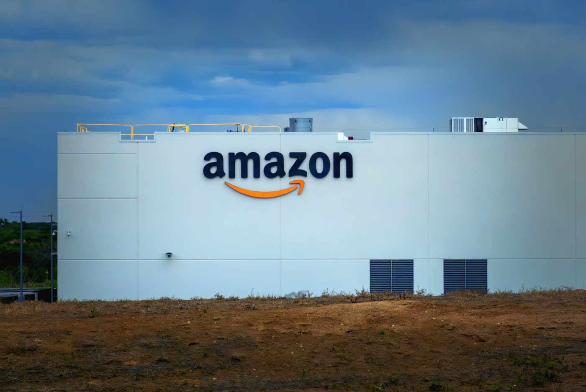

# 희귀본 제본을 잘라 AI 학습용으로 스캔하는 아마존 시설

_책 한 권에 넣은 추적장치가 라스베이거스 VGT3에서 멈췄고, 스캔 데이터는 아마존 Nova 학습에 쓰입니다_

## Executive Summary

> [!callout]
> 희귀본 배송 상자에 넣어 둔 위치추적장치는 라스베이거스에서 신호를 멈췄습니다. 404 미디어가 8월 17일 공개한 취재 결과이고, 신호가 끝난 곳은 아마존이 AI 학습용으로 책을 스캔하는 시설이었습니다. 시설 이름은 VGT3이고, 상징으로 쓰는 그림은 책을 발톱으로 움켜쥔 공룡입니다.

> 그 안에서 벌어지는 일은 스캔만이 아닙니다. 현장 직원들의 말로는 도착한 책의 제본을 잘라 낸 뒤 스캔하고, 그 과정에서 인쇄본은 남지 않습니다. 스캔한 데이터는 아마존의 자체 모델 Nova 학습에 쓰입니다. 인쇄본이 이렇게까지 값이 나가는 이유 하나는 출간 연도에 있습니다. 2022년 이전에 나온 책에는 LLM이 쓴 문장이 섞여 있을 수 없고, AI가 만든 텍스트로 다시 학습하면 모델 붕괴 위험이 커지기 때문입니다.

> 이 소식이 데이터를 다루는 쪽에 남기는 질문은 아마존을 어떻게 평가할지가 아닙니다. 원본이 사라진 뒤 이 스캔본이 어느 판본에서 나왔는지 누가 무엇으로 확인하는가. 대조할 원본이 없는 상태에서 스캔 품질은 무엇으로 보증하는가. 이 글은 그 두 질문을 따라갑니다.

### 주요 수치

앞의 두 숫자는 인쇄본이 지금 왜 원료로 취급되는지를 가리키고, 뒤의 두 숫자는 그 원료를 모으는 일이 이미 법정과 시장을 한 바퀴 돌았다는 사실을 보여 줍니다.

출처: [TechCrunch (2026-08-17)](https://techcrunch.com/2026/08/17/amazon-once-an-online-bookseller-is-destroying-rare-books-to-train-ai-models/), [404 Media (2026-07-31)](https://www.404media.co/ai-company-training-scanning-books-database-isbndb/), [페블러스, 앤트로픽 저작권 합의 분석](/blog/anthropic-copyright-settlement-provenance/ko/)

<!-- stat-card -->
**2022년** — 원료 순도의 기준선 — 그 이전 출간물에는 LLM이 쓴 문장이 섞일 수 없음

<!-- stat-card -->
**0권** — 스캔 뒤 남는 대조용 원본 — 제본을 자른 인쇄본은 재검증에 다시 쓸 수 없음

<!-- stat-card -->
**15억 달러** — 앤트로픽 해적판 트랙 합의액 — 적법 구매 후 파괴적 스캔은 공정 이용으로 갈림

<!-- stat-card -->
**9일** — ISBNdb가 중개 페이지를 내리기까지 — 보도 아흐레 뒤 서비스 홍보를 삭제하고 부인

## 추적기를 넣은 책이 멈춘 곳

보도의 출발점은 서적상들 사이의 소문이었습니다. 누군가 희귀본을 수집가의 방식과는 다르게, 목록을 훑듯이 대량으로 사들이고 있다는 이야기였습니다. 404 미디어는 사는 쪽을 캐묻는 대신 팔려 나가는 물건을 따라가기로 했습니다. AI 기업이 사들일 것으로 의심한 희귀본 배송 안에 위치추적장치를 넣고, 그 화물이 미국을 가로질러 마지막에 어디에서 멈추는지 지켜봤습니다.

멈춘 곳은 라스베이거스의 아마존 시설이었습니다. 404 미디어는 이 시설을 VGT3라고 부르며, 아마존이 AI 학습 데이터를 위해 책을 스캔하는 곳이라고 적었습니다. TechCrunch는 이 시설이 책을 발톱으로 움켜쥔 공룡 그림으로 자기를 표시한다고 전했습니다. 아마존이 대량의 책을 사들여 AI 학습용으로 스캔하고 그 과정에서 책을 없애는 이 작업은 그때까지 보도된 적이 없었습니다.

*▲ 아마존 풀필먼트 시설 외관(예시 사진, VGT3 실사진 아님) | Source: [Wikimedia Commons (CC BY 4.0)](https://commons.wikimedia.org/wiki/File:Amazon_Fulfillment_Center_Warehouse_in_Thornton,_Denver,_Colorado_(DEN3)_(55253052895).jpg)*

추적장치 하나가 증명한 것은 딱 한 가지입니다. 책이 어디로 갔는지입니다. 그런데 그 한 가지가 나머지 논의의 성격을 바꿉니다. 학습 데이터의 출처를 두고 지금까지 오간 이야기는 대부분 웹 크롤링과 라이선스 계약, 그리고 섀도 라이브러리 같은 온라인 경로였습니다. 이번에는 트럭과 창고, 재단기가 등장합니다. 데이터 취득이 물리적 공정이 되면 되돌릴 수 없는 단계가 생깁니다.

## 제본을 자르면 스캔이 빨라집니다

시설에서 일한 사람들의 설명은 단순합니다. 대량으로 도착한 책의 제본을 잘라 내면 낱장으로 넘길 수 있어 스캔 속도가 올라가고, 그렇게 처리된 인쇄본은 원래 형태로 돌아가지 못합니다. 아마존은 이 데이터를 자체 모델 Nova 학습에 씁니다. 회사가 404 미디어에 낸 입장은 상업적 경로로 책을 구매해 고객이 쓰는 제품과 서비스를 개선한다는 것이었습니다. 구매가 적법한지를 말한 문장이고, 구매한 책이 그 뒤 어떻게 되는지에 대한 답은 아닙니다.

속도를 올리는 선택이 왜 파괴로 이어지는지는 규모를 함께 보면 드러납니다. 서적상들은 AI 기업들이 ISBN 번호를 기준으로 사실상 모든 책을 차례로 스캔하려는 것이 아닌지 의심하고 있습니다. 목록을 채우는 일이 목표가 되면 한 권을 얼마나 조심스럽게 다루는지는 비용이 되고, 제본을 살려 스캔하는 공정은 처리량 앞에서 밀려납니다. 파괴는 사고가 아니라 설계에 포함된 단계입니다.
